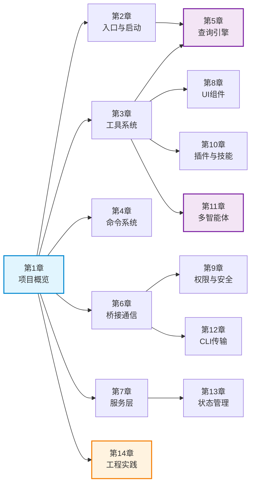

# 深入剖析：大型 CLI 智能体系统源码解析

> 一本关于如何构建包含 1,900+ 文件、512,000+ 行代码的 TypeScript 智能体系统的技术书籍。

## 这本书讲什么？

本书以一个真实的大型 CLI 智能体系统为蓝本，系统性地剖析其架构设计、核心模块、设计模式和工程实践。这个项目基于 **Bun 运行时**、**TypeScript**、**React + Ink 终端 UI**、**Commander.js CLI 解析** 等技术栈构建，包含 40+ 工具、80+ 斜杠命令、113+ UI 组件，涵盖 LLM 查询引擎、IDE 桥接通信、多智能体协调、插件扩展等子系统。

无论你是想了解大型 TypeScript 项目的架构设计，还是想学习智能体系统的构建方式，这本书都能为你提供深入且实用的知识。

---

## 全书目录

### 第一部分：基础篇

#### 第 1 章 · 项目概览

> 📄 `01-project-overview.mdx`

本章从宏观视角介绍整个项目的背景、用途和技术全貌。你将了解项目的完整技术栈——从 Bun 运行时到 Anthropic SDK，从 React/Ink 终端渲染到 OpenTelemetry 可观测性。本章还会展示项目的目录结构全景图，为每个顶层模块（`src/tools/`、`src/commands/`、`src/bridge/` 等 30+ 个目录）提供一句话定位。通过一张架构总览图，你将建立起对各子系统之间关系的直觉认知，为后续深入各模块打下坚实基础。

#### 第 2 章 · 入口与启动流程

> 📄 `02-entry-and-startup.mdx`

本章追踪程序从 `main.tsx` 启动到各子系统就绪的完整初始化链路。你将看到 Commander.js 如何解析 CLI 参数、React/Ink 渲染器如何在终端中初始化，以及一个精妙的并行预取优化模式——MDM 设置预取、keychain 预取和 API 预连接如何在启动阶段并发执行以缩短冷启动时间。本章还会深入解析 `bun:bundle` 特性标志系统及其在编译期死代码消除中的关键作用。通过启动序列图，你将清晰地看到每个初始化阶段的时序关系。

---

### 第二部分：核心系统

#### 第 3 章 · 工具系统

> 📄 `03-tool-system.mdx`

本章深入剖析整个系统的"双手"——工具系统。你将从 `Tool.ts` 的基础类型定义出发，理解工具的输入 Schema（基于 Zod）、权限模型和执行生命周期。本章将全部 40+ 工具按功能分为文件操作、搜索、Web 交互、Agent 协作、任务管理和系统工具六大类，并对 BashTool、FileEditTool、AgentTool、MCPTool、GrepTool 五个代表性工具进行深度源码分析。你还将了解 `tools.ts` 中的工具注册机制，以及工具如何被查询引擎发现和调用。

#### 第 4 章 · 命令系统

> 📄 `04-command-system.mdx`

本章解析用户交互的入口——斜杠命令系统。你将了解 80+ 命令的注册、路由分发和执行机制，看到命令如何从用户输入一路流转到最终执行。本章将所有命令按功能分组（版本控制、会话管理、配置、调试、插件等），并对 commit、review、compact、doctor、mcp 五个代表性命令进行深度分析。你还将理解命令系统与工具系统之间的职责边界——命令面向用户交互，工具面向 LLM 调用，两者如何协同工作。

#### 第 5 章 · 查询引擎

> 📄 `05-query-engine.mdx`

本章揭示系统的"大脑"——LLM 查询引擎的核心实现。你将深入 `QueryEngine.ts` 理解流式响应处理、工具调用循环（tool-call loop）、思考模式（thinking mode）、重试逻辑和 Token 计数等关键机制。本章还会解析 `context.ts` 中的上下文收集与管理策略——如何智能地组织和优化发送给 LLM 的上下文信息，以及 `cost-tracker.ts` 中的成本追踪系统。通过查询-响应循环序列图，你将完整理解从用户提问到最终回答的全链路交互过程。

---

### 第三部分：通信与服务

#### 第 6 章 · 桥接通信系统

> 📄 `06-bridge-system.mdx`

本章深入解析 IDE 与 CLI 之间的"桥梁"——桥接通信系统。你将了解 `src/bridge/` 下 30+ 个文件如何协同实现双向通信架构，包括 JWT 认证机制（`jwtUtils.ts`）、会话生命周期管理（`createSession.ts` → `sessionRunner.ts`）、消息协议定义（`bridgeMessaging.ts`）以及 REPL 桥接子系统。本章还会解析容量唤醒（`capacityWake.ts`）、可信设备（`trustedDevice.ts`）等高级特性。通过通信流程图，你将看到一条消息如何从 IDE 扩展经过层层处理最终到达 CLI 执行引擎。

#### 第 7 章 · 服务层

> 📄 `07-service-layer.mdx`

本章全面梳理系统的外部集成层——服务层。你将逐一了解 API 客户端、MCP 服务器管理、OAuth 认证、LSP 集成、Analytics 分析、Compact 压缩、记忆提取等各项服务的职责和实现方式。本章还会深入解析 Token 估算机制（`tokenEstimation.ts`）、速率限制与策略限制系统，以及团队记忆同步机制。你将理解这些服务如何被查询引擎、工具系统等上层模块调用，以及它们之间如何协同工作以支撑整个系统的运转。

---

### 第四部分：交互与安全

#### 第 8 章 · UI 组件与终端渲染

> 📄 `08-ui-and-rendering.mdx`

本章探索系统的"面孔"——基于 React + Ink 的终端 UI 系统。你将了解 React 如何被适配到终端环境中，113+ UI 组件如何按功能分组（输入、输出、布局、状态展示等），以及至少 10 个关键自定义 Hook 的用途和实现。本章还会解析屏幕（Screen）系统的导航模式、`src/keybindings/` 中的键绑定系统和 `src/vim/` 中的 Vim 模式实现。你将看到终端 UI 开发与浏览器 UI 开发的异同，学习如何在字符界面中构建丰富的交互体验。

#### 第 9 章 · 权限与安全系统

> 📄 `09-permission-and-security.mdx`

本章剖析智能体系统中至关重要的安全防线。你将深入理解工具权限检查系统的四种模式（default、plan、bypassPermissions、auto）各自的工作方式和适用场景。本章还会解析完整的 OAuth 2.0 认证流程、JWT 会话认证在桥接连接中的应用，以及可信设备机制的建立和验证过程。你将看到安全机制如何贯穿工具执行、桥接通信、用户认证等各个环节，形成多层次的安全保障体系。

---

### 第五部分：扩展与协调

#### 第 10 章 · 插件与技能系统

> 📄 `10-plugin-and-skill-system.mdx`

本章解析系统的可扩展性基石——插件与技能系统。你将了解插件的发现、加载和初始化流程，内置插件的组织方式，以及技能系统的三个核心方面：bundled skills（内置技能打包）、skill loading（动态加载）和 MCP skill builders（基于 MCP 协议的技能构建器）。本章还会展示 SkillTool 和插件命令如何与核心系统集成，并提供创建自定义插件和技能的完整示例代码，帮助你理解如何为系统添加新能力。

#### 第 11 章 · 多智能体协调

> 📄 `11-multi-agent-coordination.mdx`

本章揭示系统最前沿的能力——多智能体协调机制。你将了解 AgentTool 如何生成子智能体、TeamCreateTool/TeamDeleteTool 如何管理智能体团队、SendMessageTool 如何实现智能体间通信。本章还会深入解析协调器（Coordinator）模式的编排逻辑——如何分配任务、监控进度和汇总结果。通过智能体协调流程图，你将看到多个智能体如何从任务分解到并行执行再到结果汇总的完整协作过程。

---

### 第六部分：基础设施

#### 第 12 章 · CLI 传输层与远程会话

> 📄 `12-cli-transport-and-remote.mdx`

本章深入网络通信的底层——CLI 传输层。你将了解三种传输实现（SSE、WebSocket、Hybrid 混合传输）各自的适用场景和实现差异，以及串行批量事件上传器（SerialBatchEventUploader）和 Worker 状态上传器（WorkerStateUploader）的工作机制。本章还会解析远程会话的创建、维护和断线重连策略，以及结构化 IO 系统的序列化和传输方式。你将理解传输层如何为上层的桥接通信和远程协作提供可靠的网络基础。

#### 第 13 章 · 状态管理与数据持久化

> 📄 `13-state-and-persistence.mdx`

本章解析系统的"记忆"——状态管理与数据持久化。你将了解状态的定义、更新、订阅和传播方式，持久化内存目录（memdir）系统的目录结构和读写机制，以及基于 Zod 的配置 Schema 验证流程。本章还会解析 `src/migrations/` 中的版本管理和数据迁移策略，以及 `sessionHistory.ts` 中的会话历史管理机制。你将理解状态如何在各模块间流转，以及 CLI 应用如何在无数据库的环境下实现可靠的数据持久化。

---

### 第七部分：总结

#### 第 14 章 · 工程实践与设计模式

> 📄 `14-engineering-practices.mdx`

本章是全书的收官之作，从项目中提炼出可复用的工程智慧。你将看到并行预取、懒加载、Agent Swarms、特性标志、插件架构等设计模式的系统性总结，了解 TypeScript 严格模式和类型安全实践如何提升代码质量。本章还会分析项目的测试策略、错误处理模式和韧性机制，并提供面向读者的可操作建议——帮助你将这些经过大规模项目验证的工程实践应用到自己的项目中。

---

## 章节依赖关系图

下图展示了各章节之间的知识依赖关系。箭头表示"建议先阅读"的方向——例如，阅读第 5 章（查询引擎）前，建议先了解第 2 章（入口启动）和第 3 章（工具系统）。



:::tip 如何使用这张图
- **蓝色节点**（第 1 章）是全书的起点，建议所有读者首先阅读
- **紫色节点**（第 5、11 章）是依赖较多的高级章节，建议按依赖顺序阅读
- **橙色节点**（第 14 章）是全书总结，建议最后阅读
- 没有直接依赖关系的章节可以按兴趣自由选读
:::

---

## 阅读指南：选择你的路径

不同背景的读者可以选择不同的阅读路径，以最高效地获取所需知识。

### 🟢 路径一：全栈开发者（推荐完整阅读）

如果你是有经验的全栈开发者，想系统性地理解整个项目：

**按顺序阅读全部 14 章。** 本书的章节编排已经按照从基础到高级的渐进顺序组织，每一章都建立在前面章节的基础之上。

> 第 1 章 → 第 2 章 → 第 3 章 → 第 4 章 → 第 5 章 → 第 6 章 → … → 第 14 章

### 🔵 路径二：架构师 / 技术负责人

如果你主要关注架构设计和系统全貌：

> 第 1 章（项目概览）→ 第 2 章（启动流程）→ 第 5 章（查询引擎）→ 第 6 章（桥接通信）→ 第 11 章（多智能体）→ 第 14 章（工程实践）

这条路径让你快速掌握系统的核心架构决策和关键设计模式。

### 🟡 路径三：前端 / UI 开发者

如果你对终端 UI 开发和用户交互感兴趣：

> 第 1 章（项目概览）→ 第 4 章（命令系统）→ 第 8 章（UI 组件与渲染）→ 第 3 章（工具系统）→ 第 9 章（权限与安全）

这条路径聚焦于用户交互层的实现，从命令输入到 UI 渲染再到权限控制。

### 🟠 路径四：AI / LLM 应用开发者

如果你想学习如何构建 LLM 驱动的智能体系统：

> 第 1 章（项目概览）→ 第 3 章（工具系统）→ 第 5 章（查询引擎）→ 第 11 章（多智能体）→ 第 10 章（插件与技能）→ 第 14 章（工程实践）

这条路径聚焦于 AI 智能体的核心能力：工具调用、LLM 交互、多智能体协作和可扩展性。

### 🔴 路径五：后端 / 基础设施工程师

如果你关注通信协议、状态管理和系统基础设施：

> 第 1 章（项目概览）→ 第 6 章（桥接通信）→ 第 12 章（CLI 传输层）→ 第 7 章（服务层）→ 第 13 章（状态管理）→ 第 9 章（权限与安全）

这条路径聚焦于系统的底层基础设施，从网络通信到数据持久化再到安全机制。

---

## 项目技术栈速览

在开始阅读之前，以下是本书涉及的核心技术栈，供你快速了解：

| 技术 | 用途 | 相关章节 |
|------|------|---------|
| **TypeScript** | 主要编程语言，严格模式 | 全书 |
| **Bun** | JavaScript/TypeScript 运行时 | 第 1、2 章 |
| **React + Ink** | 终端 UI 渲染框架 | 第 8 章 |
| **Commander.js** | CLI 参数解析 | 第 2、4 章 |
| **Zod** | 运行时数据验证 | 第 3、13 章 |
| **Anthropic SDK** | LLM API 调用 | 第 5 章 |
| **MCP SDK** | 模型上下文协议集成 | 第 3、10 章 |
| **JWT** | 会话认证 | 第 6、9 章 |
| **OAuth 2.0** | 用户认证 | 第 9 章 |
| **OpenTelemetry** | 可观测性与追踪 | 第 7、14 章 |
| **GrowthBook** | 特性标志管理 | 第 2、14 章 |
| **ripgrep** | 高性能文件搜索 | 第 3 章 |

---

## 项目规模一览

```
📁 源码文件数    ~1,900 个
📝 代码行数      512,000+ 行
🔧 工具数量      40+ 个
⌨️  斜杠命令      80+ 个
🎨 UI 组件       113+ 个
📂 顶层模块      30+ 个目录
🌐 桥接文件      30+ 个
📦 服务模块      10+ 个
```

---

:::info 关于本书
本书使用 Docusaurus 构建，支持 Mermaid 图表渲染和交互式代码展示。所有内容基于项目源码直接分析撰写，力求准确、深入且通俗易懂。如果你在阅读过程中发现任何问题，欢迎反馈。
:::
