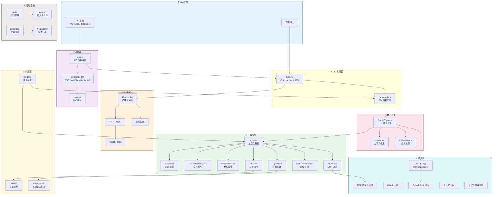
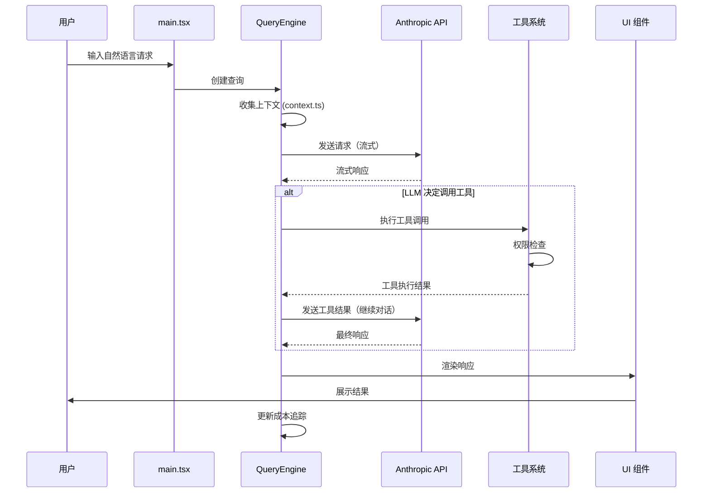

# 第 1 章 · 项目概览

> 在深入任何一个模块之前，我们需要先站在高处俯瞰全局。本章将帮助你建立对整个系统的宏观认知——它是什么、用了哪些技术、代码是如何组织的、各子系统之间如何协作。这些认知将成为你阅读后续章节的"地图"。

## 1.1 项目背景与用途

这是一个大型的 **CLI 智能体系统**，允许用户在终端中与大语言模型（LLM）进行交互，完成软件工程任务。它不是一个简单的聊天客户端——它是一个拥有完整工具链的**自主代理（Agent）**，能够：

- 📂 **读写文件**：创建、编辑、搜索项目中的任何文件
- 🖥️ **执行命令**：在 Shell 中运行任意命令并理解输出
- 🔍 **搜索代码**：基于 ripgrep 进行高性能代码搜索
- 🌐 **访问网络**：获取网页内容、执行 Web 搜索
- 🤖 **生成子智能体**：通过多智能体协调完成复杂任务
- 🔌 **扩展能力**：通过插件和技能系统无限扩展功能边界

整个项目的规模令人印象深刻：

| 指标 | 数值 |
|------|------|
| 源码文件数 | ~1,900 个 |
| 代码行数 | 512,000+ 行 |
| 工具（Tool）数量 | 40+ 个 |
| 斜杠命令数量 | 80+ 个 |
| UI 组件数量 | 113+ 个 |
| 顶层源码目录 | 34 个 |
| 桥接系统文件 | 30+ 个 |
| 服务模块 | 20+ 个 |

:::tip 为什么值得深入研究？
这个项目是一个**真实的、生产级别的大型 TypeScript 系统**。它融合了 CLI 工具开发、终端 UI 渲染、LLM 集成、多智能体协调、IDE 桥接通信等多个领域的工程实践。无论你对哪个方向感兴趣，都能从中学到实用的设计思路和实现技巧。
:::

## 1.2 完整技术栈

本项目的技术选型覆盖了从运行时到可观测性的完整链路。下面我们逐一介绍每项技术及其在系统中的角色。

### 🏃 Bun 运行时

项目选择 [Bun](https://bun.sh) 作为 JavaScript/TypeScript 运行时，而非 Node.js。Bun 提供了几个关键优势：

- **原生 TypeScript 支持**：无需编译步骤，直接运行 `.ts` / `.tsx` 文件
- **更快的启动速度**：对 CLI 工具来说，冷启动时间至关重要
- **`bun:bundle` 特性标志**：支持编译期死代码消除（Dead Code Elimination），这是项目中一个非常精妙的设计

```typescript title="src/main.tsx" showLineNumbers
// highlight-next-line
import { feature } from 'bun:bundle';

// 通过 feature flag 实现编译期条件导入
// 当 flag 为 false 时，整个 require 分支在构建时被完全移除
// highlight-start
const coordinatorModeModule = feature('COORDINATOR_MODE')
  ? require('./coordinator/coordinatorMode.js')
  : null;
// highlight-end
```

这种模式在项目中被广泛使用，已知的特性标志包括：`PROACTIVE`、`KAIROS`、`BRIDGE_MODE`、`DAEMON`、`VOICE_MODE`、`AGENT_TRIGGERS`、`COORDINATOR_MODE`、`MONITOR_TOOL` 等。

### 📝 TypeScript（严格模式）

整个项目使用 TypeScript 编写，启用了严格模式。类型系统在这个规模的项目中扮演着至关重要的角色——它不仅是开发时的辅助工具，更是架构约束的一部分。

### ⚛️ React + Ink 终端 UI

这可能是本项目最令人惊喜的技术选型之一。项目使用 [React](https://react.dev) + [Ink](https://github.com/vadimdemedes/ink) 在终端中构建 UI。是的，你没看错——**用 React 写终端界面**。

Ink 将 React 的组件模型、状态管理和声明式渲染带入了终端环境。项目中有 **113+ 个 UI 组件**，涵盖消息展示、代码差异对比、权限对话框、进度指示器、Vim 模式输入等丰富的交互元素。

### 🔧 Commander.js CLI 解析

[Commander.js](https://github.com/tj/commander.js)（使用 `@commander-js/extra-typings` 增强类型版本）负责 CLI 参数解析。它定义了程序的所有命令行选项、子命令和参数验证逻辑。

### ✅ Zod 数据验证

[Zod v4](https://zod.dev) 用于运行时数据验证，在项目中有两个核心应用场景：

1. **工具输入 Schema**：每个工具的输入参数都通过 Zod Schema 定义和验证
2. **配置 Schema**：用户配置、项目配置等都通过 Zod 进行结构验证

### 🔍 ripgrep 代码搜索

[ripgrep](https://github.com/BurntSushi/ripgrep) 是一个极快的正则表达式搜索工具。项目通过 `GrepTool` 封装了 ripgrep 的能力，让 LLM 能够高效地在代码库中搜索内容。

### 🔌 MCP SDK 协议集成

[Model Context Protocol (MCP)](https://modelcontextprotocol.io) 是一个标准化的协议，用于连接 LLM 与外部工具和数据源。项目通过 MCP SDK 实现了：

- MCP 服务器的连接和管理（`src/services/mcp/`）
- MCP 工具的动态发现和调用（`src/tools/MCPTool/`）
- MCP 资源的列出和读取（`src/tools/ListMcpResourcesTool/`、`src/tools/ReadMcpResourceTool/`）

### 🧠 Anthropic SDK API 调用

[Anthropic SDK](https://docs.anthropic.com) 是与 Claude API 交互的核心客户端。`QueryEngine.ts`（项目中最大的文件之一）封装了所有与 LLM 的交互逻辑，包括流式响应处理、工具调用循环、思考模式和重试机制。

### 📊 OpenTelemetry 可观测性

项目集成了 [OpenTelemetry](https://opentelemetry.io/) + gRPC 进行遥测数据收集。这些重量级模块采用**懒加载**策略——只在实际需要时才通过动态 `import()` 加载，避免拖慢启动速度。

### 🚩 GrowthBook 特性标志

[GrowthBook](https://www.growthbook.io/) 用于运行时特性标志管理和 A/B 测试。与 `bun:bundle` 的编译期特性标志不同，GrowthBook 提供的是**运行时**的动态特性控制，位于 `src/services/analytics/` 目录下。

### 🔐 认证体系

项目实现了完整的认证体系：
- **OAuth 2.0**：用户认证流程（`src/services/oauth/`）
- **JWT**：桥接连接的会话认证（`src/bridge/jwtUtils.ts`）
- **macOS Keychain**：安全存储凭证

| 技术 | 用途 | 核心文件/目录 |
|------|------|--------------|
| Bun | JavaScript/TypeScript 运行时 | `bun:bundle` feature flags |
| TypeScript | 主要编程语言（严格模式） | 全项目 |
| React + Ink | 终端 UI 渲染框架 | `src/components/`、`src/screens/` |
| Commander.js | CLI 参数解析 | `src/main.tsx` |
| Zod v4 | 运行时数据验证 | `src/Tool.ts`、`src/schemas/` |
| ripgrep | 高性能代码搜索 | `src/tools/GrepTool/` |
| MCP SDK | 模型上下文协议集成 | `src/services/mcp/` |
| Anthropic SDK | LLM API 调用 | `src/QueryEngine.ts` |
| OpenTelemetry | 可观测性与追踪 | 懒加载，按需导入 |
| GrowthBook | 运行时特性标志 | `src/services/analytics/` |
| OAuth 2.0 / JWT | 认证与授权 | `src/services/oauth/`、`src/bridge/jwtUtils.ts` |

## 1.3 目录结构全景

项目的 `src/` 目录包含 **34 个顶层目录** 和 **18 个顶层文件**。每个目录都是一个功能内聚的模块。下面我们逐一介绍：

### 核心文件（顶层）

| 文件 | 职责 |
|------|------|
| `main.tsx` | 程序入口，Commander.js CLI 解析与 React/Ink 渲染器初始化 |
| `commands.ts` | 命令注册表，管理全部 80+ 斜杠命令的注册和分发 |
| `tools.ts` | 工具注册表，管理全部 40+ 工具的注册和组装 |
| `Tool.ts` | 工具基础类型定义，包括输入 Schema、权限模型、执行生命周期 |
| `QueryEngine.ts` | LLM 查询引擎核心，处理流式响应、工具调用循环、重试逻辑 |
| `context.ts` | 系统/用户上下文收集，组织发送给 LLM 的上下文信息 |
| `cost-tracker.ts` | Token 成本追踪，计算和展示 API 调用费用 |
| `setup.ts` | 会话初始化逻辑，项目根目录检测、Git 状态检查等 |
| `Task.ts` | 任务类型定义 |
| `tasks.ts` | 任务管理逻辑 |
| `query.ts` | 查询管道入口 |
| `ink.ts` | Ink 渲染器封装 |
| `history.ts` | 命令历史管理 |

### 功能模块目录

```
src/
├── tools/                   # 🔧 工具实现（40+ 个工具，每个工具一个子目录）
│                            #    BashTool、FileEditTool、AgentTool、GrepTool 等
│
├── commands/                # ⌨️  斜杠命令实现（80+ 个命令）
│                            #    /commit、/review、/compact、/doctor、/mcp 等
│
├── components/              # 🎨 React/Ink UI 组件（113+ 个组件）
│                            #    消息展示、代码差异、权限对话框、进度指示器等
│
├── services/                # 🌐 外部服务集成层（20+ 个服务模块）
│                            #    API 客户端、MCP 管理、OAuth、分析、压缩等
│
├── bridge/                  # 🌉 IDE 桥接通信系统（30+ 个文件）
│                            #    IDE 扩展与 CLI 之间的双向通信层
│
├── hooks/                   # 🪝 React Hooks（工具权限、状态管理等）
│                            #    包含关键的 toolPermission 权限检查系统
│
├── screens/                 # 📺 全屏 UI 界面（Doctor、REPL、Resume 等）
│
├── coordinator/             # 🤖 多智能体协调器
│                            #    管理子智能体的生成、任务分配和结果汇总
│
├── plugins/                 # 🔌 插件系统（内置插件和第三方插件加载）
│
├── skills/                  # 🎯 技能系统（可复用的工作流定义）
│
├── cli/                     # 📡 CLI 传输层
│                            #    SSE、WebSocket、Hybrid 传输和远程 IO
│
├── state/                   # 📦 状态管理
│
├── types/                   # 📋 TypeScript 类型定义
│
├── utils/                   # 🛠️ 工具函数库
│
├── entrypoints/             # 🚀 初始化逻辑入口
│
├── bootstrap/               # 🏗️ 启动引导状态
│
├── context/                 # 📝 上下文管理（通知、统计等）
│
├── query/                   # 🔄 查询管道实现
│
├── schemas/                 # 📐 Zod 配置 Schema 定义
│
├── migrations/              # 🔀 配置版本迁移
│
├── memdir/                  # 💾 持久化内存目录系统
│
├── tasks/                   # ✅ 任务管理系统
│
├── assistant/               # 🤝 助手模式（会话历史等）
│
├── remote/                  # 🌍 远程会话管理
│
├── server/                  # 🖥️ 服务器模式
│
├── keybindings/             # ⌨️  键绑定配置
│
├── vim/                     # 📝 Vim 模式实现
│
├── voice/                   # 🎤 语音输入
│
├── ink/                     # 🖨️ Ink 渲染器底层封装
│
├── buddy/                   # 🐾 伴侣精灵（Companion Sprite）
│
├── native-ts/               # 🔧 原生 TypeScript 工具
│
├── outputStyles/            # 🎭 输出样式配置
│
├── moreright/               # ➡️  扩展权限模块
│
├── upstreamproxy/           # 🔗 上游代理配置
│
└── constants/               # 📌 常量定义
```

:::info 模块规模参考
- `src/tools/` 下有 **42 个子目录**，每个子目录对应一个工具实现
- `src/commands/` 下有 **85 个子目录 + 15 个独立文件**，覆盖了从 Git 操作到 MCP 管理的各种命令
- `src/components/` 下有 **31 个子目录 + 100+ 个独立组件文件**
- `src/services/` 下有 **20 个子目录 + 17 个独立文件**
- `src/bridge/` 下有 **30+ 个文件**，构成了完整的 IDE 桥接通信系统
:::

## 1.4 架构总览

理解了目录结构之后，让我们从更高的抽象层次来看各子系统之间的关系。下面这张架构图展示了系统的核心组件及其交互方式：



### 数据流：从用户输入到最终响应

让我们追踪一条典型的用户请求，看看它如何在系统中流转：



这个流程揭示了系统的核心设计理念：**QueryEngine 是整个系统的中枢**，它协调上下文收集、API 调用、工具执行和 UI 渲染。工具调用循环（tool-call loop）是 LLM 智能体的核心模式——LLM 可以反复调用工具、获取结果、再决定下一步行动，直到任务完成。

## 1.5 核心子系统速览

在后续章节中，我们将深入每个子系统。这里先给出一个快速概览，帮助你建立各模块之间的关联认知。

### 工具系统：智能体的"双手"

工具系统是 LLM 与外部世界交互的桥梁。每个工具都是一个自包含的模块，定义了输入 Schema、权限模型和执行逻辑：

```typescript title="src/Tool.ts" showLineNumbers
// 工具的核心接口定义（简化版）
// 每个工具都必须实现这些方法
export interface Tool<Input, Output> {
  name: string;
  // highlight-start
  // Zod Schema 定义工具的输入参数
  inputSchema: Input;
  // 权限检查：决定工具是否可以执行
  checkPermissions(input, context): Promise<PermissionResult>;
  // 核心执行逻辑
  call(args, context, canUseTool, parentMessage, onProgress?): Promise<ToolResult<Output>>;
  // highlight-end
  // 工具描述（动态生成，可根据上下文变化）
  description(input, options): Promise<string>;
  // 是否为只读操作
  isReadOnly(input): boolean;
  // 是否支持并发执行
  isConcurrencySafe(input): boolean;
}
```

工具注册表 `tools.ts` 负责组装所有可用工具。注意它如何使用 `bun:bundle` 的 `feature()` 进行条件加载：

```typescript title="src/tools.ts" showLineNumbers
import { feature } from 'bun:bundle';
import { AgentTool } from './tools/AgentTool/AgentTool.js';
import { BashTool } from './tools/BashTool/BashTool.js';
import { FileEditTool } from './tools/FileEditTool/FileEditTool.js';
// ... 更多工具导入

// highlight-start
// 条件加载：只在特性标志开启时才包含这些工具
const SleepTool = feature('PROACTIVE') || feature('KAIROS')
  ? require('./tools/SleepTool/SleepTool.js').SleepTool
  : null;
// highlight-end

// 获取所有基础工具的完整列表
export function getAllBaseTools(): Tools {
  return [
    AgentTool,
    BashTool,
    FileEditTool,
    FileReadTool,
    FileWriteTool,
    GrepTool,
    GlobTool,
    WebFetchTool,
    WebSearchTool,
    SkillTool,
    // ... 根据特性标志动态包含更多工具
    ...(SleepTool ? [SleepTool] : []),
    ...(isAgentSwarmsEnabled()
      ? [getTeamCreateTool(), getTeamDeleteTool()]
      : []),
  ];
}
```

:::info 源码位置
工具类型定义：`src/Tool.ts` | 工具注册表：`src/tools.ts` | 工具实现：`src/tools/` 下各子目录
:::

### 命令系统：用户交互的入口

命令系统处理用户通过 `/` 前缀输入的斜杠命令。与工具系统不同，命令面向**用户交互**，而工具面向 **LLM 调用**：

```typescript title="src/commands.ts" showLineNumbers
// 命令注册表导入了所有命令实现
import commit from './commands/commit.js';
import compact from './commands/compact/index.js';
import config from './commands/config/index.js';
import doctor from './commands/doctor/index.js';
import mcp from './commands/mcp/index.js';
import review, { ultrareview } from './commands/review.js';
// ... 80+ 个命令

// 同样使用 feature flag 进行条件加载
// highlight-start
const voiceCommand = feature('VOICE_MODE')
  ? require('./commands/voice/index.js').default
  : null;
const bridge = feature('BRIDGE_MODE')
  ? require('./commands/bridge/index.js').default
  : null;
// highlight-end
```

### 查询引擎：系统的"大脑"

`QueryEngine.ts` 是整个系统中最核心、也是最复杂的文件。它负责：

- 与 Anthropic API 的流式通信
- 工具调用循环（tool-call loop）的编排
- 思考模式（thinking mode）的管理
- 重试逻辑和错误处理
- Token 计数和成本追踪

```typescript title="src/QueryEngine.ts" showLineNumbers
// QueryEngine 的核心依赖展示了它的中枢地位
import { query } from './query.js';                    // 查询管道
import { getModelUsage, getTotalCost } from './cost-tracker.js';  // 成本追踪
import { type Tools, type ToolUseContext } from './Tool.js';       // 工具系统
import { loadMemoryPrompt } from './memdir/memdir.js';            // 持久化记忆
import type { AppState } from './state/AppState.js';              // 应用状态
```

### 桥接通信：连接 IDE 与 CLI

桥接系统（`src/bridge/`）实现了 IDE 扩展（VS Code、JetBrains）与 CLI 之间的双向通信。这是一个完整的通信协议栈，包含：

- JWT 认证（`jwtUtils.ts`）
- 消息协议（`bridgeMessaging.ts`）
- 会话管理（`createSession.ts`、`sessionRunner.ts`）
- REPL 桥接（`replBridge.ts`）
- 可信设备验证（`trustedDevice.ts`）

### 启动优化：并行预取

项目在启动时采用了精妙的**并行预取**模式。在 `main.tsx` 的最顶部，三个耗时操作被立即触发，与后续的模块加载并行执行：

```typescript title="src/main.tsx" showLineNumbers
// highlight-start
// 这些副作用必须在所有其他导入之前运行：
// 1. profileCheckpoint 在重量级模块加载前标记入口时间
// 2. startMdmRawRead 启动 MDM 子进程（plutil/reg query），
//    与后续约 135ms 的 import 并行执行
// 3. startKeychainPrefetch 并行启动 macOS keychain 读取
//    （OAuth + 旧版 API key），避免后续同步读取的 ~65ms 开销
// highlight-end
import { profileCheckpoint } from './utils/startupProfiler.js';
profileCheckpoint('main_tsx_entry');

import { startMdmRawRead } from './utils/settings/mdm/rawRead.js';
startMdmRawRead();

import { startKeychainPrefetch } from './utils/secureStorage/keychainPrefetch.js';
startKeychainPrefetch();
```

这段代码展示了一个重要的工程实践：**利用 JavaScript 模块加载的时序特性，在 import 语句之间插入副作用调用**，让 I/O 操作与 CPU 密集的模块解析并行执行。

## 1.6 设计哲学与关键模式

在深入各模块之前，理解项目的几个核心设计哲学会帮助你更好地阅读后续章节：

### 模式一：编译期 vs 运行时特性标志

项目同时使用了两种特性标志机制：

| 层面 | 技术 | 特点 |
|------|------|------|
| 编译期 | `bun:bundle` `feature()` | 构建时决定，未启用的代码被完全移除（死代码消除） |
| 运行时 | GrowthBook | 运行时动态控制，支持 A/B 测试和渐进发布 |

### 模式二：懒加载与按需导入

重量级模块（OpenTelemetry、gRPC、部分分析模块）采用动态 `import()` 延迟加载，只在实际需要时才加载到内存中。这对 CLI 工具的启动速度至关重要。

### 模式三：自包含的工具/命令模块

每个工具和命令都是一个独立的目录，包含自己的实现、类型定义和测试。这种组织方式使得：
- 添加新工具/命令只需创建新目录
- 每个模块可以独立开发和测试
- 通过特性标志可以轻松启用/禁用特定功能

### 模式四：权限优先

安全性贯穿整个系统。每个工具在执行前都必须通过权限检查，支持四种权限模式（`default`、`plan`、`bypassPermissions`、`auto`），确保 LLM 不会在未经授权的情况下执行危险操作。

### 模式五：多智能体协调

系统不仅支持单个智能体工作，还通过 `AgentTool`、`TeamCreateTool`、`SendMessageTool` 和 `coordinator/` 模块实现了完整的多智能体协作能力——一个主智能体可以生成多个子智能体，分配任务，并汇总结果。

## 1.7 本章小结

通过本章，你应该已经建立了对整个系统的宏观认知：

1. **它是什么**：一个生产级的 CLI 智能体系统，规模达 512,000+ 行代码
2. **用了什么技术**：Bun + TypeScript + React/Ink + Commander.js + Zod + ripgrep + MCP SDK + Anthropic SDK + OpenTelemetry + GrowthBook
3. **代码如何组织**：34 个功能内聚的顶层目录，核心文件位于 `src/` 根目录
4. **各部分如何协作**：QueryEngine 作为中枢，协调工具系统、服务层、UI 渲染和通信层
5. **关键设计模式**：并行预取、编译期死代码消除、懒加载、权限优先、多智能体协调

在接下来的章节中，我们将沿着这张"地图"，逐一深入每个子系统的实现细节。下一章，我们将从程序的入口 `main.tsx` 开始，追踪完整的启动流程。

---

## 术语表

| 术语 | 说明 |
|------|------|
| **Tool（工具）** | LLM 可以调用的功能单元，如文件读写、Shell 执行、代码搜索等 |
| **Command（命令）** | 用户通过 `/` 前缀触发的交互式命令，如 `/commit`、`/review` |
| **QueryEngine（查询引擎）** | 管理与 LLM API 交互的核心引擎，处理流式响应和工具调用循环 |
| **Bridge（桥接）** | IDE 扩展与 CLI 之间的双向通信层 |
| **MCP（模型上下文协议）** | 标准化的 LLM 与外部工具/数据源连接协议 |
| **Feature Flag（特性标志）** | 控制功能启用/禁用的开关，分为编译期（`bun:bundle`）和运行时（GrowthBook）两种 |
| **Dead Code Elimination（死代码消除）** | 构建时移除未使用代码的优化技术 |
| **Tool-Call Loop（工具调用循环）** | LLM 反复调用工具、获取结果、决定下一步的核心交互模式 |
| **Ink** | 基于 React 的终端 UI 渲染框架 |
| **Agent Swarms（智能体群）** | 多个智能体协同工作完成复杂任务的模式 |
