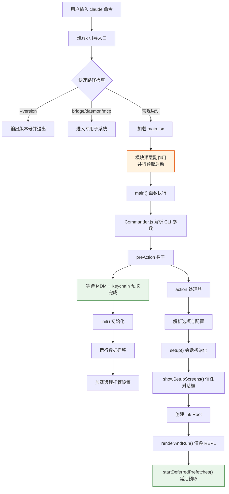
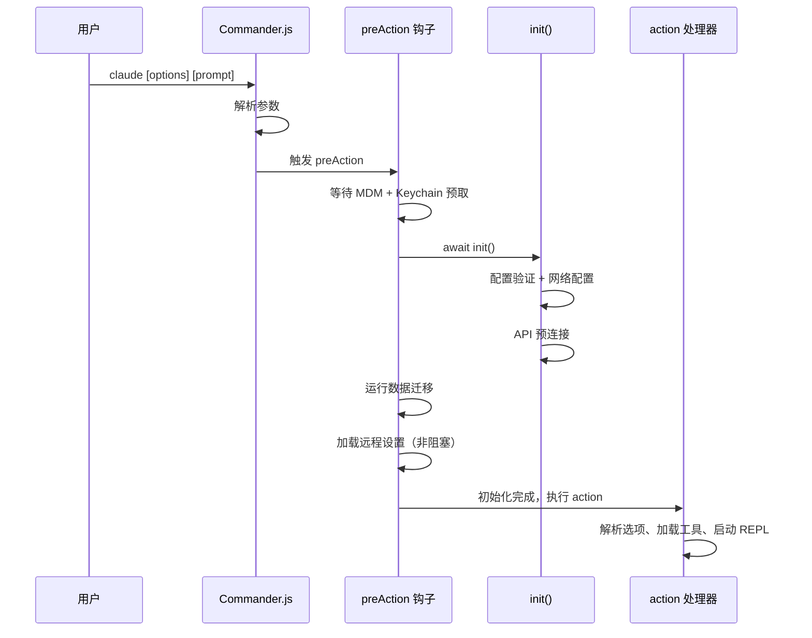
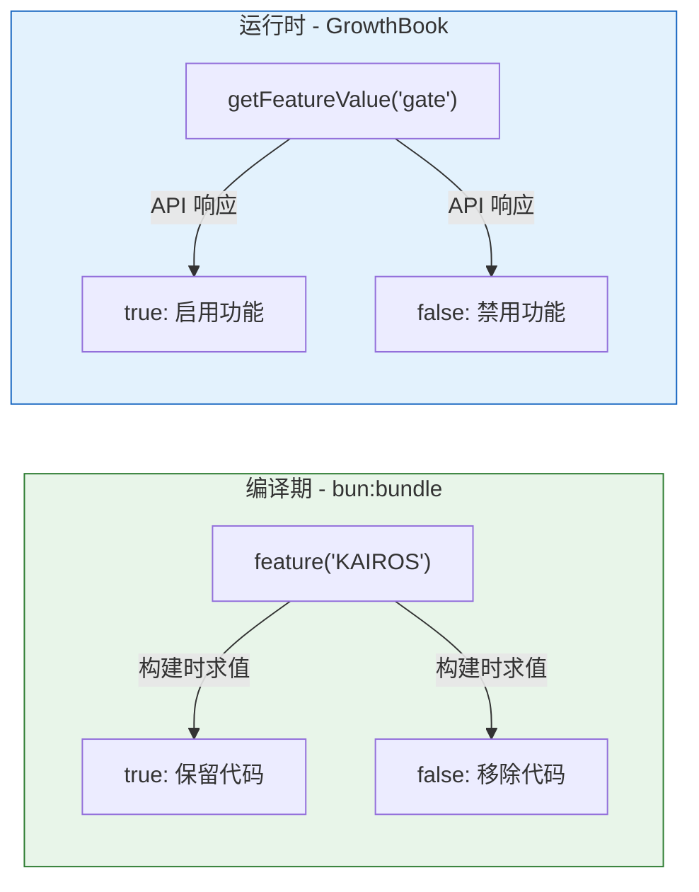
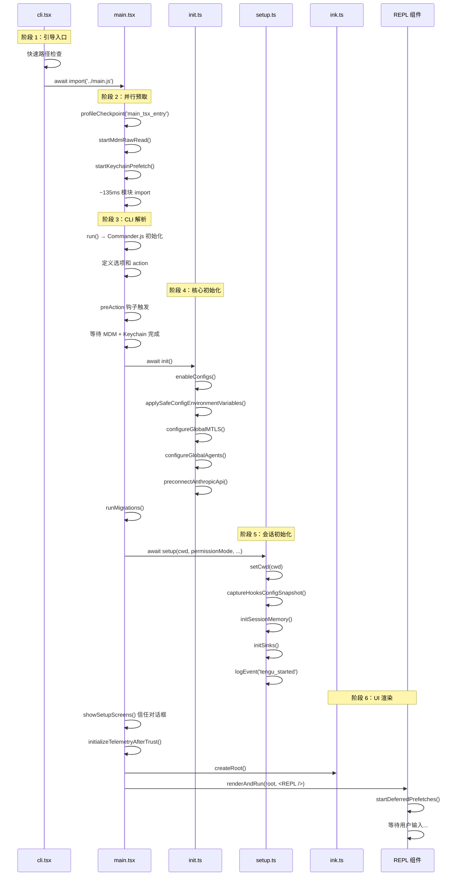

# 第 2 章 · 入口与启动流程

> 一个 CLI 工具的启动速度直接决定了用户体验。本章将带你追踪程序从第一行代码执行到 REPL 界面呈现的完整路径，揭示其中精妙的并行预取优化、编译期死代码消除机制，以及各子系统如何在启动过程中被有序串联起来。

## 2.1 启动流程全景

在深入细节之前，让我们先建立对整个启动流程的宏观认知。从用户在终端输入 `claude` 命令到看到交互式 REPL 界面，程序经历了以下关键阶段：



整个启动过程可以分为六个阶段：

| 阶段 | 关键文件 | 核心职责 |
|------|---------|---------|
| 1. 引导入口 | `src/entrypoints/cli.tsx` | 快速路径分发，最小化模块加载 |
| 2. 并行预取 | `src/main.tsx` 顶层 | MDM 设置、Keychain、性能标记 |
| 3. CLI 解析 | `src/main.tsx` `run()` | Commander.js 参数定义与解析 |
| 4. 核心初始化 | `src/entrypoints/init.ts` | 配置加载、网络配置、API 预连接 |
| 5. 会话初始化 | `src/setup.ts` | 工作目录设置、插件加载、会话恢复 |
| 6. UI 渲染 | `src/ink.ts` + `src/interactiveHelpers.tsx` | React/Ink 渲染器创建与 REPL 挂载 |

## 2.2 引导入口：cli.tsx

程序的真正入口是 `src/entrypoints/cli.tsx`。这个文件的设计理念是**最小化模块加载**——对于不需要完整 CLI 的场景，尽可能少地加载代码。

```typescript title="src/entrypoints/cli.tsx" showLineNumbers
import { feature } from 'bun:bundle';

/**
 * Bootstrap entrypoint - checks for special flags before loading the full CLI.
 * All imports are dynamic to minimize module evaluation for fast paths.
 * Fast-path for --version has zero imports beyond this file.
 */
async function main(): Promise<void> {
  const args = process.argv.slice(2);

  // highlight-start
  // 快速路径：--version 不需要加载任何模块
  if (args.length === 1 &&
    (args[0] === '--version' || args[0] === '-v' || args[0] === '-V')) {
    console.log(`${MACRO.VERSION} (Claude Code)`);
    return;
  }
  // highlight-end

  // 加载启动性能分析器
  const { profileCheckpoint } = await import('../utils/startupProfiler.js');
  profileCheckpoint('cli_entry');

  // highlight-start
  // 快速路径：bridge、daemon、mcp 等子系统有独立的启动流程
  if (feature('BRIDGE_MODE') &&
    (args[0] === 'remote-control' || args[0] === 'rc')) {
    // ... 直接进入桥接模式，不加载完整 CLI
    return;
  }
  // highlight-end

  // 常规路径：加载完整的 main.tsx
  const { startCapturingEarlyInput } = await import('../utils/earlyInput.js');
  startCapturingEarlyInput();
  const { main: cliMain } = await import('../main.js');
  await cliMain();
}

void main();
```

:::tip 设计要点：快速路径模式
`cli.tsx` 使用**全动态导入**（`await import()`），确保每条快速路径只加载必要的模块。`--version` 路径甚至不需要任何额外导入——`MACRO.VERSION` 在构建时被内联。这种设计让简单命令的响应时间降到最低。
:::

### 快速路径一览

`cli.tsx` 定义了多条快速路径，每条路径都有独立的最小化启动流程：

| 快速路径 | 触发条件 | 加载的模块 |
|---------|---------|-----------|
| 版本查询 | `--version` / `-v` | 无（零导入） |
| 桥接模式 | `remote-control` / `bridge` | 桥接系统模块 |
| 守护进程 | `daemon` | 守护进程模块 |
| MCP 服务 | `--claude-in-chrome-mcp` | Chrome MCP 服务器 |
| 后台会话 | `ps` / `logs` / `attach` / `kill` | 后台会话管理 |
| 常规 CLI | 其他所有情况 | 完整的 `main.tsx` |

注意 `--bare` 模式的处理——它在加载 `main.tsx` 之前就设置了 `CLAUDE_CODE_SIMPLE=1` 环境变量，确保后续所有模块在求值阶段就能感知到精简模式：

```typescript title="src/entrypoints/cli.tsx" showLineNumbers
// highlight-start
// --bare: 在模块求值阶段就设置 SIMPLE 标志
// 确保所有 feature gate 在 import 时就能正确判断
if (args.includes('--bare')) {
  process.env.CLAUDE_CODE_SIMPLE = '1';
}
// highlight-end

// 常规路径：加载完整 CLI
const { main: cliMain } = await import('../main.js');
await cliMain();
```

## 2.3 并行预取：启动速度的秘密武器

当 `cli.tsx` 通过 `await import('../main.js')` 加载 `main.tsx` 时，JavaScript 引擎开始求值 `main.tsx` 的模块顶层代码。项目在这里巧妙地利用了**模块求值的时序特性**，在 `import` 语句之间插入副作用调用，让 I/O 操作与 CPU 密集的模块解析并行执行。

这是整个项目中最精妙的启动优化之一。让我们逐行分析：

```typescript title="src/main.tsx" showLineNumbers
// highlight-start
// 这些副作用必须在所有其他导入之前运行：
// 1. profileCheckpoint 在重量级模块加载前标记入口时间
// 2. startMdmRawRead 启动 MDM 子进程（plutil/reg query），
//    与后续约 135ms 的 import 并行执行
// 3. startKeychainPrefetch 并行启动 macOS keychain 读取
//    （OAuth + 旧版 API key），避免后续同步读取的 ~65ms 开销
// highlight-end

import { profileCheckpoint } from './utils/startupProfiler.js';
profileCheckpoint('main_tsx_entry');  // ① 标记入口时间

import { startMdmRawRead } from './utils/settings/mdm/rawRead.js';
startMdmRawRead();                    // ② 启动 MDM 子进程

import { startKeychainPrefetch } from './utils/secureStorage/keychainPrefetch.js';
startKeychainPrefetch();              // ③ 启动 Keychain 读取

// highlight-start
// 接下来是约 135ms 的常规 import 语句
// 在这段时间里，上面启动的子进程在后台并行执行
// highlight-end
import { feature } from 'bun:bundle';
import { Command as CommanderCommand } from '@commander-js/extra-typings';
import chalk from 'chalk';
// ... 约 150 行 import 语句，耗时 ~135ms
```

:::caution 为什么顺序如此重要？
这段代码的顺序是经过精心设计的。`startMdmRawRead()` 和 `startKeychainPrefetch()` 必须在所有其他 `import` 之前执行，因为：
1. 它们启动的是**异步子进程**（`execFile`），不会阻塞事件循环
2. 后续的 `import` 语句是**同步的模块求值**，会占用 CPU ~135ms
3. 子进程在操作系统层面与 JavaScript 引擎并行运行
4. 当 `import` 完成后，子进程的结果通常已经就绪

这就是"利用 import 的时间窗口"——把 I/O 等待隐藏在 CPU 密集的模块解析背后。
:::

### 预取机制一：MDM 设置读取

MDM（Mobile Device Management）设置用于企业环境下的集中配置管理。在 macOS 上，它通过 `plutil` 命令读取 plist 文件；在 Windows 上，通过 `reg query` 读取注册表。

```typescript title="src/utils/settings/mdm/rawRead.ts" showLineNumbers
import { execFile } from 'child_process';

/**
 * 启动 MDM 子进程读取。在 main.tsx 模块求值时调用。
 * 结果通过 getMdmRawReadPromise() 在后续消费。
 */
export function startMdmRawRead(): void {
  if (rawReadPromise) return;
  rawReadPromise = fireRawRead();
}

export function fireRawRead(): Promise<RawReadResult> {
  return (async (): Promise<RawReadResult> => {
    if (process.platform === 'darwin') {
      const plistPaths = getMacOSPlistPaths();
      // highlight-start
      // 并行读取所有 plist 路径，第一个成功的结果胜出
      const allResults = await Promise.all(
        plistPaths.map(async ({ path, label }) => {
          // 快速路径：文件不存在时跳过 plutil 子进程
          if (!existsSync(path)) {
            return { stdout: '', label, ok: false };
          }
          const { stdout, code } = await execFilePromise(
            PLUTIL_PATH, [...PLUTIL_ARGS_PREFIX, path]
          );
          return { stdout, label, ok: code === 0 && !!stdout };
        }),
      );
      // highlight-end
      return { plistStdouts: allResults.find(r => r.ok) ? [...] : [] };
    }

    if (process.platform === 'win32') {
      // highlight-next-line
      // Windows: 并行查询 HKLM 和 HKCU 注册表
      const [hklm, hkcu] = await Promise.all([
        execFilePromise('reg', ['query', WINDOWS_REGISTRY_KEY_PATH_HKLM, ...]),
        execFilePromise('reg', ['query', WINDOWS_REGISTRY_KEY_PATH_HKCU, ...]),
      ]);
      return { hklmStdout: hklm.stdout, hkcuStdout: hkcu.stdout };
    }

    return { plistStdouts: null, hklmStdout: null, hkcuStdout: null };
  })();
}
```

### 预取机制二：macOS Keychain 读取

Keychain 预取解决了一个具体的性能问题：`isRemoteManagedSettingsEligible()` 在初始化时需要**顺序读取**两个 Keychain 条目（OAuth 令牌和旧版 API Key），每次读取约 32-33ms，总计约 65ms。通过预取，这两次读取变成并行的，且与模块加载重叠。

```typescript title="src/utils/secureStorage/keychainPrefetch.ts" showLineNumbers
/**
 * 并行启动两个 macOS keychain 读取。
 * 在 main.tsx 顶层调用，紧跟在 startMdmRawRead() 之后。
 * 非 darwin 平台为空操作。
 */
export function startKeychainPrefetch(): void {
  if (process.platform !== 'darwin' || prefetchPromise || isBareMode()) return;

  // highlight-start
  // 同时启动两个子进程，它们与 main.tsx 的 import 并行执行
  const oauthSpawn = spawnSecurity(
    getMacOsKeychainStorageServiceName(CREDENTIALS_SERVICE_SUFFIX),
  );  // OAuth 令牌 ~32ms
  const legacySpawn = spawnSecurity(
    getMacOsKeychainStorageServiceName(),
  );  // 旧版 API Key ~33ms
  // highlight-end

  prefetchPromise = Promise.all([oauthSpawn, legacySpawn]).then(
    ([oauth, legacy]) => {
      // 将结果写入缓存，后续同步读取直接命中
      if (!oauth.timedOut) primeKeychainCacheFromPrefetch(oauth.stdout);
      if (!legacy.timedOut) legacyApiKeyPrefetch = { stdout: legacy.stdout };
    },
  );
}
```

### 预取机制三：API 预连接

第三个预取发生在 `init()` 函数中（稍后的阶段），它预先建立与 Anthropic API 的 TCP+TLS 连接：

```typescript title="src/utils/apiPreconnect.ts" showLineNumbers
/**
 * 预连接 Anthropic API，将 TCP+TLS 握手与启动工作重叠。
 *
 * TCP+TLS 握手通常需要 ~100-200ms，会阻塞第一次 API 调用。
 * 在 init 阶段发起一个 fire-and-forget 的 fetch，让握手与
 * action handler 的工作（~100ms）并行完成。
 *
 * Bun 的 fetch 共享全局 keep-alive 连接池，
 * 所以真正的 API 请求会复用这个已预热的连接。
 */
export function preconnectAnthropicApi(): void {
  if (fired) return;
  fired = true;

  // 跳过不适用的场景
  if (isEnvTruthy(process.env.CLAUDE_CODE_USE_BEDROCK) || /* ... */) return;
  if (process.env.HTTPS_PROXY || /* ... */) return;

  const baseUrl = process.env.ANTHROPIC_BASE_URL
    || getOauthConfig().BASE_API_URL;

  // highlight-start
  // HEAD 请求：无响应体，连接立即可被 keep-alive 池复用
  void fetch(baseUrl, {
    method: 'HEAD',
    signal: AbortSignal.timeout(10_000),
  }).catch(() => {});
  // highlight-end
}
```

### 并行预取时序图

下面这张时序图展示了三个预取操作如何与模块加载并行执行：

```mermaid
gantt
    title 启动阶段并行预取时序
    dateFormat X
    axisFormat %L ms

    section 主线程
    profileCheckpoint           :a1, 0, 1
    startMdmRawRead() 调用      :a2, 1, 2
    startKeychainPrefetch() 调用 :a3, 2, 3
    模块 import 求值 (~135ms)    :a4, 3, 138
    main() 函数开始              :a5, 138, 140
    Commander.js 初始化          :a6, 140, 145
    preAction 钩子               :a7, 145, 150
    等待预取完成 (几乎免费)       :a8, 150, 152
    init() 初始化                :a9, 152, 200
    preconnectAnthropicApi()     :a10, 195, 196

    section MDM 子进程
    plutil/reg query 执行        :b1, 2, 50

    section Keychain 子进程 1
    OAuth 令牌读取               :c1, 3, 35

    section Keychain 子进程 2
    旧版 API Key 读取            :c2, 3, 36

    section API 预连接
    TCP+TLS 握手                 :d1, 196, 396
```



:::info 性能收益
通过并行预取，启动时间节省了约 **65ms**（Keychain 顺序读取）+ **50ms**（MDM 读取）+ **100-200ms**（API 握手）。这些优化对于 CLI 工具来说意义重大——用户期望命令行工具能够即时响应。
:::

## 2.4 Commander.js CLI 解析

当 `main()` 函数开始执行时，首先创建 Commander.js 程序实例并定义所有 CLI 选项。这个过程发生在 `run()` 函数中。

```typescript title="src/main.tsx" showLineNumbers
async function run(): Promise<CommanderCommand> {
  profileCheckpoint('run_function_start');

  // highlight-start
  // 创建 Commander 实例，启用选项排序和位置参数
  const program = new CommanderCommand()
    .configureHelp(createSortedHelpConfig())
    .enablePositionalOptions();
  // highlight-end

  // preAction 钩子：在执行任何命令前运行初始化
  program.hook('preAction', async thisCommand => {
    // ① 等待模块顶层启动的异步预取完成
    await Promise.all([
      ensureMdmSettingsLoaded(),
      ensureKeychainPrefetchCompleted(),
    ]);
    // ② 运行核心初始化
    await init();
    // ③ 运行数据迁移
    runMigrations();
    // ④ 加载远程托管设置（非阻塞）
    void loadRemoteManagedSettings();
    void loadPolicyLimits();
  });

  // 定义主命令和所有选项
  program
    .name('claude')
    .argument('[prompt]', 'Your prompt')
    .option('-p, --print', '输出响应并退出')
    .option('--bare', '最小模式')
    .option('-c, --continue', '继续最近的对话')
    .option('-r, --resume [value]', '恢复指定会话')
    .option('--model <model>', '指定模型')
    .option('--permission-mode <mode>', '权限模式')
    .option('--mcp-config <configs...>', 'MCP 服务器配置')
    // ... 约 50 个选项定义
    .action(async (prompt, options) => {
      // 主命令的 action 处理器
      // 这里是启动流程的核心逻辑
    });

  return program;
}
```

### preAction 钩子：初始化的编排中心

Commander.js 的 `preAction` 钩子是一个关键的设计选择。它确保初始化逻辑**只在实际执行命令时运行**，而不是在显示帮助信息时运行。这避免了 `claude --help` 触发不必要的初始化。



### CLI 选项体系

程序定义了丰富的 CLI 选项，可以分为以下几类：

| 类别 | 代表性选项 | 说明 |
|------|-----------|------|
| 运行模式 | `-p/--print`, `--bare` | 控制交互/非交互模式 |
| 会话管理 | `-c/--continue`, `-r/--resume` | 会话恢复与继续 |
| 模型配置 | `--model`, `--effort`, `--thinking` | LLM 模型与推理参数 |
| 权限控制 | `--permission-mode`, `--dangerously-skip-permissions` | 工具执行权限 |
| 工具配置 | `--allowed-tools`, `--disallowed-tools`, `--tools` | 工具白名单/黑名单 |
| MCP 集成 | `--mcp-config`, `--strict-mcp-config` | MCP 服务器配置 |
| 输出格式 | `--output-format`, `--json-schema` | 结构化输出控制 |
| 扩展 | `--plugin-dir`, `--agents`, `--settings` | 插件、智能体、设置 |

## 2.5 核心初始化：init()

`init()` 函数（位于 `src/entrypoints/init.ts`）是系统初始化的核心。它使用 `memoize` 确保只执行一次，负责配置验证、网络设置、安全配置等关键工作。

```typescript title="src/entrypoints/init.ts" showLineNumbers
import memoize from 'lodash-es/memoize.js';

// highlight-next-line
export const init = memoize(async (): Promise<void> => {
  profileCheckpoint('init_function_start');

  // ① 验证并启用配置系统
  enableConfigs();

  // ② 应用安全的环境变量（信任对话框之前）
  applySafeConfigEnvironmentVariables();

  // ③ 应用 CA 证书配置（必须在首次 TLS 握手之前）
  applyExtraCACertsFromConfig();

  // ④ 设置优雅退出处理
  setupGracefulShutdown();

  // ⑤ 初始化 1P 事件日志（异步，不阻塞）
  void Promise.all([
    import('../services/analytics/firstPartyEventLogger.js'),
    import('../services/analytics/growthbook.js'),
  ]).then(([fp, gb]) => {
    fp.initialize1PEventLogging();
    gb.onGrowthBookRefresh(() => {
      void fp.reinitialize1PEventLoggingIfConfigChanged();
    });
  });

  // ⑥ 填充 OAuth 账户信息（异步）
  void populateOAuthAccountInfoIfNeeded();

  // ⑦ 初始化远程托管设置加载 Promise
  if (isEligibleForRemoteManagedSettings()) {
    initializeRemoteManagedSettingsLoadingPromise();
  }
  if (isPolicyLimitsEligible()) {
    initializePolicyLimitsLoadingPromise();
  }

  // ⑧ 配置 mTLS 和全局 HTTP 代理
  configureGlobalMTLS();
  configureGlobalAgents();

  // highlight-start
  // ⑨ API 预连接：在 CA 证书和代理配置完成后
  // 重叠 TCP+TLS 握手（~100-200ms）与后续工作
  preconnectAnthropicApi();
  // highlight-end

  // ⑩ Windows 下设置 git-bash
  setShellIfWindows();

  // ⑪ 注册清理回调
  registerCleanup(shutdownLspServerManager);
});
```

`init()` 的设计体现了几个重要原则：

1. **幂等性**：通过 `memoize` 确保多次调用只执行一次
2. **安全优先**：CA 证书必须在任何 TLS 连接之前配置
3. **非阻塞**：大量工作通过 `void` 异步执行，不阻塞主流程
4. **顺序敏感**：mTLS 和代理必须在 API 预连接之前配置

### 遥测初始化：信任之后

遥测系统的初始化被特意延迟到用户信任对话框之后。这是因为 OpenTelemetry 模块体积庞大（~400KB），且需要用户授权：

```typescript title="src/entrypoints/init.ts" showLineNumbers
/**
 * 在信任授权后初始化遥测。
 * 对于远程设置用户，等待设置加载完成后再初始化。
 */
export function initializeTelemetryAfterTrust(): void {
  if (isEligibleForRemoteManagedSettings()) {
    void waitForRemoteManagedSettingsToLoad()
      .then(async () => {
        // highlight-start
        // 重新应用环境变量以包含远程设置
        applyConfigEnvironmentVariables();
        // 懒加载 OpenTelemetry（~400KB）
        await doInitializeTelemetry();
        // highlight-end
      });
  } else {
    void doInitializeTelemetry();
  }
}

async function setMeterState(): Promise<void> {
  // highlight-next-line
  // 懒加载：延迟 ~400KB 的 OpenTelemetry + protobuf 模块
  const { initializeTelemetry } = await import(
    '../utils/telemetry/instrumentation.js'
  );
  const meter = await initializeTelemetry();
  if (meter) {
    setMeter(meter, createAttributedCounter);
    getSessionCounter()?.add(1);
  }
}
```

:::info 懒加载策略
OpenTelemetry + protobuf 约 400KB，gRPC 导出器约 700KB。这些模块采用动态 `import()` 延迟加载，只在遥测实际初始化时才加载到内存。这是第 1 章提到的"懒加载模式"的典型应用。
:::

## 2.6 会话初始化：setup()

`setup()` 函数（位于 `src/setup.ts`）负责会话级别的初始化工作。它在 `init()` 之后、UI 渲染之前执行。

```typescript title="src/setup.ts" showLineNumbers
export async function setup(
  cwd: string,
  permissionMode: PermissionMode,
  allowDangerouslySkipPermissions: boolean,
  worktreeEnabled: boolean,
  worktreeName: string | undefined,
  tmuxEnabled: boolean,
  customSessionId?: string | null,
): Promise<void> {
  // ① 设置工作目录（必须最先执行）
  setCwd(cwd);

  // ② 捕获 Hooks 配置快照（必须在 setCwd 之后）
  captureHooksConfigSnapshot();

  // ③ 初始化文件变更监听器
  initializeFileChangedWatcher(cwd);

  // highlight-start
  // ④ 处理 worktree 创建（如果请求）
  if (worktreeEnabled) {
    const worktreeSession = await createWorktreeForSession(
      getSessionId(), slug, tmuxSessionName
    );
    process.chdir(worktreeSession.worktreePath);
    setCwd(worktreeSession.worktreePath);
  }
  // highlight-end

  // ⑤ 初始化会话记忆
  initSessionMemory();

  // ⑥ 锁定当前版本（防止其他进程删除）
  void lockCurrentVersion();

  // ⑦ 初始化日志和分析 sink
  initSinks();

  // highlight-next-line
  // ⑧ 发送 tengu_started 事件（最早的可靠"进程已启动"信号）
  logEvent('tengu_started', {});

  // ⑨ 预取 API Key（安全地，仅在信任已确认时）
  void prefetchApiKeyFromApiKeyHelperIfSafe(getIsNonInteractiveSession());

  // ⑩ 检查发布说明
  const { hasReleaseNotes } = await checkForReleaseNotes(...);

  // ⑪ 安全检查：bypassPermissions 模式验证
  if (permissionMode === 'bypassPermissions') {
    // 验证是否在安全环境中（Docker/沙箱 + 无网络）
  }
}
```

`setup()` 中有一个值得注意的设计：`tengu_started` 事件在 `initSinks()` 之后立即发送，位于所有可能抛出异常的代码之前。这确保了即使后续代码崩溃，也能记录到"进程已启动"的信号，用于发布健康监控。

## 2.7 React/Ink 渲染器初始化

在 `setup()` 完成后，程序进入 UI 渲染阶段。这是 React/Ink 终端 UI 框架发挥作用的地方。

### Ink 渲染器创建

`src/ink.ts` 封装了 Ink 的渲染 API，并自动注入主题提供者：

```typescript title="src/ink.ts" showLineNumbers
import { createElement, type ReactNode } from 'react';
import { ThemeProvider } from './components/design-system/ThemeProvider.js';
import { createRoot as inkCreateRoot, type Root } from './ink/root.js';

// highlight-start
// 所有渲染调用自动包裹 ThemeProvider
// 确保 ThemedBox/ThemedText 等组件无需手动挂载主题
function withTheme(node: ReactNode): ReactNode {
  return createElement(ThemeProvider, null, node);
}
// highlight-end

export async function createRoot(options?: RenderOptions): Promise<Root> {
  const root = await inkCreateRoot(options);
  return {
    ...root,
    render: node => root.render(withTheme(node)),
  };
}
```

### renderAndRun：渲染与生命周期管理

`renderAndRun()` 是连接 React 渲染和进程生命周期的桥梁：

```typescript title="src/interactiveHelpers.tsx" showLineNumbers
/**
 * 将主 UI 渲染到 root 并等待退出。
 * 处理通用的收尾工作：启动延迟预取、等待退出、优雅关闭。
 */
export async function renderAndRun(
  root: Root,
  element: React.ReactNode,
): Promise<void> {
  // highlight-start
  root.render(element);           // 渲染 React 组件树
  startDeferredPrefetches();      // 启动延迟预取（首次渲染后）
  await root.waitUntilExit();     // 等待用户退出
  await gracefulShutdown(0);      // 优雅关闭
  // highlight-end
}
```

注意 `startDeferredPrefetches()` 的调用时机——它在**首次渲染之后**执行。这是一个精心设计的时间点：

```typescript title="src/main.tsx" showLineNumbers
/**
 * 启动不需要在首次渲染前完成的后台预取和维护任务。
 * 从 setup() 中延迟到这里，以减少关键启动路径上的
 * 事件循环竞争和子进程生成。
 */
export function startDeferredPrefetches(): void {
  // 如果只是测量启动性能，跳过所有预取
  if (isEnvTruthy(process.env.CLAUDE_CODE_EXIT_AFTER_FIRST_RENDER)
    || isBareMode()) {
    return;
  }

  // highlight-start
  // 进程生成类预取（在首次 API 调用时消费，用户还在打字）
  void initUser();
  void getUserContext();
  prefetchSystemContextIfSafe();
  void getRelevantTips();
  // highlight-end

  // 分析和特性标志初始化
  void initializeAnalyticsGates();
  void prefetchOfficialMcpUrls();
  void refreshModelCapabilities();

  // 文件变更检测器（从 init() 延迟到这里以不阻塞首次渲染）
  void settingsChangeDetector.initialize();
  void skillChangeDetector.initialize();
}
```

:::tip 延迟预取的设计哲学
`startDeferredPrefetches()` 中的所有工作都不影响首次渲染。它们利用"用户正在打字"的时间窗口，在后台预热缓存。当用户提交第一个请求时，这些数据通常已经就绪。这是一种**投机性预取**——赌用户会在几秒内开始交互。
:::

## 2.8 `bun:bundle` 特性标志与死代码消除

项目使用 Bun 运行时的 `bun:bundle` 模块实现了一套编译期特性标志系统。这是一个非常强大的机制——它不仅控制功能的启用/禁用，还能在构建时**完全移除**未启用功能的代码。

### 工作原理

```typescript title="src/main.tsx" showLineNumbers
import { feature } from 'bun:bundle';

// highlight-start
// 编译期条件导入：当 COORDINATOR_MODE 为 false 时，
// 整个 require 分支在构建时被完全移除
const coordinatorModeModule = feature('COORDINATOR_MODE')
  ? require('./coordinator/coordinatorMode.js')
  : null;
// highlight-end

// 同样的模式用于 KAIROS（助手模式）
const assistantModule = feature('KAIROS')
  ? require('./assistant/index.js')
  : null;

// TRANSCRIPT_CLASSIFIER 控制自动模式状态
const autoModeStateModule = feature('TRANSCRIPT_CLASSIFIER')
  ? require('./utils/permissions/autoModeState.js')
  : null;
```

当 `feature('COORDINATOR_MODE')` 在构建时被求值为 `false`，Bun 的打包器会：

1. 将整个三元表达式替换为 `null`
2. 移除 `require('./coordinator/coordinatorMode.js')` 的引用
3. 如果 `coordinatorMode.js` 没有其他引用，整个模块及其依赖树都会被移除

这就是**死代码消除（Dead Code Elimination, DCE）**——未使用的代码在构建产物中完全不存在。

### 已知的特性标志

项目中使用了大量特性标志，覆盖了从核心功能到实验性特性的各个方面：

| 特性标志 | 控制的功能 | 影响范围 |
|---------|-----------|---------|
| `COORDINATOR_MODE` | 多智能体协调器模式 | 协调器模块加载 |
| `KAIROS` | 助手模式（Assistant） | 助手模块、频道系统 |
| `KAIROS_BRIEF` | 简报工具 | BriefTool 加载 |
| `KAIROS_CHANNELS` | 频道系统 | 推送通知注册 |
| `PROACTIVE` | 主动模式 | SleepTool、主动提示 |
| `BRIDGE_MODE` | IDE 桥接模式 | 桥接子系统加载 |
| `SSH_REMOTE` | SSH 远程模式 | SSH 会话管理 |
| `DIRECT_CONNECT` | 直连模式 | cc:// URL 处理 |
| `DAEMON` | 守护进程模式 | 后台守护进程 |
| `BG_SESSIONS` | 后台会话 | ps/logs/attach/kill |
| `TRANSCRIPT_CLASSIFIER` | 转录分类器 | 自动模式状态 |
| `UDS_INBOX` | Unix 域套接字消息 | 进程间通信 |
| `COMMIT_ATTRIBUTION` | 提交归因 | Git 钩子注册 |
| `TEAMMEM` | 团队记忆 | 记忆同步监听 |
| `UPLOAD_USER_SETTINGS` | 设置上传 | 设置同步 |
| `CONTEXT_COLLAPSE` | 上下文折叠 | 上下文压缩 |
| `LODESTONE` | 深度链接 | URI 协议处理 |
| `TEMPLATES` | 模板任务 | 模板命令 |
| `CHICAGO_MCP` | 计算机使用 MCP | 计算机使用服务器 |
| `WEB_BROWSER_TOOL` | Web 浏览器工具 | 浏览器集成 |
| `ABLATION_BASELINE` | 消融基线 | 科学实验控制 |

### 编译期 vs 运行时特性标志

项目同时使用两种特性标志机制，它们有本质的区别：



| 维度 | `bun:bundle` feature() | GrowthBook |
|------|----------------------|------------|
| 求值时机 | 构建时 | 运行时 |
| 代码影响 | 未启用的代码被完全移除 | 代码始终存在，通过条件分支控制 |
| 变更方式 | 需要重新构建 | 服务端配置即时生效 |
| 适用场景 | 大型模块的条件加载 | A/B 测试、渐进发布 |
| 性能影响 | 减小包体积，加快启动 | 运行时有微小开销 |

### 在 cli.tsx 中的应用

`cli.tsx` 中的快速路径也大量使用 `feature()` 进行条件分发：

```typescript title="src/entrypoints/cli.tsx" showLineNumbers
// highlight-start
// 每个 feature() 调用在构建时被替换为 true 或 false
// 当为 false 时，整个 if 块（包括动态 import）被移除
// highlight-end
if (feature('BRIDGE_MODE') && args[0] === 'remote-control') {
  // 桥接模式的完整启动流程
  const { bridgeMain } = await import('../bridge/bridgeMain.js');
  await bridgeMain(args.slice(1));
  return;
}

if (feature('DAEMON') && args[0] === 'daemon') {
  // 守护进程的完整启动流程
  const { daemonMain } = await import('../daemon/main.js');
  await daemonMain(args.slice(1));
  return;
}
```

这意味着在外部发布版本中，如果 `BRIDGE_MODE` 被设为 `false`，那么 `bridgeMain.js` 及其整个依赖树都不会出现在最终的构建产物中。这对于控制发布包的大小和减少攻击面都非常有价值。

## 2.9 Bootstrap 状态：启动期间的全局状态管理

`src/bootstrap/state.ts` 是启动过程中的全局状态容器。它管理着会话 ID、工作目录、模型配置、成本追踪等几乎所有需要在启动期间共享的状态。

```typescript title="src/bootstrap/state.ts" showLineNumbers
// 状态通过模块级变量管理，提供 getter/setter 函数访问

// highlight-start
// 会话管理
function getSessionId(): SessionId { /* ... */ }
function switchSession(newId: SessionId): void { /* ... */ }

// 工作目录
function getOriginalCwd(): string { /* ... */ }
function setOriginalCwd(cwd: string): void { /* ... */ }
function getProjectRoot(): string { /* ... */ }

// 模型配置
function getInitialMainLoopModel(): ModelSetting { /* ... */ }
function setMainLoopModelOverride(model: ModelSetting): void { /* ... */ }

// 成本追踪
function addToTotalCostState(cost: number, ...): void { /* ... */ }
function getTotalCostUSD(): number { /* ... */ }

// 交互模式
function getIsNonInteractiveSession(): boolean { /* ... */ }
function setIsInteractive(value: boolean): void { /* ... */ }
// highlight-end
```

这个模块的设计选择值得注意：它使用**模块级闭包**而非类实例来管理状态。这意味着状态是进程级别的单例，所有模块通过导入同一个模块来共享状态。这种模式在 CLI 应用中很常见——每个进程只有一个会话。

## 2.10 启动流程与子系统的串联

现在让我们把所有阶段串联起来，看看启动流程如何将各子系统连接在一起。



### 启动流程如何连接各子系统

启动过程不仅仅是"初始化"——它是各子系统建立连接的过程：

1. **工具系统**：在 action 处理器中通过 `getTools()` 加载，受 `feature()` 标志控制哪些工具可用
2. **命令系统**：在 `setup()` 中通过 `getCommands()` 预取，确保 REPL 启动时命令已就绪
3. **查询引擎**：在 REPL 中首次用户输入时才实际调用，但 API 连接已在 `init()` 中预热
4. **桥接系统**：如果检测到 IDE 连接（`--ide` 选项），在 action 处理器中初始化
5. **插件系统**：在 `main.tsx` 中通过 `initBundledSkills()` 和 `initBuiltinPlugins()` 注册
6. **权限系统**：在 action 处理器中通过 `initializeToolPermissionContext()` 初始化
7. **状态管理**：通过 `bootstrap/state.ts` 在整个启动过程中持续更新

:::tip 与第 1 章的关联
回顾第 1 章的架构图，启动流程实际上是沿着"CLI 入口层 → 核心引擎 → 工具系统 → UI 渲染层"的路径，逐步激活各个子系统。每个子系统的初始化都被精心安排在最合适的时间点——既不过早（浪费资源），也不过晚（影响体验）。
:::

## 2.11 数据迁移系统

启动过程中还包含一个重要的环节——数据迁移。`runMigrations()` 确保用户的配置数据能够平滑地从旧版本升级到新版本：

```typescript title="src/main.tsx" showLineNumbers
const CURRENT_MIGRATION_VERSION = 11;

function runMigrations(): void {
  // highlight-start
  // 只在版本不匹配时运行迁移
  if (getGlobalConfig().migrationVersion !== CURRENT_MIGRATION_VERSION) {
    migrateAutoUpdatesToSettings();
    migrateBypassPermissionsAcceptedToSettings();
    migrateEnableAllProjectMcpServersToSettings();
    resetProToOpusDefault();
    migrateSonnet1mToSonnet45();
    migrateLegacyOpusToCurrent();
    migrateSonnet45ToSonnet46();
    migrateOpusToOpus1m();
    migrateReplBridgeEnabledToRemoteControlAtStartup();
    // highlight-end

    // 条件迁移：仅在特性标志启用时运行
    if (feature('TRANSCRIPT_CLASSIFIER')) {
      resetAutoModeOptInForDefaultOffer();
    }

    // 更新迁移版本号
    saveGlobalConfig(prev => ({
      ...prev,
      migrationVersion: CURRENT_MIGRATION_VERSION,
    }));
  }

  // 异步迁移：fire-and-forget
  migrateChangelogFromConfig().catch(() => {});
}
```

迁移系统的设计要点：
- **版本号控制**：通过 `CURRENT_MIGRATION_VERSION` 确保迁移只运行一次
- **同步迁移**：关键迁移同步执行，确保后续代码看到正确的配置
- **异步迁移**：非关键迁移（如 changelog）异步执行，不阻塞启动
- **条件迁移**：部分迁移受 `feature()` 标志控制

## 2.12 本章小结

通过本章的分析，我们深入理解了程序从第一行代码到 REPL 界面的完整启动路径。以下是关键要点：

1. **分层引导**：`cli.tsx` → `main.tsx` → `init.ts` → `setup.ts` → `ink.ts`，每层有明确的职责边界
2. **并行预取**：MDM 设置、Keychain 读取、API 预连接三个机制，将 I/O 等待隐藏在 CPU 工作背后
3. **编译期优化**：`bun:bundle` 的 `feature()` 实现死代码消除，未启用的功能在构建产物中完全不存在
4. **延迟加载**：OpenTelemetry、gRPC 等重量级模块通过动态 `import()` 延迟到实际需要时才加载
5. **精心编排**：每个初始化步骤都被安排在最合适的时间点，平衡了启动速度和功能完整性

这些启动优化技巧不仅适用于本项目——它们是构建高性能 CLI 工具的通用模式。在后续章节中，我们将看到这些在启动阶段初始化的子系统如何在运行时协同工作。

---

## 术语表

| 术语 | 说明 |
|------|------|
| **快速路径（Fast Path）** | 针对特定命令的最小化启动流程，跳过不必要的模块加载 |
| **并行预取（Parallel Prefetch）** | 在模块加载期间并行启动 I/O 操作，利用 CPU 工作的时间窗口 |
| **死代码消除（DCE）** | 构建时移除未使用代码的优化技术，由 `bun:bundle` 的 `feature()` 驱动 |
| **MDM（Mobile Device Management）** | 企业移动设备管理，用于集中配置管理 |
| **Keychain** | macOS 的安全凭证存储系统 |
| **preAction 钩子** | Commander.js 在执行命令前触发的钩子，用于运行初始化逻辑 |
| **延迟预取（Deferred Prefetch）** | 在首次渲染后启动的后台预取，利用"用户正在打字"的时间窗口 |
| **memoize** | 函数记忆化，确保函数只执行一次并缓存结果 |
| **Ink** | 基于 React 的终端 UI 渲染框架 |
| **GrowthBook** | 运行时特性标志和 A/B 测试平台 |