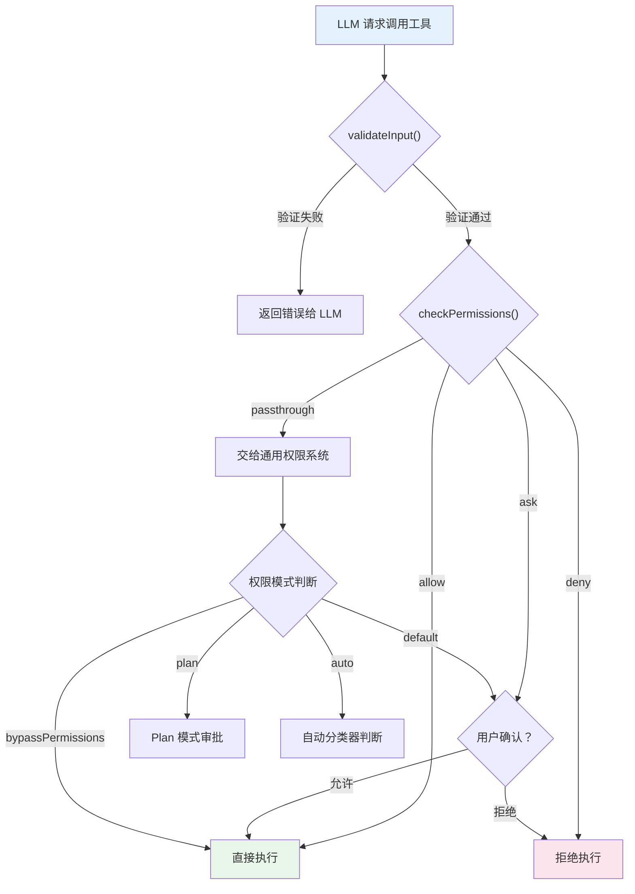
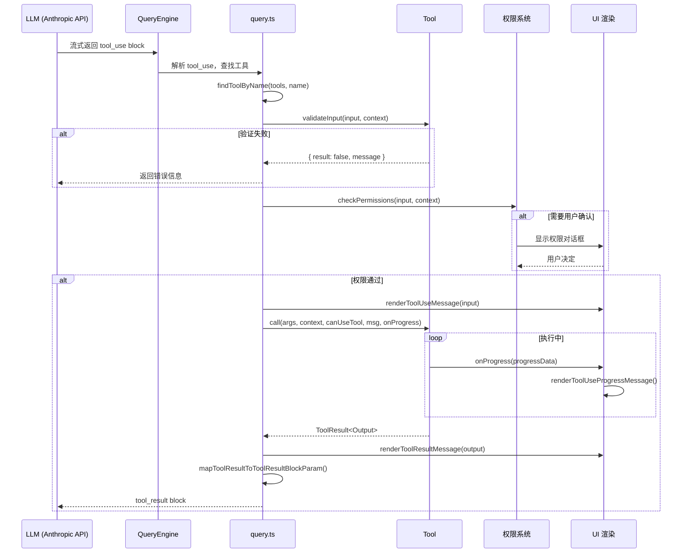
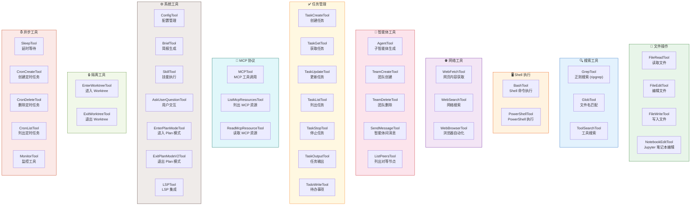
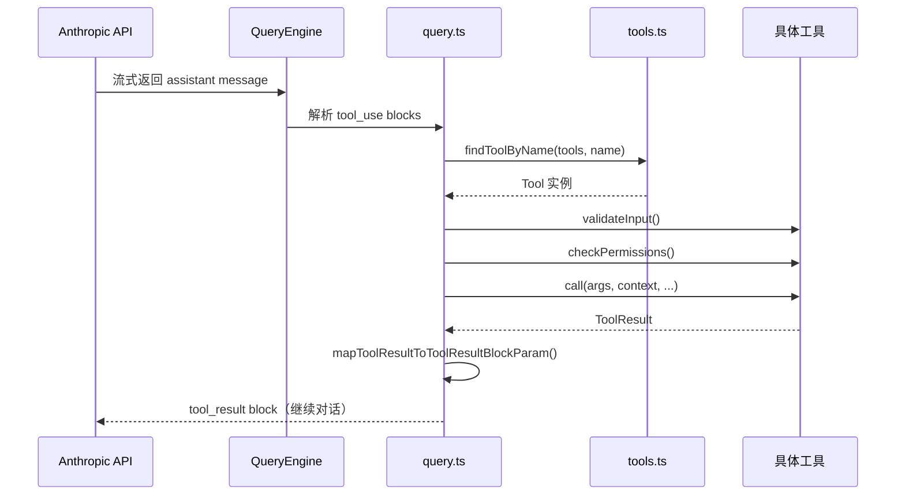

# 第 3 章 · 工具系统

> 工具系统是 LLM 智能体的"双手"——没有工具，智能体只能说话；有了工具，它才能真正做事。本章将带你深入理解工具系统的完整设计：从基础类型定义到权限模型，从注册机制到执行生命周期，再到 40+ 个工具的分类全景。

## 3.1 概述：为什么需要工具系统？

在 LLM 智能体架构中，**工具（Tool）** 是模型与外部世界交互的唯一通道。当用户要求"帮我修改这个文件"或"搜索代码中的某个模式"时，LLM 本身无法直接操作文件系统——它需要通过工具来完成这些操作。

本项目的工具系统具有以下核心特征：

- **类型安全**：每个工具的输入通过 Zod Schema 严格定义和验证
- **权限优先**：每个工具在执行前必须通过权限检查，确保安全性
- **自包含**：每个工具是一个独立目录，包含实现、UI 渲染、提示词等
- **可扩展**：通过 MCP 协议可以动态接入外部工具
- **条件加载**：通过特性标志实现编译期死代码消除

工具系统的核心文件分布如下：

| 文件 | 职责 |
|------|------|
| `src/Tool.ts` | 工具基础类型定义、`buildTool` 构建函数 |
| `src/tools.ts` | 工具注册表、组装逻辑、过滤规则 |
| `src/tools/` | 40+ 个工具的具体实现（每个工具一个子目录） |

## 3.2 工具基础类型定义

### Tool 接口：工具的"契约"

`src/Tool.ts` 定义了整个工具系统的核心类型。每个工具都必须实现 `Tool` 接口，这个接口可以分为几个功能域：

```typescript title="src/Tool.ts" showLineNumbers
export type Tool<
  Input extends AnyObject = AnyObject,
  Output = unknown,
  P extends ToolProgressData = ToolProgressData,
> = {
  // ========== 身份标识 ==========
  readonly name: string;
  aliases?: string[];           // 向后兼容的别名
  searchHint?: string;          // ToolSearch 关键词匹配提示

  // ========== Schema 定义 ==========
  readonly inputSchema: Input;  // Zod Schema，定义输入参数
  readonly inputJSONSchema?: ToolInputJSONSchema; // MCP 工具的 JSON Schema
  outputSchema?: z.ZodType<unknown>;

  // ========== 核心执行 ==========
  // highlight-next-line
  call(args, context, canUseTool, parentMessage, onProgress?): Promise<ToolResult<Output>>;
  description(input, options): Promise<string>;
  prompt(options): Promise<string>;

  // ========== 权限与安全 ==========
  // highlight-next-line
  checkPermissions(input, context): Promise<PermissionResult>;
  validateInput?(input, context): Promise<ValidationResult>;
  isReadOnly(input): boolean;
  isDestructive?(input): boolean;
  isConcurrencySafe(input): boolean;

  // ========== UI 渲染 ==========
  renderToolUseMessage(input, options): React.ReactNode;
  renderToolResultMessage?(content, progressMessages, options): React.ReactNode;
  renderToolUseProgressMessage?(progressMessages, options): React.ReactNode;
  renderToolUseRejectedMessage?(input, options): React.ReactNode;
  renderToolUseErrorMessage?(result, options): React.ReactNode;

  // ========== 元数据 ==========
  maxResultSizeChars: number;
  readonly shouldDefer?: boolean;   // 是否延迟加载（配合 ToolSearch）
  readonly alwaysLoad?: boolean;    // 是否始终加载
  readonly strict?: boolean;        // 是否启用严格模式
  isMcp?: boolean;                  // 是否为 MCP 工具
  // ... 更多方法
}
```

这个接口的设计体现了几个重要的工程决策：

1. **泛型参数化**：`Tool<Input, Output, P>` 通过三个泛型参数实现类型安全——输入类型、输出类型和进度事件类型
2. **关注点分离**：执行逻辑（`call`）、权限检查（`checkPermissions`）、UI 渲染（`render*`）各自独立
3. **渐进式复杂度**：大量方法是可选的（`?`），简单工具只需实现核心方法

### 输入 Schema：Zod 驱动的类型安全

每个工具的输入参数通过 Zod Schema 定义。这不仅提供了运行时验证，还能自动生成 JSON Schema 供 LLM 理解参数格式：

```typescript title="src/tools/GrepTool/GrepTool.ts" showLineNumbers
const inputSchema = lazySchema(() =>
  z.strictObject({
    pattern: z.string()
      .describe('The regular expression pattern to search for in file contents'),
    path: z.string().optional()
      .describe('File or directory to search in. Defaults to current working directory.'),
    glob: z.string().optional()
      .describe('Glob pattern to filter files (e.g. "*.js", "*.{ts,tsx}")'),
    output_mode: z.enum(['content', 'files_with_matches', 'count']).optional()
      .describe('Output mode: "content", "files_with_matches", or "count"'),
    // highlight-next-line
    '-i': semanticBoolean(z.boolean().optional())
      .describe('Case insensitive search (rg -i)'),
    head_limit: semanticNumber(z.number().optional())
      .describe('Limit output to first N lines/entries'),
    // ... 更多参数
  }),
)
```

:::tip 设计要点：lazySchema 与 semanticBoolean
注意两个精妙的设计：
- **`lazySchema()`**：延迟创建 Schema，避免模块加载时的循环依赖和不必要的初始化开销
- **`semanticBoolean()` / `semanticNumber()`**：包装器，让 LLM 传入的"语义化"值（如字符串 `"true"`）能被正确解析为布尔值或数字
:::

### buildTool：统一的工具构建函数

为了避免每个工具都重复实现相同的默认行为，`Tool.ts` 提供了 `buildTool` 函数：

```typescript title="src/Tool.ts" showLineNumbers
// highlight-start
// 安全的默认值（fail-closed 原则）
const TOOL_DEFAULTS = {
  isEnabled: () => true,
  isConcurrencySafe: (_input?: unknown) => false,  // 假设不安全
  isReadOnly: (_input?: unknown) => false,          // 假设会写入
  isDestructive: (_input?: unknown) => false,
  checkPermissions: (input) =>
    Promise.resolve({ behavior: 'allow', updatedInput: input }),
  toAutoClassifierInput: (_input?: unknown) => '',
  userFacingName: (_input?: unknown) => '',
}
// highlight-end

export function buildTool<D extends AnyToolDef>(def: D): BuiltTool<D> {
  return {
    ...TOOL_DEFAULTS,
    userFacingName: () => def.name,
    ...def,
  } as BuiltTool<D>
}
```

这个设计遵循了 **fail-closed** 原则：
- `isConcurrencySafe` 默认为 `false`——假设工具不支持并发，除非显式声明
- `isReadOnly` 默认为 `false`——假设工具会写入，除非显式声明为只读
- 所有 40+ 个工具都通过 `buildTool` 构建，确保默认行为的一致性

## 3.3 权限模型

工具系统的权限检查是一个多层防御体系，确保 LLM 不会在未经授权的情况下执行危险操作。

### 权限检查流程

每个工具在执行前会经历以下检查链：



### 四种权限模式

系统支持四种权限模式，通过 `ToolPermissionContext` 传递：

```typescript title="src/Tool.ts" showLineNumbers
export type ToolPermissionContext = DeepImmutable<{
  // highlight-next-line
  mode: PermissionMode;  // 'default' | 'plan' | 'bypassPermissions' | 'auto'
  additionalWorkingDirectories: Map<string, AdditionalWorkingDirectory>;
  alwaysAllowRules: ToolPermissionRulesBySource;
  alwaysDenyRules: ToolPermissionRulesBySource;
  alwaysAskRules: ToolPermissionRulesBySource;
  isBypassPermissionsModeAvailable: boolean;
  shouldAvoidPermissionPrompts?: boolean;
}>
```

| 模式 | 行为 | 适用场景 |
|------|------|---------|
| `default` | 危险操作需要用户确认 | 交互式使用 |
| `plan` | 所有操作需要 Plan 审批 | 需要审查的场景 |
| `bypassPermissions` | 跳过所有权限检查 | 受信任的自动化 |
| `auto` | 自动分类器判断是否安全 | 半自动模式 |

### 工具级权限规则

除了全局权限模式，每个工具还可以定义自己的权限逻辑。以 BashTool 为例：

```typescript title="src/tools/BashTool/BashTool.tsx" showLineNumbers
export const BashTool = buildTool({
  // ...
  async checkPermissions(input, context): Promise<PermissionResult> {
    // highlight-next-line
    return bashToolHasPermission(input, context);
  },
  // 支持通配符匹配的权限规则
  async preparePermissionMatcher({ command }) {
    const parsed = await parseForSecurity(command);
    if (parsed.kind !== 'simple') {
      return () => true;  // 复杂命令：安全起见，始终触发 hook
    }
    const subcommands = parsed.commands.map(c => c.argv.join(' '));
    // highlight-start
    return pattern => {
      const prefix = permissionRuleExtractPrefix(pattern);
      return subcommands.some(cmd => {
        if (prefix !== null) {
          return cmd === prefix || cmd.startsWith(`${prefix} `);
        }
        return matchWildcardPattern(pattern, cmd);
      });
    };
    // highlight-end
  },
})
```

`preparePermissionMatcher` 是一个精妙的设计：它将命令解析为子命令列表，然后返回一个闭包用于匹配权限规则。这样 `ls && git push` 这样的复合命令不会绕过 `Bash(git *)` 的安全 hook。

## 3.4 执行生命周期

### 完整的工具调用流程

从 LLM 决定调用工具到结果返回，经历以下完整生命周期：



### ToolUseContext：执行上下文

每次工具调用都会收到一个 `ToolUseContext` 对象，它携带了工具执行所需的全部上下文信息：

```typescript title="src/Tool.ts" showLineNumbers
export type ToolUseContext = {
  options: {
    commands: Command[];
    tools: Tools;
    mcpClients: MCPServerConnection[];
    mainLoopModel: string;
    thinkingConfig: ThinkingConfig;
    isNonInteractiveSession: boolean;
    agentDefinitions: AgentDefinitionsResult;
    // highlight-next-line
    refreshTools?: () => Tools;  // MCP 服务器中途连接时刷新工具列表
  };
  abortController: AbortController;
  readFileState: FileStateCache;
  getAppState(): AppState;
  setAppState(f: (prev: AppState) => AppState): void;
  messages: Message[];
  // ... 更多字段
}
```

:::info 关键设计：refreshTools
`refreshTools` 回调允许在查询过程中动态刷新工具列表。这解决了一个实际问题：MCP 服务器可能在查询开始后才完成连接，此时需要将新发现的 MCP 工具加入可用工具池。
:::

### ToolResult：执行结果

工具执行完成后返回 `ToolResult`，它不仅包含数据，还可以携带新消息和上下文修改器：

```typescript title="src/Tool.ts" showLineNumbers
export type ToolResult<T> = {
  data: T;
  // highlight-start
  newMessages?: (UserMessage | AssistantMessage | AttachmentMessage | SystemMessage)[];
  contextModifier?: (context: ToolUseContext) => ToolUseContext;
  // highlight-end
  mcpMeta?: {
    _meta?: Record<string, unknown>;
    structuredContent?: Record<string, unknown>;
  };
}
```

`contextModifier` 是一个强大的机制——工具可以在执行后修改后续工具调用的上下文。但注意，它只对非并发安全的工具生效，避免并发修改导致的竞态条件。

## 3.5 工具注册与发现机制

### tools.ts：工具注册表

`src/tools.ts` 是整个工具系统的注册中心。它负责组装所有可用工具，并根据各种条件进行过滤。

#### getAllBaseTools：工具的完整清单

```typescript title="src/tools.ts" showLineNumbers
import { feature } from 'bun:bundle';
import { AgentTool } from './tools/AgentTool/AgentTool.js';
import { BashTool } from './tools/BashTool/BashTool.js';
import { FileEditTool } from './tools/FileEditTool/FileEditTool.js';
import { FileReadTool } from './tools/FileReadTool/FileReadTool.js';
import { FileWriteTool } from './tools/FileWriteTool/FileWriteTool.js';
// ... 更多静态导入

// highlight-start
// 条件导入：通过特性标志实现编译期死代码消除
const SleepTool =
  feature('PROACTIVE') || feature('KAIROS')
    ? require('./tools/SleepTool/SleepTool.js').SleepTool
    : null;

const cronTools = feature('AGENT_TRIGGERS')
  ? [
      require('./tools/ScheduleCronTool/CronCreateTool.js').CronCreateTool,
      require('./tools/ScheduleCronTool/CronDeleteTool.js').CronDeleteTool,
      require('./tools/ScheduleCronTool/CronListTool.js').CronListTool,
    ]
  : [];
// highlight-end

export function getAllBaseTools(): Tools {
  return [
    AgentTool,
    TaskOutputTool,
    BashTool,
    // 当内嵌搜索工具可用时，跳过独立的 Glob/Grep 工具
    ...(hasEmbeddedSearchTools() ? [] : [GlobTool, GrepTool]),
    ExitPlanModeV2Tool,
    FileReadTool,
    FileEditTool,
    FileWriteTool,
    NotebookEditTool,
    WebFetchTool,
    TodoWriteTool,
    WebSearchTool,
    TaskStopTool,
    AskUserQuestionTool,
    SkillTool,
    EnterPlanModeTool,
    // 条件加载的工具
    ...(SleepTool ? [SleepTool] : []),
    ...(isAgentSwarmsEnabled()
      ? [getTeamCreateTool(), getTeamDeleteTool()]
      : []),
    // ... 更多条件工具
    // highlight-next-line
    ...(isToolSearchEnabledOptimistic() ? [ToolSearchTool] : []),
  ];
}
```

这段代码展示了三种工具加载策略：

1. **静态导入**：核心工具（BashTool、FileEditTool 等）始终可用
2. **编译期条件加载**：通过 `feature()` 标志，未启用的工具在构建时被完全移除
3. **运行时条件加载**：通过 `isAgentSwarmsEnabled()` 等函数在运行时决定

#### getTools：权限过滤后的工具列表

`getTools` 函数在 `getAllBaseTools` 的基础上，应用权限过滤和模式过滤：

```typescript title="src/tools.ts" showLineNumbers
export const getTools = (permissionContext: ToolPermissionContext): Tools => {
  // highlight-start
  // 简单模式：只保留 Bash、Read、Edit 三个基础工具
  if (isEnvTruthy(process.env.CLAUDE_CODE_SIMPLE)) {
    const simpleTools: Tool[] = [BashTool, FileReadTool, FileEditTool];
    return filterToolsByDenyRules(simpleTools, permissionContext);
  }
  // highlight-end

  const tools = getAllBaseTools().filter(tool => !specialTools.has(tool.name));
  let allowedTools = filterToolsByDenyRules(tools, permissionContext);

  // REPL 模式下隐藏原始工具（它们在 VM 内部仍可访问）
  if (isReplModeEnabled()) {
    const replEnabled = allowedTools.some(tool =>
      toolMatchesName(tool, REPL_TOOL_NAME),
    );
    if (replEnabled) {
      allowedTools = allowedTools.filter(
        tool => !REPL_ONLY_TOOLS.has(tool.name),
      );
    }
  }

  // 最后检查每个工具的 isEnabled() 状态
  const isEnabled = allowedTools.map(_ => _.isEnabled());
  return allowedTools.filter((_, i) => isEnabled[i]);
}
```

#### assembleToolPool：合并内置工具与 MCP 工具

最终呈现给 LLM 的工具列表由 `assembleToolPool` 函数组装：

```typescript title="src/tools.ts" showLineNumbers
export function assembleToolPool(
  permissionContext: ToolPermissionContext,
  mcpTools: Tools,
): Tools {
  const builtInTools = getTools(permissionContext);
  const allowedMcpTools = filterToolsByDenyRules(mcpTools, permissionContext);

  // highlight-start
  // 排序策略：内置工具作为连续前缀，MCP 工具追加在后
  // 这对 API 的 prompt cache 稳定性至关重要
  const byName = (a: Tool, b: Tool) => a.name.localeCompare(b.name);
  return uniqBy(
    [...builtInTools].sort(byName).concat(allowedMcpTools.sort(byName)),
    'name',  // 同名时内置工具优先
  );
  // highlight-end
}
```

:::caution 缓存稳定性
排序策略的设计非常讲究：内置工具和 MCP 工具分别排序后拼接，而不是混合排序。这是因为 Anthropic API 的 prompt cache 会在工具定义处设置缓存断点——如果 MCP 工具插入到内置工具之间，会导致所有下游缓存键失效。
:::

### 工具发现的完整链路


## 3.6 工具分类全景

项目包含 40+ 个工具，可以按功能分为以下几大类：

### 工具分类图



### 分类汇总表

| 分类 | 工具数量 | 代表工具 | 说明 |
|------|---------|---------|------|
| 文件操作 | 4 | FileReadTool, FileEditTool, FileWriteTool, NotebookEditTool | 文件的读取、编辑、写入和 Jupyter 笔记本操作 |
| 搜索工具 | 3 | GrepTool, GlobTool, ToolSearchTool | 基于 ripgrep 的内容搜索和文件名匹配 |
| Shell 执行 | 2 | BashTool, PowerShellTool | Shell 命令执行，支持后台运行和沙箱 |
| 网络工具 | 3 | WebFetchTool, WebSearchTool, WebBrowserTool | 网页获取、搜索和浏览器自动化 |
| 智能体工具 | 5 | AgentTool, TeamCreateTool, SendMessageTool | 子智能体生成、团队管理和消息传递 |
| 任务管理 | 7 | TaskCreateTool, TodoWriteTool, TaskStopTool | 任务的创建、查询、更新和停止 |
| MCP 协议 | 3 | MCPTool, ListMcpResourcesTool, ReadMcpResourceTool | MCP 工具调用和资源管理 |
| 系统工具 | 7 | SkillTool, ConfigTool, EnterPlanModeTool | 配置、技能、Plan 模式和 LSP 集成 |
| 隔离工具 | 2 | EnterWorktreeTool, ExitWorktreeTool | Git Worktree 隔离环境 |
| 异步工具 | 5 | SleepTool, CronCreateTool, MonitorTool | 延时、定时任务和监控 |

:::info 条件加载的工具
上表中部分工具需要特定的特性标志才会被加载。例如：
- `SleepTool` 需要 `PROACTIVE` 或 `KAIROS` 标志
- `CronCreateTool` 等需要 `AGENT_TRIGGERS` 标志
- `TeamCreateTool` 等需要 Agent Swarms 功能启用
- `WebBrowserTool` 需要 `WEB_BROWSER_TOOL` 标志
- `MonitorTool` 需要 `MONITOR_TOOL` 标志
:::

## 3.7 代表性工具深度分析

### 3.7.1 BashTool：Shell 命令执行

BashTool 是最复杂的工具之一，它不仅要执行 Shell 命令，还要处理安全性、后台任务、沙箱隔离等多个维度。

**文件结构**（`src/tools/BashTool/`）：

```
BashTool/
├── BashTool.tsx              # 主实现（1100+ 行）
├── bashPermissions.ts        # 权限检查逻辑
├── bashSecurity.ts           # 安全性检查
├── commandSemantics.ts       # 命令语义分析
├── modeValidation.ts         # 模式验证
├── pathValidation.ts         # 路径验证
├── readOnlyValidation.ts     # 只读约束检查
├── sedEditParser.ts          # sed 编辑命令解析
├── sedValidation.ts          # sed 命令验证
├── shouldUseSandbox.ts       # 沙箱判断
├── prompt.ts                 # LLM 提示词
├── toolName.ts               # 工具名称常量
├── UI.tsx                    # UI 渲染组件
└── utils.ts                  # 工具函数
```

**核心设计特点**：

1. **命令语义分析**：BashTool 能识别命令的语义类型（搜索、读取、列目录、静默命令），用于 UI 折叠显示：

```typescript title="src/tools/BashTool/BashTool.tsx" showLineNumbers
// 搜索命令：折叠显示
const BASH_SEARCH_COMMANDS = new Set([
  'find', 'grep', 'rg', 'ag', 'ack', 'locate', 'which', 'whereis'
]);
// 读取命令：折叠显示
const BASH_READ_COMMANDS = new Set([
  'cat', 'head', 'tail', 'less', 'more', 'wc', 'stat', 'file',
  'strings', 'jq', 'awk', 'cut', 'sort', 'uniq', 'tr'
]);
// 语义中性命令：不影响管道的搜索/读取性质
const BASH_SEMANTIC_NEUTRAL_COMMANDS = new Set([
  'echo', 'printf', 'true', 'false', ':'
]);
```

2. **后台任务支持**：命令可以通过 `run_in_background: true` 在后台运行，输出写入磁盘文件：

```typescript title="src/tools/BashTool/BashTool.tsx" showLineNumbers
// 后台任务的输出路径
if (backgroundTaskId) {
  const outputPath = getTaskOutputPath(backgroundTaskId);
  backgroundInfo = `Command running in background with ID: ${backgroundTaskId}. ` +
    `Output is being written to: ${outputPath}`;
}
```

3. **sed 编辑预览**：当用户执行 `sed -i` 命令时，系统会先解析 sed 命令、预览修改效果，用户确认后再通过 `_simulatedSedEdit` 直接写入文件，确保"所见即所得"。

4. **沙箱隔离**：支持在沙箱环境中执行命令，防止危险操作影响宿主系统。

### 3.7.2 FileEditTool：文件编辑

FileEditTool 实现了精确的文件编辑能力，采用"旧字符串→新字符串"的替换模式。

```typescript title="src/tools/FileEditTool/FileEditTool.ts" showLineNumbers
export const FileEditTool = buildTool({
  name: FILE_EDIT_TOOL_NAME,
  searchHint: 'modify file contents in place',
  maxResultSizeChars: 100_000,
  strict: true,  // 启用严格模式，确保 LLM 严格遵循参数格式

  // highlight-start
  // 将输入路径展开为绝对路径，防止通过 ~ 或相对路径绕过权限
  backfillObservableInput(input) {
    if (typeof input.file_path === 'string') {
      input.file_path = expandPath(input.file_path);
    }
  },
  // highlight-end

  async checkPermissions(input, context): Promise<PermissionDecision> {
    const appState = context.getAppState();
    return checkWritePermissionForTool(
      FileEditTool, input, appState.toolPermissionContext,
    );
  },

  // 判断两次编辑是否等价（用于去重）
  inputsEquivalent: areFileEditsInputsEquivalent,
})
```

**关键设计考量**：

- **`backfillObservableInput`**：在权限检查和 hook 触发前，将相对路径展开为绝对路径。这是一个安全措施——防止 LLM 通过 `~/secret.txt` 绕过基于绝对路径的权限规则
- **`strict: true`**：启用 API 的严格模式，让 LLM 更严格地遵循参数 Schema
- **文件历史追踪**：每次编辑前记录文件状态，支持撤销操作
- **VS Code 通知**：编辑完成后通知 IDE 刷新文件内容

### 3.7.3 AgentTool：子智能体生成

AgentTool 是多智能体协调的核心入口，它能生成子智能体来处理复杂任务。

```typescript title="src/tools/AgentTool/AgentTool.tsx" showLineNumbers
export const AgentTool = buildTool({
  name: AGENT_TOOL_NAME,
  searchHint: 'delegate work to a subagent',
  aliases: [LEGACY_AGENT_TOOL_NAME],  // 向后兼容旧名称
  maxResultSizeChars: 100_000,

  async call({
    prompt, subagent_type, description, model: modelParam,
    run_in_background, name, team_name, isolation, cwd
  }: AgentToolInput, toolUseContext, canUseTool, assistantMessage, onProgress?) {
    // highlight-start
    // 三种执行路径：
    // 1. 团队成员生成（team_name + name）
    // 2. Fork 子智能体（实验性）
    // 3. 普通子智能体
    // highlight-end

    // 团队成员生成
    if (teamName && name) {
      const result = await spawnTeammate({
        name, prompt, description, team_name: teamName,
        use_splitpane: true,
        plan_mode_required: spawnMode === 'plan',
      }, toolUseContext);
      return { data: spawnResult };
    }

    // 解析智能体类型
    const effectiveType = subagent_type ??
      (isForkSubagentEnabled() ? undefined : GENERAL_PURPOSE_AGENT.agentType);

    // 查找智能体定义
    const selectedAgent = agents.find(agent =>
      agent.agentType === effectiveType
    );

    // 检查 MCP 服务器依赖
    if (requiredMcpServers?.length) {
      // 等待 pending 的 MCP 服务器连接完成
      // ...
    }

    // 执行子智能体
    // ...
  },
})
```

**AgentTool 的复杂性体现在**：

| 特性 | 说明 |
|------|------|
| 多种执行路径 | 团队成员、Fork 子智能体、普通子智能体、远程智能体 |
| 隔离模式 | 支持 `worktree`（Git Worktree 隔离）和 `remote`（远程环境） |
| 后台执行 | 支持 `run_in_background` 异步执行 |
| MCP 依赖检查 | 等待所需的 MCP 服务器连接就绪 |
| 权限继承 | 子智能体可以指定独立的权限模式 |
| 模型选择 | 支持为子智能体指定不同的模型（sonnet/opus/haiku） |

### 3.7.4 MCPTool：MCP 协议工具

MCPTool 是一个特殊的"模板工具"——它本身只定义了基础框架，实际的工具名称、描述、输入 Schema 和执行逻辑都在 MCP 客户端连接时被动态覆盖。

```typescript title="src/tools/MCPTool/MCPTool.ts" showLineNumbers
export const MCPTool = buildTool({
  isMcp: true,
  // highlight-start
  // 以下属性都会在 mcpClient.ts 中被覆盖
  name: 'mcp',
  async description() { return DESCRIPTION; },
  async prompt() { return PROMPT; },
  async call() { return { data: '' }; },
  // highlight-end

  // 输入 Schema 使用 passthrough 模式，接受任意对象
  get inputSchema(): InputSchema {
    return inputSchema();  // z.object({}).passthrough()
  },

  // 权限检查返回 'passthrough'，交给通用权限系统处理
  async checkPermissions(): Promise<PermissionResult> {
    return {
      behavior: 'passthrough',
      message: 'MCPTool requires permission.',
    };
  },
})
```

**MCPTool 的设计哲学**：

MCPTool 采用了**原型模式**——定义一个基础模板，然后在运行时为每个 MCP 服务器的每个工具创建定制化的副本。这种设计的优势在于：

1. **统一的 UI 渲染**：所有 MCP 工具共享相同的渲染逻辑
2. **统一的权限模型**：通过 `passthrough` 行为委托给通用权限系统
3. **动态 Schema**：每个 MCP 工具可以定义自己的输入 Schema（通过 `inputJSONSchema`）
4. **命名约定**：MCP 工具的名称格式为 `mcp__serverName__toolName`

### 3.7.5 GrepTool：代码搜索

GrepTool 封装了 ripgrep 的能力，是 LLM 在代码库中搜索内容的主要工具。

```typescript title="src/tools/GrepTool/GrepTool.ts" showLineNumbers
export const GrepTool = buildTool({
  name: GREP_TOOL_NAME,
  searchHint: 'search file contents with regex (ripgrep)',
  maxResultSizeChars: 20_000,
  strict: true,

  // highlight-start
  // 搜索工具天然是并发安全和只读的
  isConcurrencySafe() { return true; },
  isReadOnly() { return true; },
  // highlight-end

  isSearchOrReadCommand() {
    return { isSearch: true, isRead: false };
  },

  async call({
    pattern, path, glob, output_mode = 'files_with_matches',
    head_limit, offset = 0, multiline = false, ...flags
  }, { abortController, getAppState }) {
    const absolutePath = path ? expandPath(path) : getCwd();
    const args = ['--hidden'];

    // 排除版本控制目录
    for (const dir of VCS_DIRECTORIES_TO_EXCLUDE) {
      args.push('--glob', `!${dir}`);
    }
    // 限制行长度，防止 base64/压缩内容污染输出
    args.push('--max-columns', '500');

    // ... 构建 ripgrep 参数

    const results = await ripGrep(args, absolutePath, abortController.signal);

    // highlight-start
    // 对 files_with_matches 模式：按修改时间排序，最近修改的文件排在前面
    const stats = await Promise.allSettled(
      results.map(_ => getFsImplementation().stat(_)),
    );
    const sortedMatches = results
      .map((_, i) => [_, stats[i]?.value?.mtimeMs ?? 0])
      .sort((a, b) => b[1] - a[1])
      .map(_ => _[0]);
    // highlight-end

    // 应用 head_limit 分页
    const { items: finalMatches, appliedLimit } = applyHeadLimit(
      sortedMatches, head_limit, offset,
    );

    return {
      data: {
        mode: 'files_with_matches',
        filenames: finalMatches.map(toRelativePath),
        numFiles: finalMatches.length,
      },
    };
  },
})
```

**GrepTool 的设计亮点**：

1. **三种输出模式**：`content`（显示匹配内容）、`files_with_matches`（显示文件路径）、`count`（显示匹配计数）
2. **智能排序**：文件按修改时间降序排列，最近修改的文件排在前面——这对代码搜索非常实用
3. **分页机制**：通过 `head_limit` 和 `offset` 实现分页，默认限制 250 条结果，防止上下文膨胀
4. **路径优化**：将绝对路径转换为相对路径，节省 Token 消耗
5. **并发安全**：搜索是只读操作，可以安全地并发执行

## 3.8 工具系统与其他模块的协作

工具系统不是孤立存在的，它与 QueryEngine、命令系统、权限系统等多个模块紧密协作。

### QueryEngine 如何调用工具

QueryEngine（`src/QueryEngine.ts`）是工具调用的编排者。当 LLM 返回 `tool_use` block 时，QueryEngine 通过 `query.ts` 中的查询管道执行工具调用：



关键代码路径在 `src/query.ts` 中：

```typescript title="src/query.ts" showLineNumbers
// 从 assistant message 中提取 tool_use blocks
const toolUseBlocks = assistantMessage.message.content.filter(
  content => content.type === 'tool_use',
) as ToolUseBlock[];

// 查找对应的工具实例
// highlight-next-line
const tool = findToolByName(tools, toolUse.name);
```

`findToolByName` 支持通过主名称或别名查找工具：

```typescript title="src/Tool.ts" showLineNumbers
export function toolMatchesName(
  tool: { name: string; aliases?: string[] },
  name: string,
): boolean {
  return tool.name === name || (tool.aliases?.includes(name) ?? false);
}

export function findToolByName(tools: Tools, name: string): Tool | undefined {
  return tools.find(t => toolMatchesName(t, name));
}
```

### 命令系统如何触发工具

命令系统（`src/commands/`）中的某些命令会间接触发工具执行。例如，当用户在对话中输入自然语言请求时，QueryEngine 会让 LLM 决定调用哪些工具。命令系统本身不直接调用工具，而是通过以下路径间接关联：

1. 用户输入 → 命令系统解析 → 如果不是斜杠命令 → 发送给 QueryEngine
2. QueryEngine → LLM 决策 → 返回 tool_use → 执行工具
3. 某些命令（如 `/compact`）会触发上下文压缩，间接影响工具的可用上下文

### ToolSearch：延迟加载优化

当工具数量超过阈值时，系统会启用 ToolSearch 机制——将部分工具标记为"延迟加载"（`shouldDefer: true`），LLM 需要先通过 ToolSearchTool 搜索才能使用这些工具：

```typescript title="src/tools.ts" showLineNumbers
// 当工具搜索可能启用时，包含 ToolSearchTool
...(isToolSearchEnabledOptimistic() ? [ToolSearchTool] : []),
```

每个工具可以通过 `searchHint` 属性提供搜索关键词：

```typescript
// BashTool
searchHint: 'execute shell commands',
// GrepTool
searchHint: 'search file contents with regex (ripgrep)',
// AgentTool
searchHint: 'delegate work to a subagent',
```

这种设计在工具数量很多时（尤其是接入大量 MCP 工具后）能显著减少初始 prompt 的 Token 消耗。

## 3.9 工具的 UI 渲染体系

每个工具都定义了一套完整的 UI 渲染方法，用于在终端中展示工具的调用过程和结果。这些方法与 React + Ink 渲染框架配合，提供丰富的终端交互体验。

| 渲染方法 | 触发时机 | 用途 |
|---------|---------|------|
| `renderToolUseMessage` | 工具开始执行 | 显示工具调用信息（如"正在编辑 src/foo.ts"） |
| `renderToolUseProgressMessage` | 执行过程中 | 显示进度信息（如 Bash 命令的实时输出） |
| `renderToolResultMessage` | 执行完成 | 显示执行结果 |
| `renderToolUseRejectedMessage` | 权限被拒绝 | 显示拒绝信息（如被拒绝的文件编辑差异） |
| `renderToolUseErrorMessage` | 执行出错 | 显示错误信息 |
| `renderGroupedToolUse` | 多个并行调用 | 将同类工具调用合并显示 |
| `renderToolUseQueuedMessage` | 等待执行 | 显示排队状态 |

工具还可以通过 `isSearchOrReadCommand` 方法声明自己是搜索/读取操作，UI 层会将这类操作折叠显示，减少视觉噪音。

## 3.10 设计模式总结

回顾整个工具系统，我们可以提炼出以下关键设计模式：

### 模式一：Builder 模式（buildTool）

`buildTool` 函数实现了 Builder 模式的变体——提供安全的默认值，让工具定义者只需关注差异化的部分。这大大降低了创建新工具的门槛。

### 模式二：原型模式（MCPTool）

MCPTool 作为模板，在运行时为每个 MCP 工具创建定制化副本。这种模式让动态工具能够复用统一的基础设施。

### 模式三：策略模式（权限检查）

权限检查通过 `checkPermissions` 方法实现策略模式——每个工具可以定义自己的权限策略，同时通过 `passthrough` 行为委托给通用权限系统。

### 模式四：编译期死代码消除

通过 `bun:bundle` 的 `feature()` 函数，未启用的工具在构建时被完全移除。这不仅减小了产物体积，还确保了未启用功能的代码不会被意外执行。

### 模式五：Fail-Closed 安全默认

`TOOL_DEFAULTS` 中的默认值遵循 fail-closed 原则：默认假设工具不支持并发、会写入数据、不是只读的。工具必须显式声明自己的安全属性，而不是依赖不安全的默认值。

## 3.11 本章小结

通过本章，你应该已经理解了工具系统的完整设计：

1. **类型基础**：`Tool` 接口通过泛型和 Zod Schema 实现类型安全，`buildTool` 提供安全的默认值
2. **权限模型**：多层防御体系，支持四种权限模式和工具级自定义权限逻辑
3. **执行生命周期**：从 LLM 的 `tool_use` 到 `validateInput` → `checkPermissions` → `call` → `ToolResult` 的完整链路
4. **注册机制**：`getAllBaseTools` → `getTools` → `assembleToolPool` 的三级过滤和组装
5. **40+ 工具分类**：覆盖文件操作、搜索、Shell、网络、智能体、任务管理、MCP 等十大类别
6. **代表性工具**：BashTool 的命令语义分析、FileEditTool 的安全路径处理、AgentTool 的多路径执行、MCPTool 的原型模式、GrepTool 的智能排序

在下一章中，我们将探索命令系统——用户通过斜杠命令与系统交互的入口，以及它与工具系统之间的关系。

---

## 术语表

| 术语 | 说明 |
|------|------|
| **Tool（工具）** | LLM 可以调用的功能单元，通过 `Tool` 接口定义 |
| **buildTool** | 工具构建函数，提供安全的默认值 |
| **ToolUseContext** | 工具执行上下文，携带状态、配置和回调 |
| **ToolResult** | 工具执行结果，包含数据、新消息和上下文修改器 |
| **PermissionResult** | 权限检查结果：allow、deny、ask、passthrough |
| **ToolPermissionContext** | 权限上下文，包含模式、规则和工作目录 |
| **lazySchema** | 延迟创建 Zod Schema 的包装器，避免循环依赖 |
| **feature()** | `bun:bundle` 的编译期特性标志函数 |
| **MCP（模型上下文协议）** | 标准化的 LLM 与外部工具连接协议 |
| **ToolSearch** | 工具搜索机制，用于延迟加载大量工具 |
| **fail-closed** | 安全设计原则：默认拒绝，需要显式允许 |
| **prompt cache** | Anthropic API 的提示缓存机制，工具排序影响缓存命中率 |
