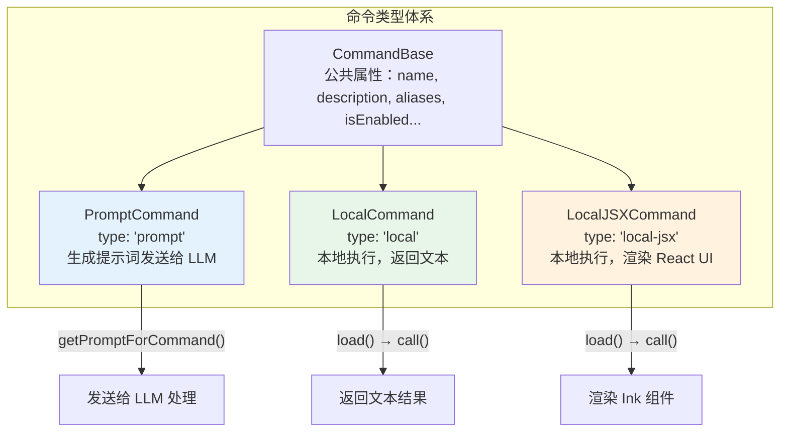
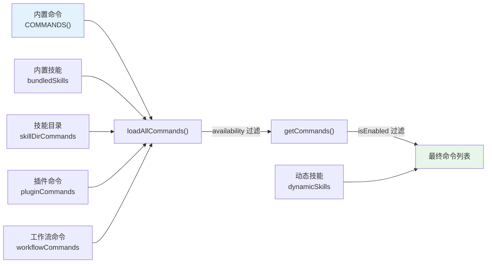
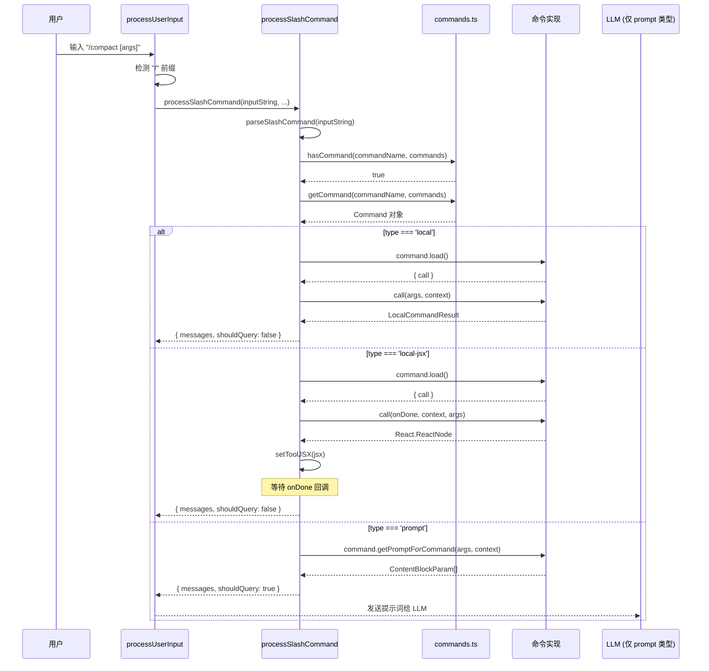
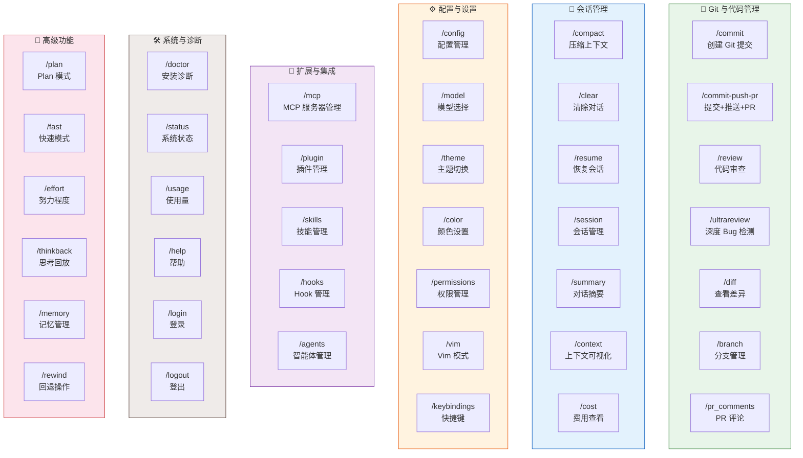
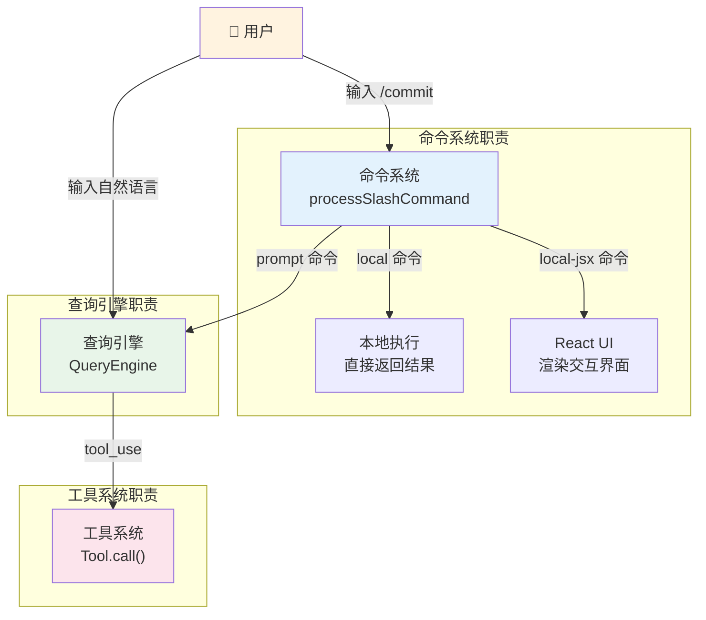
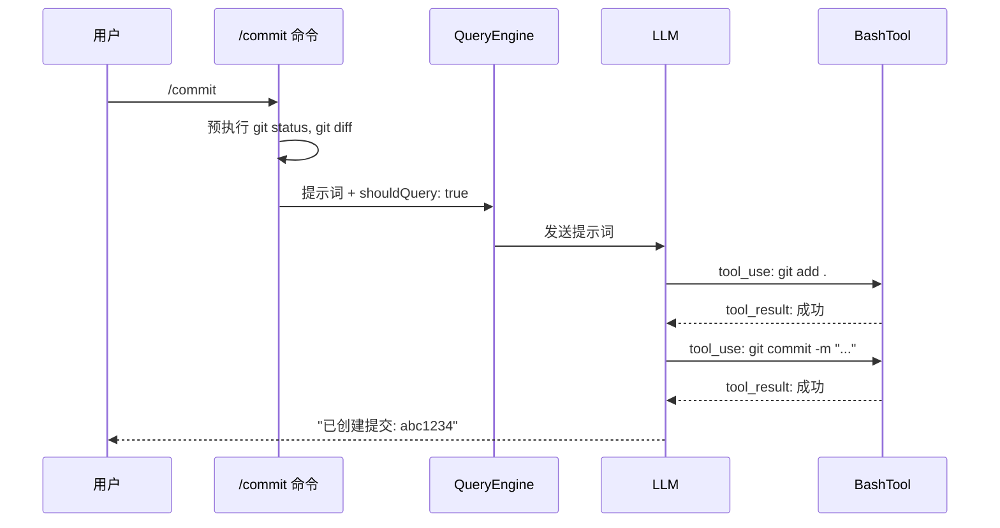

# 第 4 章 · 命令系统

> 如果说工具系统是 LLM 智能体的"双手"，那么命令系统就是用户的"遥控器"——它让用户能够通过简洁的斜杠命令（`/commit`、`/review`、`/compact`）直接控制系统行为，而不必每次都用自然语言描述意图。本章将带你深入理解命令系统的完整设计：从类型定义到注册机制，从路由分发到执行流程，再到 80+ 个命令的分类全景。

## 4.1 概述：命令系统的角色

在本项目的架构中，**命令（Command）** 是用户与系统交互的直接通道。与工具系统不同，命令面向的是人类用户而非 LLM：

| 维度 | 工具系统 | 命令系统 |
|------|---------|---------|
| 调用者 | LLM 决定调用 | 用户主动输入 |
| 触发方式 | `tool_use` block | `/command [args]` |
| 输入格式 | 结构化 JSON（Zod Schema） | 自由文本参数 |
| 执行上下文 | QueryEngine 编排 | processSlashCommand 路由 |
| 典型用途 | 文件操作、搜索、Shell | 配置管理、Git 操作、系统诊断 |

命令系统的核心文件分布如下：

| 文件 | 职责 |
|------|------|
| `src/types/command.ts` | 命令基础类型定义（`Command`、`PromptCommand`、`LocalCommand` 等） |
| `src/commands.ts` | 命令注册表、组装逻辑、查找与过滤 |
| `src/commands/` | 80+ 个命令的具体实现（每个命令一个子目录或文件） |
| `src/utils/processUserInput/processSlashCommand.tsx` | 命令路由与执行引擎 |
| `src/utils/processUserInput/processUserInput.ts` | 用户输入总入口，决定走命令还是查询 |

## 4.2 命令类型定义

### 三种命令类型

`src/types/command.ts` 定义了命令系统的核心类型。每个命令都是 `CommandBase` 与三种具体类型之一的联合：

```typescript title="src/types/command.ts" showLineNumbers
// 命令的联合类型：基础属性 + 三种具体类型之一
export type Command = CommandBase &
  (PromptCommand | LocalCommand | LocalJSXCommand)
```

这三种类型代表了完全不同的执行模式：



### CommandBase：公共属性

所有命令共享的基础属性定义在 `CommandBase` 中：

```typescript title="src/types/command.ts" showLineNumbers
export type CommandBase = {
  // ========== 身份标识 ==========
  name: string;
  aliases?: string[];
  description: string;
  argumentHint?: string;          // 参数提示（如 "[enable|disable [server-name]]"）

  // ========== 可见性与启用状态 ==========
  // highlight-start
  availability?: CommandAvailability[];  // 'claude-ai' | 'console'
  isEnabled?: () => boolean;             // 默认 true，支持特性标志控制
  isHidden?: boolean;                    // 是否从帮助列表中隐藏
  // highlight-end

  // ========== 来源与分类 ==========
  loadedFrom?: 'commands_DEPRECATED' | 'skills' | 'plugin'
             | 'managed' | 'bundled' | 'mcp';
  kind?: 'workflow';                     // 工作流命令标记
  source?: string;                       // 命令来源

  // ========== 执行控制 ==========
  immediate?: boolean;           // 是否立即执行（跳过队列）
  isSensitive?: boolean;         // 参数是否需要脱敏
  disableModelInvocation?: boolean;  // 禁止 LLM 通过 SkillTool 调用
  userInvocable?: boolean;       // 用户是否可以直接调用
}
```

这里有两个重要的设计决策：

1. **`availability` vs `isEnabled`**：`availability` 是静态的身份要求（你是谁），`isEnabled` 是动态的功能开关（功能是否开启）。两者分离让权限检查更清晰
2. **`loadedFrom`**：追踪命令的来源，用于 UI 展示和遥测分析

### PromptCommand：提示词命令

`PromptCommand` 是最有趣的命令类型——它不直接执行操作，而是生成一段提示词发送给 LLM，让 LLM 来完成实际工作：

```typescript title="src/types/command.ts" showLineNumbers
export type PromptCommand = {
  type: 'prompt';
  progressMessage: string;       // 执行时的进度提示
  contentLength: number;         // 内容长度（用于 Token 估算）
  // highlight-next-line
  source: SettingSource | 'builtin' | 'mcp' | 'plugin' | 'bundled';
  allowedTools?: string[];       // 限制 LLM 可用的工具
  model?: string;                // 指定使用的模型
  context?: 'inline' | 'fork';  // 执行上下文：内联或子智能体
  effort?: EffortValue;          // 努力程度
  paths?: string[];              // 文件路径匹配模式（条件可见性）
  hooks?: HooksSettings;         // 技能关联的 Hooks

  // highlight-next-line
  // 核心方法：生成发送给 LLM 的提示词
  getPromptForCommand(
    args: string,
    context: ToolUseContext,
  ): Promise<ContentBlockParam[]>;
}
```

`PromptCommand` 的精妙之处在于 `allowedTools` 字段——它可以限制 LLM 在处理该命令时只能使用特定的工具。例如 `/commit` 命令只允许使用 `Bash(git add:*)`、`Bash(git status:*)`、`Bash(git commit:*)` 三个工具，防止 LLM 在提交代码时做出意外操作。

### LocalCommand 与 LocalJSXCommand：本地命令

本地命令直接在客户端执行，不经过 LLM：

```typescript title="src/types/command.ts" showLineNumbers
// 纯文本输出的本地命令
type LocalCommand = {
  type: 'local';
  supportsNonInteractive: boolean;  // 是否支持非交互模式
  // highlight-next-line
  load: () => Promise<LocalCommandModule>;  // 懒加载实现
}

// 渲染 React UI 的本地命令
type LocalJSXCommand = {
  type: 'local-jsx';
  // highlight-next-line
  load: () => Promise<LocalJSXCommandModule>;  // 懒加载实现
}
```

两者都采用了**懒加载模式**——`load()` 返回一个 Promise，只有在命令被实际调用时才加载实现代码。这对启动性能至关重要：80+ 个命令中，用户每次会话通常只使用其中几个，没必要在启动时加载所有命令的实现。

:::tip 设计要点：懒加载的三层含义
1. **启动加速**：命令注册只需要名称和描述，实现代码延迟加载
2. **内存节约**：未使用的命令不占用内存
3. **代码分割**：配合 bundler 实现更细粒度的代码分割
:::

## 4.3 命令注册机制

### commands.ts：命令注册表

`src/commands.ts` 是整个命令系统的注册中心。它负责导入所有命令、组装命令列表，并提供查找和过滤功能。

#### 静态导入与条件导入

命令的导入分为两类：

```typescript title="src/commands.ts" showLineNumbers
// ========== 静态导入：核心命令，始终可用 ==========
import commit from './commands/commit.js'
import compact from './commands/compact/index.js'
import config from './commands/config/index.js'
import doctor from './commands/doctor/index.js'
import help from './commands/help/index.js'
import mcp from './commands/mcp/index.js'
import review, { ultrareview } from './commands/review.js'
// ... 更多静态导入

// ========== 条件导入：通过特性标志控制 ==========
import { feature } from 'bun:bundle'

// highlight-start
const bridge = feature('BRIDGE_MODE')
  ? require('./commands/bridge/index.js').default
  : null

const voiceCommand = feature('VOICE_MODE')
  ? require('./commands/voice/index.js').default
  : null

const ultraplan = feature('ULTRAPLAN')
  ? require('./commands/ultraplan.js').default
  : null
// highlight-end
```

这种模式与工具系统（第 3 章）完全一致——通过 `bun:bundle` 的 `feature()` 函数实现编译期死代码消除。未启用的命令在构建时被完全移除，不会出现在最终产物中。

#### COMMANDS：命令的完整清单

所有命令通过 `COMMANDS` 函数组装为一个列表：

```typescript title="src/commands.ts" showLineNumbers
// highlight-next-line
// 使用 memoize 延迟初始化，因为底层函数需要读取配置
const COMMANDS = memoize((): Command[] => [
  addDir,
  advisor,
  agents,
  branch,
  chrome,
  clear,
  color,
  compact,
  config,
  copy,
  desktop,
  context,
  cost,
  diff,
  doctor,
  effort,
  exit,
  fast,
  files,
  help,
  mcp,
  memory,
  model,
  review,
  ultrareview,
  vim,
  // ... 更多命令

  // 条件加载的命令
  ...(bridge ? [bridge] : []),
  ...(voiceCommand ? [voiceCommand] : []),
  ...(ultraplan ? [ultraplan] : []),

  // 仅内部用户可见的命令
  ...(process.env.USER_TYPE === 'ant' && !process.env.IS_DEMO
    ? INTERNAL_ONLY_COMMANDS
    : []),
])
```

注意 `COMMANDS` 使用了 `memoize` 包装——这不仅是性能优化，更是因为某些命令的初始化依赖配置文件，而配置在模块加载时可能还未就绪。

#### getCommands：多源命令聚合

最终呈现给用户的命令列表由 `getCommands` 函数组装，它聚合了多个来源的命令：

```typescript title="src/commands.ts" showLineNumbers
const loadAllCommands = memoize(async (cwd: string): Promise<Command[]> => {
  const [
    { skillDirCommands, pluginSkills, bundledSkills, builtinPluginSkills },
    pluginCommands,
    workflowCommands,
  ] = await Promise.all([
    getSkills(cwd),
    getPluginCommands(),
    getWorkflowCommands ? getWorkflowCommands(cwd) : Promise.resolve([]),
  ])

  // highlight-start
  // 命令优先级：bundled > builtin plugin > skill dir > workflow > plugin > 内置
  return [
    ...bundledSkills,
    ...builtinPluginSkills,
    ...skillDirCommands,
    ...workflowCommands,
    ...pluginCommands,
    ...pluginSkills,
    ...COMMANDS(),
  ]
  // highlight-end
})

export async function getCommands(cwd: string): Promise<Command[]> {
  const allCommands = await loadAllCommands(cwd)
  const dynamicSkills = getDynamicSkills()

  // highlight-next-line
  // 每次调用都重新检查 availability 和 isEnabled，确保认证变化立即生效
  const baseCommands = allCommands.filter(
    _ => meetsAvailabilityRequirement(_) && isCommandEnabled(_),
  )

  // 去重动态技能，插入到内置命令之前
  if (dynamicSkills.length === 0) return baseCommands
  const baseCommandNames = new Set(baseCommands.map(c => c.name))
  const uniqueDynamicSkills = dynamicSkills.filter(
    s => !baseCommandNames.has(s.name) &&
         meetsAvailabilityRequirement(s) &&
         isCommandEnabled(s),
  )
  return [...baseCommands.slice(0, insertIndex), ...uniqueDynamicSkills, ...baseCommands.slice(insertIndex)]
}
```

命令来源的完整链路如下：



### 可用性过滤：meetsAvailabilityRequirement

命令的可用性由用户的认证身份决定：

```typescript title="src/commands.ts" showLineNumbers
export function meetsAvailabilityRequirement(cmd: Command): boolean {
  if (!cmd.availability) return true  // 无限制 = 所有人可用
  for (const a of cmd.availability) {
    switch (a) {
      case 'claude-ai':
        // highlight-next-line
        if (isClaudeAISubscriber()) return true  // claude.ai 订阅用户
        break
      case 'console':
        // Console API 用户（直接使用 api.anthropic.com）
        if (!isClaudeAISubscriber() && !isUsing3PServices()
            && isFirstPartyAnthropicBaseUrl())
          return true
        break
    }
  }
  return false
}
```

这个函数**没有被 memoize**——因为认证状态可能在会话中途改变（例如用户执行 `/login`），所以每次 `getCommands()` 调用都需要重新评估。

### 命令查找：findCommand

```typescript title="src/commands.ts" showLineNumbers
export function findCommand(
  commandName: string,
  commands: Command[],
): Command | undefined {
  return commands.find(
    _ =>
      _.name === commandName ||
      // highlight-next-line
      getCommandName(_) === commandName ||  // 支持 userFacingName
      _.aliases?.includes(commandName),     // 支持别名
  )
}
```

查找支持三种匹配方式：精确名称、用户可见名称（`userFacingName`）和别名。这让命令可以有多个入口点——例如一个命令可以同时通过 `/review` 和 `/code-review` 触发。

## 4.4 命令路由与执行流程

### 从用户输入到命令执行的完整链路

当用户在终端中输入 `/compact` 时，系统经历以下完整流程：



### processUserInput：输入总入口

`src/utils/processUserInput/processUserInput.ts` 是所有用户输入的总入口。它根据输入内容决定走哪条路径：

```typescript title="src/utils/processUserInput/processUserInput.ts" showLineNumbers
async function processUserInputBase(
  input: string | Array<ContentBlockParam>,
  mode: PromptInputMode,
  // ...
): Promise<ProcessUserInputBaseResult> {
  // ... 图片处理、附件提取 ...

  // highlight-start
  // 路径 1：Bash 模式
  if (inputString !== null && mode === 'bash') {
    const { processBashCommand } = await import('./processBashCommand.js')
    return await processBashCommand(inputString, ...)
  }

  // 路径 2：斜杠命令（以 "/" 开头）
  if (inputString !== null && !effectiveSkipSlash && inputString.startsWith('/')) {
    const { processSlashCommand } = await import('./processSlashCommand.js')
    return await processSlashCommand(inputString, ...)
  }

  // 路径 3：普通文本 → 发送给 LLM
  // ... 构建用户消息，设置 shouldQuery: true
  // highlight-end
}
```

这个路由逻辑非常清晰：以 `/` 开头的输入走命令系统，其他输入走查询引擎。

### processSlashCommand：命令路由引擎

`src/utils/processUserInput/processSlashCommand.tsx` 是命令系统的核心路由引擎。它根据命令类型分发到不同的执行路径：

```typescript title="src/utils/processUserInput/processSlashCommand.tsx" showLineNumbers
export async function processSlashCommand(
  inputString: string,
  // ...
): Promise<ProcessUserInputBaseResult> {
  // 1. 解析命令名和参数
  const parsed = parseSlashCommand(inputString)
  const { commandName, args } = parsed

  // 2. 检查命令是否存在
  if (!hasCommand(commandName, context.options.commands)) {
    // highlight-start
    // 不是命令？检查是否像命令名（而非文件路径）
    if (looksLikeCommand(commandName) && !isFilePath) {
      return { messages: [...], shouldQuery: false }  // "Unknown skill"
    }
    // 看起来像文件路径 → 当作普通输入发送给 LLM
    return { messages: [...], shouldQuery: true }
    // highlight-end
  }

  // 3. 路由到具体执行逻辑
  const result = await getMessagesForSlashCommand(commandName, args, ...)
  return result
}
```

注意一个精妙的设计：当用户输入 `/var/log/syslog` 这样的文件路径时，系统不会报"Unknown skill"错误，而是将其当作普通文本发送给 LLM。这通过 `looksLikeCommand` 和文件路径检测实现。

### 三种命令类型的执行差异

`getMessagesForSlashCommand` 函数根据命令类型采用完全不同的执行策略：

#### local-jsx 命令：React UI 渲染

```typescript title="src/utils/processUserInput/processSlashCommand.tsx" showLineNumbers
case 'local-jsx': {
  return new Promise<SlashCommandResult>(resolve => {
    let doneWasCalled = false
    // highlight-start
    // onDone 回调：命令完成时调用
    const onDone = (result?, options?) => {
      doneWasCalled = true
      resolve({ messages: [...], shouldQuery: options?.shouldQuery ?? false })
    }
    // highlight-end

    // 懒加载 → 调用 → 渲染 JSX
    command.load()
      .then(mod => mod.call(onDone, context, args))
      .then(jsx => {
        if (doneWasCalled) return  // 防止 onDone 后再设置 JSX
        // highlight-next-line
        setToolJSX({ jsx, isLocalJSXCommand: true, isImmediate: command.immediate })
      })
      .catch(e => {
        // 错误恢复：清除 JSX，解除阻塞
        if (!doneWasCalled) {
          setToolJSX({ jsx: null, clearLocalJSX: true })
          resolve({ messages: [], shouldQuery: false })
        }
      })
  })
}
```

`local-jsx` 命令的执行是异步的——它返回一个 Promise，在 `onDone` 回调被调用时才 resolve。这允许命令渲染交互式 UI（如 MCP 设置面板、Doctor 诊断界面），用户操作完成后通过 `onDone` 通知系统。

#### local 命令：同步文本执行

```typescript title="src/utils/processUserInput/processSlashCommand.tsx" showLineNumbers
case 'local': {
  const mod = await command.load()
  const result = await mod.call(args, context)

  // highlight-start
  // 特殊处理：compact 命令返回压缩结果
  if (result.type === 'compact') {
    return {
      messages: buildPostCompactMessages(compactionResult),
      shouldQuery: false,
    }
  }
  // highlight-end

  // 普通文本结果
  return {
    messages: [userMessage, createCommandInputMessage(`<local-command-stdout>${result.value}</local-command-stdout>`)],
    shouldQuery: false,
  }
}
```

#### prompt 命令：LLM 代理执行

```typescript title="src/utils/processUserInput/processSlashCommand.tsx" showLineNumbers
case 'prompt': {
  // 支持 fork 模式：在子智能体中执行
  if (command.context === 'fork') {
    return await executeForkedSlashCommand(command, args, ...)
  }
  // highlight-next-line
  // 内联模式：生成提示词，设置 shouldQuery: true
  return await getMessagesForPromptSlashCommand(command, args, context, ...)
}
```

`prompt` 命令的关键在于 `shouldQuery: true`——这告诉系统将生成的提示词发送给 LLM，由 LLM 来完成实际工作。这是命令系统与查询引擎的桥梁。

## 4.5 命令分类全景

项目包含 80+ 个命令，可以按功能分为以下几大类：

### 命令分类图



### 分类汇总表

| 分类 | 命令数量 | 代表命令 | 命令类型 | 说明 |
|------|---------|---------|---------|------|
| Git 与代码管理 | 8 | `/commit`, `/review`, `/diff` | prompt | 通过 LLM 执行 Git 操作和代码审查 |
| 会话管理 | 10 | `/compact`, `/clear`, `/context` | local / local-jsx | 管理对话上下文、费用和会话 |
| 配置与设置 | 12 | `/config`, `/model`, `/theme` | local-jsx | 交互式配置界面 |
| 扩展与集成 | 8 | `/mcp`, `/plugin`, `/skills` | local-jsx | 管理 MCP、插件和技能 |
| 系统与诊断 | 10 | `/doctor`, `/help`, `/login` | local-jsx / local | 系统诊断、帮助和认证 |
| 高级功能 | 9 | `/plan`, `/memory`, `/rewind` | local / local-jsx | Plan 模式、记忆和回退 |
| 内部命令 | 15+ | `/bughunter`, `/teleport` | 混合 | 仅内部用户可见 |
| 条件命令 | 10+ | `/bridge`, `/voice`, `/ultraplan` | 混合 | 需要特性标志启用 |

:::info 命令来源的多样性
除了内置命令，系统还支持从以下来源加载命令：
- **技能目录**（`~/.claude/skills/`）：用户自定义的 Markdown 技能文件
- **插件**：通过插件系统注册的命令
- **内置技能**（bundled skills）：随产品打包的预置技能
- **MCP 服务器**：通过 MCP 协议提供的远程技能
- **工作流**：基于脚本的工作流命令
:::

### 特殊命令集合

系统定义了几个特殊的命令集合，用于不同场景的过滤：

```typescript title="src/commands.ts" showLineNumbers
// 远程模式安全命令：只影响本地 TUI 状态
export const REMOTE_SAFE_COMMANDS: Set<Command> = new Set([
  session, exit, clear, help, theme, color, vim,
  cost, usage, copy, btw, feedback, plan, keybindings,
  statusline, stickers, mobile,
])

// 桥接安全命令：可以通过 Remote Control 执行
export const BRIDGE_SAFE_COMMANDS: Set<Command> = new Set([
  compact, clear, cost, summary, releaseNotes, files,
])

// 内部专用命令：仅在内部构建中可用
export const INTERNAL_ONLY_COMMANDS = [
  backfillSessions, breakCache, bughunter, commit,
  commitPushPr, ctx_viz, goodClaude, issue, ...
]
```

这些集合体现了**最小权限原则**：远程模式下只暴露不影响文件系统的命令，桥接模式下只暴露产生文本输出的命令。

## 4.6 代表性命令深度分析

### 4.6.1 /commit：Git 提交命令

`/commit` 是一个典型的 `prompt` 类型命令——它不直接执行 Git 操作，而是构建一段精心设计的提示词，让 LLM 来分析代码变更并创建提交。

```typescript title="src/commands/commit.ts" showLineNumbers
// highlight-next-line
// 限制 LLM 只能使用这三个 Git 相关的 Bash 工具
const ALLOWED_TOOLS = [
  'Bash(git add:*)',
  'Bash(git status:*)',
  'Bash(git commit:*)',
]

function getPromptContent(): string {
  return `## Context

- Current git status: !\`git status\`
- Current git diff (staged and unstaged changes): !\`git diff HEAD\`
- Current branch: !\`git branch --show-current\`
- Recent commits: !\`git log --oneline -10\`

## Git Safety Protocol

- NEVER update the git config
- NEVER skip hooks (--no-verify, --no-gpg-sign, etc)
- CRITICAL: ALWAYS create NEW commits. NEVER use git commit --amend
- Do not commit files that likely contain secrets (.env, credentials.json, etc)

## Your task

Based on the above changes, create a single git commit:

1. Analyze all staged changes and draft a commit message:
   - Look at the recent commits to follow this repository's commit message style
   - Summarize the nature of the changes
   - Draft a concise (1-2 sentences) commit message

2. Stage relevant files and create the commit using HEREDOC syntax...`
}
```

**设计亮点**：

1. **Shell 命令预执行**：提示词中的 `` !\`git status\` `` 语法会在发送给 LLM 之前被执行，结果内联到提示词中。这通过 `executeShellCommandsInPrompt` 实现
2. **工具白名单**：`ALLOWED_TOOLS` 严格限制 LLM 只能执行 Git 相关命令，防止意外操作
3. **安全协议**：提示词中明确列出安全规则（不修改 config、不跳过 hooks、不 amend），这是"提示词即安全策略"的实践
4. **风格适应**：要求 LLM 参考最近 10 条提交来适应项目的提交消息风格

```typescript title="src/commands/commit.ts" showLineNumbers
const command = {
  type: 'prompt',
  name: 'commit',
  description: 'Create a git commit',
  allowedTools: ALLOWED_TOOLS,
  progressMessage: 'creating commit',
  source: 'builtin',
  async getPromptForCommand(_args, context) {
    const promptContent = getPromptContent()
    // highlight-start
    // 预执行 Shell 命令，将结果内联到提示词中
    const finalContent = await executeShellCommandsInPrompt(
      promptContent,
      { ...context, /* 注入工具权限 */ },
      '/commit',
    )
    // highlight-end
    return [{ type: 'text', text: finalContent }]
  },
} satisfies Command
```

### 4.6.2 /review：代码审查命令

`/review` 同样是 `prompt` 类型，但设计更为简洁——它依赖 GitHub CLI（`gh`）来获取 PR 信息：

```typescript title="src/commands/review.ts" showLineNumbers
const LOCAL_REVIEW_PROMPT = (args: string) => `
  You are an expert code reviewer. Follow these steps:

  1. If no PR number is provided, run \`gh pr list\` to show open PRs
  2. If a PR number is provided, run \`gh pr view <number>\` to get PR details
  3. Run \`gh pr diff <number>\` to get the diff
  4. Analyze the changes and provide a thorough code review that includes:
     - Overview of what the PR does
     - Analysis of code quality and style
     - Specific suggestions for improvements
     - Any potential issues or risks

  Focus on: Code correctness, project conventions, performance,
  test coverage, security considerations.

  PR number: ${args}
`

const review: Command = {
  type: 'prompt',
  name: 'review',
  description: 'Review a pull request',
  progressMessage: 'reviewing pull request',
  source: 'builtin',
  async getPromptForCommand(args) {
    return [{ type: 'text', text: LOCAL_REVIEW_PROMPT(args) }]
  },
}
```

与 `/commit` 不同，`/review` 没有设置 `allowedTools`——它允许 LLM 使用所有可用工具，因为代码审查可能需要读取文件、搜索代码等多种操作。

值得注意的是，项目还提供了 `/ultrareview`——一个 `local-jsx` 类型的增强版审查命令，它在云端运行深度 Bug 检测：

```typescript title="src/commands/review.ts" showLineNumbers
const ultrareview: Command = {
  type: 'local-jsx',
  name: 'ultrareview',
  description: '~10–20 min · Finds and verifies bugs in your branch.',
  // highlight-next-line
  isEnabled: () => isUltrareviewEnabled(),  // 需要特性标志
  load: () => import('./review/ultrareviewCommand.js'),
}
```

### 4.6.3 /compact：上下文压缩命令

`/compact` 是一个 `local` 类型命令，也是系统中最复杂的命令之一。它负责压缩对话上下文，防止 Token 超限：

```typescript title="src/commands/compact/index.ts" showLineNumbers
const compact = {
  type: 'local',
  name: 'compact',
  description: 'Clear conversation history but keep a summary in context.',
  // highlight-next-line
  isEnabled: () => !isEnvTruthy(process.env.DISABLE_COMPACT),
  supportsNonInteractive: true,
  argumentHint: '<optional custom summarization instructions>',
  load: () => import('./compact.js'),
} satisfies Command
```

其实现展示了多层压缩策略：

```typescript title="src/commands/compact/compact.ts" showLineNumbers
export const call: LocalCommandCall = async (args, context) => {
  const customInstructions = args.trim()

  // highlight-start
  // 策略 1：Session Memory 压缩（轻量级，优先尝试）
  if (!customInstructions) {
    const sessionMemoryResult = await trySessionMemoryCompaction(
      messages, context.agentId,
    )
    if (sessionMemoryResult) {
      // 成功 → 清理缓存，返回结果
      getUserContext.cache.clear?.()
      runPostCompactCleanup()
      return { type: 'compact', compactionResult: sessionMemoryResult }
    }
  }

  // 策略 2：Reactive 压缩（实验性）
  if (reactiveCompact?.isReactiveOnlyMode()) {
    return await compactViaReactive(messages, context, customInstructions, reactiveCompact)
  }

  // 策略 3：传统压缩（先 microcompact 再 summarize）
  const microcompactResult = await microcompactMessages(messages, context)
  const result = await compactConversation(
    microcompactResult.messages, context, cacheSharingParams,
    false, customInstructions, false,
  )
  // highlight-end

  return { type: 'compact', compactionResult: result }
}
```

**三层压缩策略**：

| 策略 | 触发条件 | 原理 | 开销 |
|------|---------|------|------|
| Session Memory | 无自定义指令 | 基于会话记忆的增量压缩 | 低 |
| Reactive | `REACTIVE_COMPACT` 标志 | 响应式分组压缩 | 中 |
| 传统压缩 | 兜底策略 | microcompact + LLM 摘要 | 高 |

`/compact` 还支持自定义压缩指令——用户可以输入 `/compact focus on the authentication changes` 来引导压缩过程保留特定内容。

### 4.6.4 /doctor：系统诊断命令

`/doctor` 是一个 `local-jsx` 类型命令，它渲染一个交互式诊断界面：

```typescript title="src/commands/doctor/index.ts" showLineNumbers
const doctor: Command = {
  name: 'doctor',
  description: 'Diagnose and verify your Claude Code installation and settings',
  // highlight-next-line
  isEnabled: () => !isEnvTruthy(process.env.DISABLE_DOCTOR_COMMAND),
  type: 'local-jsx',
  load: () => import('./doctor.js'),
}
```

```typescript title="src/commands/doctor/doctor.tsx" showLineNumbers
import { Doctor } from '../../screens/Doctor.js'
import type { LocalJSXCommandCall } from '../../types/command.js'

// highlight-next-line
// 极简的命令实现：直接渲染 Doctor 屏幕组件
export const call: LocalJSXCommandCall = (onDone, _context, _args) => {
  return Promise.resolve(<Doctor onDone={onDone} />)
}
```

`/doctor` 的实现展示了 `local-jsx` 命令的典型模式：

1. **命令定义**（`index.ts`）：只包含元数据和懒加载入口
2. **命令实现**（`doctor.tsx`）：极简的胶水代码，将控制权交给 Screen 组件
3. **UI 组件**（`screens/Doctor.tsx`）：实际的诊断逻辑和交互界面

这种分层让命令的注册成本极低（只需名称和描述），而复杂的 UI 逻辑被封装在独立的 Screen 组件中。

### 4.6.5 /mcp：MCP 服务器管理命令

`/mcp` 是一个功能丰富的 `local-jsx` 命令，支持多个子命令：

```typescript title="src/commands/mcp/index.ts" showLineNumbers
const mcp = {
  type: 'local-jsx',
  name: 'mcp',
  description: 'Manage MCP servers',
  // highlight-next-line
  immediate: true,  // 立即执行，不等待队列
  argumentHint: '[enable|disable [server-name]]',
  load: () => import('./mcp.js'),
} satisfies Command
```

其实现展示了子命令路由模式：

```typescript title="src/commands/mcp/mcp.tsx" showLineNumbers
export async function call(
  onDone: LocalJSXCommandOnDone,
  _context: unknown,
  args?: string,
): Promise<React.ReactNode> {
  if (args) {
    const parts = args.trim().split(/\s+/)

    // highlight-start
    // 子命令路由
    if (parts[0] === 'reconnect' && parts[1]) {
      return <MCPReconnect serverName={parts.slice(1).join(' ')} onComplete={onDone} />
    }
    if (parts[0] === 'enable' || parts[0] === 'disable') {
      return <MCPToggle action={parts[0]}
                        target={parts.length > 1 ? parts.slice(1).join(' ') : 'all'}
                        onComplete={onDone} />
    }
    // highlight-end
  }

  // 默认：显示 MCP 设置面板
  return <MCPSettings onComplete={onDone} />
}
```

**`/mcp` 的子命令**：

| 子命令 | 用途 | 示例 |
|--------|------|------|
| （无参数） | 打开 MCP 设置面板 | `/mcp` |
| `enable [name]` | 启用 MCP 服务器 | `/mcp enable filesystem` |
| `disable [name]` | 禁用 MCP 服务器 | `/mcp disable all` |
| `reconnect <name>` | 重连 MCP 服务器 | `/mcp reconnect my-server` |

注意 `immediate: true` 标记——这让 `/mcp` 命令跳过消息队列立即执行，因为 MCP 管理操作需要即时响应。

## 4.7 命令系统与工具系统的关系

命令系统和工具系统是两个互补但职责不同的子系统。理解它们之间的关系，是理解整个项目架构的关键。

### 职责边界



| 维度 | 命令系统 | 工具系统 |
|------|---------|---------|
| 面向对象 | 人类用户 | LLM |
| 触发方式 | `/command` 斜杠命令 | LLM 的 `tool_use` 决策 |
| 输入验证 | 简单的字符串解析 | Zod Schema 严格验证 |
| 权限模型 | availability + isEnabled | checkPermissions 多层防御 |
| 执行方式 | 直接执行或生成提示词 | 通过 QueryEngine 编排 |
| UI 反馈 | 命令输出或 React 组件 | renderToolUseMessage 系列 |

### prompt 命令：命令到工具的桥梁

`prompt` 类型的命令是连接两个系统的桥梁。以 `/commit` 为例：

1. 用户输入 `/commit` → 命令系统解析
2. 命令生成提示词（包含 Git 状态、diff 等上下文）
3. 提示词发送给 LLM（`shouldQuery: true`）
4. LLM 决定调用 `BashTool`（`git add`、`git commit`）
5. 工具系统执行 Shell 命令
6. 结果返回给 LLM，LLM 生成最终响应



### SkillTool：LLM 调用命令的通道

有趣的是，命令系统和工具系统之间还有一条反向通道——`SkillTool`（在第 3 章中介绍）允许 LLM 主动调用 `prompt` 类型的命令：

```typescript title="src/commands.ts" showLineNumbers
// SkillTool 展示所有 LLM 可调用的 prompt 命令
export const getSkillToolCommands = memoize(
  async (cwd: string): Promise<Command[]> => {
    const allCommands = await getCommands(cwd)
    return allCommands.filter(
      cmd =>
        cmd.type === 'prompt' &&
        // highlight-next-line
        !cmd.disableModelInvocation &&  // 未禁止 LLM 调用
        cmd.source !== 'builtin' &&     // 非内置命令
        (cmd.loadedFrom === 'bundled' ||
         cmd.loadedFrom === 'skills' ||
         cmd.hasUserSpecifiedDescription ||
         cmd.whenToUse),
    )
  },
)
```

这形成了一个双向通道：
- **用户 → 命令 → LLM → 工具**：用户通过 `/commit` 触发 LLM 使用 BashTool
- **LLM → SkillTool → 命令**：LLM 通过 SkillTool 调用用户定义的技能

### 命令与工具的协作模式

在实际使用中，命令和工具经常协作完成复杂任务：

| 场景 | 命令角色 | 工具角色 |
|------|---------|---------|
| `/commit` | 收集 Git 上下文，构建提示词 | BashTool 执行 git add/commit |
| `/review` | 构建审查提示词 | BashTool 执行 gh 命令，GrepTool 搜索代码 |
| `/compact` | 直接执行压缩逻辑 | 不涉及工具系统 |
| `/mcp` | 渲染管理 UI | 间接影响工具池（MCP 工具的增减） |
| `/doctor` | 渲染诊断 UI | 不涉及工具系统 |

## 4.8 远程模式与桥接安全

命令系统还需要处理远程执行的安全性——当命令通过 IDE 桥接或移动端发送时，不是所有命令都适合执行。

### 桥接安全检查

```typescript title="src/commands.ts" showLineNumbers
export function isBridgeSafeCommand(cmd: Command): boolean {
  // highlight-start
  // local-jsx 命令渲染 Ink UI → 在远程端无法显示 → 阻止
  if (cmd.type === 'local-jsx') return false
  // prompt 命令展开为文本 → 天然安全
  if (cmd.type === 'prompt') return true
  // local 命令需要显式加入白名单
  return BRIDGE_SAFE_COMMANDS.has(cmd)
  // highlight-end
}
```

这个设计体现了**默认拒绝**原则：
- `local-jsx` 命令默认不安全（因为它们渲染终端 UI）
- `prompt` 命令默认安全（因为它们只生成文本）
- `local` 命令需要逐个审查并加入白名单

### 远程模式过滤

```typescript title="src/utils/processUserInput/processUserInput.ts" showLineNumbers
// 桥接来源的命令安全检查
if (bridgeOrigin && inputString.startsWith('/')) {
  const cmd = findCommand(parsed.commandName, context.options.commands)
  if (cmd) {
    if (isBridgeSafeCommand(cmd)) {
      effectiveSkipSlash = false  // 安全 → 允许执行
    } else {
      // highlight-next-line
      // 不安全 → 返回友好提示
      return { messages: [`/${getCommandName(cmd)} isn't available over Remote Control.`] }
    }
  }
}
```

## 4.9 设计模式总结

回顾整个命令系统，我们可以提炼出以下关键设计模式：

### 模式一：懒加载（Lazy Loading）

所有 `local` 和 `local-jsx` 命令都通过 `load()` 方法实现懒加载。命令注册只需要名称和描述（几十字节），实际实现代码（可能数千行）只在命令被调用时才加载。这让 80+ 个命令的注册成本几乎为零。

### 模式二：提示词即程序（Prompt as Program）

`prompt` 类型命令将提示词视为"程序"——通过精心设计的提示词来控制 LLM 的行为。`/commit` 的安全协议、`/review` 的审查框架都是这种模式的体现。提示词中的 `allowedTools` 白名单更是将安全策略编码到了提示词层面。

### 模式三：多源聚合（Multi-Source Aggregation）

命令来自多个来源（内置、技能、插件、MCP、工作流），通过 `getCommands` 统一聚合。每个来源独立加载，失败不影响其他来源——这是一种优雅的容错设计。

### 模式四：编译期消除（Dead Code Elimination）

与工具系统一致，命令系统通过 `bun:bundle` 的 `feature()` 函数实现编译期死代码消除。未启用的命令（如 `/voice`、`/bridge`）在构建时被完全移除。

### 模式五：回调驱动的异步 UI（Callback-Driven Async UI）

`local-jsx` 命令通过 `onDone` 回调实现异步 UI 交互。命令渲染 React 组件，用户操作完成后通过回调通知系统。这种模式让命令可以实现复杂的多步交互流程。

## 4.10 本章小结

通过本章，你应该已经理解了命令系统的完整设计：

1. **类型体系**：三种命令类型（`prompt`、`local`、`local-jsx`）覆盖了从 LLM 代理执行到本地 UI 渲染的所有场景
2. **注册机制**：`commands.ts` 聚合内置命令、技能、插件等多个来源，通过 `availability` 和 `isEnabled` 双重过滤
3. **路由分发**：`processUserInput` → `processSlashCommand` → 按类型分发的完整链路
4. **80+ 命令分类**：覆盖 Git 操作、会话管理、配置设置、扩展集成、系统诊断、高级功能等六大类别
5. **代表性命令**：`/commit` 的提示词工程、`/compact` 的多层压缩策略、`/doctor` 的 Screen 组件模式、`/mcp` 的子命令路由
6. **与工具系统的关系**：`prompt` 命令是桥梁，`SkillTool` 是反向通道，两个系统互补协作

在下一章中，我们将探索查询引擎——LLM 交互的核心编排器，以及它如何协调命令系统和工具系统完成复杂任务。

---

## 术语表

| 术语 | 说明 |
|------|------|
| **Command（命令）** | 用户通过斜杠触发的操作单元，通过 `Command` 类型定义 |
| **PromptCommand** | 生成提示词发送给 LLM 的命令类型 |
| **LocalCommand** | 本地执行并返回文本结果的命令类型 |
| **LocalJSXCommand** | 本地执行并渲染 React UI 的命令类型 |
| **processSlashCommand** | 命令路由引擎，解析和分发斜杠命令 |
| **availability** | 命令的身份要求（claude-ai 或 console） |
| **isEnabled** | 命令的动态启用状态（特性标志控制） |
| **allowedTools** | prompt 命令限制 LLM 可用工具的白名单 |
| **SkillTool** | 允许 LLM 主动调用 prompt 命令的工具 |
| **BRIDGE_SAFE_COMMANDS** | 可以通过远程桥接安全执行的命令白名单 |
| **onDone** | local-jsx 命令完成时的回调函数 |
| **loadedFrom** | 命令的来源标记（skills、plugin、bundled、mcp 等） |
| **immediate** | 标记命令跳过队列立即执行 |
