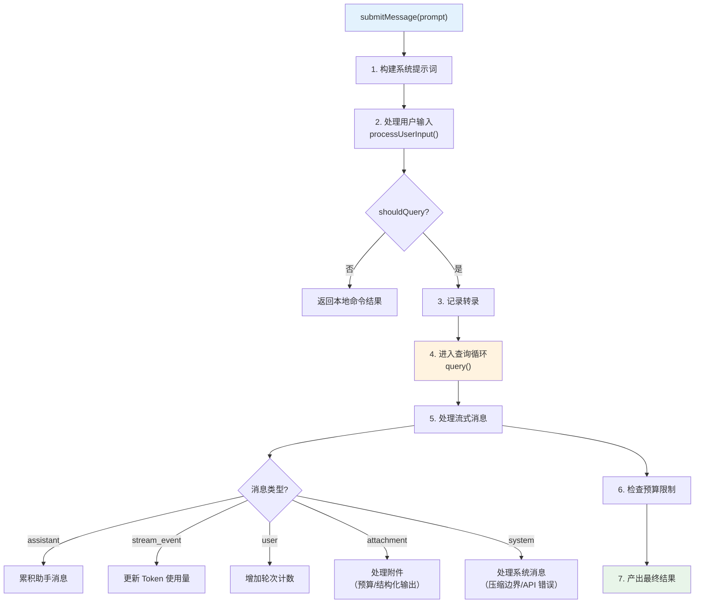
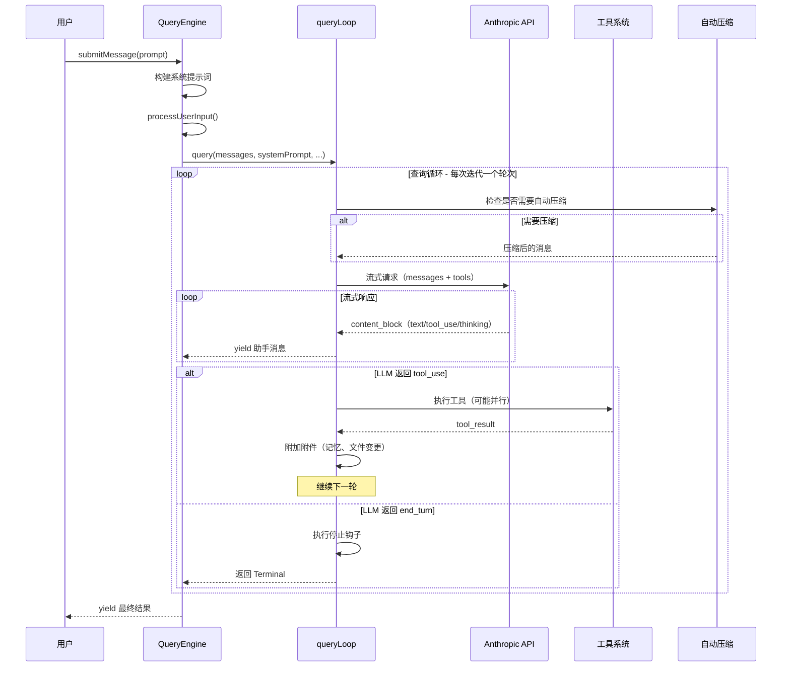
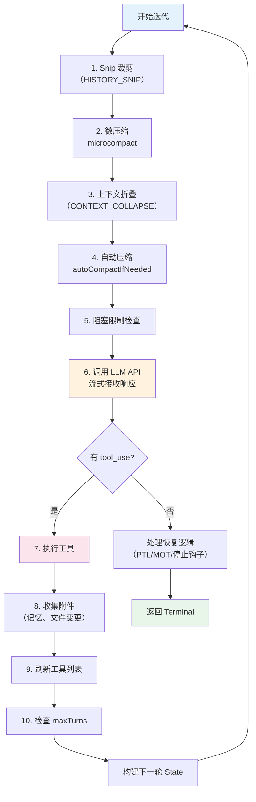
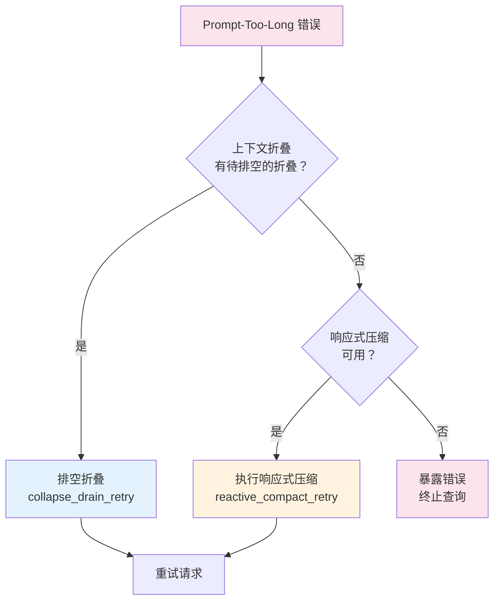
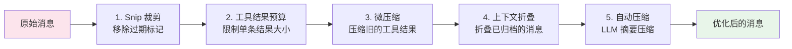
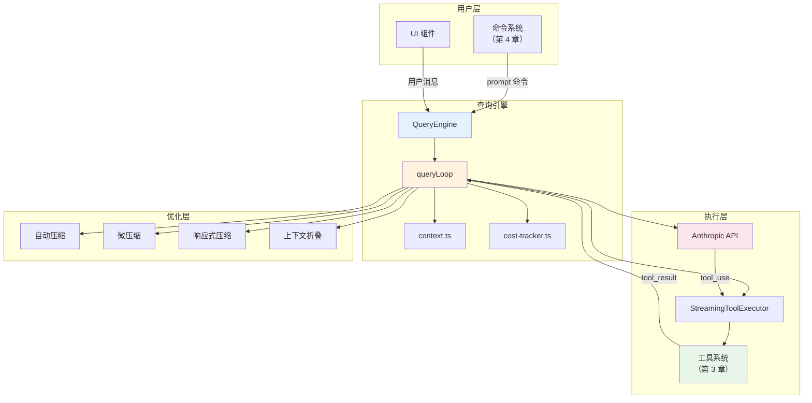

# 第 5 章 · 查询引擎

> 如果说工具系统是智能体的"双手"，命令系统是用户的"遥控器"，那么查询引擎就是整个系统的"大脑"——它负责与 LLM 对话、解析流式响应、编排工具调用、管理上下文窗口、追踪成本消耗。本章将带你深入理解查询引擎的完整实现：从 `QueryEngine` 类的会话管理，到 `query.ts` 中的核心循环，再到上下文收集和成本追踪系统。

## 5.1 概述：查询引擎的角色

查询引擎是连接用户输入与 LLM 响应的核心管道。每当用户发送一条消息（无论是自然语言还是 `prompt` 类型的斜杠命令），最终都会流经查询引擎。它的职责包括：

- **会话管理**：维护对话历史、文件状态缓存和 Token 使用量
- **流式响应处理**：逐块接收 LLM 返回的数据流，实时渲染给用户
- **工具调用循环**：当 LLM 决定调用工具时，执行工具并将结果回传
- **上下文优化**：自动压缩、微压缩、上下文折叠等多种策略管理上下文窗口
- **重试与容错**：处理 API 错误、速率限制、模型回退等异常场景
- **成本追踪**：记录每次 API 调用的 Token 消耗和费用

查询引擎的核心文件分布如下：

| 文件 | 职责 |
|------|------|
| `src/QueryEngine.ts` | 查询引擎类，管理会话生命周期和消息流 |
| `src/query.ts` | 核心查询循环，编排 API 调用、工具执行和上下文管理 |
| `src/query/config.ts` | 查询配置快照，不可变的运行时参数 |
| `src/query/deps.ts` | 依赖注入接口，便于测试 |
| `src/query/stopHooks.ts` | 停止钩子处理，轮次结束后的后处理逻辑 |
| `src/query/tokenBudget.ts` | Token 预算追踪，控制自动续写 |
| `src/context.ts` | 上下文收集，Git 状态和用户配置 |
| `src/cost-tracker.ts` | 成本追踪系统，记录费用和 Token 使用量 |

## 5.2 QueryEngine 类：会话的守护者

### 设计理念

`QueryEngine` 是整个查询生命周期的入口。它的核心设计理念是：**一个 QueryEngine 实例对应一个对话会话**。每次调用 `submitMessage()` 代表会话中的一个新轮次，而状态（消息历史、文件缓存、Token 使用量等）在轮次之间持久化。

```typescript title="src/QueryEngine.ts" showLineNumbers
/**
 * QueryEngine owns the query lifecycle and session state for a conversation.
 * It extracts the core logic from ask() into a standalone class that can be
 * used by both the headless/SDK path and (in a future phase) the REPL.
 *
 * One QueryEngine per conversation. Each submitMessage() call starts a new
 * turn within the same conversation. State (messages, file cache, usage, etc.)
 * persists across turns.
 */
export class QueryEngine {
  private config: QueryEngineConfig
  private mutableMessages: Message[]
  private abortController: AbortController
  private permissionDenials: SDKPermissionDenial[]
  private totalUsage: NonNullableUsage
  private hasHandledOrphanedPermission = false
  private readFileState: FileStateCache
  private discoveredSkillNames = new Set<string>()
  private loadedNestedMemoryPaths = new Set<string>()

  constructor(config: QueryEngineConfig) {
    this.config = config
    this.mutableMessages = config.initialMessages ?? []
    this.abortController = config.abortController ?? createAbortController()
    this.permissionDenials = []
    this.readFileState = config.readFileCache
    this.totalUsage = EMPTY_USAGE
  }
  // ...
}
```

### QueryEngineConfig：配置全景

`QueryEngineConfig` 定义了创建查询引擎所需的全部配置。它涵盖了从基础设施到业务逻辑的各个层面：

```typescript title="src/QueryEngine.ts" showLineNumbers
export type QueryEngineConfig = {
  cwd: string
  tools: Tools
  commands: Command[]
  mcpClients: MCPServerConnection[]
  agents: AgentDefinition[]
  canUseTool: CanUseToolFn
  getAppState: () => AppState
  setAppState: (f: (prev: AppState) => AppState) => void
  initialMessages?: Message[]
  readFileCache: FileStateCache
  customSystemPrompt?: string
  appendSystemPrompt?: string
  userSpecifiedModel?: string
  fallbackModel?: string
  // highlight-start
  thinkingConfig?: ThinkingConfig
  maxTurns?: number
  maxBudgetUsd?: number
  taskBudget?: { total: number }
  // highlight-end
  jsonSchema?: Record<string, unknown>
  verbose?: boolean
  replayUserMessages?: boolean
  handleElicitation?: ToolUseContext['handleElicitation']
  includePartialMessages?: boolean
  setSDKStatus?: (status: SDKStatus) => void
  abortController?: AbortController
  orphanedPermission?: OrphanedPermission
  snipReplay?: (
    yieldedSystemMsg: Message,
    store: Message[],
  ) => { messages: Message[]; executed: boolean } | undefined
}
```

几个关键配置项值得注意：

| 配置项 | 用途 |
|--------|------|
| `maxTurns` | 限制最大轮次数，防止无限循环 |
| `maxBudgetUsd` | 美元预算上限，超出后终止查询 |
| `taskBudget` | API 级别的任务预算（output_config.task_budget） |
| `thinkingConfig` | 思考模式配置：adaptive / enabled / disabled |
| `fallbackModel` | 主模型不可用时的回退模型 |
| `snipReplay` | 历史裁剪回放处理器（HISTORY_SNIP 特性） |

### submitMessage：轮次的完整生命周期

`submitMessage` 是 QueryEngine 的核心方法。它是一个 **AsyncGenerator**——通过 `yield` 逐步产出 SDK 消息，调用方可以实时消费这些消息。

一个完整的 `submitMessage` 调用经历以下阶段：



#### 阶段 1：构建系统提示词

```typescript title="src/QueryEngine.ts" showLineNumbers
// 获取系统提示词的各个组成部分
const {
  defaultSystemPrompt,
  userContext: baseUserContext,
  systemContext,
} = await fetchSystemPromptParts({
  tools,
  mainLoopModel: initialMainLoopModel,
  additionalWorkingDirectories: Array.from(
    initialAppState.toolPermissionContext.additionalWorkingDirectories.keys(),
  ),
  mcpClients,
  customSystemPrompt: customPrompt,
})

// highlight-start
// 组装最终系统提示词：默认提示词 + 记忆机制提示词 + 追加提示词
const systemPrompt = asSystemPrompt([
  ...(customPrompt !== undefined ? [customPrompt] : defaultSystemPrompt),
  ...(memoryMechanicsPrompt ? [memoryMechanicsPrompt] : []),
  ...(appendSystemPrompt ? [appendSystemPrompt] : []),
])
// highlight-end
```

系统提示词由三部分组成：
1. **默认提示词**（或自定义提示词）：定义 LLM 的角色和行为规范
2. **记忆机制提示词**：当 SDK 调用方配置了记忆目录时注入，教 LLM 如何使用 MEMORY.md
3. **追加提示词**：调用方可以附加额外的策略文本

#### 阶段 2：处理用户输入

```typescript title="src/QueryEngine.ts" showLineNumbers
const {
  messages: messagesFromUserInput,
  shouldQuery,
  allowedTools,
  model: modelFromUserInput,
  resultText,
} = await processUserInput({
  input: prompt,
  mode: 'prompt',
  setToolJSX: () => {},
  context: {
    ...processUserInputContext,
    messages: this.mutableMessages,
  },
  messages: this.mutableMessages,
  uuid: options?.uuid,
  isMeta: options?.isMeta,
  querySource: 'sdk',
})
```

`processUserInput` 是用户输入的总入口（在第 4 章中已介绍）。它返回的 `shouldQuery` 决定了后续走向：
- `true`：需要调用 LLM（自然语言或 prompt 命令）
- `false`：本地命令已处理完毕，直接返回结果

#### 阶段 3-5：进入查询循环

当 `shouldQuery` 为 `true` 时，进入核心查询循环。这是整个查询引擎最复杂的部分，我们将在 5.3 节详细展开。

#### 阶段 6：预算检查

查询循环的每次迭代后，QueryEngine 会检查多种预算限制：

```typescript title="src/QueryEngine.ts" showLineNumbers
// 检查美元预算是否超限
if (maxBudgetUsd !== undefined && getTotalCost() >= maxBudgetUsd) {
  yield {
    type: 'result',
    subtype: 'error_max_budget_usd',
    // ...
    errors: [`Reached maximum budget (${maxBudgetUsd})`],
  }
  return
}

// 检查结构化输出重试次数是否超限
if (message.type === 'user' && jsonSchema) {
  const currentCalls = countToolCalls(
    this.mutableMessages, SYNTHETIC_OUTPUT_TOOL_NAME,
  )
  const callsThisQuery = currentCalls - initialStructuredOutputCalls
  const maxRetries = parseInt(
    process.env.MAX_STRUCTURED_OUTPUT_RETRIES || '5', 10,
  )
  if (callsThisQuery >= maxRetries) {
    yield { type: 'result', subtype: 'error_max_structured_output_retries', /* ... */ }
    return
  }
}
```

### ask()：一次性查询的便捷包装

对于不需要多轮对话的场景，`ask()` 函数提供了一个便捷的包装器：

```typescript title="src/QueryEngine.ts" showLineNumbers
// highlight-next-line
// 便捷包装器：创建 QueryEngine，提交一条消息，返回结果
export async function* ask({
  commands, prompt, cwd, tools, mcpClients, canUseTool,
  mutableMessages = [], getReadFileCache, setReadFileCache,
  // ... 更多参数
}: { /* ... */ }): AsyncGenerator<SDKMessage, void, unknown> {
  const engine = new QueryEngine({
    cwd, tools, commands, mcpClients, agents, canUseTool,
    getAppState, setAppState,
    initialMessages: mutableMessages,
    readFileCache: cloneFileStateCache(getReadFileCache()),
    // ... 更多配置
    // highlight-start
    // HISTORY_SNIP 特性：注入裁剪回放处理器
    ...(feature('HISTORY_SNIP')
      ? {
          snipReplay: (yielded: Message, store: Message[]) => {
            if (!snipProjection!.isSnipBoundaryMessage(yielded))
              return undefined
            return snipModule!.snipCompactIfNeeded(store, { force: true })
          },
        }
      : {}),
    // highlight-end
  })

  try {
    yield* engine.submitMessage(prompt, { uuid: promptUuid, isMeta })
  } finally {
    // 确保文件状态缓存被回写
    setReadFileCache(engine.getReadFileState())
  }
}
```

:::tip 设计要点：AsyncGenerator 的选择
`submitMessage` 和 `ask` 都使用了 AsyncGenerator 而非 Promise。这个选择至关重要——它允许调用方在 LLM 响应的过程中实时消费消息（流式输出），而不必等待整个响应完成。这对于长时间运行的工具调用尤其重要：用户可以看到实时进度，而不是面对一个无响应的界面。
:::

## 5.3 查询循环：引擎的心跳

`src/query.ts` 中的 `queryLoop` 函数是整个查询引擎的核心——一个 `while(true)` 循环，每次迭代代表一个"轮次"（turn）。每个轮次包含：调用 LLM → 解析响应 → 执行工具 → 准备下一轮。

### 查询-响应循环序列图



### 循环状态管理

查询循环维护一个可变的 `State` 对象，在每次迭代之间传递：

```typescript title="src/query.ts" showLineNumbers
// 可变的跨迭代状态
type State = {
  messages: Message[]
  toolUseContext: ToolUseContext
  autoCompactTracking: AutoCompactTrackingState | undefined
  maxOutputTokensRecoveryCount: number
  hasAttemptedReactiveCompact: boolean
  maxOutputTokensOverride: number | undefined
  pendingToolUseSummary: Promise<ToolUseSummaryMessage | null> | undefined
  stopHookActive: boolean | undefined
  turnCount: number
  // highlight-next-line
  // 上一次迭代为什么继续。用于测试断言恢复路径
  transition: Continue | undefined
}
```

`transition` 字段记录了上一次迭代继续的原因，这对调试和测试非常有价值。可能的原因包括：

| transition.reason | 含义 |
|-------------------|------|
| `next_turn` | 正常的工具调用后继续 |
| `reactive_compact_retry` | 响应式压缩后重试 |
| `collapse_drain_retry` | 上下文折叠排空后重试 |
| `max_output_tokens_recovery` | 输出 Token 超限恢复 |
| `max_output_tokens_escalate` | 输出 Token 限制升级（8k → 64k） |
| `stop_hook_blocking` | 停止钩子阻塞后重试 |
| `token_budget_continuation` | Token 预算续写 |

### 每次迭代的完整流程

每次循环迭代按以下顺序执行：



## 5.4 流式响应处理

### 流式 API 调用

查询循环通过 `deps.callModel()` 调用 Anthropic API，这实际上是 `queryModelWithStreaming` 函数。它返回一个 AsyncGenerator，逐块产出消息：

```typescript title="src/query.ts" showLineNumbers
for await (const message of deps.callModel({
  messages: prependUserContext(messagesForQuery, userContext),
  systemPrompt: fullSystemPrompt,
  thinkingConfig: toolUseContext.options.thinkingConfig,
  tools: toolUseContext.options.tools,
  signal: toolUseContext.abortController.signal,
  options: {
    async getToolPermissionContext() {
      const appState = toolUseContext.getAppState()
      return appState.toolPermissionContext
    },
    model: currentModel,
    fallbackModel,
    querySource,
    // highlight-start
    maxOutputTokensOverride,
    // task_budget：跨压缩边界追踪剩余预算
    ...(params.taskBudget && {
      taskBudget: {
        total: params.taskBudget.total,
        ...(taskBudgetRemaining !== undefined && {
          remaining: taskBudgetRemaining,
        }),
      },
    }),
    // highlight-end
  },
})) {
  // 处理每个流式消息...
}
```

### 消息类型处理

流式响应中的每条消息根据类型进行不同处理：

```typescript title="src/query.ts" showLineNumbers
if (message.type === 'assistant') {
  assistantMessages.push(message)

  // 提取 tool_use blocks
  const msgToolUseBlocks = message.message.content.filter(
    content => content.type === 'tool_use',
  ) as ToolUseBlock[]

  if (msgToolUseBlocks.length > 0) {
    toolUseBlocks.push(...msgToolUseBlocks)
    // highlight-next-line
    needsFollowUp = true  // 标记需要继续循环

    // 流式工具执行：在 API 还在流式返回时就开始执行工具
    if (streamingToolExecutor) {
      for (const toolBlock of msgToolUseBlocks) {
        streamingToolExecutor.addTool(toolBlock, message)
      }
    }
  }
}
```

### 流式工具执行（Streaming Tool Execution）

这是一个重要的性能优化——当 LLM 返回多个 `tool_use` block 时，系统不必等待所有 block 都接收完毕才开始执行工具。`StreamingToolExecutor` 在 API 还在流式返回的同时就开始执行已接收到的工具：

```typescript title="src/services/tools/StreamingToolExecutor.ts" showLineNumbers
export class StreamingToolExecutor {
  private tools: Tools
  private canUseTool: CanUseToolFn
  private toolUseContext: ToolUseContext
  private queue: TrackedTool[] = []
  private executing: TrackedTool[] = []
  private completed: TrackedTool[] = []
  // highlight-next-line
  private hasNonConcurrencySafeExecuting = false

  addTool(block: ToolUseBlock, assistantMessage: AssistantMessage): void {
    const tool = findToolByName(this.tools, block.name)
    const tracked: TrackedTool = {
      block, assistantMessage, tool,
      status: 'queued', message: null, newContext: null,
    }
    this.queue.push(tracked)
    // highlight-next-line
    void this.processQueue()  // 立即尝试执行
  }

  private canExecuteTool(isConcurrencySafe: boolean): boolean {
    if (this.executing.length === 0) return true
    // highlight-start
    // 只有当所有正在执行的工具都是并发安全的，
    // 且新工具也是并发安全的，才允许并行执行
    return isConcurrencySafe && !this.hasNonConcurrencySafeExecuting
    // highlight-end
  }
}
```

:::info 并发安全性
`StreamingToolExecutor` 严格遵守工具的并发安全声明。例如：
- `GrepTool`（`isConcurrencySafe: true`）可以与其他搜索工具并行执行
- `FileEditTool`（`isConcurrencySafe: false`）必须独占执行，防止文件竞态
- 如果队列中有一个非并发安全的工具正在执行，所有后续工具都必须等待
:::

### 错误消息的暂扣机制

流式响应中的某些错误消息会被"暂扣"（withhold），不立即传递给调用方，而是等待恢复逻辑尝试处理：

```typescript title="src/query.ts" showLineNumbers
let withheld = false
// 上下文折叠可恢复的 prompt-too-long 错误
if (feature('CONTEXT_COLLAPSE')) {
  if (contextCollapse?.isWithheldPromptTooLong(
    message, isPromptTooLongMessage, querySource,
  )) {
    withheld = true
  }
}
// 响应式压缩可恢复的 prompt-too-long 错误
if (reactiveCompact?.isWithheldPromptTooLong(message)) {
  withheld = true
}
// 媒体大小错误（图片/PDF 过大）
if (mediaRecoveryEnabled && reactiveCompact?.isWithheldMediaSizeError(message)) {
  withheld = true
}
// highlight-next-line
// max_output_tokens 错误（可通过升级或多轮恢复）
if (isWithheldMaxOutputTokens(message)) {
  withheld = true
}
if (!withheld) {
  yield yieldMessage
}
```

这种暂扣机制确保了恢复逻辑有机会处理错误，而不会过早地将错误暴露给 SDK 调用方（如桌面应用），导致会话被意外终止。

## 5.5 工具调用循环（Tool-Call Loop）

工具调用循环是查询引擎最核心的交互模式——LLM 决定调用工具，系统执行工具并将结果回传，LLM 根据结果决定下一步行动。

### 工具执行流程

当流式响应中包含 `tool_use` block 时（`needsFollowUp = true`），循环进入工具执行阶段：

```typescript title="src/query.ts" showLineNumbers
// 两种执行路径：流式执行 vs 批量执行
const toolUpdates = streamingToolExecutor
  ? streamingToolExecutor.getRemainingResults()
  : runTools(toolUseBlocks, assistantMessages, canUseTool, toolUseContext)

for await (const update of toolUpdates) {
  if (update.message) {
    yield update.message

    // 检查钩子是否阻止继续
    if (
      update.message.type === 'attachment' &&
      update.message.attachment.type === 'hook_stopped_continuation'
    ) {
      shouldPreventContinuation = true
    }

    // 收集 tool_result 消息
    toolResults.push(
      ...normalizeMessagesForAPI(
        [update.message],
        toolUseContext.options.tools,
      ).filter(_ => _.type === 'user'),
    )
  }
  // highlight-start
  // 工具可以通过 contextModifier 修改后续工具的上下文
  if (update.newContext) {
    updatedToolUseContext = { ...update.newContext, queryTracking }
  }
  // highlight-end
}
```

### 工具执行后的附件收集

工具执行完成后，系统会收集各种附件（attachments）追加到消息中，为下一轮 LLM 调用提供额外上下文：

```typescript title="src/query.ts" showLineNumbers
// 收集附件：文件变更通知、记忆、队列命令等
for await (const attachment of getAttachmentMessages(
  null,
  updatedToolUseContext,
  null,
  queuedCommandsSnapshot,
  [...messagesForQuery, ...assistantMessages, ...toolResults],
  querySource,
)) {
  yield attachment
  toolResults.push(attachment)
}

// highlight-start
// 记忆预取消费：如果预取已完成，注入相关记忆
if (pendingMemoryPrefetch?.settledAt !== null &&
    pendingMemoryPrefetch?.consumedOnIteration === -1) {
  const memoryAttachments = filterDuplicateMemoryAttachments(
    await pendingMemoryPrefetch.promise,
    toolUseContext.readFileState,
  )
  for (const memAttachment of memoryAttachments) {
    const msg = createAttachmentMessage(memAttachment)
    yield msg
    toolResults.push(msg)
  }
  pendingMemoryPrefetch.consumedOnIteration = turnCount - 1
}
// highlight-end
```

### 工具列表刷新

在轮次之间，系统会检查是否有新的 MCP 服务器连接完成，并刷新可用工具列表：

```typescript title="src/query.ts" showLineNumbers
// 在轮次之间刷新工具，使新连接的 MCP 服务器的工具可用
if (updatedToolUseContext.options.refreshTools) {
  const refreshedTools = updatedToolUseContext.options.refreshTools()
  if (refreshedTools !== updatedToolUseContext.options.tools) {
    updatedToolUseContext = {
      ...updatedToolUseContext,
      options: { ...updatedToolUseContext.options, tools: refreshedTools },
    }
  }
}
```

### 构建下一轮状态

工具执行和附件收集完成后，构建下一轮的 State 并继续循环：

```typescript title="src/query.ts" showLineNumbers
const next: State = {
  // highlight-start
  // 消息链：原始消息 + 助手消息 + 工具结果
  messages: [...messagesForQuery, ...assistantMessages, ...toolResults],
  // highlight-end
  toolUseContext: toolUseContextWithQueryTracking,
  autoCompactTracking: tracking,
  turnCount: nextTurnCount,
  maxOutputTokensRecoveryCount: 0,
  hasAttemptedReactiveCompact: false,
  pendingToolUseSummary: nextPendingToolUseSummary,
  maxOutputTokensOverride: undefined,
  stopHookActive,
  transition: { reason: 'next_turn' },
}
state = next
// continue → 回到 while(true) 的顶部
```

### 工具使用摘要（Tool Use Summary）

为了在移动端等受限界面上提供更好的体验，系统会在工具执行后异步生成工具使用摘要：

```typescript title="src/query.ts" showLineNumbers
// 工具摘要生成：使用 Haiku 模型，在下一轮 API 调用期间并行执行
if (config.gates.emitToolUseSummaries && toolUseBlocks.length > 0) {
  nextPendingToolUseSummary = generateToolUseSummary({
    tools: toolInfoForSummary,
    signal: toolUseContext.abortController.signal,
    isNonInteractiveSession: toolUseContext.options.isNonInteractiveSession,
    lastAssistantText,
  })
    .then(summary => summary ? createToolUseSummaryMessage(summary, toolUseIds) : null)
    .catch(() => null)
}
```

:::tip 设计要点：异步摘要的时序
摘要生成使用 Haiku 模型（约 1 秒），而主模型的 API 调用通常需要 5-30 秒。通过在上一轮工具执行后启动摘要生成，在下一轮 API 调用前消费结果，摘要的延迟被完全隐藏在主模型的响应时间中。
:::

## 5.6 思考模式（Thinking Mode）

### 三种思考配置

思考模式控制 LLM 是否在响应中包含"思考过程"（thinking blocks）。系统支持三种配置：

```typescript title="src/utils/thinking.ts" showLineNumbers
export type ThinkingConfig =
  | { type: 'adaptive' }              // 自适应：模型自行决定是否思考
  | { type: 'enabled'; budgetTokens: number }  // 启用：指定思考 Token 预算
  | { type: 'disabled' }              // 禁用：不使用思考
```

### 触发条件

思考模式的启用遵循以下优先级链：

```typescript title="src/utils/thinking.ts" showLineNumbers
export function shouldEnableThinkingByDefault(): boolean {
  // 1. 环境变量显式控制
  if (process.env.MAX_THINKING_TOKENS) {
    return parseInt(process.env.MAX_THINKING_TOKENS, 10) > 0
  }

  // 2. 用户设置显式禁用
  const { settings } = getSettingsWithErrors()
  if (settings.alwaysThinkingEnabled === false) {
    return false
  }

  // highlight-next-line
  // 3. 默认启用思考模式
  return true
}
```

在 QueryEngine 中，思考配置的确定逻辑如下：

```typescript title="src/QueryEngine.ts" showLineNumbers
const initialThinkingConfig: ThinkingConfig = thinkingConfig
  ? thinkingConfig                          // 调用方显式指定
  : shouldEnableThinkingByDefault() !== false
    ? { type: 'adaptive' }                  // 默认：自适应模式
    : { type: 'disabled' }                  // 用户禁用
```

### 模型兼容性

并非所有模型都支持思考模式。系统通过 `modelSupportsThinking` 和 `modelSupportsAdaptiveThinking` 函数检查兼容性：

```typescript title="src/utils/thinking.ts" showLineNumbers
export function modelSupportsThinking(model: string): boolean {
  const canonical = getCanonicalName(model)
  const provider = getAPIProvider()
  // highlight-start
  // 1P 和 Foundry：所有 Claude 4+ 模型（包括 Haiku 4.5）
  if (provider === 'foundry' || provider === 'firstParty') {
    return !canonical.includes('claude-3-')
  }
  // 3P（Bedrock/Vertex）：仅 Opus 4+ 和 Sonnet 4+
  return canonical.includes('sonnet-4') || canonical.includes('opus-4')
  // highlight-end
}
```

### Ultrathink：深度思考触发

系统还支持一种特殊的"超级思考"模式——当用户在消息中包含 `ultrathink` 关键词时触发：

```typescript title="src/utils/thinking.ts" showLineNumbers
export function hasUltrathinkKeyword(text: string): boolean {
  return /\bultrathink\b/i.test(text)
}
```

:::caution 思考模式的规则
思考模式有严格的 API 规则（代码注释中称为"巫师的规则"）：
1. 包含 thinking block 的消息必须在 `max_thinking_length > 0` 的查询中
2. thinking block 不能是消息中的最后一个 block
3. thinking block 必须在整个助手轨迹（trajectory）期间保留

违反这些规则会导致 API 错误，这也是为什么模型回退时需要 `stripSignatureBlocks` 清理思考签名。
:::

## 5.7 重试逻辑与容错机制

查询引擎实现了多层重试和容错机制，确保在各种异常场景下尽可能恢复正常运行。

### API 级别重试（withRetry）

最底层的重试由 `withRetry` 函数实现，它包装了所有 Anthropic API 调用：

```typescript title="src/services/api/withRetry.ts" showLineNumbers
const DEFAULT_MAX_RETRIES = 10
const MAX_529_RETRIES = 3
export const BASE_DELAY_MS = 500

export async function* withRetry<T>(
  getClient: () => Promise<Anthropic>,
  operation: (client: Anthropic, attempt: number, context: RetryContext) => Promise<T>,
  options: RetryOptions,
): AsyncGenerator<SystemAPIErrorMessage, T> {
  const maxRetries = getMaxRetries(options)
  let consecutive529Errors = options.initialConsecutive529Errors ?? 0

  for (let attempt = 1; attempt <= maxRetries + 1; attempt++) {
    if (options.signal?.aborted) {
      throw new APIUserAbortError()
    }
    try {
      // 尝试执行 API 调用...
    } catch (error) {
      // highlight-start
      // 根据错误类型决定重试策略
      // 429（速率限制）：指数退避重试
      // 529（过载）：最多重试 3 次，仅前台查询
      // 连接错误：重试
      // 认证错误：刷新凭证后重试
      // highlight-end
    }
  }
}
```

`withRetry` 的重试策略根据错误类型有所不同：

| 错误类型 | 状态码 | 重试策略 | 最大重试次数 |
|---------|--------|---------|------------|
| 速率限制 | 429 | 指数退避（500ms 基础延迟） | 10 |
| 服务过载 | 529 | 仅前台查询重试 | 3 |
| 连接错误 | - | 立即重试 | 10 |
| 认证错误 | 401 | 刷新 OAuth Token 后重试 | 1 |
| 提示词过长 | 400 | 不重试，交给上层处理 | 0 |

:::info 529 错误的特殊处理
529（服务过载）错误只对前台查询源重试。后台任务（摘要生成、标题生成、分类器等）遇到 529 时立即放弃——因为在容量级联（capacity cascade）期间，每次重试都会产生 3-10 倍的网关放大效应，而用户不会看到这些后台任务的失败。
:::

### 模型回退（Model Fallback）

当主模型不可用时，系统可以自动切换到回退模型：

```typescript title="src/query.ts" showLineNumbers
} catch (innerError) {
  if (innerError instanceof FallbackTriggeredError && fallbackModel) {
    // 切换到回退模型
    currentModel = fallbackModel

    // 清理已有的助手消息（它们属于旧模型）
    yield* yieldMissingToolResultBlocks(assistantMessages, 'Model fallback triggered')
    assistantMessages.length = 0
    toolResults.length = 0
    toolUseBlocks.length = 0

    // highlight-start
    // 思考签名是模型绑定的：将受保护的 thinking block
    // 重放给不支持的回退模型会导致 400 错误
    if (process.env.USER_TYPE === 'ant') {
      messagesForQuery = stripSignatureBlocks(messagesForQuery)
    }
    // highlight-end

    // 通知用户模型已切换
    yield createSystemMessage(
      `Switched to ${renderModelName(innerError.fallbackModel)} due to high demand...`,
      'warning',
    )
    continue  // 使用新模型重试
  }
  throw innerError
}
```

### 输出 Token 超限恢复

当 LLM 的输出达到 `max_output_tokens` 限制时，系统有两级恢复策略：

```typescript title="src/query.ts" showLineNumbers
if (isWithheldMaxOutputTokens(lastMessage)) {
  // highlight-start
  // 第一级：升级输出 Token 限制（8k → 64k）
  // 同一请求重试，无需多轮对话
  if (capEnabled && maxOutputTokensOverride === undefined) {
    state = { ...state, maxOutputTokensOverride: ESCALATED_MAX_TOKENS }
    continue
  }
  // highlight-end

  // highlight-start
  // 第二级：多轮恢复（最多 3 次）
  // 注入恢复消息，让 LLM 从断点继续
  if (maxOutputTokensRecoveryCount < MAX_OUTPUT_TOKENS_RECOVERY_LIMIT) {
    const recoveryMessage = createUserMessage({
      content:
        `Output token limit hit. Resume directly — no apology, no recap. ` +
        `Pick up mid-thought if that is where the cut happened. ` +
        `Break remaining work into smaller pieces.`,
      isMeta: true,
    })
    state = {
      ...state,
      messages: [...messagesForQuery, ...assistantMessages, recoveryMessage],
      maxOutputTokensRecoveryCount: maxOutputTokensRecoveryCount + 1,
    }
    continue
  }
  // highlight-end

  // 恢复耗尽 → 暴露被暂扣的错误
  yield lastMessage
}
```

### Prompt-Too-Long 恢复

当上下文超出模型的上下文窗口时，系统有三级恢复策略：



1. **上下文折叠排空**（Context Collapse Drain）：将已暂存的折叠提交，减少上下文大小
2. **响应式压缩**（Reactive Compact）：触发完整的上下文压缩
3. **暴露错误**：如果两种恢复都失败，将错误传递给调用方

## 5.8 Token 计数与预算管理

### Token 使用量追踪

QueryEngine 在流式响应的 `stream_event` 中追踪 Token 使用量：

```typescript title="src/QueryEngine.ts" showLineNumbers
case 'stream_event':
  if (message.event.type === 'message_start') {
    // 每条新消息重置当前消息的使用量
    currentMessageUsage = EMPTY_USAGE
    currentMessageUsage = updateUsage(
      currentMessageUsage,
      message.event.message.usage,
    )
  }
  if (message.event.type === 'message_delta') {
    // 增量更新使用量
    currentMessageUsage = updateUsage(
      currentMessageUsage,
      message.event.usage,
    )
  }
  if (message.event.type === 'message_stop') {
    // highlight-next-line
    // 消息完成时，累积到总使用量
    this.totalUsage = accumulateUsage(this.totalUsage, currentMessageUsage)
  }
  break
```

### Token 预算系统

当启用 `TOKEN_BUDGET` 特性时，系统会追踪每个轮次的 Token 消耗，并在预算未用完时自动续写：

```typescript title="src/query/tokenBudget.ts" showLineNumbers
const COMPLETION_THRESHOLD = 0.9    // 90% 预算用完时停止
const DIMINISHING_THRESHOLD = 500   // 连续两次增量 < 500 Token 视为收益递减

export function checkTokenBudget(
  tracker: BudgetTracker,
  agentId: string | undefined,
  budget: number | null,
  globalTurnTokens: number,
): TokenBudgetDecision {
  // 子智能体不使用 Token 预算
  if (agentId || budget === null || budget <= 0) {
    return { action: 'stop', completionEvent: null }
  }

  const turnTokens = globalTurnTokens
  const pct = Math.round((turnTokens / budget) * 100)
  const deltaSinceLastCheck = globalTurnTokens - tracker.lastGlobalTurnTokens

  // highlight-start
  // 收益递减检测：连续 3 次续写后，如果每次增量 < 500 Token，
  // 说明模型已经没有更多有意义的输出了
  const isDiminishing =
    tracker.continuationCount >= 3 &&
    deltaSinceLastCheck < DIMINISHING_THRESHOLD &&
    tracker.lastDeltaTokens < DIMINISHING_THRESHOLD
  // highlight-end

  // 未达到 90% 预算且没有收益递减 → 继续
  if (!isDiminishing && turnTokens < budget * COMPLETION_THRESHOLD) {
    tracker.continuationCount++
    return {
      action: 'continue',
      nudgeMessage: getBudgetContinuationMessage(pct, turnTokens, budget),
      // ...
    }
  }

  // 达到阈值或收益递减 → 停止
  return { action: 'stop', completionEvent: { /* ... */ } }
}
```

Token 预算的续写机制在查询循环中的应用：

```typescript title="src/query.ts" showLineNumbers
if (feature('TOKEN_BUDGET')) {
  const decision = checkTokenBudget(
    budgetTracker!, toolUseContext.agentId,
    getCurrentTurnTokenBudget(), getTurnOutputTokens(),
  )

  if (decision.action === 'continue') {
    incrementBudgetContinuationCount()
    state = {
      ...state,
      messages: [
        ...messagesForQuery, ...assistantMessages,
        // highlight-next-line
        // 注入续写提示消息
        createUserMessage({ content: decision.nudgeMessage, isMeta: true }),
      ],
      transition: { reason: 'token_budget_continuation' },
    }
    continue  // 继续循环
  }
}
```

### 自动压缩的 Token 感知

查询循环在每次迭代开始时会检查是否需要自动压缩。这个检查基于当前的 Token 使用量：

```typescript title="src/query.ts" showLineNumbers
// 阻塞限制检查：当自动压缩关闭时，预留空间让用户手动 /compact
if (!compactionResult && querySource !== 'compact' && querySource !== 'session_memory'
    && !(reactiveCompact?.isReactiveCompactEnabled() && isAutoCompactEnabled())
    && !collapseOwnsIt) {
  const { isAtBlockingLimit } = calculateTokenWarningState(
    // highlight-next-line
    tokenCountWithEstimation(messagesForQuery) - snipTokensFreed,
    toolUseContext.options.mainLoopModel,
  )
  if (isAtBlockingLimit) {
    yield createAssistantAPIErrorMessage({
      content: PROMPT_TOO_LONG_ERROR_MESSAGE,
    })
    return { reason: 'blocking_limit' }
  }
}
```

### 上下文压缩管道

查询循环在调用 LLM 之前，会依次执行多个上下文优化步骤：



| 步骤 | 机制 | 开销 | 触发条件 |
|------|------|------|---------|
| Snip 裁剪 | 移除过期的裁剪标记 | 极低 | HISTORY_SNIP 特性启用 |
| 工具结果预算 | 限制单条工具结果的大小 | 低 | 始终执行 |
| 微压缩 | 压缩旧的工具调用结果 | 低 | 始终执行 |
| 上下文折叠 | 将已归档的消息替换为摘要 | 中 | CONTEXT_COLLAPSE 特性启用 |
| 自动压缩 | 使用 LLM 生成对话摘要 | 高 | Token 超过阈值时 |

## 5.9 上下文收集与管理

`src/context.ts` 负责收集发送给 LLM 的上下文信息。上下文分为两类：**系统上下文**（systemContext）和**用户上下文**（userContext），它们在每次对话开始时收集一次并缓存。

### 系统上下文（System Context）

系统上下文包含环境信息，主要是 Git 状态：

```typescript title="src/context.ts" showLineNumbers
export const getSystemContext = memoize(
  async (): Promise<{ [k: string]: string }> => {
    // 在远程模式或禁用 Git 指令时跳过
    const gitStatus =
      isEnvTruthy(process.env.CLAUDE_CODE_REMOTE) ||
      !shouldIncludeGitInstructions()
        ? null
        : await getGitStatus()

    return {
      ...(gitStatus && { gitStatus }),
      // 缓存破坏注入（仅内部使用）
      ...(feature('BREAK_CACHE_COMMAND') && injection
        ? { cacheBreaker: `[CACHE_BREAKER: ${injection}]` }
        : {}),
    }
  },
)
```

### Git 状态收集

`getGitStatus` 并行执行多个 Git 命令，收集当前仓库的状态快照：

```typescript title="src/context.ts" showLineNumbers
export const getGitStatus = memoize(async (): Promise<string | null> => {
  const isGit = await getIsGit()
  if (!isGit) return null

  // highlight-start
  // 并行执行 5 个 Git 命令，最大化效率
  const [branch, mainBranch, status, log, userName] = await Promise.all([
    getBranch(),
    getDefaultBranch(),
    execFileNoThrow(gitExe(), ['--no-optional-locks', 'status', '--short'], {
      preserveOutputOnError: false,
    }).then(({ stdout }) => stdout.trim()),
    execFileNoThrow(gitExe(),
      ['--no-optional-locks', 'log', '--oneline', '-n', '5'],
      { preserveOutputOnError: false },
    ).then(({ stdout }) => stdout.trim()),
    execFileNoThrow(gitExe(), ['config', 'user.name'], {
      preserveOutputOnError: false,
    }).then(({ stdout }) => stdout.trim()),
  ])
  // highlight-end

  // 截断过长的 status 输出（> 2000 字符）
  const truncatedStatus = status.length > MAX_STATUS_CHARS
    ? status.substring(0, MAX_STATUS_CHARS) +
      '\n... (truncated. If you need more information, run "git status" using BashTool)'
    : status

  return [
    `This is the git status at the start of the conversation...`,
    `Current branch: ${branch}`,
    `Main branch: ${mainBranch}`,
    ...(userName ? [`Git user: ${userName}`] : []),
    `Status:\n${truncatedStatus || '(clean)'}`,
    `Recent commits:\n${log}`,
  ].join('\n\n')
})
```

:::tip 设计要点：快照语义
注意 Git 状态的注释："This is the git status at the start of the conversation. Note that this status is a snapshot in time, and will not update during the conversation."

这是一个重要的设计决策——Git 状态只在对话开始时收集一次（通过 `memoize`），后续轮次不会更新。这避免了每次 API 调用都执行 Git 命令的开销，同时也避免了 LLM 看到不一致的状态（例如工具修改了文件后 Git 状态变化）。
:::

### 用户上下文（User Context）

用户上下文包含用户的配置和偏好，主要是 CLAUDE.md 文件的内容：

```typescript title="src/context.ts" showLineNumbers
export const getUserContext = memoize(
  async (): Promise<{ [k: string]: string }> => {
    // highlight-start
    // --bare 模式：跳过自动发现，但尊重显式 --add-dir
    const shouldDisableClaudeMd =
      isEnvTruthy(process.env.CLAUDE_CODE_DISABLE_CLAUDE_MDS) ||
      (isBareMode() && getAdditionalDirectoriesForClaudeMd().length === 0)
    // highlight-end

    const claudeMd = shouldDisableClaudeMd
      ? null
      : getClaudeMds(filterInjectedMemoryFiles(await getMemoryFiles()))

    // 缓存供自动模式分类器使用（避免循环依赖）
    setCachedClaudeMdContent(claudeMd || null)

    return {
      ...(claudeMd && { claudeMd }),
      currentDate: `Today's date is ${getLocalISODate()}.`,
    }
  },
)
```

### 上下文注入到 API 调用

在查询循环中，用户上下文和系统上下文分别注入到 API 调用的不同位置：

```typescript title="src/query.ts" showLineNumbers
// 用户上下文：前置到消息列表中
messages: prependUserContext(messagesForQuery, userContext),
// 系统上下文：追加到系统提示词中
systemPrompt: asSystemPrompt(
  appendSystemContext(systemPrompt, systemContext),
),
```

这种分离确保了：
- **用户上下文**（CLAUDE.md、日期）作为用户消息的一部分，参与 prompt cache
- **系统上下文**（Git 状态）作为系统提示词的一部分，在所有轮次中保持一致

## 5.10 成本追踪系统

`src/cost-tracker.ts` 实现了完整的成本追踪系统，记录每次 API 调用的 Token 消耗和费用。

### 核心追踪函数

```typescript title="src/cost-tracker.ts" showLineNumbers
export function addToTotalSessionCost(
  cost: number,
  usage: Usage,
  model: string,
): number {
  // 1. 更新模型级别的使用量统计
  const modelUsage = addToTotalModelUsage(cost, usage, model)
  addToTotalCostState(cost, modelUsage, model)

  // 2. 更新 OpenTelemetry 计数器
  const attrs = isFastModeEnabled() && usage.speed === 'fast'
    ? { model, speed: 'fast' }
    : { model }
  getCostCounter()?.add(cost, attrs)
  getTokenCounter()?.add(usage.input_tokens, { ...attrs, type: 'input' })
  getTokenCounter()?.add(usage.output_tokens, { ...attrs, type: 'output' })
  getTokenCounter()?.add(usage.cache_read_input_tokens ?? 0, {
    ...attrs, type: 'cacheRead',
  })
  getTokenCounter()?.add(usage.cache_creation_input_tokens ?? 0, {
    ...attrs, type: 'cacheCreation',
  })

  // highlight-start
  // 3. 递归处理 Advisor 模型的使用量
  let totalCost = cost
  for (const advisorUsage of getAdvisorUsage(usage)) {
    const advisorCost = calculateUSDCost(advisorUsage.model, advisorUsage)
    totalCost += addToTotalSessionCost(
      advisorCost, advisorUsage, advisorUsage.model,
    )
  }
  // highlight-end
  return totalCost
}
```

### 模型级别使用量

系统按模型分别追踪使用量，支持多模型场景（主模型 + 回退模型 + Advisor 模型）：

```typescript title="src/cost-tracker.ts" showLineNumbers
function addToTotalModelUsage(
  cost: number,
  usage: Usage,
  model: string,
): ModelUsage {
  const modelUsage = getUsageForModel(model) ?? {
    inputTokens: 0,
    outputTokens: 0,
    cacheReadInputTokens: 0,
    cacheCreationInputTokens: 0,
    webSearchRequests: 0,
    costUSD: 0,
    contextWindow: 0,
    maxOutputTokens: 0,
  }

  modelUsage.inputTokens += usage.input_tokens
  modelUsage.outputTokens += usage.output_tokens
  modelUsage.cacheReadInputTokens += usage.cache_read_input_tokens ?? 0
  modelUsage.cacheCreationInputTokens += usage.cache_creation_input_tokens ?? 0
  // highlight-next-line
  modelUsage.webSearchRequests += usage.server_tool_use?.web_search_requests ?? 0
  modelUsage.costUSD += cost
  modelUsage.contextWindow = getContextWindowForModel(model, getSdkBetas())
  modelUsage.maxOutputTokens = getModelMaxOutputTokens(model).default
  return modelUsage
}
```

### 会话成本持久化

成本数据会持久化到项目配置中，支持会话恢复时恢复成本状态：

```typescript title="src/cost-tracker.ts" showLineNumbers
// 保存当前会话的成本到项目配置
export function saveCurrentSessionCosts(fpsMetrics?: FpsMetrics): void {
  saveCurrentProjectConfig(current => ({
    ...current,
    lastCost: getTotalCostUSD(),
    lastAPIDuration: getTotalAPIDuration(),
    lastTotalInputTokens: getTotalInputTokens(),
    lastTotalOutputTokens: getTotalOutputTokens(),
    lastTotalCacheCreationInputTokens: getTotalCacheCreationInputTokens(),
    lastTotalCacheReadInputTokens: getTotalCacheReadInputTokens(),
    lastModelUsage: Object.fromEntries(
      Object.entries(getModelUsage()).map(([model, usage]) => [model, {
        inputTokens: usage.inputTokens,
        outputTokens: usage.outputTokens,
        // ...
      }]),
    ),
    lastSessionId: getSessionId(),
  }))
}

// 恢复会话时恢复成本状态
export function restoreCostStateForSession(sessionId: string): boolean {
  const data = getStoredSessionCosts(sessionId)
  if (!data) return false
  setCostStateForRestore(data)
  return true
}
```

### 成本展示

`/cost` 命令使用 `formatTotalCost` 函数展示详细的成本报告：

```typescript title="src/cost-tracker.ts" showLineNumbers
export function formatTotalCost(): string {
  return chalk.dim(
    `Total cost:            ${formatCost(getTotalCostUSD())}\n` +
    `Total duration (API):  ${formatDuration(getTotalAPIDuration())}\n` +
    `Total duration (wall): ${formatDuration(getTotalDuration())}\n` +
    `Total code changes:    ${getTotalLinesAdded()} lines added, ` +
                           `${getTotalLinesRemoved()} lines removed\n` +
    `${formatModelUsage()}`
  )
}
```

`formatModelUsage` 按模型短名称聚合使用量，展示每个模型的输入/输出/缓存 Token 和费用：

```
Usage by model:
       sonnet-4:  125,432 input, 8,234 output, 98,765 cache read, 12,345 cache write ($0.0234)
        haiku-4:  5,678 input, 1,234 output, 3,456 cache read, 0 cache write ($0.0012)
```

### 成本追踪与 QueryEngine 的集成

在 QueryEngine 中，成本追踪通过两个路径集成：

1. **实时追踪**：通过 `stream_event` 中的 `message_stop` 事件累积 Token 使用量
2. **结果报告**：在最终的 `result` 消息中包含总成本和模型使用量

```typescript title="src/QueryEngine.ts" showLineNumbers
yield {
  type: 'result',
  subtype: 'success',
  // ...
  // highlight-start
  total_cost_usd: getTotalCost(),
  usage: this.totalUsage,
  modelUsage: getModelUsage(),
  // highlight-end
}
```

## 5.11 停止钩子（Stop Hooks）

当 LLM 完成响应（没有更多工具调用）时，查询循环不会立即返回，而是先执行停止钩子。停止钩子是一种后处理机制，允许在轮次结束时执行自定义逻辑。

```typescript title="src/query/stopHooks.ts" showLineNumbers
export async function* handleStopHooks(
  messagesForQuery: Message[],
  assistantMessages: AssistantMessage[],
  systemPrompt: SystemPrompt,
  userContext: { [k: string]: string },
  systemContext: { [k: string]: string },
  toolUseContext: ToolUseContext,
  querySource: QuerySource,
  stopHookActive?: boolean,
): AsyncGenerator</* ... */> {
  // 1. 保存缓存安全参数（供 /btw 和 side_question 使用）
  if (querySource === 'repl_main_thread' || querySource === 'sdk') {
    saveCacheSafeParams(createCacheSafeParams(stopHookContext))
  }

  // highlight-start
  // 2. 后台任务（fire-and-forget）
  // - 提示建议生成
  // - 记忆提取
  // - 自动梦境（Auto Dream）
  if (!isBareMode()) {
    void executePromptSuggestion(stopHookContext)
    if (feature('EXTRACT_MEMORIES') && isExtractModeActive()) {
      void extractMemoriesModule!.executeExtractMemories(stopHookContext, ...)
    }
    void executeAutoDream(stopHookContext, ...)
  }
  // highlight-end

  // 3. 执行用户定义的停止钩子
  const generator = executeStopHooks(
    permissionMode, toolUseContext.abortController.signal,
    undefined, stopHookActive ?? false,
    toolUseContext.agentId, toolUseContext,
    [...messagesForQuery, ...assistantMessages],
    toolUseContext.agentType,
  )

  for await (const result of generator) {
    if (result.blockingError) {
      // 阻塞错误：注入错误消息，让 LLM 重新尝试
      blockingErrors.push(createUserMessage({
        content: getStopHookMessage(result.blockingError),
        isMeta: true,
      }))
    }
    if (result.preventContinuation) {
      // 阻止继续：停止钩子要求终止查询
      return { blockingErrors: [], preventContinuation: true }
    }
  }
}
```

停止钩子的结果会影响查询循环的行为：

| 结果 | 查询循环行为 |
|------|------------|
| 无阻塞错误 | 正常返回 |
| 有阻塞错误 | 将错误注入消息，继续循环让 LLM 修复 |
| preventContinuation | 立即终止查询 |

## 5.12 查询引擎与其他模块的协作

查询引擎是整个系统的中枢，它与多个模块紧密协作：



### 与工具系统的交互

查询引擎通过以下路径与工具系统交互（详见第 3 章）：

1. **工具定义传递**：QueryEngine 将工具列表传递给 API，LLM 据此决定调用哪些工具
2. **工具执行编排**：`StreamingToolExecutor` 或 `runTools` 执行工具调用
3. **权限检查**：通过 `canUseTool` 回调在执行前检查权限
4. **工具列表刷新**：通过 `refreshTools` 在轮次之间更新可用工具

### 与命令系统的交互

命令系统（详见第 4 章）通过以下方式与查询引擎交互：

1. **prompt 命令**：生成提示词，设置 `shouldQuery: true`，触发查询引擎
2. **allowedTools**：prompt 命令可以限制 LLM 可用的工具（如 `/commit` 只允许 Git 工具）
3. **队列命令**：在查询循环中，排队的命令会作为附件注入到下一轮消息中

### 依赖注入设计

查询循环通过 `QueryDeps` 接口实现依赖注入，便于测试：

```typescript title="src/query/deps.ts" showLineNumbers
export type QueryDeps = {
  callModel: typeof queryModelWithStreaming
  microcompact: typeof microcompactMessages
  autocompact: typeof autoCompactIfNeeded
  uuid: () => string
}

export function productionDeps(): QueryDeps {
  return {
    callModel: queryModelWithStreaming,
    microcompact: microcompactMessages,
    autocompact: autoCompactIfNeeded,
    uuid: randomUUID,
  }
}
```

:::tip 设计要点：为什么用依赖注入而非 mock
传统的测试方式是通过 `spyOn` 模拟模块导入，但这在 6-8 个测试文件中重复出现。通过 `QueryDeps` 接口，测试可以直接注入 fake 实现，避免了模块级别的 mock 样板代码。这种模式也让查询循环更容易被提取为纯函数（`(state, event, config) => state`）。
:::

## 5.13 设计模式总结

回顾整个查询引擎，我们可以提炼出以下关键设计模式：

### 模式一：AsyncGenerator 管道

从 `ask()` → `QueryEngine.submitMessage()` → `query()` → `queryLoop()`，整个调用链都使用 AsyncGenerator。这形成了一个**流式管道**——每一层都可以在接收到数据时立即向上层传递，实现真正的流式处理。

### 模式二：状态机循环

`queryLoop` 的 `while(true)` 循环本质上是一个**状态机**。`State` 对象是状态，`transition` 字段记录状态转换的原因。每次 `continue` 都是一次状态转换，而 `return` 是终态。这种设计让复杂的恢复逻辑（PTL 恢复、MOT 恢复、停止钩子重试）变得清晰可追踪。

### 模式三：暂扣-恢复（Withhold-Recover）

错误消息的暂扣机制是一个精妙的设计——先暂扣错误，尝试恢复，恢复成功则丢弃错误，恢复失败则暴露错误。这避免了 SDK 调用方过早终止会话。

### 模式四：并行预取

查询引擎大量使用并行预取来隐藏延迟：
- **记忆预取**：在模型流式返回时预取相关记忆
- **技能发现预取**：在模型流式返回时预取相关技能
- **工具摘要生成**：在下一轮 API 调用时并行生成上一轮的摘要

### 模式五：多级压缩

上下文管理采用了**多级压缩**策略——从轻量级的 Snip 裁剪到重量级的 LLM 摘要压缩，每一级都有不同的触发条件和开销。这种分层设计确保了在大多数情况下使用低开销的方法，只在必要时才触发高开销的压缩。

## 5.14 本章小结

通过本章，你应该已经理解了查询引擎的完整设计：

1. **QueryEngine 类**：管理会话生命周期，通过 `submitMessage` 的 AsyncGenerator 实现流式消息传递
2. **查询循环**：`while(true)` 状态机，每次迭代包含上下文优化 → API 调用 → 工具执行 → 附件收集
3. **流式响应处理**：逐块接收 LLM 响应，支持流式工具执行和错误暂扣
4. **工具调用循环**：LLM 决定调用工具 → 执行工具 → 回传结果 → LLM 决定下一步
5. **思考模式**：三种配置（adaptive/enabled/disabled），模型兼容性检查，ultrathink 触发
6. **重试与容错**：API 级别重试、模型回退、输出 Token 超限恢复、Prompt-Too-Long 恢复
7. **Token 管理**：实时使用量追踪、Token 预算续写、多级上下文压缩
8. **上下文收集**：Git 状态快照、CLAUDE.md 用户配置、系统/用户上下文分离
9. **成本追踪**：按模型分别追踪、会话持久化、OpenTelemetry 集成

在下一章中，我们将探索桥接通信系统——IDE 扩展与 CLI 之间的双向通信层，以及它如何让查询引擎的能力延伸到 IDE 环境中。

---

## 术语表

| 术语 | 说明 |
|------|------|
| **QueryEngine** | 查询引擎类，管理会话生命周期和消息流 |
| **queryLoop** | 核心查询循环，编排 API 调用和工具执行 |
| **submitMessage** | QueryEngine 的核心方法，处理一个对话轮次 |
| **ask()** | 一次性查询的便捷包装器 |
| **turn（轮次）** | 查询循环的一次迭代，包含 API 调用和工具执行 |
| **StreamingToolExecutor** | 流式工具执行器，在 API 流式返回时并行执行工具 |
| **ThinkingConfig** | 思考模式配置：adaptive（自适应）、enabled（启用）、disabled（禁用） |
| **withRetry** | API 级别的重试包装器，处理速率限制和服务过载 |
| **autoCompact** | 自动压缩，当 Token 超过阈值时使用 LLM 生成摘要 |
| **microcompact** | 微压缩，压缩旧的工具调用结果 |
| **reactiveCompact** | 响应式压缩，在 prompt-too-long 错误后触发 |
| **contextCollapse** | 上下文折叠，将已归档的消息替换为摘要 |
| **snipCompact** | Snip 裁剪，移除过期的历史标记 |
| **tokenBudget** | Token 预算，控制自动续写行为 |
| **stopHooks** | 停止钩子，轮次结束后的后处理逻辑 |
| **systemContext** | 系统上下文，包含 Git 状态等环境信息 |
| **userContext** | 用户上下文，包含 CLAUDE.md 配置和日期 |
| **cost-tracker** | 成本追踪系统，记录 Token 消耗和费用 |
| **prompt cache** | Anthropic API 的提示词缓存，减少重复 Token 的计费 |
| **withhold（暂扣）** | 暂时不传递错误消息，等待恢复逻辑处理 |
| **fallback（回退）** | 主模型不可用时切换到备用模型 |
