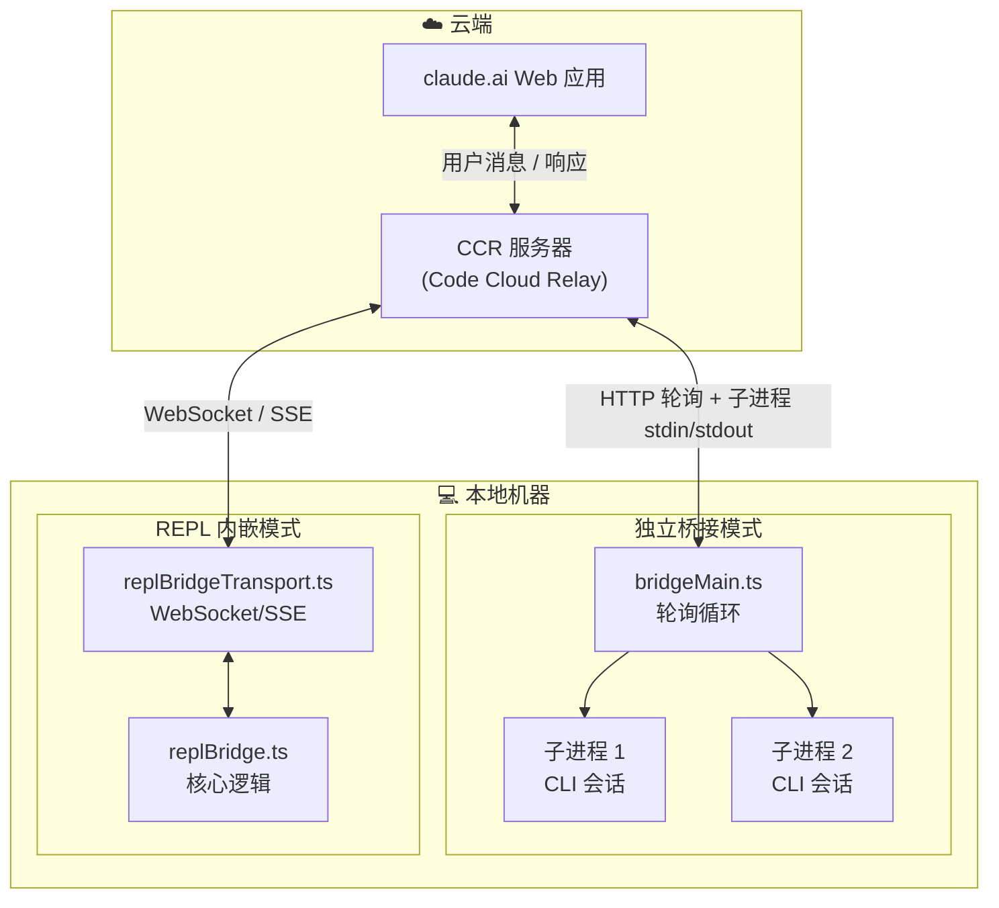
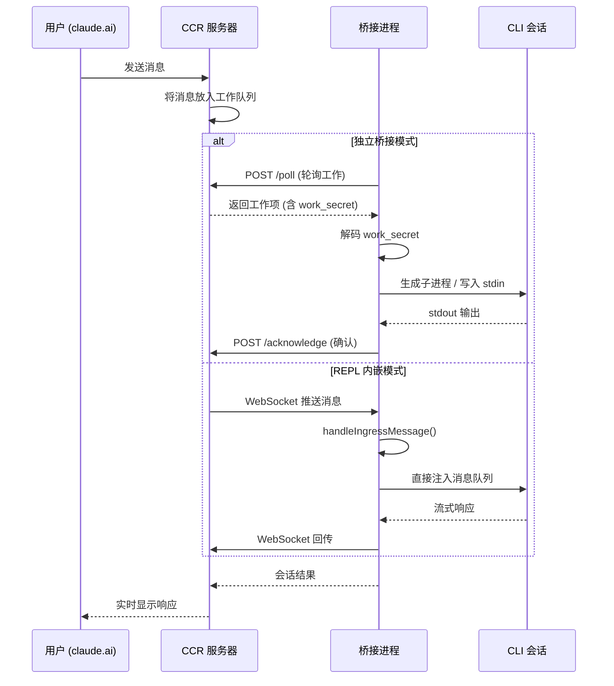
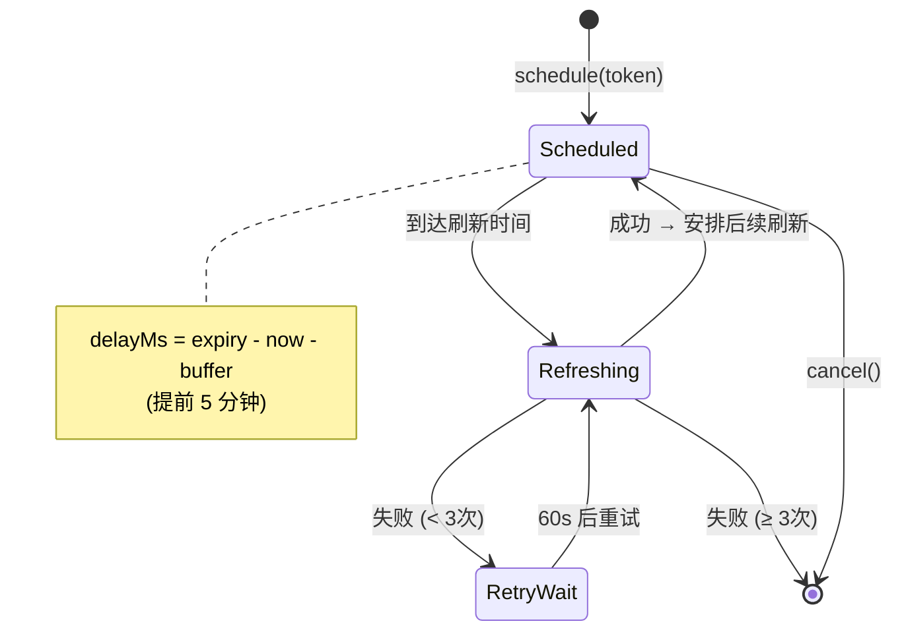
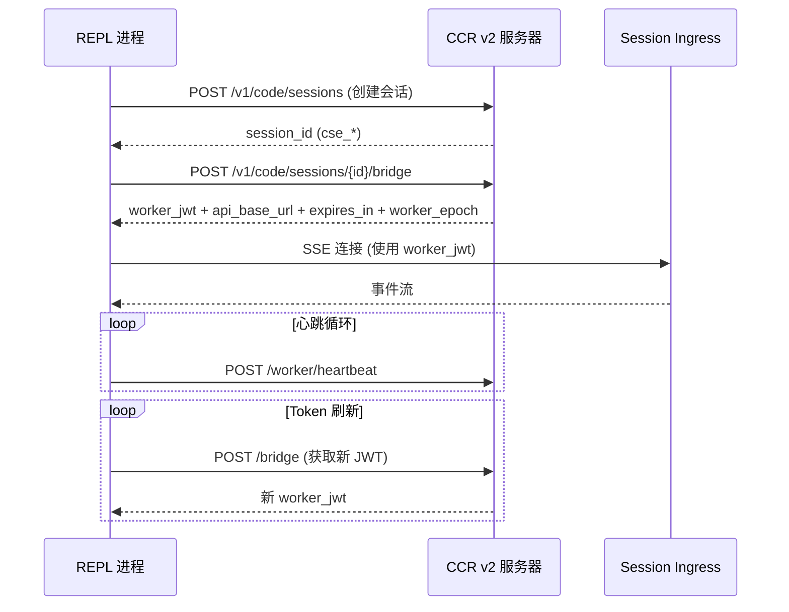
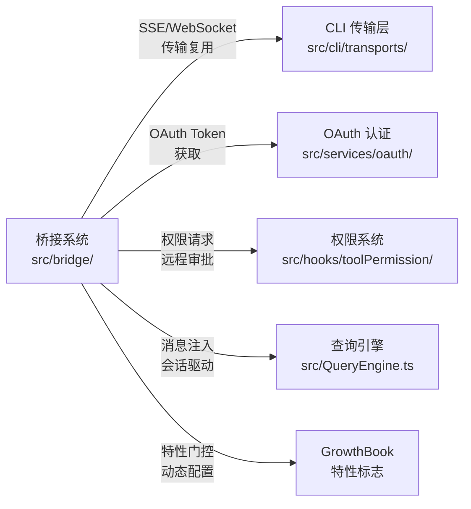

# 第 6 章 · 桥接通信系统

> 当你在 claude.ai 网页端输入一条指令，它如何穿越网络到达你本地机器上运行的 CLI 进程？当 CLI 执行完工具调用后，结果又如何实时回传到浏览器？这一切的幕后功臣就是桥接通信系统（Bridge System）。本章将带你深入理解 `src/bridge/` 目录下 31 个文件的协作机制：从环境注册、工作轮询到会话生命周期管理，从 JWT 认证到消息协议，从独立桥接模式到 REPL 内嵌桥接。

## 6.1 概述：桥接系统的角色

桥接系统是 Claude Code 实现"远程控制"（Remote Control）功能的核心基础设施。它解决了一个关键问题：**如何让运行在云端的 IDE 界面（claude.ai）与运行在用户本地的 CLI 进程实现安全、可靠的双向通信**。

桥接系统的核心职责包括：

- **双向通信**：在 IDE 扩展（Web 端）和本地 CLI 之间建立实时消息通道
- **会话管理**：创建、运行、恢复和归档远程会话
- **安全认证**：通过 JWT 和 OAuth 确保通信安全，通过可信设备机制增强安全等级
- **消息协议**：定义和处理 SDK 消息、控制请求/响应等多种消息类型
- **容错恢复**：处理网络断连、Token 过期、进程崩溃等异常场景

桥接系统的核心文件分布如下：

| 文件 | 职责 |
|------|------|
| `src/bridge/bridgeMain.ts` | 独立桥接模式入口，多会话轮询循环 |
| `src/bridge/replBridge.ts` | REPL 内嵌桥接核心逻辑 |
| `src/bridge/initReplBridge.ts` | REPL 桥接初始化入口 |
| `src/bridge/bridgeMessaging.ts` | 消息协议定义与处理 |
| `src/bridge/jwtUtils.ts` | JWT Token 解码与刷新调度 |
| `src/bridge/createSession.ts` | 会话创建 API 封装 |
| `src/bridge/sessionRunner.ts` | 会话进程生成与管理 |
| `src/bridge/bridgeApi.ts` | 桥接 API 客户端 |
| `src/bridge/types.ts` | 核心类型定义 |
| `src/bridge/trustedDevice.ts` | 可信设备认证 |
| `src/bridge/replBridgeTransport.ts` | REPL 桥接传输层 |
| `src/bridge/bridgeConfig.ts` | 桥接配置与认证解析 |
| `src/bridge/bridgePointer.ts` | 崩溃恢复指针 |
| `src/bridge/flushGate.ts` | 消息刷新门控 |
| `src/bridge/workSecret.ts` | 工作密钥解码与 URL 构建 |

## 6.2 双向通信架构

### 两种桥接模式

桥接系统提供两种运行模式，适用于不同的使用场景：

1. **独立桥接模式**（Standalone Bridge）：通过 `claude remote-control` 命令启动，由 `bridgeMain.ts` 驱动。这是一个独立进程，专门负责轮询服务器获取工作、生成子进程执行会话。支持多会话并发。

2. **REPL 内嵌桥接模式**（REPL Bridge）：在交互式 REPL 会话中自动启动，由 `initReplBridge.ts` → `replBridge.ts` 驱动。它复用当前 REPL 进程，通过 WebSocket 或 SSE 传输层与服务器通信。



### 通信链路全景

一条用户消息从 Web 端到达本地 CLI 的完整链路如下：



### 环境注册与工作轮询

独立桥接模式的核心是一个"注册-轮询-执行"循环。桥接进程首先向 CCR 服务器注册一个"环境"（Environment），然后持续轮询等待工作分配：

```typescript title="src/bridge/bridgeMain.ts" showLineNumbers
export async function runBridgeLoop(
  config: BridgeConfig,
  environmentId: string,
  environmentSecret: string,
  api: BridgeApiClient,
  spawner: SessionSpawner,
  logger: BridgeLogger,
  signal: AbortSignal,
  backoffConfig: BackoffConfig = DEFAULT_BACKOFF,
  initialSessionId?: string,
  getAccessToken?: () => string | undefined | Promise<string | undefined>,
): Promise<void> {
  const controller = new AbortController()
  if (signal.aborted) {
    controller.abort()
  } else {
    signal.addEventListener('abort', () => controller.abort(), { once: true })
  }
  const loopSignal = controller.signal

  const activeSessions = new Map<string, SessionHandle>()
  const sessionStartTimes = new Map<string, number>()
  const sessionWorkIds = new Map<string, string>()
  // ...
}
```

:::tip 设计要点
`runBridgeLoop` 维护了多个 `Map` 来追踪活跃会话的各种状态——启动时间、工作 ID、兼容性 ID、入口 Token 等。这种"多 Map 并行追踪"的模式虽然看起来冗余，但避免了创建复杂的嵌套对象，每个 Map 的生命周期可以独立管理。
:::

## 6.3 JWT 认证机制

### 认证架构概览

桥接系统采用多层认证机制确保通信安全：

1. **OAuth 2.0 Token**：用户通过 claude.ai 登录获取，用于桥接 API 调用（环境注册、会话创建等）
2. **Session Ingress JWT**：服务器为每个会话签发的短期 Token，用于 WebSocket/SSE 连接认证
3. **可信设备 Token**：持久化在本地 keychain 中的设备级 Token，用于提升安全等级

### JWT 解码与过期检测

`jwtUtils.ts` 提供了 JWT 的客户端解码能力（不验证签名，仅提取 payload）：

```typescript title="src/bridge/jwtUtils.ts" showLineNumbers
/**
 * Decode a JWT's payload segment without verifying the signature.
 * Strips the `sk-ant-si-` session-ingress prefix if present.
 */
export function decodeJwtPayload(token: string): unknown | null {
  // highlight-start
  const jwt = token.startsWith('sk-ant-si-')
    ? token.slice('sk-ant-si-'.length)
    : token
  // highlight-end
  const parts = jwt.split('.')
  if (parts.length !== 3 || !parts[1]) return null
  try {
    return jsonParse(Buffer.from(parts[1], 'base64url').toString('utf8'))
  } catch {
    return null
  }
}
```

注意高亮部分：Session Ingress Token 带有 `sk-ant-si-` 前缀，解码前需要先剥离。这是 Anthropic 内部的 Token 命名约定，`si` 代表 "session ingress"。

### Token 刷新调度器

长时间运行的桥接会话需要在 Token 过期前主动刷新。`createTokenRefreshScheduler` 实现了一个精巧的刷新调度器：

```typescript title="src/bridge/jwtUtils.ts" showLineNumbers
/** Refresh buffer: request a new token before expiry. */
const TOKEN_REFRESH_BUFFER_MS = 5 * 60 * 1000        // 提前 5 分钟

/** Fallback refresh interval when the new token's expiry is unknown. */
const FALLBACK_REFRESH_INTERVAL_MS = 30 * 60 * 1000   // 30 分钟兜底

/** Max consecutive failures before giving up on the refresh chain. */
const MAX_REFRESH_FAILURES = 3

export function createTokenRefreshScheduler({
  getAccessToken,
  onRefresh,
  label,
  refreshBufferMs = TOKEN_REFRESH_BUFFER_MS,
}: {
  getAccessToken: () => string | undefined | Promise<string | undefined>
  onRefresh: (sessionId: string, oauthToken: string) => void
  label: string
  refreshBufferMs?: number
}): {
  schedule: (sessionId: string, token: string) => void
  scheduleFromExpiresIn: (sessionId: string, expiresInSeconds: number) => void
  cancel: (sessionId: string) => void
  cancelAll: () => void
} {
  const timers = new Map<string, ReturnType<typeof setTimeout>>()
  const failureCounts = new Map<string, number>()
  // highlight-start
  // Generation counter per session — incremented by schedule() and cancel()
  // so that in-flight async doRefresh() calls can detect when they've been
  // superseded and should skip setting follow-up timers.
  const generations = new Map<string, number>()
  // highlight-end
  // ...
}
```

调度器的核心设计要点：

1. **提前刷新**：在 Token 过期前 5 分钟触发刷新，避免"刚好过期"的竞态
2. **代际计数器**（Generation Counter）：每次 `schedule()` 或 `cancel()` 都递增代际号。异步的 `doRefresh()` 在完成后检查代际号是否匹配，如果不匹配说明已被新的调度取代，直接放弃——这优雅地解决了并发刷新的竞态问题
3. **失败重试链**：最多重试 3 次，每次间隔 60 秒。成功后重置失败计数
4. **后续刷新**：每次成功刷新后自动安排 30 分钟后的下一次刷新，确保长时间运行的会话始终保持认证状态



### 可信设备机制

对于安全等级更高的桥接会话（SecurityTier=ELEVATED），系统还引入了可信设备认证：

```typescript title="src/bridge/trustedDevice.ts" showLineNumbers
/**
 * Enroll this device via POST /auth/trusted_devices and persist the token
 * to keychain. Best-effort — logs and returns on failure so callers
 * (post-login hooks) don't block the login flow.
 */
export async function enrollTrustedDevice(): Promise<void> {
  // ...
  const response = await axios.post<{
    device_token?: string
    device_id?: string
  }>(
    `${baseUrl}/api/auth/trusted_devices`,
    // highlight-next-line
    { display_name: `Claude Code on ${hostname()} · ${process.platform}` },
    {
      headers: {
        Authorization: `Bearer ${accessToken}`,
        'Content-Type': 'application/json',
      },
      timeout: 10_000,
      validateStatus: s => s < 500,
    },
  )
  // ...
}
```

可信设备 Token 的生命周期：

1. **注册时机**：用户执行 `claude auth login` 后立即注册（服务器要求 `account_session.created_at < 10min`）
2. **存储位置**：持久化在系统 keychain（macOS Security Framework / Linux Secret Service）
3. **使用方式**：每次桥接 API 调用时通过 `X-Trusted-Device-Token` 请求头发送
4. **缓存策略**：使用 `memoize` 缓存 keychain 读取结果（避免每次调用都 spawn macOS `security` 子进程），登录和登出时清除缓存

:::info 与权限系统的关系
可信设备机制是桥接系统安全层的一部分，与第 9 章介绍的权限系统（工具权限检查、OAuth 认证流程）共同构成了完整的安全保障体系。桥接系统中的 `bridgePermissionCallbacks.ts` 定义了权限请求/响应的回调接口，使得 Web 端可以远程审批工具执行权限。
:::

## 6.4 会话生命周期

### 会话创建

会话创建是桥接通信的起点。`createSession.ts` 封装了向 CCR 服务器发起 `POST /v1/sessions` 请求的完整逻辑：

```typescript title="src/bridge/createSession.ts" showLineNumbers
export async function createBridgeSession({
  environmentId,
  title,
  events,
  gitRepoUrl,
  branch,
  signal,
  baseUrl: baseUrlOverride,
  getAccessToken,
  permissionMode,
}: {
  environmentId: string
  title?: string
  events: SessionEvent[]
  gitRepoUrl: string | null
  branch: string
  signal: AbortSignal
  baseUrl?: string
  getAccessToken?: () => string | undefined
  permissionMode?: string
}): Promise<string | null> {
  // ...
  const requestBody = {
    ...(title !== undefined && { title }),
    events,
    session_context: {
      // highlight-start
      sources: gitSource ? [gitSource] : [],
      outcomes: gitOutcome ? [gitOutcome] : [],
      model: getMainLoopModel(),
      // highlight-end
    },
    environment_id: environmentId,
    source: 'remote-control',
    ...(permissionMode && { permission_mode: permissionMode }),
  }
  // ...
}
```

会话创建时携带了丰富的上下文信息：

- **Git 源信息**：仓库 URL、分支名，让 Web 端显示代码来源
- **Git 输出信息**：预期的输出分支（如 `claude/task`），用于 PR 创建
- **模型信息**：当前使用的 LLM 模型
- **权限模式**：工具执行的权限策略

对于 CCR v2 路径，`codeSessionApi.ts` 提供了更轻量的会话创建接口：

```typescript title="src/bridge/codeSessionApi.ts" showLineNumbers
export async function createCodeSession(
  baseUrl: string,
  accessToken: string,
  title: string,
  timeoutMs: number,
  tags?: string[],
): Promise<string | null> {
  const url = `${baseUrl}/v1/code/sessions`
  const response = await axios.post(
    url,
    // highlight-next-line
    { title, bridge: {}, ...(tags?.length ? { tags } : {}) },
    {
      headers: oauthHeaders(accessToken),
      timeout: timeoutMs,
      validateStatus: s => s < 500,
    },
  )
  // ...
}
```

:::tip 设计要点
注意 `bridge: {}` 这个空对象——它是服务器端 `oneof runner` 的正向信号，告诉服务器这是一个桥接会话（而非容器会话）。省略它会导致 400 错误。这种"空对象作为类型标记"的模式在 protobuf/gRPC 系统中很常见。
:::

### 会话运行：进程生成

在独立桥接模式下，每个会话对应一个子进程。`sessionRunner.ts` 中的 `createSessionSpawner` 负责生成和管理这些子进程：

```typescript title="src/bridge/sessionRunner.ts" showLineNumbers
function createSessionSpawner(deps: SessionSpawnerDeps): SessionSpawner {
  // ...
  return {
    spawn(opts: SessionSpawnOpts, dir: string): SessionHandle {
      // 构建子进程参数
      // 子进程通过 stdin/stdout 与桥接进程通信
      // 返回 SessionHandle 用于控制子进程生命周期
    }
  }
}
```

`SessionHandle`（定义在 `types.ts`）提供了对子进程的完整控制接口：

```typescript title="src/bridge/types.ts" showLineNumbers
// SessionHandle 的关键方法
function kill(): void          // 优雅终止
function forceKill(): void     // 强制终止
function writeStdin(data: string): void    // 写入消息
function updateAccessToken(token: string): void  // 更新 Token
```

`sessionRunner.ts` 还负责从子进程的输出中提取活动信息，用于在 Web 端显示会话状态：

```typescript title="src/bridge/sessionRunner.ts" showLineNumbers
function toolSummary(name: string, input: Record<string, unknown>): string {
  // 生成工具调用的简短摘要，如 "Read src/main.ts"
}

function extractActivities(
  // 从子进程输出中提取工具调用活动
  // 用于在 Web 端实时显示 "正在读取文件..." 等状态
): SessionActivity[]
```

### 崩溃恢复：Bridge Pointer

如果桥接进程意外崩溃（kill -9、终端关闭等），如何恢复之前的会话？`bridgePointer.ts` 实现了一个优雅的崩溃恢复机制：

```typescript title="src/bridge/bridgePointer.ts" showLineNumbers
/**
 * Crash-recovery pointer for Remote Control sessions.
 *
 * Written immediately after a bridge session is created, periodically
 * refreshed during the session, and cleared on clean shutdown.
 */
export const BRIDGE_POINTER_TTL_MS = 4 * 60 * 60 * 1000  // 4 小时

const BridgePointerSchema = lazySchema(() =>
  z.object({
    sessionId: z.string(),
    environmentId: z.string(),
    source: z.enum(['standalone', 'repl']),
  }),
)
```

Bridge Pointer 的工作原理：

1. **写入时机**：会话创建后立即写入 `~/.claude/projects/{dir}/bridge-pointer.json`
2. **定期刷新**：会话运行期间定期重写（更新 mtime），保持"新鲜度"
3. **清理时机**：正常关闭时删除
4. **恢复检测**：下次启动 `claude remote-control` 时检测到未清理的 pointer，提示用户恢复
5. **过期判断**：基于文件 mtime（而非内嵌时间戳），超过 4 小时视为过期并自动清理

```typescript title="src/bridge/bridgePointer.ts" showLineNumbers
/**
 * Worktree-aware read for `--continue`. Fans out across git worktree
 * siblings to find the freshest pointer.
 */
export async function readBridgePointerAcrossWorktrees(
  dir: string,
): Promise<{ pointer: BridgePointer & { ageMs: number }; dir: string } | null> {
  // highlight-start
  // Fast path: current dir
  const here = await readBridgePointer(dir)
  if (here) return { pointer: here, dir }
  // highlight-end

  // Fanout: scan worktree siblings
  const worktrees = await getWorktreePathsPortable(dir)
  if (worktrees.length <= 1) return null
  if (worktrees.length > MAX_WORKTREE_FANOUT) return null

  // Parallel stat+read, pick freshest
  const results = await Promise.all(
    candidates.map(async wt => {
      const p = await readBridgePointer(wt)
      return p ? { pointer: p, dir: wt } : null
    }),
  )
  // ...
}
```

:::info Worktree 感知
恢复机制支持 Git Worktree——如果用户在 worktree A 中启动了桥接，然后在 worktree B 中执行 `--continue`，系统会扫描所有 worktree 兄弟目录找到最新的 pointer。这种设计考虑到了实际开发中多 worktree 并行工作的场景。
:::

## 6.5 消息协议

### 消息类型体系

`bridgeMessaging.ts` 定义了桥接系统的消息协议。消息分为三大类：

1. **SDK 消息**（SDKMessage）：用户消息、助手响应等标准对话消息
2. **控制请求**（SDKControlRequest）：权限审批请求等需要 Web 端响应的请求
3. **控制响应**（SDKControlResponse）：Web 端对控制请求的回复

```typescript title="src/bridge/bridgeMessaging.ts" showLineNumbers
function isSDKMessage(value: unknown): value is SDKMessage {
  return (
    value !== null &&
    typeof value === 'object' &&
    'type' in value &&
    typeof value.type === 'string' &&
    // highlight-next-line
    !('control' in value)  // 排除控制消息
  )
}

function isSDKControlResponse(
  value: unknown,
): value is SDKControlResponse {
  return (
    value !== null &&
    typeof value === 'object' &&
    'control' in value &&
    value.control === 'response' &&
    'request_id' in value
  )
}

function isSDKControlRequest(
  value: unknown,
): value is SDKControlRequest {
  return (
    value !== null &&
    typeof value === 'object' &&
    'control' in value &&
    value.control === 'request'
  )
}
```

### 入站消息处理

`handleIngressMessage` 是消息处理的核心函数，它根据消息类型分发到不同的处理逻辑：

```typescript title="src/bridge/bridgeMessaging.ts" showLineNumbers
function handleIngressMessage(
  // 处理从服务器接收的入站消息
  // 根据消息类型分发：
  //   - SDK 消息 → 注入到会话消息队列
  //   - 控制响应 → 传递给权限回调
  //   - 控制请求 → 处理服务器发起的控制指令
)
```

对于用户消息，`inboundMessages.ts` 负责提取和规范化消息内容：

```typescript title="src/bridge/inboundMessages.ts" showLineNumbers
/**
 * Process an inbound user message from the bridge, extracting content
 * and UUID for enqueueing. Supports both string content and
 * ContentBlockParam[] (e.g. messages containing images).
 */
export function extractInboundMessageFields(
  msg: SDKMessage,
):
  | { content: string | Array<ContentBlockParam>; uuid: UUID | undefined }
  | undefined {
  if (msg.type !== 'user') return undefined
  const content = msg.message?.content
  if (!content) return undefined
  if (Array.isArray(content) && content.length === 0) return undefined

  return {
    // highlight-next-line
    content: Array.isArray(content) ? normalizeImageBlocks(content) : content,
    uuid: /* ... */,
  }
}
```

:::caution 跨平台兼容性
`normalizeImageBlocks` 处理了一个实际的跨平台问题：iOS/Web 客户端可能发送 `mediaType`（camelCase）而非 `media_type`（snake_case），或者完全省略该字段。如果不做规范化，一个格式错误的图片块会"毒化"整个会话——后续所有 API 调用都会因为 `media_type: Field required` 而失败。
:::

### 消息去重：BoundedUUIDSet

网络重传可能导致消息重复。`BoundedUUIDSet` 是一个固定容量的环形缓冲区，用于高效去重：

```typescript title="src/bridge/bridgeMessaging.ts" showLineNumbers
class BoundedUUIDSet {
  private capacity: number
  private set = new Set<string>()
  private queue: string[] = []

  constructor(capacity: number) {
    this.capacity = capacity
  }

  add(uuid: string): void {
    if (this.set.has(uuid)) return
    // highlight-start
    if (this.set.size >= this.capacity) {
      // 环形淘汰：移除最早的 UUID
      const oldest = this.queue.shift()!
      this.set.delete(oldest)
    }
    // highlight-end
    this.set.add(uuid)
    this.queue.push(uuid)
  }

  has(uuid: string): boolean {
    return this.set.has(uuid)
  }
}
```

默认容量为 2000（通过 `envLessBridgeConfig.ts` 的 `uuid_dedup_buffer_size` 配置），足以覆盖正常会话中的消息量，同时保持内存占用可控。

### 文件附件处理

Web 端用户可以上传文件附件。`inboundAttachments.ts` 负责将这些附件下载到本地并转换为 `@path` 引用：

```typescript title="src/bridge/inboundAttachments.ts" showLineNumbers
/**
 * Resolve all attachments on an inbound message to a prefix string of
 * @path refs. Empty string if none resolved.
 */
export async function resolveInboundAttachments(
  attachments: InboundAttachment[],
): Promise<string> {
  if (attachments.length === 0) return ''
  const paths = await Promise.all(attachments.map(resolveOne))
  const ok = paths.filter((p): p is string => p !== undefined)
  if (ok.length === 0) return ''
  // highlight-next-line
  // 使用引号形式，避免路径中的空格导致截断
  return ok.map(p => `@"${p}"`).join(' ') + ' '
}
```

附件处理流程：
1. 从入站消息中提取 `file_attachments` 字段
2. 通过 OAuth 认证的 API 下载每个文件到 `~/.claude/uploads/{sessionId}/`
3. 文件名经过安全清洗（`sanitizeFileName`），并添加 UUID 前缀防止冲突
4. 将下载路径转换为 `@"path"` 引用，前置到消息内容中
5. Claude 的 Read 工具后续会读取这些文件

### 消息刷新门控

当桥接会话启动时，需要先将历史消息刷新到服务器。在刷新期间，新消息必须排队等待，防止与历史消息交错。`FlushGate` 实现了这个状态机：

```typescript title="src/bridge/flushGate.ts" showLineNumbers
/**
 * Lifecycle:
 *   start() → enqueue() returns true, items are queued
 *   end()   → returns queued items for draining, enqueue() returns false
 *   drop()  → discards queued items (permanent transport close)
 *   deactivate() → clears active flag without dropping items
 *                   (transport replacement — new transport will drain)
 */
export class FlushGate<T> {
  private _active = false
  private _pending: T[] = []

  /** If flush is active, queue the items and return true.
   *  If flush is not active, return false (caller should send directly). */
  enqueue(...items: T[]): boolean {
    if (!this._active) return false
    this._pending.push(...items)
    return true
  }

  /** End the flush and return any queued items for draining. */
  end(): T[] {
    this._active = false
    return this._pending.splice(0)
  }
}
```

`FlushGate` 的四种操作对应不同的场景：
- `start()`：开始刷新历史消息
- `end()`：刷新完成，返回排队的新消息供发送
- `drop()`：传输层永久关闭，丢弃排队消息
- `deactivate()`：传输层被替换（重连），保留排队消息供新传输层处理

## 6.6 REPL 桥接子系统

### 初始化流程

REPL 桥接模式在用户启动交互式 REPL 时自动激活。`initReplBridge.ts` 是入口，它根据特性标志选择 v1（基于环境）或 v2（无环境）路径：

```typescript title="src/bridge/initReplBridge.ts" showLineNumbers
async function initReplBridge(
  // 检查桥接是否启用
  // 根据 isEnvLessBridgeEnabled() 选择路径：
  //   v1 → 传统环境注册 + 轮询
  //   v2 → 直接创建 code session + WebSocket
  // 返回 ReplBridgeHandle 供 REPL 使用
)
```

### 核心逻辑：initBridgeCore

`replBridge.ts` 中的 `initBridgeCore` 是 REPL 桥接的核心。它建立传输连接、处理消息收发、管理会话生命周期：

```typescript title="src/bridge/replBridge.ts" showLineNumbers
export type ReplBridgeHandle = {
  bridgeSessionId: string
  environmentId: string
  sessionIngressUrl: string
  writeMessages(messages: Message[]): void
  writeSdkMessages(messages: SDKMessage[]): void
  sendControlRequest(request: SDKControlRequest): void
  sendControlResponse(response: SDKControlResponse): void
  sendControlCancelRequest(requestId: string): void
  sendResult(): void
  teardown(): Promise<void>
}
```

`ReplBridgeHandle` 是 REPL 桥接对外暴露的接口。通过 `replBridgeHandle.ts` 中的全局指针，工具和斜杠命令可以在 React 组件树之外访问桥接功能：

```typescript title="src/bridge/replBridgeHandle.ts" showLineNumbers
let handle: ReplBridgeHandle | null = null

export function setReplBridgeHandle(h: ReplBridgeHandle | null): void {
  handle = h
  // 发布桥接会话 ID 到会话记录，供其他本地对等方去重
  void updateSessionBridgeId(getSelfBridgeCompatId() ?? null).catch(() => {})
}

export function getReplBridgeHandle(): ReplBridgeHandle | null {
  return handle
}
```

### 传输层实现

`replBridgeTransport.ts` 定义了传输层的抽象接口和两种实现：

```typescript title="src/bridge/replBridgeTransport.ts" showLineNumbers
// 传输层接口
interface ReplBridgeTransport {
  write(message: StdoutMessage): Promise<void>
  writeBatch(messages: StdoutMessage[]): Promise<void>
  close(): void
  isConnectedStatus(): boolean
  getStateLabel(): string
  setOnData(callback: (data: string) => void): void
  setOnClose(callback: (closeCode?: number) => void): void
  setOnConnect(callback: () => void): void
  connect(): void
}
```

两种传输实现：

| 实现 | 函数 | 协议 | 适用场景 |
|------|------|------|----------|
| V1 传输 | `createV1ReplTransport()` | WebSocket | 传统环境注册路径 |
| V2 传输 | `createV2ReplTransport()` | SSE + HTTP POST | CCR v2 无环境路径 |

V2 传输层还提供了额外的能力：

```typescript title="src/bridge/replBridgeTransport.ts" showLineNumbers
// V2 传输层扩展接口
interface V2ReplTransport extends ReplBridgeTransport {
  getLastSequenceNum(): number           // 获取最后序列号
  reportState(state: SessionState): void // 上报会话状态
  reportMetadata(metadata: Record<string, unknown>): void  // 上报元数据
  reportDelivery(eventId: string, status: 'processing' | 'processed'): void
  flush(): Promise<void>                 // 刷新缓冲区
}
```

### 工作轮询循环

REPL 桥接也有自己的轮询循环（`startWorkPollLoop`），但与独立桥接不同，它主要用于：

1. **保活**：定期向服务器发送心跳，防止环境被自动归档
2. **容量管理**：当传输层断开时，通过轮询重新获取工作
3. **Token 刷新**：在轮询响应中获取新的 Session Ingress Token

轮询间隔通过 `pollConfig.ts` 动态配置，支持 GrowthBook 远程调参：

```typescript title="src/bridge/pollConfigDefaults.ts" showLineNumbers
/** Poll interval when actively seeking work (no transport). */
const POLL_INTERVAL_MS_NOT_AT_CAPACITY = 2000       // 2 秒

/** Poll interval when the transport is connected. */
const POLL_INTERVAL_MS_AT_CAPACITY = 600_000        // 10 分钟
```

:::tip 设计要点
轮询间隔的设计体现了"按需调频"的思想：没有连接时每 2 秒轮询一次（快速响应），已连接时每 10 分钟轮询一次（仅作保活）。服务器端的 `BRIDGE_LAST_POLL_TTL` 为 4 小时，10 分钟的间隔提供了 24 倍的安全余量。
:::

### 容量唤醒机制

当桥接处于"满容量"状态（已有活跃会话）时，轮询循环会进入长时间休眠。但如果会话结束或传输层断开，需要立即唤醒轮询。`capacityWake.ts` 实现了这个机制：

```typescript title="src/bridge/capacityWake.ts" showLineNumbers
export function createCapacityWake(outerSignal: AbortSignal): CapacityWake {
  let wakeController = new AbortController()

  function wake(): void {
    // highlight-start
    wakeController.abort()                    // 中断当前休眠
    wakeController = new AbortController()    // 准备下一次休眠
    // highlight-end
  }

  function signal(): CapacitySignal {
    const merged = new AbortController()
    const abort = (): void => merged.abort()
    // 合并两个信号：外部关闭 OR 容量释放
    outerSignal.addEventListener('abort', abort, { once: true })
    wakeController.signal.addEventListener('abort', abort, { once: true })
    return {
      signal: merged.signal,
      cleanup: () => {
        outerSignal.removeEventListener('abort', abort)
        // ...
      },
    }
  }

  return { signal, wake }
}
```

这个模式巧妙地利用了 `AbortController` 的信号合并：休眠时监听合并信号，任一信号触发都会唤醒。`wake()` 调用后立即创建新的 controller，为下一次休眠做准备。

## 6.7 远程桥接核心（CCR v2）

### 无环境桥接路径

CCR v2 引入了"无环境"（env-less）桥接路径，简化了连接流程。`remoteBridgeCore.ts` 中的 `initEnvLessBridgeCore` 实现了这个新路径：



### 远程凭证获取

`codeSessionApi.ts` 中的 `fetchRemoteCredentials` 负责获取连接凭证：

```typescript title="src/bridge/codeSessionApi.ts" showLineNumbers
export type RemoteCredentials = {
  worker_jwt: string       // 工作者 JWT，用于 SSE/WebSocket 认证
  api_base_url: string     // API 基础 URL
  expires_in: number       // JWT 有效期（秒）
  worker_epoch: number     // 工作者纪元号，用于心跳
}

export async function fetchRemoteCredentials(
  sessionId: string,
  baseUrl: string,
  accessToken: string,
  timeoutMs: number,
  trustedDeviceToken?: string,
): Promise<RemoteCredentials | null> {
  const url = `${baseUrl}/v1/code/sessions/${sessionId}/bridge`
  const headers = oauthHeaders(accessToken)
  // highlight-start
  if (trustedDeviceToken) {
    headers['X-Trusted-Device-Token'] = trustedDeviceToken
  }
  // highlight-end
  // ...
}
```

### 工作密钥与 URL 构建

`workSecret.ts` 处理从服务器接收的工作密钥，并构建连接 URL：

```typescript title="src/bridge/workSecret.ts" showLineNumbers
/** Decode a base64url-encoded work secret and validate its version. */
export function decodeWorkSecret(secret: string): WorkSecret {
  const json = Buffer.from(secret, 'base64url').toString('utf-8')
  const parsed: unknown = jsonParse(json)
  // 验证版本号为 1
  // 验证 session_ingress_token 存在且非空
  // 验证 api_base_url 存在
  return parsed as WorkSecret
}

/** Build a WebSocket SDK URL from the API base URL and session ID. */
export function buildSdkUrl(apiBaseUrl: string, sessionId: string): string {
  const isLocalhost =
    apiBaseUrl.includes('localhost') || apiBaseUrl.includes('127.0.0.1')
  // highlight-start
  const protocol = isLocalhost ? 'ws' : 'wss'
  const version = isLocalhost ? 'v2' : 'v1'
  // highlight-end
  const host = apiBaseUrl.replace(/^https?:\/\//, '').replace(/\/+$/, '')
  return `${protocol}://${host}/${version}/session_ingress/ws/${sessionId}`
}
```

:::info 本地开发适配
`buildSdkUrl` 对 localhost 做了特殊处理：使用 `ws://`（非加密）和 `/v2/` 路径（直连 session-ingress，无 Envoy 代理重写）。生产环境则使用 `wss://` 和 `/v1/`（经过 Envoy 代理将 `/v1/` 重写为 `/v2/`）。
:::

### Session ID 兼容性

CCR v2 引入了新的 Session ID 前缀 `cse_`（Code Session Entity），但 Web 前端仍然使用 `session_` 前缀。`sessionIdCompat.ts` 处理这种转换：

```typescript title="src/bridge/sessionIdCompat.ts" showLineNumbers
/**
 * Re-tag a `cse_*` session ID to `session_*` for use with the v1 compat API.
 * Same UUID, different costume.
 */
export function toCompatSessionId(id: string): string {
  if (!id.startsWith('cse_')) return id
  if (_isCseShimEnabled && !_isCseShimEnabled()) return id
  return 'session_' + id.slice('cse_'.length)
}

/**
 * Inverse: re-tag `session_*` to `cse_*` for infrastructure-layer calls.
 */
export function toInfraSessionId(id: string): string {
  if (!id.startsWith('session_')) return id
  return 'cse_' + id.slice('session_'.length)
}
```

这种"同一 UUID，不同前缀"的设计是 API 版本迁移中的常见模式——基础设施层使用新前缀，兼容层负责翻译，前端无需感知变化。

## 6.8 配置与特性门控

### 桥接启用检查

`bridgeEnabled.ts` 是桥接系统的"总开关"，通过多层检查决定是否启用远程控制：

```typescript title="src/bridge/bridgeEnabled.ts" showLineNumbers
export function isBridgeEnabled(): boolean {
  return feature('BRIDGE_MODE')
    // highlight-start
    ? isClaudeAISubscriber() &&
        getFeatureValue_CACHED_MAY_BE_STALE('tengu_ccr_bridge', false)
    // highlight-end
    : false
}
```

启用条件的三层门控：

1. **编译时门控**：`feature('BRIDGE_MODE')` 是 `bun:bundle` 特性标志，在非桥接构建中整个代码块会被死代码消除
2. **订阅检查**：`isClaudeAISubscriber()` 确认用户有 claude.ai 订阅（排除 Bedrock/Vertex 等其他部署方式）
3. **远程门控**：GrowthBook 特性标志 `tengu_ccr_bridge` 控制灰度发布

`bridgeEnabled.ts` 还提供了诊断功能，当桥接不可用时给出具体原因：

```typescript title="src/bridge/bridgeEnabled.ts" showLineNumbers
export async function getBridgeDisabledReason(): Promise<string | null> {
  if (feature('BRIDGE_MODE')) {
    if (!isClaudeAISubscriber()) {
      return 'Remote Control requires a claude.ai subscription...'
    }
    if (!hasProfileScope()) {
      return 'Remote Control requires a full-scope login token...'
    }
    if (!getOauthAccountInfo()?.organizationUuid) {
      return 'Unable to determine your organization...'
    }
    if (!(await checkGate_CACHED_OR_BLOCKING('tengu_ccr_bridge'))) {
      return 'Remote Control is not yet enabled for your account.'
    }
    return null  // 全部通过
  }
  return 'Remote Control is not available in this build.'
}
```

### 动态配置

桥接系统的运行参数通过 GrowthBook 动态配置，支持远程调参而无需发布新版本：

```typescript title="src/bridge/envLessBridgeConfig.ts" showLineNumbers
export const DEFAULT_ENV_LESS_BRIDGE_CONFIG: EnvLessBridgeConfig = {
  init_retry_max_attempts: 3,          // 初始化重试次数
  init_retry_base_delay_ms: 500,       // 重试基础延迟
  http_timeout_ms: 10_000,             // HTTP 超时
  uuid_dedup_buffer_size: 2000,        // 去重缓冲区大小
  heartbeat_interval_ms: 20_000,       // 心跳间隔 (20s)
  token_refresh_buffer_ms: 300_000,    // Token 刷新提前量 (5min)
  teardown_archive_timeout_ms: 1500,   // 清理归档超时
  connect_timeout_ms: 15_000,          // 连接超时
  min_version: '0.0.0',               // 最低版本要求
}
```

所有配置项都通过 Zod Schema 验证，带有合理的上下限约束。例如心跳间隔的下限是 5 秒（防止过于频繁），上限是 30 秒（服务器 TTL 为 60 秒，保持 2 倍余量）。

## 6.9 调试与可观测性

### 故障注入

`bridgeDebug.ts` 提供了一套故障注入框架，用于测试桥接系统的恢复能力：

```typescript title="src/bridge/bridgeDebug.ts" showLineNumbers
/**
 * Ant-only fault injection for manually testing bridge recovery paths.
 *
 * Real failure modes this targets:
 *   poll 404 not_found_error   — 147K sessions/week
 *   ws_closed 1002/1006        —  22K sessions/week
 *   register transient failure —  residual: network blips
 */
type BridgeFault = {
  method: 'pollForWork' | 'registerBridgeEnvironment'
        | 'reconnectSession' | 'heartbeatWork'
  kind: 'fatal' | 'transient'
  status: number
  errorType?: string
  count: number  // 剩余注入次数
}
```

故障注入通过 API 客户端包装实现——`wrapApiForFaultInjection` 在每次 API 调用前检查故障队列，如果匹配则抛出模拟错误而非真正调用：

```typescript title="src/bridge/bridgeDebug.ts" showLineNumbers
export function wrapApiForFaultInjection(
  api: BridgeApiClient,
): BridgeApiClient {
  return {
    ...api,
    async pollForWork(envId, secret, signal, reclaimMs) {
      const f = consume('pollForWork')
      if (f) throwFault(f, 'Poll')
      return api.pollForWork(envId, secret, signal, reclaimMs)
    },
    // ... 其他方法类似
  }
}
```

:::tip 设计要点
故障注入仅在 `USER_TYPE === 'ant'`（内部构建）时启用，外部构建零开销。这种"开发时可测试，发布时零成本"的模式值得借鉴。通过 `/bridge-kick` 斜杠命令触发，可以在运行中的 REPL 会话里实时注入故障。
:::

### 状态展示

`bridgeStatusUtil.ts` 提供了桥接状态的可视化工具，包括状态标签、连接 URL 生成和终端动画效果：

```typescript title="src/bridge/bridgeStatusUtil.ts" showLineNumbers
export type StatusState =
  | 'idle'          // 等待连接
  | 'attached'      // 已连接会话
  | 'titled'        // 已设置标题
  | 'reconnecting'  // 重连中
  | 'failed'        // 失败

export function getBridgeStatus({
  error, connected, sessionActive, reconnecting,
}: { /* ... */ }): BridgeStatusInfo {
  if (error) return { label: 'Remote Control failed', color: 'error' }
  if (reconnecting)
    return { label: 'Remote Control reconnecting', color: 'warning' }
  if (sessionActive || connected)
    return { label: 'Remote Control active', color: 'success' }
  return { label: 'Remote Control connecting…', color: 'warning' }
}
```

`bridgeUI.ts` 则负责在终端中渲染桥接状态，包括 QR 码生成（方便移动端扫码连接）和闪烁动画效果。

## 6.10 与其他系统的关系

桥接系统不是孤立存在的，它与项目中的多个子系统紧密协作：



- **CLI 传输层**（第 12 章）：REPL 桥接的 V2 传输层使用了与 CLI 传输层相同的 SSE 和 WebSocket 基础设施。`HybridTransport`、`SSETransport`、`WebSocketTransport` 等传输实现被桥接系统复用
- **权限系统**（第 9 章）：`bridgePermissionCallbacks.ts` 定义了远程权限审批的回调接口。当 CLI 需要执行敏感工具时，权限请求通过桥接发送到 Web 端，用户在浏览器中审批后，响应通过桥接回传
- **查询引擎**（第 5 章）：桥接系统将 Web 端的用户消息注入到查询引擎的消息队列中，驱动 LLM 对话循环
- **GrowthBook 特性标志**（第 2 章）：桥接系统大量使用 GrowthBook 进行灰度发布和动态配置，从启用检查到轮询间隔都可远程调参

## 术语表

| 术语 | 说明 |
|------|------|
| Bridge | 桥接系统，连接 IDE 扩展（Web 端）与本地 CLI 的通信层 |
| CCR | Code Cloud Relay，Anthropic 的云端中继服务 |
| Environment | 桥接环境，代表一个注册的本地桥接实例 |
| Session Ingress | 会话入口服务，负责 WebSocket/SSE 连接管理 |
| Work Secret | 工作密钥，包含 Session Ingress Token 和 API URL |
| Bridge Pointer | 崩溃恢复指针，记录活跃会话信息用于进程恢复 |
| FlushGate | 消息刷新门控，防止历史消息与新消息交错 |
| CapacityWake | 容量唤醒机制，在会话结束时唤醒轮询循环 |
| Trusted Device | 可信设备，通过 keychain 存储的设备级认证 Token |
| Generation Counter | 代际计数器，用于 Token 刷新调度中的竞态检测 |
