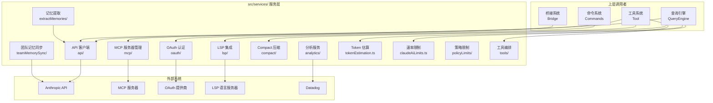
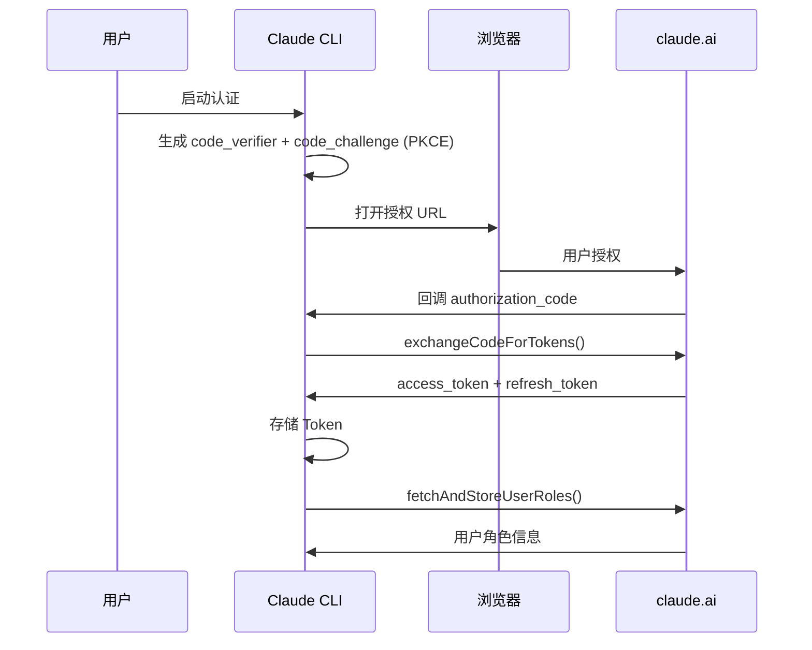
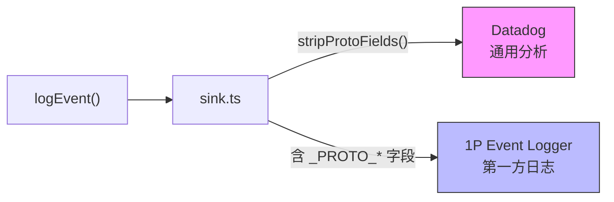
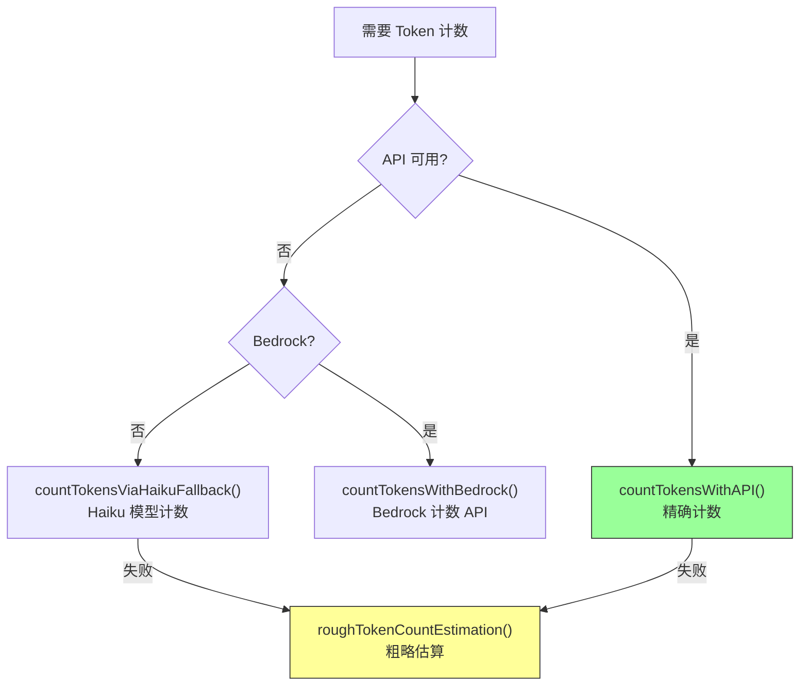
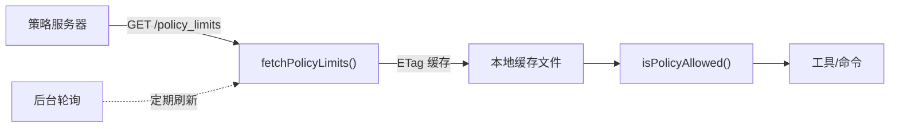
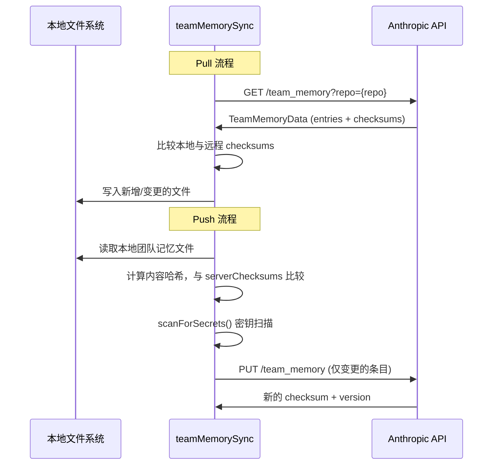
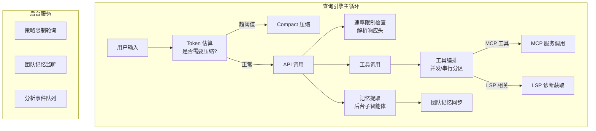

# 第 7 章 · 服务层

> 如果说工具系统和命令系统是 Claude Code 的"手"和"嘴"，那么服务层就是它的"神经系统"——连接着外部 API、管理着认证凭证、追踪着使用配额、同步着团队记忆。`src/services/` 目录下 20 个子目录和 16 个独立文件，构成了一个功能丰富的服务生态。本章将带你逐一理解这些服务的职责、实现方式，以及它们如何被上层模块（查询引擎、工具系统、桥接系统）调用和协调。

## 7.1 概述：服务层的角色与架构

服务层位于核心业务逻辑（查询引擎、工具系统）和外部系统（Anthropic API、MCP 服务器、OAuth 提供商、LSP 服务器）之间，承担着**外部集成**和**基础设施支撑**两大职责。

服务层的核心设计原则：

- **关注点分离**：每个服务专注于一个领域（API 调用、认证、分析等），通过清晰的模块边界降低耦合
- **延迟初始化**：许多服务采用懒加载模式，仅在首次使用时初始化，避免启动时的性能开销
- **事件队列**：分析服务等采用"先排队后消费"模式，确保启动阶段的事件不会丢失
- **容错设计**：API 调用、团队同步等服务内置重试、降级和缓存机制



### 服务目录总览

| 目录/文件 | 职责 | 关键特性 |
|-----------|------|----------|
| `api/` | Anthropic API 客户端封装 | 多后端支持、重试机制、流式响应 |
| `mcp/` | MCP 服务器连接管理 | 批量连接、认证、工具发现 |
| `oauth/` | OAuth 2.0 认证流程 | PKCE、Token 刷新、角色获取 |
| `lsp/` | LSP 语言服务器集成 | 多服务器管理、诊断收集 |
| `analytics/` | 事件分析与追踪 | Datadog + 1P 双通道、采样 |
| `compact/` | 对话压缩服务 | 自动/手动压缩、Token 管理 |
| `extractMemories/` | 记忆提取服务 | 后台子智能体、自动提取 |
| `teamMemorySync/` | 团队记忆同步 | Pull/Push、冲突解决、密钥扫描 |
| `policyLimits/` | 策略限制系统 | 后台轮询、缓存、组织级策略 |
| `tools/` | 工具执行编排 | 并发/串行分区、流式执行 |
| `tokenEstimation.ts` | Token 估算 | 粗估 + API 精确计数 |
| `claudeAiLimits.ts` | 速率限制追踪 | 响应头解析、预警系统 |
| `SessionMemory/` | 会话记忆管理 | 自动提取、文件持久化 |
| `tips/` | 使用提示系统 | 调度、历史、注册 |

## 7.2 API 客户端服务

API 客户端服务（`src/services/api/`）是整个系统与 Anthropic LLM 交互的唯一出口。它封装了客户端创建、请求构建、流式响应处理、重试逻辑和成本追踪等核心功能。

### 多后端客户端工厂

`getAnthropicClient()` 是一个异步工厂函数，根据环境变量动态选择后端实现：

```typescript title="src/services/api/client.ts" showLineNumbers
async function getAnthropicClient({
  apiKey,
  maxRetries,
  model,
  fetchOverride,
  source,
}: {
  apiKey?: string
  maxRetries: number
  model?: string
  fetchOverride?: ClientOptions['fetch']
  source?: string
}): Promise<Anthropic> {
  // highlight-start
  // 1. 构建通用请求头：会话 ID、User-Agent、容器 ID 等
  const defaultHeaders: { [key: string]: string } = {
    'x-app': 'cli',
    'User-Agent': getUserAgent(),
    'X-Claude-Code-Session-Id': getSessionId(),
    ...customHeaders,
  }
  // highlight-end

  // 2. 刷新 OAuth Token（如果需要）
  await checkAndRefreshOAuthTokenIfNeeded()

  // highlight-start
  // 3. 根据环境变量选择后端
  if (isEnvTruthy(process.env.CLAUDE_CODE_USE_BEDROCK)) {
    // AWS Bedrock 后端
    const { AnthropicBedrock } = await import('@anthropic-ai/bedrock-sdk')
    return new AnthropicBedrock(bedrockArgs) as unknown as Anthropic
  }
  if (isEnvTruthy(process.env.CLAUDE_CODE_USE_VERTEX)) {
    // Google Vertex AI 后端
    const { AnthropicVertex } = await import('@anthropic-ai/vertex-sdk')
    return new AnthropicVertex(vertexArgs) as unknown as Anthropic
  }
  // highlight-end

  // 4. 默认：Anthropic 直连 API
  return new Anthropic(clientConfig)
}
```

:::tip 设计要点
客户端工厂使用**动态 import** 加载 Bedrock/Vertex SDK，避免在不使用这些后端时引入约 279KB 的额外依赖。这是一种典型的**按需加载**优化模式。
:::

### 流式查询与模型交互

`src/services/api/claude.ts` 是 API 层的核心文件，包含 `queryModel()` 等关键函数。它负责：

- **消息格式转换**：将内部 `Message` 类型转换为 API 所需的 `MessageParam` 格式
- **流式响应处理**：通过 `AsyncGenerator` 逐步产出 LLM 返回的数据流
- **Prompt 缓存**：通过 `addCacheBreakpoints()` 在系统提示和对话历史中插入缓存断点，减少重复 Token 消耗
- **思考模式**：配置 `thinking` 参数，支持 extended thinking 功能
- **Token 上限管理**：根据模型动态计算 `max_tokens`

```typescript title="src/services/api/claude.ts" showLineNumbers
// highlight-start
async function* queryModel({
  messages, systemPrompt, tools, model, ...options
}): AsyncGenerator<StreamEvent> {
  // 构建系统提示块（支持缓存断点）
  const systemBlocks = buildSystemPromptBlocks(systemPrompt)
  // highlight-end

  // 配置 Prompt 缓存
  addCacheBreakpoints(messages, systemBlocks)

  // 发起流式请求
  yield* queryModelWithStreaming({ messages, systemBlocks, tools, model })
}
```

### 重试与容错机制

`src/services/api/withRetry.ts` 实现了一套精细的重试策略：

```typescript title="src/services/api/withRetry.ts" showLineNumbers
async function* withRetry<T>(
  fn: () => AsyncGenerator<T>,
  options: RetryOptions,
): AsyncGenerator<T> {
  // highlight-start
  // 根据错误类型决定是否重试
  // - 429 (Rate Limit): 使用 Retry-After 头部的延迟
  // - 529 (Overloaded): 可配置是否重试
  // - 5xx (Server Error): 指数退避重试
  // - OAuth Token 过期: 刷新后重试
  // - AWS/GCP 凭证错误: 刷新凭证后重试
  // highlight-end
}
```

重试系统的关键设计：

| 错误类型 | 策略 | 说明 |
|----------|------|------|
| 429 Rate Limit | `Retry-After` 延迟 | 尊重服务端指定的等待时间 |
| 529 Overloaded | 可配置重试 | 通过 `shouldRetry529()` 控制 |
| 5xx Server Error | 指数退避 | 最大重试次数可配置 |
| OAuth Token 过期 | 刷新后重试 | 自动刷新 OAuth Token |
| 上下文溢出 | 截断重试 | 解析错误信息，调整 `max_tokens` |

## 7.3 MCP 服务器管理服务

MCP（Model Context Protocol）服务器管理服务（`src/services/mcp/`）是 Claude Code 扩展性的核心支柱。它负责发现、连接、管理外部 MCP 服务器，并将服务器提供的工具和命令集成到核心系统中。

### 连接管理架构

MCP 服务使用 React Context 模式管理连接状态：

```typescript title="src/services/mcp/MCPConnectionManager.tsx" showLineNumbers
// highlight-start
// React Context 提供全局 MCP 连接管理能力
export function MCPConnectionManager({
  children, dynamicMcpConfig, isStrictMcpConfig,
}: MCPConnectionManagerProps): React.ReactNode {
  const { reconnectMcpServer, toggleMcpServer } =
    useManageMCPConnections(dynamicMcpConfig, isStrictMcpConfig)
  // highlight-end

  return (
    <MCPConnectionContext.Provider value={{ reconnectMcpServer, toggleMcpServer }}>
      {children}
    </MCPConnectionContext.Provider>
  )
}
```

### MCP 客户端核心

`src/services/mcp/client.ts` 是一个超过 3000 行的大文件，包含了 MCP 协议的完整客户端实现：

- **批量连接**：通过 `processBatched()` 控制并发连接数，本地服务器和远程服务器使用不同的批量大小
- **工具发现**：`getMcpToolsCommandsAndResources()` 从已连接的 MCP 服务器中提取工具、命令和资源
- **工具调用**：`callMCPTool()` 处理工具调用的完整生命周期，包括超时控制、结果转换和错误处理
- **认证缓存**：通过 `getMcpAuthCache()` 缓存 OAuth 认证状态，避免重复授权
- **资源预取**：`prefetchAllMcpResources()` 在连接建立后预取服务器资源

```typescript title="src/services/mcp/client.ts" showLineNumbers
// 批量连接控制——避免同时启动过多 MCP 服务器进程
// highlight-start
function getMcpServerConnectionBatchSize(): number {
  return 5  // 本地服务器默认并发 5 个
}
function getRemoteMcpServerConnectionBatchSize(): number {
  return 3  // 远程服务器默认并发 3 个
}
// highlight-end
```

:::info MCP 与工具系统的关系
MCP 服务器提供的工具通过 `MCPTool`（见第 3 章）集成到工具系统中。当查询引擎决定调用一个 MCP 工具时，调用链为：`QueryEngine → MCPTool.execute() → callMCPTool() → MCP Server`。MCP 服务管理的是连接和协议层，而工具系统管理的是工具的注册和权限。
:::

## 7.4 OAuth 认证服务

OAuth 认证服务（`src/services/oauth/`）实现了完整的 OAuth 2.0 + PKCE 认证流程，用于 claude.ai 订阅用户的身份验证。

### 认证流程



核心函数位于 `src/services/oauth/client.ts`：

```typescript title="src/services/oauth/client.ts" showLineNumbers
// 构建授权 URL，包含 PKCE challenge
// highlight-start
function buildAuthUrl({
  clientId, redirectUri, codeChallenge, scopes, state,
}): string {
  // 拼接 OAuth 授权端点 URL
}
// highlight-end

// 用授权码换取 Token
async function exchangeCodeForTokens(/* ... */) { /* ... */ }

// 刷新过期的 Token
async function refreshOAuthToken(/* ... */) { /* ... */ }

// 检查 Token 是否过期
function isOAuthTokenExpired(expiresAt: number | null): boolean {
  // 提前 5 分钟判定为过期，留出刷新缓冲时间
}
```

OAuth 服务还负责获取用户的组织信息和角色，这些信息用于团队记忆同步和策略限制等功能。

## 7.5 LSP 集成服务

LSP（Language Server Protocol）集成服务（`src/services/lsp/`）让 Claude Code 能够利用语言服务器提供的代码智能能力，如诊断信息、代码补全等。

### 架构设计

LSP 服务采用**管理器模式**，通过 `LSPServerManager` 统一管理多个语言服务器实例：

```typescript title="src/services/lsp/LSPServerManager.ts" showLineNumbers
interface LSPServerManager {
  // highlight-start
  initialize(): Promise<void>
  shutdown(): Promise<void>
  // highlight-end

  // 根据文件路径找到对应的 LSP 服务器
  getServerForFile(filePath: string): LSPServerInstance | undefined
  ensureServerStarted(filePath: string): Promise<LSPServerInstance | undefined>

  // 文件操作通知
  openFile(filePath: string, content: string): Promise<void>
  changeFile(filePath: string, content: string): Promise<void>
  saveFile(filePath: string): Promise<void>
  closeFile(filePath: string): Promise<void>

  // 获取所有活跃服务器
  getAllServers(): Map<string, LSPServerInstance>
}
```

LSP 服务的生命周期由 `src/services/lsp/manager.ts` 管理：

- **延迟初始化**：`initializeLspServerManager()` 在首次需要时才启动
- **按需启动**：`ensureServerStarted()` 根据文件类型自动启动对应的语言服务器
- **诊断收集**：`LSPDiagnosticRegistry` 收集各服务器的诊断信息，供工具系统使用
- **被动反馈**：`passiveFeedback.ts` 将 LSP 诊断信息作为上下文反馈给 LLM

:::tip LSP 与工具系统的协作
当用户编辑文件后，LSP 服务器会产生诊断信息（如类型错误、lint 警告）。这些信息通过 `LSPDiagnosticRegistry` 收集，并在下一次查询时作为上下文注入，帮助 LLM 理解代码的当前状态。这是一种"被动反馈"机制——LSP 不主动触发操作，而是丰富 LLM 的决策上下文。
:::

## 7.6 分析（Analytics）服务

分析服务（`src/services/analytics/`）负责收集和路由应用内的事件数据，支持产品分析和运维监控。

### 事件队列与延迟绑定

分析服务的核心设计是**事件队列 + 延迟绑定 Sink**模式。在应用启动阶段，事件可能在 Sink 初始化之前就被触发，因此需要一个队列来缓存这些早期事件：

```typescript title="src/services/analytics/index.ts" showLineNumbers
// 事件队列——在 Sink 绑定前缓存事件
const eventQueue: QueuedEvent[] = []
let sink: AnalyticsSink | null = null

// highlight-start
export function attachAnalyticsSink(newSink: AnalyticsSink): void {
  if (sink !== null) return  // 幂等：重复调用无副作用
  sink = newSink

  // 异步排空队列，避免阻塞启动路径
  if (eventQueue.length > 0) {
    const queuedEvents = [...eventQueue]
    eventQueue.length = 0
    queueMicrotask(() => {
      for (const event of queuedEvents) {
        sink!.logEvent(event.eventName, event.metadata)
      }
    })
  }
}
// highlight-end

// 记录事件——Sink 未就绪时自动排队
export function logEvent(eventName: string, metadata: LogEventMetadata): void {
  if (sink === null) {
    eventQueue.push({ eventName, metadata, async: false })
    return
  }
  sink.logEvent(eventName, metadata)
}
```

:::caution 安全设计
注意 `logEvent` 的 `metadata` 参数类型故意**不包含 `string`**，只允许 `boolean | number | undefined`。这是为了防止开发者意外将代码片段或文件路径等敏感信息记录到分析后端。如果确实需要记录字符串，必须使用 `AnalyticsMetadata_I_VERIFIED_THIS_IS_NOT_CODE_OR_FILEPATHS` 类型标记，强制开发者确认数据不含敏感信息。
:::

### 双通道路由

事件通过 `src/services/analytics/sink.ts` 路由到两个后端：



- **Datadog**：通用分析后端，通过特性开关（`tengu_log_datadog_events`）控制是否启用。发送前会剥离 `_PROTO_*` 前缀的字段（这些字段包含 PII 数据）
- **1P Event Logger**：第一方事件日志，接收完整的事件数据（包括 PII 标记字段），路由到受权限控制的 BigQuery 列

分析服务还集成了 **GrowthBook**（`growthbook.ts`）作为特性标志和 A/B 测试平台，用于控制功能的灰度发布。

## 7.7 Compact 压缩服务

Compact 压缩服务（`src/services/compact/`）解决了 LLM 对话中的一个核心问题：**随着对话变长，Token 消耗急剧增加，最终超出上下文窗口限制**。

### 压缩策略

Compact 服务提供两种压缩模式：

1. **自动压缩**（`autoCompact.ts`）：当对话 Token 数接近上下文窗口阈值时自动触发
2. **手动压缩**（`compact.ts`）：用户通过 `/compact` 命令主动触发

```typescript title="src/services/compact/autoCompact.ts" showLineNumbers
// highlight-start
function getAutoCompactThreshold(model: string): number {
  // 当 Token 使用量达到上下文窗口的 ~80% 时触发自动压缩
  return Math.floor(getEffectiveContextWindowSize(model) * 0.8)
}
// highlight-end

async function shouldAutoCompact(
  messages: Message[], model: string,
): Promise<boolean> {
  const threshold = getAutoCompactThreshold(model)
  const currentTokens = await estimateTokenCount(messages)
  return currentTokens >= threshold
}
```

### 压缩流程

压缩的核心逻辑在 `compactConversation()` 中：

```typescript title="src/services/compact/compact.ts" showLineNumbers
async function compactConversation({
  messages, tools, systemPrompt, ...options
}): Promise<CompactionResult> {
  // 1. 剥离图片和重注入的附件（减少 Token）
  const cleaned = stripImagesFromMessages(messages)

  // highlight-start
  // 2. 调用 LLM 生成对话摘要
  const summary = await streamCompactSummary({
    messages: cleaned,
    tools,
    systemPrompt,
  })
  // highlight-end

  // 3. 构建压缩后的消息序列
  return buildPostCompactMessages(summary)
}
```

压缩后，系统还会执行一系列恢复操作（`postCompactCleanup.ts`）：重新附加计划文件、技能文件等上下文，确保 LLM 在压缩后仍能正常工作。

## 7.8 记忆提取服务

记忆提取服务（`src/services/extractMemories/`）是 Claude Code 的"长期记忆"机制。它在对话过程中自动识别值得记住的信息，并将其持久化到文件系统。

### 工作原理

记忆提取以**后台子智能体**的形式运行——它复用主对话的上下文，但使用独立的工具集和提示词：

```typescript title="src/services/extractMemories/extractMemories.ts" showLineNumbers
function initExtractMemories(): void {
  // highlight-start
  // 注册消息监听器，在每轮对话后检查是否需要提取记忆
  // 触发条件：
  // 1. 距上次提取已有足够多的新消息
  // 2. 主智能体本轮没有自己写入记忆
  // highlight-end
}

// 记忆提取子智能体的工具权限控制
function createAutoMemCanUseTool(memoryDir: string): CanUseToolFn {
  // highlight-start
  // 只允许：FileRead、Grep、Glob、只读 Bash、FileEdit/FileWrite（仅限记忆目录）
  // 禁止：MCP、Agent、写入 Bash 等
  // highlight-end
}
```

记忆提取的提示词（`src/services/extractMemories/prompts.ts`）定义了四种记忆类型，并指导子智能体高效地读写记忆文件：

:::info 记忆提取的效率优化
提示词中明确要求子智能体采用"两轮策略"：第一轮并行读取所有可能需要更新的文件，第二轮并行写入所有变更。这种批量操作模式最大限度地减少了 LLM 调用轮次。
:::

### 会话记忆

除了长期记忆，`src/services/SessionMemory/` 还提供了**会话级记忆**——在单次会话中自动提取和维护的临时记忆，用于在对话压缩后保留关键上下文。

## 7.9 Token 估算机制

Token 估算服务（`src/services/tokenEstimation.ts`）是查询引擎和压缩服务的关键依赖。它提供了从粗略估算到精确计数的多层 Token 计算能力。

### 估算算法层次



### 粗略估算算法

最基础的估算方法基于**字节/Token 比率**：

```typescript title="src/services/tokenEstimation.ts" showLineNumbers
// highlight-start
export function roughTokenCountEstimation(
  content: string,
  bytesPerToken: number = 4,
): number {
  return Math.round(content.length / bytesPerToken)
}
// highlight-end

// 不同文件类型使用不同的比率
export function bytesPerTokenForFileType(fileExtension: string): number {
  switch (fileExtension) {
    case 'json':
    case 'jsonl':
    case 'jsonc':
      return 2   // JSON 有大量单字符 Token（{, }, :, ,, "）
    default:
      return 4   // 通用代码的默认比率
  }
}
```

:::tip 为什么 JSON 的比率是 2？
JSON 格式中充满了单字符 Token（花括号、冒号、逗号、引号），这使得每个 Token 平均只对应约 2 个字节，而不是通用文本的 4 个字节。如果使用默认比率，会严重低估 JSON 内容的 Token 数量，可能导致超大的工具结果被错误地放入对话上下文。
:::

### 精确计数

当需要精确的 Token 计数时，系统会调用 Anthropic 的 Token 计数 API：

```typescript title="src/services/tokenEstimation.ts" showLineNumbers
async function countTokensWithAPI(
  messages: MessageParam[],
  tools: Tool[],
  systemPrompt: string,
): Promise<number | null> {
  // highlight-start
  // 使用 Anthropic SDK 的 beta.messages.countTokens() API
  // 需要处理 thinking blocks 的特殊情况
  // highlight-end
}
```

对于包含 thinking blocks 的消息，系统会根据后端类型选择不同的计数模型：
- **Vertex 全局区域**：使用 Sonnet（Haiku 不可用）
- **Bedrock + thinking**：使用 Sonnet（Haiku 3.5 不支持 thinking）
- **其他情况**：使用 Haiku（成本最低）

## 7.10 速率限制与策略限制系统

Claude Code 实现了两套互补的限制系统：**速率限制**（Rate Limiting）追踪 API 使用配额，**策略限制**（Policy Limits）控制组织级功能权限。

### 速率限制系统

速率限制系统（`src/services/claudeAiLimits.ts`）通过解析 API 响应头来追踪用户的配额使用情况：

```typescript title="src/services/claudeAiLimits.ts" showLineNumbers
export type ClaudeAILimits = {
  status: 'allowed' | 'allowed_warning' | 'rejected'
  unifiedRateLimitFallbackAvailable: boolean
  resetsAt?: number           // 配额重置时间（Unix 时间戳）
  rateLimitType?: RateLimitType  // 'five_hour' | 'seven_day' | ...
  utilization?: number        // 使用率（0-1）
  overageStatus?: QuotaStatus // 超额使用状态
  isUsingOverage?: boolean    // 是否正在使用超额额度
}
```

#### 预警机制

系统实现了两层预警策略：

1. **服务端预警**（优先）：解析 `anthropic-ratelimit-unified-*-surpassed-threshold` 响应头
2. **客户端预警**（降级）：基于时间-使用率的启发式计算

```typescript title="src/services/claudeAiLimits.ts" showLineNumbers
// 客户端预警配置——当使用速度超过可持续水平时触发
const EARLY_WARNING_CONFIGS: EarlyWarningConfig[] = [
  {
    rateLimitType: 'five_hour',
    windowSeconds: 5 * 60 * 60,
    // highlight-start
    thresholds: [
      { utilization: 0.9, timePct: 0.72 }
      // 含义：如果在 72% 的时间内就用了 90% 的配额，触发预警
    ],
    // highlight-end
  },
  {
    rateLimitType: 'seven_day',
    windowSeconds: 7 * 24 * 60 * 60,
    thresholds: [
      { utilization: 0.75, timePct: 0.6 },
      { utilization: 0.5, timePct: 0.35 },
      { utilization: 0.25, timePct: 0.15 },
    ],
  },
]
```

### 策略限制系统

策略限制系统（`src/services/policyLimits/`）是一个组织级的功能开关系统，用于控制特定功能的可用性：

```typescript title="src/services/policyLimits/index.ts" showLineNumbers
// 核心查询函数——检查某个策略是否被允许
// highlight-start
function isPolicyAllowed(policy: string): boolean {
  // 如果策略不在限制列表中，默认允许
  // 只有明确标记为 blocked 的策略才会被拒绝
}
// highlight-end

// 后台轮询——定期从服务器获取最新策略
function startBackgroundPolling(): void {
  // 每隔一段时间 fetchPolicyLimits()
  // 使用 ETag 实现条件请求，减少带宽消耗
}
```

策略限制的数据流：



策略限制支持**本地缓存**（`saveCachedRestrictions()`），即使在离线状态下也能使用上次获取的策略。缓存使用 SHA-256 校验和确保数据完整性。

## 7.11 团队记忆同步机制

团队记忆同步服务（`src/services/teamMemorySync/`）实现了多用户、多会话间的记忆共享。它让同一组织内的团队成员能够共享项目相关的知识和约定。

### 同步模型

团队记忆以 **Git 仓库** 为作用域，通过 Anthropic API 在服务端存储。同步采用**服务端优先**（Server Wins）策略：

```typescript title="src/services/teamMemorySync/index.ts" showLineNumbers
/**
 * 同步语义：
 * - Pull：服务端内容覆盖本地文件（server wins per-key）
 * - Push：仅上传内容哈希不同的条目（delta upload）
 *   服务端使用 upsert 语义：未包含在 PUT 中的 key 会被保留
 * - 文件删除不会传播：删除本地文件不会删除服务端数据，
 *   下次 pull 会恢复本地文件
 */
```

### Pull/Push 流程



### 增量上传与批量分割

为了应对网关的请求体大小限制（~256-512KB），Push 操作会将大批量数据分割为多个请求：

```typescript title="src/services/teamMemorySync/index.ts" showLineNumbers
// highlight-start
const MAX_PUT_BODY_BYTES = 200_000  // 单次 PUT 最大 200KB
const MAX_FILE_SIZE_BYTES = 250_000 // 单文件最大 250KB
// highlight-end

// 将条目按字节大小分批
function batchDeltaByBytes(
  entries: Record<string, string>,
  maxBytes: number,
): Record<string, string>[] {
  // 每批不超过 maxBytes，确保不触发网关 413 错误
}
```

### 密钥扫描安全机制

在上传团队记忆之前，系统会使用 `secretScanner.ts` 扫描内容中的敏感信息：

```typescript title="src/services/teamMemorySync/secretScanner.ts" showLineNumbers
// 基于 gitleaks 规则的高置信度密钥检测
// highlight-start
const SECRET_RULES: SecretRule[] = [
  { id: 'aws-access-token', source: '\\b((?:A3T[A-Z0-9]|AKIA|ASIA|...)...)\\b' },
  { id: 'github-pat', source: 'ghp_[0-9a-zA-Z]{36}' },
  { id: 'anthropic-api-key', source: '\\b(sk-ant-api03-...)\\b' },
  { id: 'openai-api-key', source: '\\b(sk-(?:proj|svcacct|admin)-...)\\b' },
  // ... 30+ 条高置信度规则
]
// highlight-end

export function scanForSecrets(content: string): SecretMatch[] {
  // 返回匹配的规则 ID 和标签，但绝不返回匹配到的实际密钥值
}
```

:::caution 安全设计
密钥扫描器只使用具有**独特前缀**的高置信度规则（如 `ghp_`、`sk-ant-`），避免误报。扫描结果只包含规则 ID，**绝不记录或传输实际的密钥值**。被检测到包含密钥的文件会被跳过上传，并通知用户。
:::

### 文件监听与自动同步

`src/services/teamMemorySync/watcher.ts` 实现了基于文件系统监听的自动同步：

```typescript title="src/services/teamMemorySync/watcher.ts" showLineNumbers
async function startTeamMemoryWatcher(): Promise<void> {
  // 1. 初始 Pull：启动时从服务端拉取最新数据
  // 2. 启动文件监听器：监控团队记忆目录的变更
  // 3. 变更时自动 Push：使用防抖策略避免频繁上传
}
```

## 7.12 工具执行编排服务

工具执行编排服务（`src/services/tools/`）是查询引擎和工具系统之间的桥梁，负责管理工具调用的并发策略和执行流程。

### 并发/串行分区

`toolOrchestration.ts` 的核心设计是将工具调用分为**可并发**和**需串行**两类：

```typescript title="src/services/tools/toolOrchestration.ts" showLineNumbers
// highlight-start
function partitionToolCalls(
  toolUseMessages: ToolUseBlock[],
  toolUseContext: ToolUseContext,
): Batch[] {
  // 将工具调用分区：
  // - 连续的只读工具 → 合并为一个并发批次
  // - 非只读工具 → 单独作为一个串行批次
}
// highlight-end

export async function* runTools(
  toolUseMessages: ToolUseBlock[],
  assistantMessages: AssistantMessage[],
  canUseTool: CanUseToolFn,
  toolUseContext: ToolUseContext,
): AsyncGenerator<MessageUpdate, void> {
  for (const { isConcurrencySafe, blocks } of partitionToolCalls(...)) {
    if (isConcurrencySafe) {
      // 只读工具并发执行（最大并发数默认 10）
      yield* runToolsConcurrently(blocks, ...)
    } else {
      // 写入工具串行执行
      yield* runToolsSerially(blocks, ...)
    }
  }
}
```

这种分区策略确保了：
- **只读操作**（如文件读取、搜索）可以并行执行，提高效率
- **写入操作**（如文件编辑、命令执行）串行执行，避免竞态条件
- 工具通过 `isConcurrencySafe()` 方法自行声明是否支持并发

## 7.13 其他服务

### 提示建议服务（PromptSuggestion）

`src/services/PromptSuggestion/` 提供智能提示建议功能，通过推测性分析（`speculation.ts`）预测用户可能的下一步操作。

### 自动梦境服务（autoDream）

`src/services/autoDream/` 实现了自动记忆整合功能，在空闲时将分散的记忆文件合并整理，类似于人类睡眠时的记忆巩固过程。它使用文件锁（`consolidationLock.ts`）防止多个会话同时执行整合。

### 远程管理设置（remoteManagedSettings）

`src/services/remoteManagedSettings/` 从服务端同步组织级配置，支持安全检查（`securityCheck.tsx`）和本地缓存（`syncCache.ts`）。

### 语音服务（voice）

`src/services/voice.ts` 和 `voiceStreamSTT.ts` 提供语音输入支持，包括流式语音转文字（STT）和关键词识别（`voiceKeyterms.ts`）。

## 7.14 服务层的协同工作

服务层的各个服务并非孤立运行，而是通过上层模块的调用形成紧密的协作网络：



一次典型的查询流程中，服务层的参与方式：

1. **Token 估算**：查询引擎调用 `roughTokenCountEstimation()` 检查当前对话长度
2. **自动压缩**：如果 Token 数超过阈值，触发 `autoCompactIfNeeded()`
3. **API 调用**：通过 `getAnthropicClient()` 创建客户端，`queryModel()` 发起流式请求
4. **速率限制**：从 API 响应头中提取配额信息，更新 `currentLimits`
5. **工具编排**：LLM 返回工具调用时，`runTools()` 按并发策略执行
6. **记忆提取**：对话结束后，后台子智能体检查是否有值得记住的信息
7. **团队同步**：记忆变更触发文件监听器，自动推送到服务端

## 术语表

| 术语 | 说明 |
|------|------|
| API Client | Anthropic SDK 客户端封装，支持直连、Bedrock、Vertex 等多种后端 |
| MCP (Model Context Protocol) | 模型上下文协议，用于扩展 LLM 的工具和资源访问能力 |
| OAuth 2.0 + PKCE | 安全的授权协议，PKCE 防止授权码拦截攻击 |
| LSP (Language Server Protocol) | 语言服务器协议，提供代码智能能力（诊断、补全等） |
| Token 估算 | 估算文本内容消耗的 LLM Token 数量，用于上下文管理 |
| Rate Limiting | 速率限制，追踪 API 使用配额并在接近限额时预警 |
| Policy Limits | 策略限制，组织级的功能开关系统 |
| Compact | 对话压缩，通过 LLM 生成摘要来缩短对话历史 |
| Team Memory Sync | 团队记忆同步，在组织成员间共享项目知识 |
| Secret Scanner | 密钥扫描器，防止敏感凭证被上传到团队记忆 |
| Tool Orchestration | 工具编排，管理工具调用的并发策略 |
