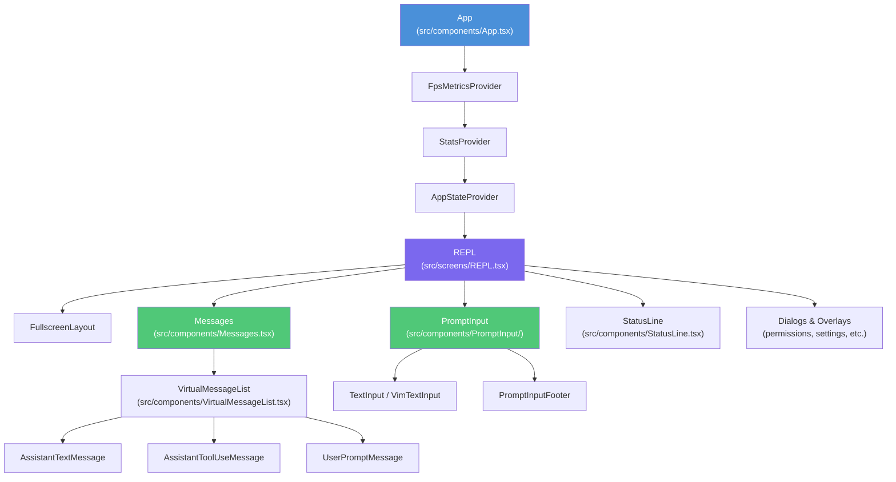
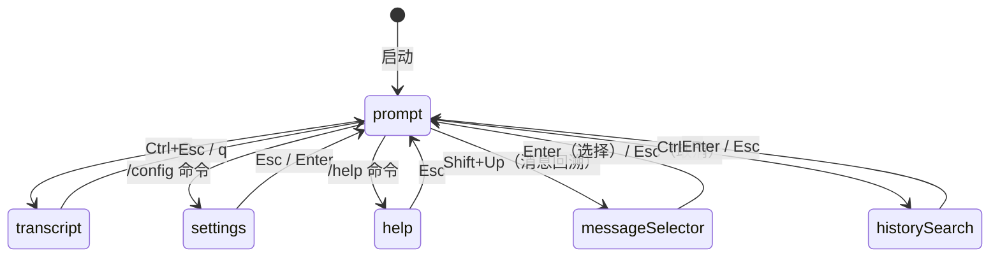
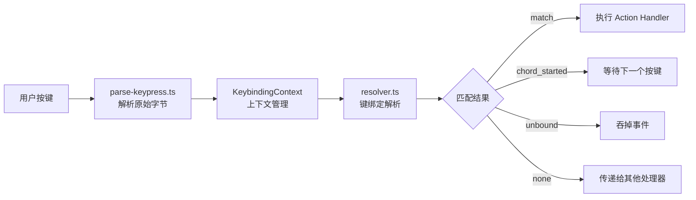
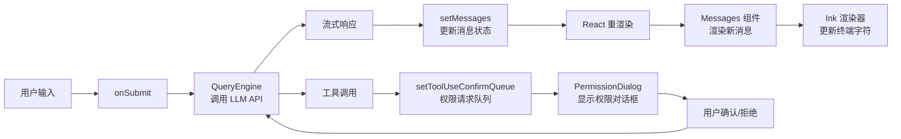

# 第 8 章 · UI 组件与终端渲染

Claude Code 的用户界面是一个运行在终端里的 React 应用。这听起来有些奇特——React 不是为浏览器设计的吗？本章将揭示这背后的魔法：一个名为 **Ink** 的框架如何将 React 的声明式编程模型带入终端世界，以及 113+ 个 UI 组件如何协同工作，构建出流畅的命令行交互体验。

## 终端 UI 的挑战

在浏览器中，React 将虚拟 DOM 映射到真实 DOM，浏览器负责像素级渲染。在终端里，没有 DOM，只有字符网格——每个单元格是一个字符加上颜色/样式属性。

终端 UI 面临的核心挑战：

- **布局系统**：终端没有 CSS，需要自己实现 Flexbox
- **渲染差异更新**：每帧只更新变化的字符，避免闪烁
- **输入处理**：键盘事件以原始字节序列到达，需要解析
- **终端兼容性**：不同终端对 ANSI 转义码的支持程度不同
- **尺寸感知**：终端窗口大小变化时需要重新布局

Claude Code 通过深度定制的 Ink 框架解决了这些问题。


## React + Ink 渲染架构

### 自定义 React 协调器

Ink 的核心是一个自定义 React 协调器（Reconciler），它替换了浏览器的 DOM 操作，转而操作内存中的虚拟终端节点树。

```typescript
// src/ink/reconciler.ts（节选）
// React 协调器的核心：diff 算法
const diff = (before: AnyObject, after: AnyObject): AnyObject | undefined => {
  // 比较前后两帧的属性差异
  // 只有变化的属性才会触发节点更新
}

// 应用属性到终端 DOM 节点
function applyProp(node: DOMElement, key: string, value: unknown): void {
  // 将 React props 映射到终端样式属性
  // 例如：color, backgroundColor, flexDirection 等
}
```

协调器的工作流程：

1. React 组件树发生变化时，协调器计算最小变更集
2. 变更被应用到内存中的 `DOMElement` 节点树
3. Yoga 布局引擎计算每个节点的位置和尺寸
4. 渲染器将节点树转换为字符网格（Screen Buffer）
5. 差异算法比较新旧两帧，生成 ANSI 转义序列
6. 转义序列写入终端标准输出

### Yoga 布局引擎

Ink 使用 Facebook 的 [Yoga](https://yogalayout.com/) 实现 Flexbox 布局，这与 React Native 的方案相同。

```typescript
// src/ink/layout/engine.ts
import { createYogaLayoutNode } from './yoga.js'

export function createLayoutNode(): LayoutNode {
  return createYogaLayoutNode()
  // 每个 Box 组件对应一个 Yoga 节点
  // Yoga 负责计算 flex 布局、padding、margin 等
}
```

`<Box>` 组件是布局的基础单元，等价于浏览器中的 `<div style="display: flex">`：

```tsx
// src/ink/components/Box.tsx（节选）
export type Props = Except<Styles, 'textWrap'> & {
  ref?: Ref<DOMElement>;
  tabIndex?: number;      // 参与 Tab 键焦点循环
  autoFocus?: boolean;    // 挂载时自动获取焦点
  onClick?: (event: ClickEvent) => void;   // 鼠标点击（仅 AlternateScreen）
  onFocus?: (event: FocusEvent) => void;
  onKeyDown?: (event: KeyboardEvent) => void;
  onMouseEnter?: () => void;
  onMouseLeave?: () => void;
};
// Box 是 Ink 的核心布局组件，等价于 <div style="display: flex">
```

### 渲染管线

```typescript
// src/ink/renderer.ts（节选）
export default function createRenderer(
  node: DOMElement,
  stylePool: StylePool,
): Renderer {
  let output: Output | undefined
  return options => {
    const { frontFrame, backFrame, isTTY, terminalWidth, terminalRows } = options

    // 1. 获取 Yoga 计算的布局尺寸
    const computedHeight = node.yogaNode?.getComputedHeight()
    const computedWidth = node.yogaNode?.getComputedWidth()

    // 2. 创建字符网格（Screen Buffer）
    const screen = backScreen ?? createScreen(width, height, stylePool, charPool, hyperlinkPool)

    // 3. 将节点树渲染到 Output 对象
    renderNodeToOutput(node, output, { prevScreen })

    // 4. 返回帧数据（包含光标位置、视口信息）
    return {
      screen: renderedScreen,
      viewport: { width: terminalWidth, height: terminalRows },
      cursor: { x: 0, y: screen.height, visible: !isTTY || screen.height === 0 },
    }
  }
}
```

### 与浏览器 React 的关键差异

| 特性 | 浏览器 React | Ink（终端 React） |
|------|-------------|-----------------|
| 渲染目标 | DOM 节点 | 字符网格 |
| 布局引擎 | CSS（浏览器内置） | Yoga（Flexbox 子集） |
| 事件系统 | DOM 事件 | 键盘/鼠标原始字节 |
| 样式系统 | CSS 全集 | 有限样式（颜色、边框、flex） |
| 字体渲染 | 矢量字体 | 等宽字符 |
| 动画 | CSS/JS 动画 | 帧差异更新 |
| 鼠标支持 | 完整支持 | 仅 AlternateScreen 模式 |


## UI 组件层次结构



### 根组件：App

`App` 组件是整个 UI 树的根，负责提供全局 Context：

```tsx
// src/components/App.tsx
export function App({ getFpsMetrics, stats, initialState, children }: Props) {
  return (
    <FpsMetricsProvider getFpsMetrics={getFpsMetrics}>
      <StatsProvider store={stats}>
        <AppStateProvider
          initialState={initialState}
          onChangeAppState={onChangeAppState}
        >
          {children}
        </AppStateProvider>
      </StatsProvider>
    </FpsMetricsProvider>
  )
}
```

三层 Provider 各司其职：
- `FpsMetricsProvider`：提供帧率监控数据
- `StatsProvider`：提供统计信息（Token 使用量等）
- `AppStateProvider`：提供全局应用状态（设置、工具权限、MCP 客户端等）

## UI 组件分类

Claude Code 的 113+ 个 UI 组件可以分为以下功能组：

### 1. 基础 Ink 组件（`src/ink/components/`）

这是最底层的 UI 原语，直接映射到终端渲染能力：

| 组件 | 作用 |
|------|------|
| `Box` | Flexbox 布局容器，等价于 `<div>` |
| `Text` | 文本渲染，支持颜色和样式 |
| `Newline` | 换行符 |
| `Spacer` | 弹性空白填充 |
| `ScrollBox` | 可滚动容器 |
| `AlternateScreen` | 切换到终端备用屏幕（全屏模式） |
| `Link` | 可点击超链接（支持 OSC 8 协议） |
| `Button` | 可交互按钮 |

### 2. 设计系统组件（`src/components/design-system/`）

构建在基础组件之上的可复用 UI 模式：

```tsx
// src/components/design-system/Dialog.tsx
// 对话框容器，提供统一的边框和布局
function Dialog({ title, children, footer }) {
  return (
    <Box flexDirection="column" borderStyle="round">
      <Box><Text bold>{title}</Text></Box>
      <Box>{children}</Box>
      {footer && <Box>{footer}</Box>}
    </Box>
  )
}
```

| 组件 | 作用 |
|------|------|
| `Dialog` | 模态对话框容器 |
| `FuzzyPicker` | 模糊搜索选择器 |
| `Tabs` | 标签页导航 |
| `ProgressBar` | 进度条 |
| `ThemedBox` / `ThemedText` | 主题感知的容器和文本 |
| `ThemeProvider` | 主题上下文提供者 |
| `StatusIcon` | 状态图标（成功/失败/加载中） |
| `Pane` | 面板容器 |
| `Divider` | 分隔线 |
| `KeyboardShortcutHint` | 键盘快捷键提示 |

### 3. 消息渲染组件（`src/components/messages/`）

负责渲染对话历史中的各类消息：

```tsx
// src/components/messages/AssistantTextMessage.tsx
// 渲染 AI 助手的文本回复，支持 Markdown 格式化
```

| 组件 | 渲染内容 |
|------|---------|
| `AssistantTextMessage` | AI 文本回复（含 Markdown） |
| `AssistantThinkingMessage` | AI 思考过程（扩展思考模式） |
| `AssistantToolUseMessage` | AI 工具调用请求 |
| `UserPromptMessage` | 用户输入的提示词 |
| `UserBashInputMessage` | 用户执行的 Bash 命令 |
| `UserBashOutputMessage` | Bash 命令输出 |
| `SystemTextMessage` | 系统通知消息 |
| `RateLimitMessage` | 速率限制提示 |
| `CompactBoundaryMessage` | 对话压缩边界标记 |
| `HookProgressMessage` | Hook 执行进度 |

### 4. 权限请求组件（`src/components/permissions/`）

当 AI 需要执行敏感操作时，这些组件负责向用户展示权限请求：

```
src/components/permissions/
├── BashPermissionRequest/      # Bash 命令执行权限
├── FileEditPermissionRequest/  # 文件编辑权限
├── FileWritePermissionRequest/ # 文件写入权限
├── WebFetchPermissionRequest/  # 网络请求权限
├── SkillPermissionRequest/     # 技能执行权限
├── ComputerUseApproval/        # 计算机控制权限
└── PermissionDialog.tsx        # 通用权限对话框
```

### 5. 输入组件（`src/components/PromptInput/`）

用户输入区域，是整个 UI 中最复杂的组件之一：

```
src/components/PromptInput/
├── PromptInput.tsx             # 主输入组件（2300+ 行）
├── PromptInputFooter.tsx       # 底部状态栏
├── PromptInputFooterSuggestions.tsx  # 命令补全建议
├── HistorySearchInput.tsx      # 历史搜索输入
├── ShimmeredInput.tsx          # 带闪光效果的输入框
├── VoiceIndicator.tsx          # 语音输入指示器
└── inputModes.ts               # 输入模式（prompt/bash/memory）
```

### 6. 加载动画组件（`src/components/Spinner/`）

AI 处理请求时的视觉反馈：

```tsx
// src/components/Spinner/SpinnerGlyph.tsx
// 旋转动画字符，使用帧动画实现
function SpinnerGlyph({ isAnimating }) {
  // 在 ⠋⠙⠹⠸⠼⠴⠦⠧⠇⠏ 等 Braille 字符间循环
}
```

| 组件 | 作用 |
|------|------|
| `SpinnerGlyph` | 旋转动画字符 |
| `SpinnerAnimationRow` | 带文字的动画行 |
| `GlimmerMessage` | 闪光文字效果 |
| `ShimmerChar` | 单字符闪光 |
| `TeammateSpinnerTree` | 多智能体协作进度树 |

### 7. MCP 管理组件（`src/components/mcp/`）

管理 MCP（Model Context Protocol）服务器连接：

| 组件 | 作用 |
|------|------|
| `MCPListPanel` | MCP 服务器列表面板 |
| `MCPSettings` | MCP 配置界面 |
| `MCPToolDetailView` | 工具详情视图 |
| `ElicitationDialog` | MCP 信息收集对话框 |
| `MCPReconnect` | 重连提示 |

### 8. 任务管理组件（`src/components/tasks/`）

管理后台运行的 AI 任务：

| 组件 | 作用 |
|------|------|
| `BackgroundTask` | 后台任务卡片 |
| `BackgroundTasksDialog` | 后台任务列表对话框 |
| `RemoteSessionProgress` | 远程会话进度 |
| `ShellProgress` | Shell 命令执行进度 |
| `AsyncAgentDetailDialog` | 异步智能体详情 |

### 9. 代码差异组件（`src/components/diff/`）

展示文件修改的差异视图：

| 组件 | 作用 |
|------|------|
| `DiffDialog` | 差异对话框 |
| `DiffFileList` | 修改文件列表 |
| `DiffDetailView` | 详细差异视图 |

### 10. 自定义选择器（`src/components/CustomSelect/`）

功能丰富的下拉选择组件：

```
src/components/CustomSelect/
├── select.tsx              # 单选组件
├── SelectMulti.tsx         # 多选组件
├── select-input-option.tsx # 带输入的选项
├── use-select-state.ts     # 选择状态管理
├── use-select-navigation.ts # 键盘导航
└── use-multi-select-state.ts # 多选状态管理
```


## 自定义 Hooks 系统

Claude Code 的 `src/hooks/` 目录包含 80+ 个自定义 Hooks，将复杂的业务逻辑从组件中分离出来。以下是 10 个最关键的 Hooks：

### 1. `useTextInput` — 文本输入基础

```typescript
// src/hooks/useTextInput.ts
function useTextInput({
  value,
  onChange,
  columns,
  onSubmit,
  inputFilter,
}: UseTextInputProps): TextInputState {
  // 管理光标位置、文本选择、键盘事件
  // 支持多行输入、光标移动、文本删除
  // 是 useVimInput 的基础
}
```

这是所有文本输入的基础 Hook，处理光标移动、文本编辑、键盘事件映射等底层逻辑。

### 2. `useVimInput` — Vim 模式输入

```typescript
// src/hooks/useVimInput.ts
export function useVimInput(props: UseVimInputProps): VimInputState {
  const vimStateRef = React.useRef<VimState>(createInitialVimState())
  const [mode, setMode] = useState<VimMode>('INSERT')
  const persistentRef = React.useRef<PersistentState>(createInitialPersistentState())

  // 在 INSERT 和 NORMAL 模式间切换
  // NORMAL 模式：解析 vim 命令（d/c/y 操作符、w/b/e 移动等）
  // INSERT 模式：记录输入文本用于 dot-repeat（. 命令）

  function handleVimInput(rawInput: string, key: Key): void {
    const state = vimStateRef.current
    if (key.escape && state.mode === 'INSERT') {
      switchToNormalMode()  // Esc 切换到 NORMAL 模式
      return
    }
    if (state.mode === 'NORMAL') {
      // 解析 vim 命令序列
      const result = transition(state.command, vimInput, ctx)
      if (result.execute) result.execute()
    }
  }
}
```

### 3. `useHistorySearch` — 历史命令搜索

```typescript
// src/hooks/useHistorySearch.ts
export function useHistorySearch(
  onAcceptHistory: (entry: HistoryEntry) => void,
  currentInput: string,
  // ...
): { historyQuery, historyMatch, historyFailedMatch, handleKeyDown } {
  // Ctrl+R 触发历史搜索模式
  // 实时搜索历史记录文件（异步流式读取）
  // 支持 Ctrl+R 继续搜索下一个匹配
  // Esc 取消并恢复原始输入
}
```

### 4. `useVirtualScroll` — 虚拟滚动

```typescript
// src/hooks/useVirtualScroll.ts
function useVirtualScroll(
  items: readonly T[],
  options: VirtualScrollOptions,
): VirtualScrollResult {
  // 只渲染视口内可见的消息
  // 对于长对话（数百条消息），避免全量渲染
  // 支持动态高度估算和精确测量
}
```

这是性能优化的关键 Hook。当对话历史很长时，不渲染所有消息，只渲染当前视口内可见的部分。

### 5. `useInputBuffer` — 输入撤销缓冲

```typescript
// src/hooks/useInputBuffer.ts
export function useInputBuffer({ maxBufferSize, debounceMs }): UseInputBufferResult {
  // 维护输入历史缓冲区，支持 Ctrl+Z 撤销
  // 防抖：快速连续输入合并为一个缓冲条目
  // 限制缓冲区大小，避免内存泄漏

  const pushToBuffer = (text, cursorOffset, pastedContents) => {
    // 去重：与上一条相同则不添加
    // 截断：超出 maxBufferSize 时删除最旧条目
  }

  const undo = (): BufferEntry | undefined => {
    // 返回上一个缓冲条目，更新当前索引
  }
}
```

### 6. `useGlobalKeybindings` — 全局键绑定

```tsx
// src/hooks/useGlobalKeybindings.tsx
function GlobalKeybindingHandlers({ ... }) {
  // 注册全局键绑定处理器
  // Ctrl+C：中断当前请求
  // Ctrl+D：退出应用
  // Ctrl+L：重绘终端
  // Ctrl+T：切换任务列表
  // Ctrl+O：切换对话记录
}
```

### 7. `useCommandKeybindings` — 命令键绑定

```tsx
// src/hooks/useCommandKeybindings.tsx
function CommandKeybindingHandlers({ commands, onSubmit }) {
  // 将斜杠命令绑定到键盘快捷键
  // 例如：/compact → Ctrl+X Ctrl+K
  // 支持用户自定义绑定（keybindings.json）
}
```

### 8. `useTerminalSize` — 终端尺寸感知

```typescript
// src/hooks/useTerminalSize.ts
export function useTerminalSize(): TerminalSize {
  const size = useContext(TerminalSizeContext)
  // 返回 { columns, rows }
  // 终端窗口大小变化时自动更新
  // 组件可据此调整布局（如截断长文本）
}
```

### 9. `useMainLoopModel` — 模型选择

```typescript
// src/hooks/useMainLoopModel.ts
export function useMainLoopModel(): ModelName {
  const mainLoopModel = useAppState(s => s.mainLoopModel)
  // 订阅 GrowthBook 特性标志刷新
  // 解析用户指定的模型名称（支持别名）
  // 确保 /model 命令和 API 调用使用同一个模型
}
```

### 10. `useReplBridge` — IDE 桥接集成

```typescript
// src/hooks/useReplBridge.tsx
function useReplBridge(
  messages: Message[],
  setMessages: ...,
  abortControllerRef: ...,
  commands: readonly Command[],
  mainLoopModel: string,
): { sendBridgeResult, ... } {
  // 连接 IDE 扩展与 REPL 的双向通信
  // 接收来自 IDE 的提示词注入
  // 向 IDE 发送对话状态更新
  // 处理 IDE 发起的中断请求
}
```

### 通知系统 Hooks（`src/hooks/notifs/`）

这组 Hooks 专门负责向用户展示各类通知：

| Hook | 触发条件 |
|------|---------|
| `useRateLimitWarningNotification` | API 速率限制接近时 |
| `useMcpConnectivityStatus` | MCP 服务器连接状态变化 |
| `useIDEStatusIndicator` | IDE 扩展连接状态变化 |
| `useDeprecationWarningNotification` | 使用了即将废弃的模型 |
| `useInstallMessages` | 插件安装完成 |
| `useLspInitializationNotification` | LSP 服务器初始化 |
| `useStartupNotification` | 应用启动时的提示 |


## 屏幕系统与导航模式

Claude Code 有三个主要屏幕，通过 `src/screens/` 目录管理：

```
src/screens/
├── REPL.tsx              # 主交互屏幕（核心）
├── Doctor.tsx            # 诊断屏幕（/doctor 命令）
└── ResumeConversation.tsx # 恢复对话屏幕（/resume 命令）
```

### 主屏幕：REPL

`REPL.tsx` 是整个应用的核心屏幕，包含了几乎所有的交互逻辑。它通过内部状态 `screen` 管理子视图切换：

```tsx
// src/screens/REPL.tsx（节选）
function REPL({ commands, initialMessages, ... }: Props) {
  // 子视图状态
  const [screen, setScreen] = useState<Screen>('prompt')
  // Screen 类型包括：
  // 'prompt'     - 正常对话模式
  // 'transcript' - 查看完整对话记录
  // 'settings'   - 设置面板
  // 'help'       - 帮助界面

  // 全局状态订阅
  const toolPermissionContext = useAppState(s => s.toolPermissionContext)
  const mainLoopModel = useMainLoopModel()

  // 通知系统初始化
  useModelMigrationNotifications()
  useMcpConnectivityStatus({ mcpClients })
  useRateLimitWarningNotification(mainLoopModel)
  // ... 更多通知 hooks

  // 消息状态管理
  const [messages, rawSetMessages] = useState<MessageType[]>(initialMessages ?? [])

  // 查询守卫（防止并发请求）
  const queryGuard = React.useRef(new QueryGuard()).current
  const isQueryActive = React.useSyncExternalStore(
    queryGuard.subscribe,
    queryGuard.getSnapshot
  )
}
```

### 屏幕切换机制

REPL 内部的屏幕切换通过条件渲染实现，而不是路由跳转：



### 全屏布局模式

当终端支持时，REPL 会切换到全屏（AlternateScreen）模式，提供更好的滚动体验：

```tsx
// src/ink/components/AlternateScreen.tsx
// 切换到终端备用屏幕缓冲区
// 优点：不污染终端滚动历史，支持鼠标事件
// 缺点：退出后内容消失（需要 Ctrl+O 查看记录）
```

### Doctor 屏幕

`Doctor.tsx` 是诊断屏幕，通过 `/doctor` 命令触发，检查系统配置、API 连接、MCP 服务器状态等。

### ResumeConversation 屏幕

`ResumeConversation.tsx` 在 `/resume` 命令时显示，列出历史会话供用户选择恢复。

## 键绑定系统

`src/keybindings/` 实现了一个完整的、可配置的键绑定系统，支持上下文感知和和弦序列（chord sequences）。

### 架构设计



### 上下文系统

键绑定按上下文分组，不同上下文的相同按键可以有不同的行为：

```typescript
// src/keybindings/schema.ts
export const KEYBINDING_CONTEXTS = [
  'Global',        // 全局，任何时候都生效
  'Chat',          // 聊天输入框获得焦点时
  'Autocomplete',  // 自动补全菜单显示时
  'Confirmation',  // 确认/权限对话框显示时
  'Transcript',    // 查看对话记录时
  'HistorySearch', // Ctrl+R 历史搜索时
  'Settings',      // 设置面板打开时
  'Select',        // 选择列表获得焦点时
  'DiffDialog',    // 差异对话框打开时
  'MessageSelector', // 消息回溯选择器打开时
  // ...
] as const
```

### 默认键绑定

```typescript
// src/keybindings/defaultBindings.ts（节选）
export const DEFAULT_BINDINGS: KeybindingBlock[] = [
  {
    context: 'Global',
    bindings: {
      'ctrl+c': 'app:interrupt',   // 中断当前请求
      'ctrl+d': 'app:exit',        // 退出应用
      'ctrl+l': 'app:redraw',      // 重绘终端
      'ctrl+t': 'app:toggleTodos', // 切换任务列表
      'ctrl+o': 'app:toggleTranscript', // 切换对话记录
      'ctrl+r': 'history:search',  // 历史搜索
    },
  },
  {
    context: 'Chat',
    bindings: {
      'escape': 'chat:cancel',     // 取消当前输入
      'shift+tab': 'chat:cycleMode', // 循环切换权限模式
      'meta+p': 'chat:modelPicker', // 打开模型选择器
      'meta+t': 'chat:thinkingToggle', // 切换思考模式
      'enter': 'chat:submit',      // 提交输入
      'up': 'history:previous',    // 上一条历史
      'down': 'history:next',      // 下一条历史
      'ctrl+_': 'chat:undo',       // 撤销
      'ctrl+s': 'chat:stash',      // 暂存当前输入
    },
  },
  {
    context: 'Select',
    bindings: {
      'up': 'select:previous',
      'down': 'select:next',
      'j': 'select:next',          // Vim 风格导航
      'k': 'select:previous',
      'enter': 'select:accept',
      'escape': 'select:cancel',
    },
  },
]
```

### 和弦序列支持

系统支持多键序列（如 Emacs 风格的 `Ctrl+X Ctrl+K`）：

```typescript
// src/keybindings/resolver.ts
export function resolveKeyWithChordState(
  input: string,
  key: Key,
  activeContexts: KeybindingContextName[],
  bindings: ParsedBinding[],
  pending: ParsedKeystroke[] | null,  // 当前和弦状态
): ChordResolveResult {
  // 构建当前按键序列
  const testChord = pending ? [...pending, currentKeystroke] : [currentKeystroke]

  // 检查是否有更长的和弦等待匹配
  if (hasLongerChords) {
    return { type: 'chord_started', pending: testChord }
    // 继续等待下一个按键
  }

  // 精确匹配
  if (exactMatch) {
    return { type: 'match', action: exactMatch.action }
  }
}
```

### 用户自定义键绑定

用户可以通过 `~/.claude/keybindings.json` 覆盖默认绑定：

```json
{
  "$schema": "...",
  "bindings": [
    {
      "context": "Chat",
      "bindings": {
        "ctrl+enter": "chat:submit",
        "enter": "chat:newline"
      }
    }
  ]
}
```

### `useKeybinding` Hook

组件通过 `useKeybinding` Hook 注册键绑定处理器：

```typescript
// src/keybindings/useKeybinding.ts
export function useKeybinding(
  action: string,
  handler: () => void | false | Promise<void>,
  options: { context?: KeybindingContextName; isActive?: boolean } = {},
): void {
  // 注册 handler 到 KeybindingContext
  // 监听键盘输入，匹配时调用 handler
  // 使用 stopImmediatePropagation() 防止事件冒泡

  // 示例用法：
  // useKeybinding('app:toggleTodos', () => setShowTodos(prev => !prev))
  // useKeybinding('chat:submit', handleSubmit, { context: 'Chat' })
}
```


## Vim 模式实现

`src/vim/` 目录实现了一个完整的 Vim 编辑模式，让习惯 Vim 的用户可以用熟悉的方式编辑输入。

### 状态机设计

Vim 模式的核心是一个精心设计的状态机，类型定义即文档：

```typescript
// src/vim/types.ts
/**
 * Vim Mode State Machine Types
 *
 * State Diagram:
 *                              VimState
 *   ┌──────────────────────────────┬──────────────────────────────────────┐
 *   │  INSERT                      │  NORMAL                              │
 *   │  (tracks insertedText)       │  (CommandState machine)              │
 *   │                              │                                      │
 *   │                              │  idle ──┬─[d/c/y]──► operator        │
 *   │                              │         ├─[1-9]────► count           │
 *   │                              │         ├─[fFtT]───► find            │
 *   │                              │         ├─[g]──────► g               │
 *   │                              │         └─[r]──────► replace         │
 *   └──────────────────────────────┴──────────────────────────────────────┘
 */
export type VimState =
  | { mode: 'INSERT'; insertedText: string }
  | { mode: 'NORMAL'; command: CommandState }

export type CommandState =
  | { type: 'idle' }
  | { type: 'count'; digits: string }           // 数字前缀（如 3w）
  | { type: 'operator'; op: Operator; count: number }  // d/c/y 等待动作
  | { type: 'find'; find: FindType; count: number }    // f/F/t/T 等待字符
  | { type: 'replace'; count: number }                 // r 等待替换字符
```

### 支持的 Vim 操作

**移动命令（Motions）：**
- `h/l/j/k` — 基本方向移动
- `w/b/e/W/B/E` — 单词移动
- `0/^/$` — 行首/行尾
- `f/F/t/T` — 字符查找

**操作符（Operators）：**
- `d` — 删除（delete）
- `c` — 修改（change，删除后进入 INSERT）
- `y` — 复制（yank）

**文本对象（Text Objects）：**
- `iw/aw` — 内部/外部单词
- `i"/a"` — 引号内/外
- `i(/a(` — 括号内/外

**其他命令：**
- `.` — 重复上一次修改（dot-repeat）
- `r` — 替换单个字符
- `u` — 撤销（委托给 `useInputBuffer`）
- `x` — 删除光标处字符
- `o/O` — 在下方/上方新建行

### 状态转换

```typescript
// src/vim/transitions.ts
export function transition(
  state: CommandState,
  input: string,
  ctx: TransitionContext,
): TransitionResult {
  switch (state.type) {
    case 'idle':
      return fromIdle(input, ctx)
      // 'd' → { type: 'operator', op: 'delete', count: 1 }
      // '3' → { type: 'count', digits: '3' }
      // 'w' → 执行 word-forward 移动

    case 'operator':
      return fromOperator(state, input, ctx)
      // 'd' + 'w' → 执行 delete-word
      // 'd' + 'd' → 执行 delete-line
      // 'd' + 'i' → { type: 'operatorTextObj', ... }
  }
}
```

### Dot-Repeat 实现

Vim 的 `.` 命令可以重复上一次修改，这需要记录每次操作的完整信息：

```typescript
// src/vim/types.ts
export type RecordedChange =
  | { type: 'insert'; text: string }           // 记录插入的文本
  | { type: 'operator'; op: Operator; motion: string; count: number }
  | { type: 'replace'; char: string; count: number }
  | { type: 'x'; count: number }
  // ...

// src/hooks/useVimInput.ts
function replayLastChange(): void {
  const change = persistentRef.current.lastChange
  if (!change) return
  // 根据 change.type 重新执行对应操作
}
```

## UI 与底层系统的交互

### 数据驱动 UI 更新

Claude Code 的 UI 完全由状态驱动，状态变化自动触发重渲染：



### AppState 作为单一数据源

所有 UI 组件通过 `useAppState` Hook 订阅全局状态：

```typescript
// 组件只订阅自己需要的状态切片
const toolPermissionContext = useAppState(s => s.toolPermissionContext)
const verbose = useAppState(s => s.verbose)
const mcp = useAppState(s => s.mcp)

// 状态更新通过 setAppState 进行
const setAppState = useSetAppState()
setAppState(prev => ({ ...prev, verbose: true }))
```

### 命令系统与 UI 的集成

斜杠命令可以返回 JSX，直接在 UI 中渲染：

```typescript
// 命令可以返回 React 组件作为输出
// src/commands/config/config.tsx
export const configCommand: Command = {
  name: 'config',
  handler: async ({ setToolJSX }) => {
    setToolJSX({
      jsx: <Settings onClose={() => setToolJSX(null)} />,
      shouldHidePromptInput: true,
    })
  }
}
```

这种设计让命令系统和 UI 系统无缝集成：命令不仅可以执行逻辑，还可以直接渲染交互式 UI 组件。

### 流式渲染优化

为了在 AI 流式输出时保持 UI 响应，Claude Code 使用了多种优化技术：

```tsx
// src/screens/REPL.tsx（节选）
// 1. useDeferredValue：以过渡优先级渲染消息，保持输入响应
const deferredMessages = useDeferredValue(messages)

// 2. 流式文本预览：在消息完成前显示部分内容
const [streamingText, setStreamingText] = useState<string | null>(null)
// 只显示到最后一个换行符，避免字符级闪烁
const visibleStreamingText = streamingText
  ? streamingText.substring(0, streamingText.lastIndexOf('\n') + 1) || null
  : null

// 3. React Compiler 优化：自动记忆化组件
// App.tsx 中可以看到编译器生成的 _c() 调用
const $ = _c(9)  // React Compiler 的缓存数组
```

## 终端特性适配

### ANSI 转义码处理

```typescript
// src/ink/termio/ansi.ts
// 处理各种 ANSI 转义序列：
// - SGR（Select Graphic Rendition）：颜色和样式
// - CSI（Control Sequence Introducer）：光标移动
// - OSC（Operating System Command）：超链接、标题
// - DEC（DEC Private Mode）：鼠标追踪、备用屏幕
```

### 双向文本支持

```typescript
// src/ink/bidi.ts
// 支持从右到左（RTL）的文本渲染
// 处理阿拉伯语、希伯来语等 RTL 语言
```

### 终端宽度感知

```typescript
// src/ink/stringWidth.ts
// 计算字符串的显示宽度
// 处理全角字符（CJK）占两列的情况
// 处理零宽字符（组合字符）
// 这对于中文等东亚语言的正确对齐至关重要
```

## 小结

Claude Code 的 UI 系统展示了一种优雅的架构：

1. **React 的声明式模型**在终端环境中同样适用，通过自定义协调器实现
2. **Yoga 布局引擎**将 Flexbox 带入终端，让布局代码与 Web 开发高度相似
3. **113+ 个组件**按功能分层组织，从基础原语到业务组件清晰分离
4. **80+ 个自定义 Hooks**将复杂逻辑封装为可复用单元
5. **键绑定系统**支持上下文感知和和弦序列，高度可配置
6. **Vim 模式**通过精心设计的状态机实现，支持 dot-repeat 等高级特性
7. **数据驱动**的 UI 更新模式确保状态与视图始终同步

对于想要构建终端 UI 应用的开发者，这套架构提供了一个很好的参考：React 的组件化思想不局限于浏览器，只要有合适的渲染后端，它可以在任何环境中发挥作用。

:::tip 延伸阅读
- 权限系统如何与 UI 集成，请参阅[第 9 章：权限与安全系统](./09-permission-and-security)
- 状态管理的完整实现，请参阅[第 13 章：状态管理与数据持久化](./13-state-and-persistence)
- 命令系统如何触发 UI 渲染，请参阅[第 4 章：命令系统](./04-command-system)
:::
