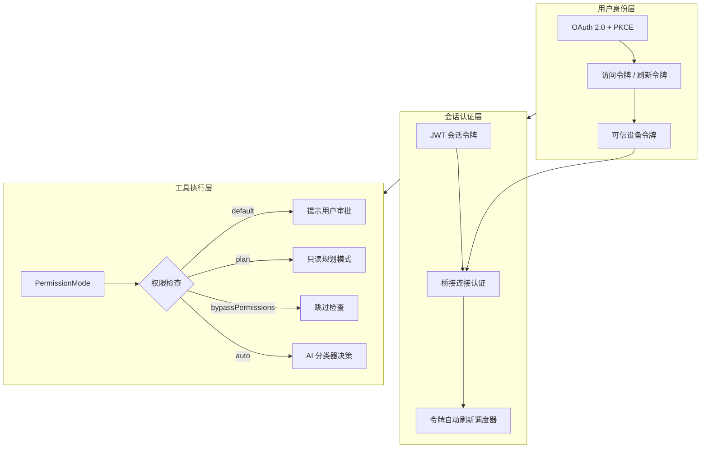
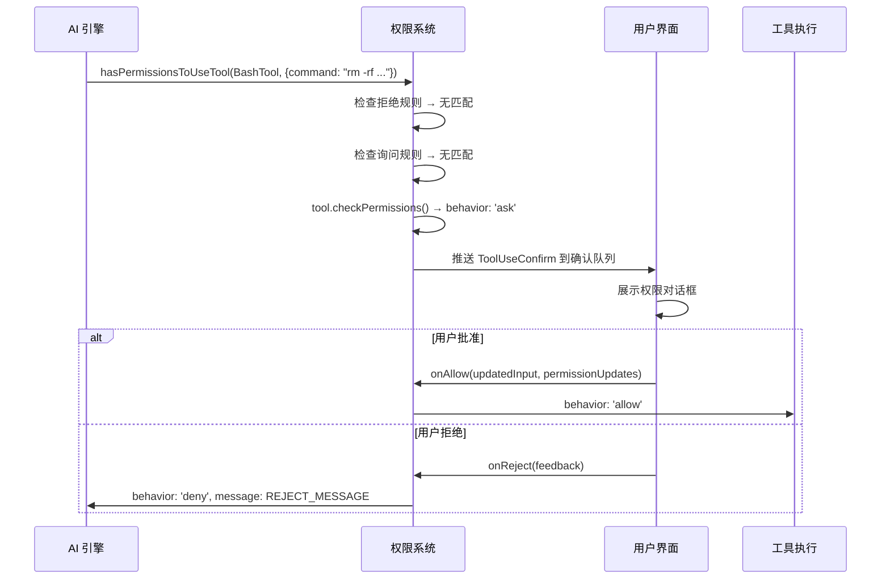
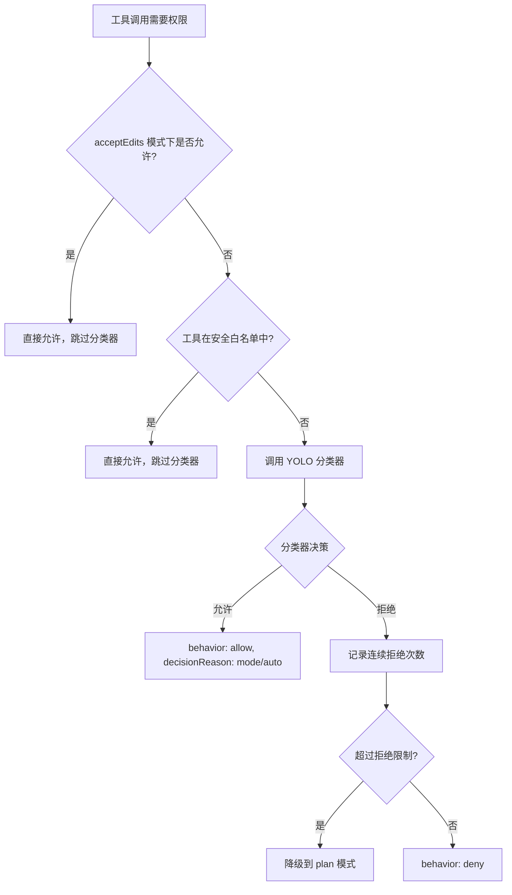
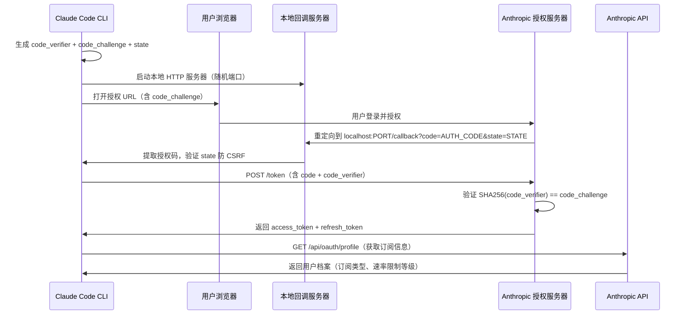
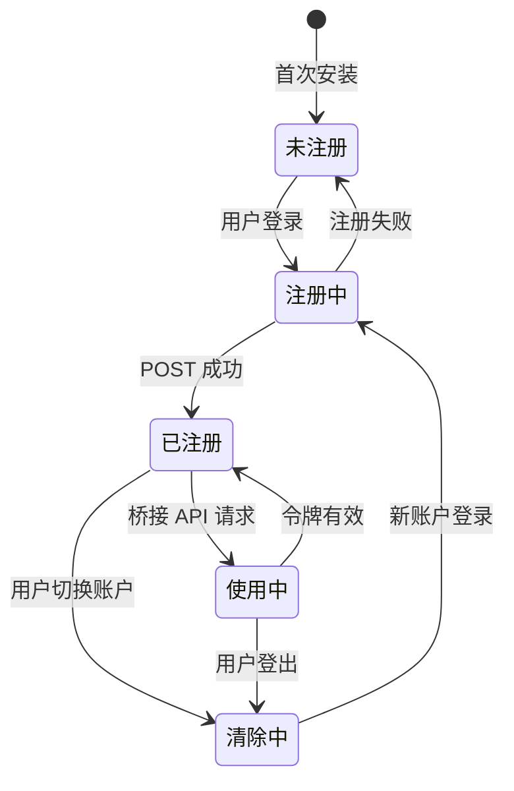
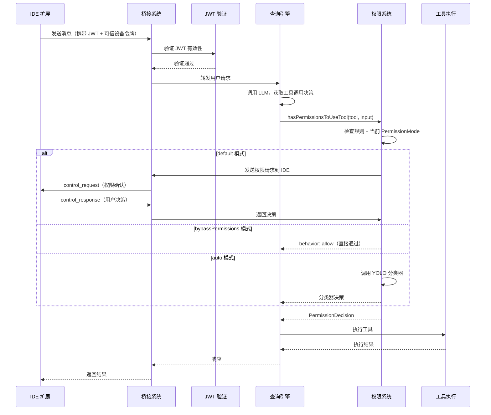

# 第 9 章 · 权限与安全系统

Claude Code 是一个能够执行 shell 命令、读写文件、调用外部 API 的智能体系统。这种能力带来了巨大的安全挑战：如何确保 AI 不会执行危险操作？如何验证连接来源的合法性？如何在自动化与安全之间取得平衡？

本章将深入剖析 Claude Code 的多层安全架构，从工具执行前的权限检查，到 IDE 桥接连接的 JWT 认证，再到 OAuth 2.0 用户身份验证，以及可信设备机制——这些安全层共同构成了一个纵深防御体系。

## 术语表

| 术语 | 含义 |
|------|------|
| **PermissionMode** | 权限模式，决定工具调用时的审批策略 |
| **ToolPermissionContext** | 工具权限上下文，包含当前模式和规则集 |
| **PKCE** | Proof Key for Code Exchange，OAuth 2.0 安全扩展 |
| **JWT** | JSON Web Token，用于桥接会话认证 |
| **可信设备令牌** | 持久化设备身份凭证，用于提升桥接会话安全级别 |
| **bypassPermissions** | 绕过权限模式，跳过所有非强制性权限检查 |
| **auto 模式** | 自动模式，使用 AI 分类器替代人工审批 |

## 安全架构全景

Claude Code 的安全体系分为三个层次：



## 工具权限检查系统

### 权限检查的核心入口

每次 AI 调用工具前，系统都会执行 `hasPermissionsToUseTool` 函数。这是整个权限系统的核心入口，位于 `src/utils/permissions/permissions.ts`：

```typescript title="src/utils/permissions/permissions.ts" showLineNumbers
export const hasPermissionsToUseTool: CanUseToolFn = async (
  tool,
  input,
  context,
  assistantMessage,
  toolUseID,
): Promise<PermissionDecision> => {
  const result = await hasPermissionsToUseToolInner(tool, input, context)
  // ...后续处理 dontAsk / auto 模式转换
}
```

内部函数 `hasPermissionsToUseToolInner` 按优先级依次检查：

1. **拒绝规则**：工具是否在黑名单中？
2. **强制询问规则**：工具是否被配置为始终询问？
3. **工具自身的权限检查**：调用 `tool.checkPermissions()`
4. **模式判断**：根据当前 `PermissionMode` 决定最终行为

### 四种权限模式详解

权限模式定义在 `src/types/permissions.ts` 中：

```typescript title="src/types/permissions.ts" showLineNumbers
export const EXTERNAL_PERMISSION_MODES = [
  'acceptEdits',
  'bypassPermissions',
  'default',
  'dontAsk',
  'plan',
] as const

// auto 模式是内部模式，仅对 Anthropic 内部用户开放
export const INTERNAL_PERMISSION_MODES = [
  ...EXTERNAL_PERMISSION_MODES,
  ...(feature('TRANSCRIPT_CLASSIFIER') ? (['auto'] as const) : ([] as const)),
] as const
```


#### 模式一：default（默认模式）

这是最常见的工作模式。每次 AI 想要执行可能有副作用的操作（如运行 shell 命令、修改文件），系统都会暂停并向用户展示一个确认对话框。

**工作流程：**



用户可以选择"仅此一次"或"永久允许"，后者会将规则持久化到配置文件。

#### 模式二：plan（规划模式）

Plan 模式是一种"只读规划"状态。在此模式下，AI 只能执行读取操作（如查看文件、搜索代码），不能执行写入或执行操作。这让用户可以先看到 AI 的完整计划，再决定是否授权执行。

`src/utils/permissions/PermissionMode.ts` 中的配置：

```typescript title="src/utils/permissions/PermissionMode.ts" showLineNumbers
plan: {
  title: 'Plan Mode',
  shortTitle: 'Plan',
  symbol: PAUSE_ICON,  // ⏸ 暂停图标
  color: 'planMode',
  external: 'plan',
},
```

Plan 模式有一个特殊机制：如果用户最初以 `bypassPermissions` 模式启动，切换到 plan 模式后，`isBypassPermissionsModeAvailable` 标志会被保留。这意味着从 plan 模式退出时，可以恢复到 bypass 模式：

```typescript title="src/utils/permissions/permissions.ts" showLineNumbers
// 检查是否应该绕过权限：
// - 直接 bypassPermissions 模式
// - plan 模式且原本是 bypass 模式（isBypassPermissionsModeAvailable）
const shouldBypassPermissions =
  appState.toolPermissionContext.mode === 'bypassPermissions' ||
  (appState.toolPermissionContext.mode === 'plan' &&
    appState.toolPermissionContext.isBypassPermissionsModeAvailable)
```

#### 模式三：bypassPermissions（绕过权限模式）

这是最"危险"也最高效的模式，专为完全自动化场景设计（如 CI/CD 流水线）。在此模式下，系统跳过所有非强制性权限检查，工具调用直接执行。

**但有三类检查是 bypass 免疫的，无论何种模式都必须执行：**

```typescript title="src/utils/permissions/permissions.ts" showLineNumbers
// 1. 工具实现明确拒绝（behavior: 'deny'）
if (toolPermissionResult?.behavior === 'deny') {
  return toolPermissionResult
}

// 2. 工具需要用户交互（如 ExitPlanMode、AskUserQuestion）
if (tool.requiresUserInteraction?.() && toolPermissionResult?.behavior === 'ask') {
  return toolPermissionResult
}

// 3. 内容级别的 ask 规则（用户明确配置的询问规则）
if (
  toolPermissionResult?.behavior === 'ask' &&
  toolPermissionResult.decisionReason?.type === 'rule' &&
  toolPermissionResult.decisionReason.rule.ruleBehavior === 'ask'
) {
  return toolPermissionResult
}

// 4. 安全检查（.git/、.claude/、shell 配置文件等敏感路径）
if (
  toolPermissionResult?.behavior === 'ask' &&
  toolPermissionResult.decisionReason?.type === 'safetyCheck'
) {
  return toolPermissionResult
}
```

这种设计体现了"最小权限原则"：即使在最宽松的模式下，系统仍然保留了对敏感操作的最后防线。

#### 模式四：auto（自动模式）

Auto 模式是最智能也最复杂的模式，它使用 AI 分类器（YOLO Classifier）来替代人工审批决策。这是 Anthropic 内部功能（通过 `TRANSCRIPT_CLASSIFIER` 特性标志控制）。

**决策流程（三级快速路径）：**



分类器通过分析对话历史和工具调用上下文来判断操作是否安全，避免了不必要的用户打扰，同时保持了安全性。

### 权限上下文（ToolPermissionContext）

所有权限检查都依赖 `ToolPermissionContext`，它是权限系统的"状态快照"：

```typescript title="src/types/permissions.ts" showLineNumbers
export type ToolPermissionContext = {
  readonly mode: PermissionMode           // 当前权限模式
  readonly additionalWorkingDirectories: ReadonlyMap<string, AdditionalWorkingDirectory>
  readonly alwaysAllowRules: ToolPermissionRulesBySource  // 永久允许规则
  readonly alwaysDenyRules: ToolPermissionRulesBySource   // 永久拒绝规则
  readonly alwaysAskRules: ToolPermissionRulesBySource    // 永久询问规则
  readonly isBypassPermissionsModeAvailable: boolean
  readonly shouldAvoidPermissionPrompts?: boolean  // 无头模式标志
  readonly awaitAutomatedChecksBeforeDialog?: boolean
}
```

### 多场景权限处理器

权限系统针对不同运行场景提供了专门的处理器，位于 `src/hooks/toolPermission/handlers/`：

**交互式处理器（interactiveHandler.ts）**：主智能体的标准处理器，支持多路竞争——本地用户操作、桥接远程响应（claude.ai）、频道响应（Telegram/iMessage）、Hook 自动审批、Bash 分类器，任何一路先响应即生效。

**协调器处理器（coordinatorHandler.ts）**：协调器工作节点的处理器，先顺序执行 Hook 和分类器，若均未决策则回退到交互式对话框：

```typescript title="src/hooks/toolPermission/handlers/coordinatorHandler.ts" showLineNumbers
async function handleCoordinatorPermission(params): Promise<PermissionDecision | null> {
  // 1. 先尝试 Hook（快速，本地）
  const hookResult = await ctx.runHooks(permissionMode, suggestions, updatedInput)
  if (hookResult) return hookResult

  // 2. 再尝试分类器（慢，需要推理）
  const classifierResult = await ctx.tryClassifier?.(pendingClassifierCheck, updatedInput)
  if (classifierResult) return classifierResult

  // 3. 均未决策，回退到交互式对话框
  return null
}
```

**Swarm 工作节点处理器（swarmWorkerHandler.ts）**：多智能体 Swarm 架构中，子节点无法直接展示 UI，因此通过邮箱机制将权限请求转发给 Leader 节点处理：

```typescript title="src/hooks/toolPermission/handlers/swarmWorkerHandler.ts" showLineNumbers
// 注册回调 BEFORE 发送请求，避免竞态条件
registerPermissionCallback({
  requestId: request.id,
  toolUseId: ctx.toolUseID,
  async onAllow(allowedInput, permissionUpdates, feedback) { /* ... */ },
  onReject(feedback) { /* ... */ },
})

// 发送请求到 Leader
void sendPermissionRequestViaMailbox(request)
```


## OAuth 2.0 认证流程

Claude Code 使用 OAuth 2.0 授权码流程（带 PKCE 扩展）来验证用户身份。整个实现位于 `src/services/oauth/` 目录。

### PKCE：防止授权码拦截攻击

PKCE（Proof Key for Code Exchange）是 OAuth 2.0 的安全扩展，专门防止授权码被中间人拦截后滥用。`src/services/oauth/crypto.ts` 实现了 PKCE 所需的密码学操作：

```typescript title="src/services/oauth/crypto.ts" showLineNumbers
import { createHash, randomBytes } from 'crypto'

function base64URLEncode(buffer: Buffer): string {
  return buffer
    .toString('base64')
    .replace(/\+/g, '-')
    .replace(/\//g, '_')
    .replace(/=/g, '')
}

// 生成 32 字节随机 code_verifier
export function generateCodeVerifier(): string {
  return base64URLEncode(randomBytes(32))
}

// code_challenge = BASE64URL(SHA256(code_verifier))
export function generateCodeChallenge(verifier: string): string {
  const hash = createHash('sha256')
  hash.update(verifier)
  return base64URLEncode(hash.digest())
}

// 防 CSRF 的随机 state 参数
export function generateState(): string {
  return base64URLEncode(randomBytes(32))
}
```

**PKCE 工作原理**：客户端生成随机 `code_verifier`，计算其 SHA-256 哈希作为 `code_challenge` 发送给授权服务器。授权码交换时，客户端发送原始 `code_verifier`，服务器验证其哈希是否匹配。即使授权码被拦截，攻击者也无法在没有 `code_verifier` 的情况下换取令牌。

### 完整 OAuth 流程

`src/services/oauth/index.ts` 中的 `OAuthService` 类封装了完整的认证流程：



**双流程支持**：系统同时支持自动流程（浏览器重定向到本地服务器）和手动流程（用户手动复制粘贴授权码），两者竞争，先到者生效：

```typescript title="src/services/oauth/index.ts" showLineNumbers
// 同时启动自动流程和手动流程，任一先完成即可
const authorizationCode = await this.waitForAuthorizationCode(
  state,
  async () => {
    await authURLHandler(manualFlowUrl)  // 展示手动选项给用户
    await openBrowser(automaticFlowUrl)  // 尝试自动流程
  },
)
```

### 授权码监听器

`src/services/oauth/auth-code-listener.ts` 实现了一个临时的本地 HTTP 服务器，专门用于捕获 OAuth 回调：

```typescript title="src/services/oauth/auth-code-listener.ts" showLineNumbers
export class AuthCodeListener {
  private validateAndRespond(authCode, state, res): void {
    if (!authCode) {
      res.writeHead(400)
      res.end('Authorization code not found')
      this.reject(new Error('No authorization code received'))
      return
    }

    // 验证 state 参数，防止 CSRF 攻击
    if (state !== this.expectedState) {
      res.writeHead(400)
      res.end('Invalid state parameter')
      this.reject(new Error('Invalid state parameter'))
      return
    }

    // 保存响应对象，用于后续重定向到成功页面
    this.pendingResponse = res
    this.resolve(authCode)
  }
}
```

### 令牌交换与刷新

获取授权码后，`src/services/oauth/client.ts` 负责令牌交换和刷新：

```typescript title="src/services/oauth/client.ts" showLineNumbers
export async function exchangeCodeForTokens(
  authorizationCode: string,
  state: string,
  codeVerifier: string,  // 发送原始 verifier，服务器验证哈希
  port: number,
  useManualRedirect: boolean = false,
): Promise<OAuthTokenExchangeResponse> {
  const requestBody = {
    grant_type: 'authorization_code',
    code: authorizationCode,
    redirect_uri: useManualRedirect
      ? getOauthConfig().MANUAL_REDIRECT_URL
      : `http://localhost:${port}/callback`,
    client_id: getOauthConfig().CLIENT_ID,
    code_verifier: codeVerifier,  // PKCE 验证
    state,
  }
  // POST 到 TOKEN_URL...
}
```

令牌刷新时，系统会智能跳过不必要的 Profile API 调用，减少网络请求：

```typescript title="src/services/oauth/client.ts" showLineNumbers
// 如果已有完整的 Profile 信息，跳过额外的 API 调用
// 这可以减少约 700 万次/天的请求量
const haveProfileAlready =
  config.oauthAccount?.billingType !== undefined &&
  config.oauthAccount?.accountCreatedAt !== undefined &&
  existing?.subscriptionType != null &&
  existing?.rateLimitTier != null

const profileInfo = haveProfileAlready
  ? null
  : await fetchProfileInfo(accessToken)
```


## JWT 会话认证机制

当 Claude Code 通过桥接系统与 IDE 扩展通信时，每个会话都需要 JWT（JSON Web Token）进行身份验证。相关实现位于 `src/bridge/jwtUtils.ts`。

### JWT 解码与过期检测

系统不验证 JWT 签名（签名验证由服务器端完成），只解码 Payload 以获取过期时间：

```typescript title="src/bridge/jwtUtils.ts" showLineNumbers
/**
 * 解码 JWT Payload，不验证签名。
 * 如果令牌以 'sk-ant-si-' 前缀开头（会话入口前缀），先去除前缀。
 */
export function decodeJwtPayload(token: string): unknown | null {
  const jwt = token.startsWith('sk-ant-si-')
    ? token.slice('sk-ant-si-'.length)
    : token
  const parts = jwt.split('.')
  if (parts.length !== 3 || !parts[1]) return null
  try {
    return jsonParse(Buffer.from(parts[1], 'base64url').toString('utf8'))
  } catch {
    return null
  }
}

export function decodeJwtExpiry(token: string): number | null {
  const payload = decodeJwtPayload(token)
  if (
    payload !== null &&
    typeof payload === 'object' &&
    'exp' in payload &&
    typeof payload.exp === 'number'
  ) {
    return payload.exp  // Unix 时间戳（秒）
  }
  return null
}
```

### 令牌刷新调度器

长时间运行的桥接会话需要在令牌过期前自动刷新。`createTokenRefreshScheduler` 实现了一个精密的刷新调度机制：

```typescript title="src/bridge/jwtUtils.ts" showLineNumbers
const TOKEN_REFRESH_BUFFER_MS = 5 * 60 * 1000  // 提前 5 分钟刷新
const FALLBACK_REFRESH_INTERVAL_MS = 30 * 60 * 1000  // 无法解码时的回退间隔
const MAX_REFRESH_FAILURES = 3  // 最大连续失败次数

export function createTokenRefreshScheduler({
  getAccessToken,
  onRefresh,
  label,
  refreshBufferMs = TOKEN_REFRESH_BUFFER_MS,
}) {
  const timers = new Map<string, ReturnType<typeof setTimeout>>()
  const failureCounts = new Map<string, number>()
  // 代际计数器：防止过期的异步刷新回调设置新定时器
  const generations = new Map<string, number>()

  function schedule(sessionId: string, token: string): void {
    const expiry = decodeJwtExpiry(token)
    if (!expiry) {
      // 无法解码（如 OAuth 令牌），保留现有定时器，不中断刷新链
      return
    }
    const gen = nextGeneration(sessionId)  // 使旧的异步回调失效
    const delayMs = expiry * 1000 - Date.now() - refreshBufferMs
    if (delayMs <= 0) {
      void doRefresh(sessionId, gen)  // 已过期或在缓冲期内，立即刷新
      return
    }
    const timer = setTimeout(doRefresh, delayMs, sessionId, gen)
    timers.set(sessionId, timer)
  }
  // ...
}
```

**代际计数器（Generation Counter）**是这个调度器的关键设计。每次调用 `schedule()` 或 `cancel()` 时，代际计数器递增，使所有正在进行的异步刷新回调失效。这解决了一个微妙的竞态条件：如果会话在刷新进行中被取消，旧的回调不会设置新的定时器。

**刷新链的维持**：每次成功刷新后，系统会设置一个 30 分钟的后续刷新定时器，确保长时间运行的会话始终保持认证状态：

```typescript title="src/bridge/jwtUtils.ts" showLineNumbers
async function doRefresh(sessionId: string, gen: number): Promise<void> {
  // ...获取新令牌...
  onRefresh(sessionId, oauthToken)

  // 设置后续刷新，维持刷新链
  const timer = setTimeout(doRefresh, FALLBACK_REFRESH_INTERVAL_MS, sessionId, gen)
  timers.set(sessionId, timer)
}
```

### JWT 在桥接通信中的应用

桥接系统使用 JWT 来验证每个会话的合法性。在 `src/bridge/bridgeApi.ts` 中，每次 API 请求都会携带当前的 JWT 令牌。当令牌即将过期时，刷新调度器会触发刷新，并通过 `onRefresh` 回调将新令牌传递给对应的传输层（独立桥接通过子进程 stdin，REPL 桥接通过 WebSocket 重连）。


## 可信设备机制

可信设备（Trusted Device）是 Claude Code 安全体系中的一个高级特性，专门用于提升桥接会话的安全级别。实现位于 `src/bridge/trustedDevice.ts`。

### 设计背景

桥接会话（Bridge Sessions）在服务器端被标记为 `SecurityTier=ELEVATED`（提升安全级别）。为了通过服务器的安全验证，CLI 需要在每次桥接 API 请求中携带 `X-Trusted-Device-Token` 请求头。

这个机制采用了双标志位的分阶段发布策略：
- **CLI 侧标志**（`tengu_sessions_elevated_auth_enforcement`）：控制 CLI 是否发送设备令牌头
- **服务器侧标志**：控制服务器是否验证设备令牌

这样可以先翻转 CLI 侧标志（令牌开始流动，服务器暂时忽略），再翻转服务器侧标志，实现平滑的分阶段发布。

### 设备令牌的存储与读取

设备令牌存储在系统的安全存储（macOS Keychain 等）中，并使用 `memoize` 缓存读取结果，避免频繁调用系统 API：

```typescript title="src/bridge/trustedDevice.ts" showLineNumbers
// 使用 memoize 缓存，因为 secureStorage.read() 会启动 macOS `security` 子进程（约 40ms）
// bridgeApi.ts 在每次轮询/心跳/确认时都会调用 getHeaders()，因此缓存至关重要
const readStoredToken = memoize((): string | undefined => {
  // 环境变量优先（用于测试/金丝雀发布）
  const envToken = process.env.CLAUDE_TRUSTED_DEVICE_TOKEN
  if (envToken) {
    return envToken
  }
  return getSecureStorage().read()?.trustedDeviceToken
})

export function getTrustedDeviceToken(): string | undefined {
  if (!isGateEnabled()) {
    return undefined  // 特性标志未开启，不发送令牌
  }
  return readStoredToken()
}
```

### 设备注册流程

设备注册（Enrollment）必须在用户登录后立即执行，因为服务器要求 `account_session.created_at < 10分钟`：

```typescript title="src/bridge/trustedDevice.ts" showLineNumbers
export async function enrollTrustedDevice(): Promise<void> {
  try {
    // 检查特性标志（等待 GrowthBook 刷新完成后读取）
    if (!(await checkGate_CACHED_OR_BLOCKING(TRUSTED_DEVICE_GATE))) {
      return
    }

    // 如果设置了环境变量，跳过注册（环境变量优先）
    if (process.env.CLAUDE_TRUSTED_DEVICE_TOKEN) {
      return
    }

    const accessToken = getClaudeAIOAuthTokens()?.accessToken
    if (!accessToken) return

    // 调用注册 API
    const response = await axios.post(
      `${baseUrl}/api/auth/trusted_devices`,
      { display_name: `Claude Code on ${hostname()} · ${process.platform}` },
      {
        headers: { Authorization: `Bearer ${accessToken}` },
        timeout: 10_000,
        validateStatus: s => s < 500,  // 4xx 不抛出异常，记录日志后返回
      },
    )

    const token = response.data?.device_token
    if (!token) return

    // 持久化到安全存储
    const storageData = secureStorage.read()
    storageData.trustedDeviceToken = token
    secureStorage.update(storageData)

    // 清除 memoize 缓存，使新令牌立即生效
    readStoredToken.cache?.clear?.()
  } catch (err) {
    // 最佳努力：注册失败不阻塞登录流程
    logForDebugging(`[trusted-device] Enrollment error: ${errorMessage(err)}`)
  }
}
```

### 账户切换时的令牌清理

当用户切换账户时，必须清除旧账户的设备令牌，防止旧令牌被用于新账户的桥接请求：

```typescript title="src/bridge/trustedDevice.ts" showLineNumbers
/**
 * 在 /login 期间调用，清除旧账户的设备令牌。
 * 必须在 enrollTrustedDevice() 之前调用，防止注册进行中时
 * 旧令牌被发送到新账户的桥接请求。
 */
export function clearTrustedDeviceToken(): void {
  if (!isGateEnabled()) return
  const secureStorage = getSecureStorage()
  try {
    const data = secureStorage.read()
    if (data?.trustedDeviceToken) {
      delete data.trustedDeviceToken
      secureStorage.update(data)
    }
  } catch {
    // 最佳努力，不阻塞登录
  }
  readStoredToken.cache?.clear?.()  // 清除 memoize 缓存
}
```

### 可信设备令牌的生命周期



设备令牌有 90 天的滚动过期期，每次使用都会延长有效期，适合长期使用的开发环境。


## 安全机制的系统整合

理解各个安全组件后，让我们看看它们如何在整个系统中协同工作。

### 工具执行的完整安全链路



### 权限决策的日志与审计

所有权限决策都通过 `logPermissionDecision` 函数记录，实现了完整的审计追踪：

```typescript title="src/hooks/toolPermission/permissionLogging.ts" showLineNumbers
// 单一入口点，所有权限决策都经过这里
// 扇出到：分析事件、OTel 遥测、代码编辑计数器、上下文决策存储
function logPermissionDecision(
  ctx: PermissionLogContext,
  args: PermissionDecisionArgs,
  permissionPromptStartTimeMs?: number,
): void {
  const waiting_for_user_permission_ms =
    permissionPromptStartTimeMs !== undefined
      ? Date.now() - permissionPromptStartTimeMs
      : undefined

  // 记录分析事件（区分不同来源）
  if (args.decision === 'accept') {
    logApprovalEvent(tool, messageId, args.source, waiting_for_user_permission_ms)
  } else {
    logRejectionEvent(tool, messageId, args.source, waiting_for_user_permission_ms)
  }

  // 持久化决策到上下文，供下游代码检查
  toolUseContext.toolDecisions.set(toolUseID, {
    source: sourceString,
    decision,
    timestamp: Date.now(),
  })

  // OTel 遥测
  void logOTelEvent('tool_decision', { decision, source: sourceString, tool_name })
}
```

### 多层安全设计哲学

Claude Code 的安全设计体现了几个核心原则：

**纵深防御**：即使在最宽松的 `bypassPermissions` 模式下，安全检查（敏感路径保护）和强制交互（`requiresUserInteraction`）仍然有效。没有任何单一配置能完全绕过所有安全措施。

**最小权限原则**：默认模式要求对每个可能有副作用的操作进行明确授权。用户可以逐步扩大权限（永久允许规则），但不能一次性授予无限权限。

**可审计性**：所有权限决策都被记录，包括决策来源（用户/Hook/分类器/配置）、等待时间、工具名称等，支持事后审计和问题排查。

**渐进式信任**：从 OAuth 用户身份验证，到 JWT 会话认证，再到可信设备令牌，系统建立了多层次的信任链。每一层都有独立的验证机制，互相补充。

**优雅降级**：可信设备注册失败不会阻塞登录；分类器不可用时回退到人工审批；Hook 执行失败时回退到对话框——系统在安全性和可用性之间保持了良好的平衡。

:::tip 安全最佳实践
在生产环境中使用 Claude Code 时，建议：
1. 使用 `default` 模式，保持对所有工具调用的可见性
2. 通过 `alwaysAllowRules` 配置已知安全的操作，减少不必要的打扰
3. 仅在完全受控的 CI/CD 环境中使用 `bypassPermissions` 模式
4. 定期检查 `alwaysAllowRules` 中的规则，移除不再需要的授权
:::

## 小结

Claude Code 的权限与安全系统是一个精心设计的多层防御体系：

- **工具权限系统**通过四种模式（default/plan/bypassPermissions/auto）在安全性和自动化效率之间提供灵活的平衡点，同时保留了对敏感操作的强制保护
- **OAuth 2.0 + PKCE**确保用户身份的安全验证，防止授权码拦截攻击，支持自动和手动两种认证流程
- **JWT 令牌刷新调度器**通过代际计数器和刷新链机制，确保长时间运行的桥接会话始终保持有效认证
- **可信设备机制**为桥接会话提供了额外的设备级身份验证，通过分阶段发布策略实现平滑的安全升级

这些机制共同构成了一个既安全又实用的智能体系统安全基础，为后续章节中的插件系统、多智能体协调等高级功能提供了可靠的安全保障。
