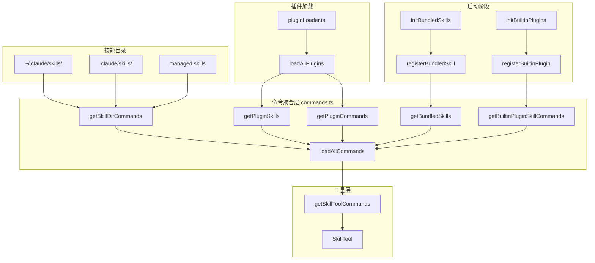
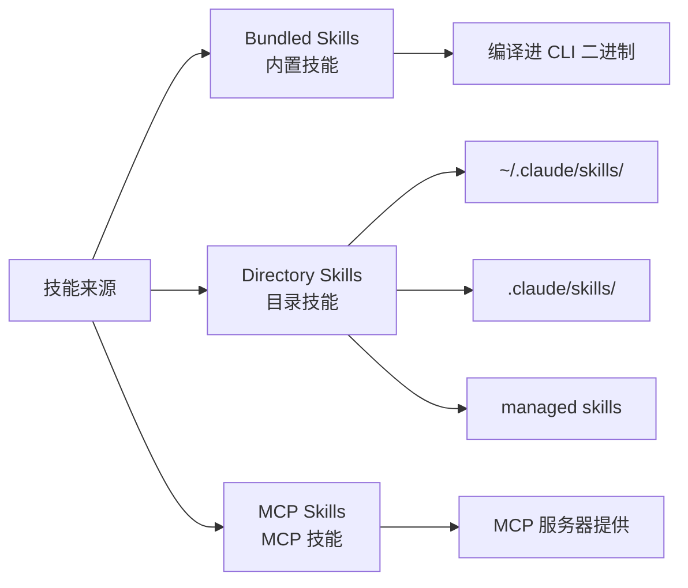
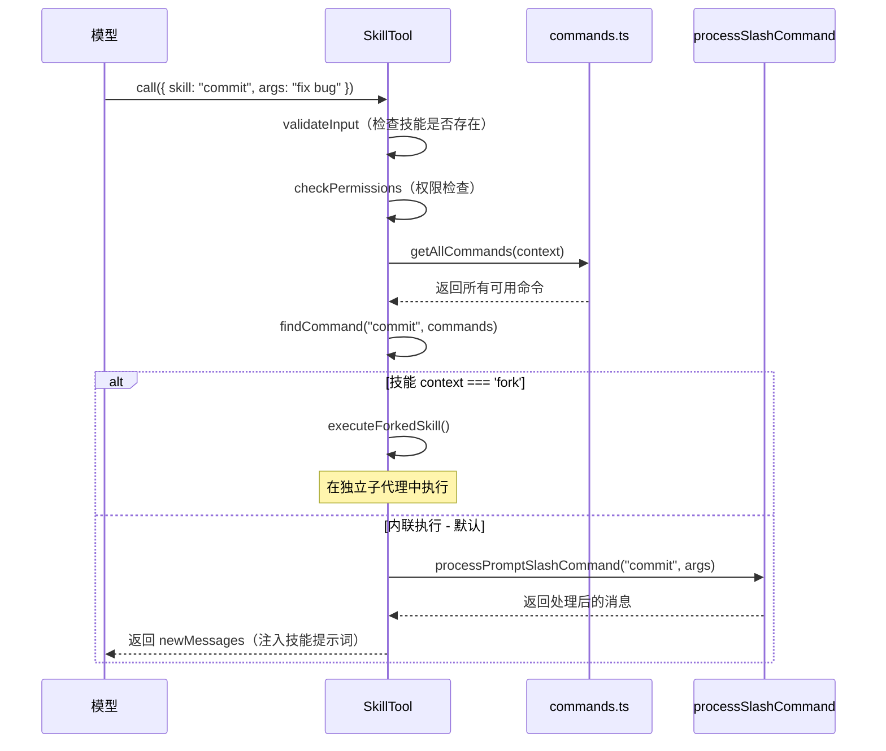

# 第 10 章 · 插件与技能系统

Claude Code 的可扩展性建立在两个相互协作的机制之上：**插件系统**（Plugin System）负责从外部市场加载功能包，**技能系统**（Skill System）负责管理可被模型调用的提示词命令。两者共同构成了一个开放的扩展架构，让用户和开发者能够在不修改核心代码的前提下，为 Claude Code 添加新能力。

## 术语表

| 术语 | 含义 |
|------|------|
| **Plugin（插件）** | 从市场（Marketplace）安装的功能包，可包含命令、技能、MCP 服务器、Hooks 等组件 |
| **Skill（技能）** | 一段以 Markdown 编写的提示词，模型可通过 SkillTool 调用 |
| **Bundled Skill（内置技能）** | 编译进 CLI 二进制文件的技能，随 CLI 一起发布 |
| **Built-in Plugin（内置插件）** | 随 CLI 发布、可在 `/plugin` UI 中启用/禁用的插件 |
| **SkillTool** | 核心工具，让模型能够发现并执行技能 |
| **Marketplace（市场）** | 插件的分发渠道，通常是一个 Git 仓库 |
| **LoadedPlugin** | 已加载到内存中的插件对象，包含路径、清单、启用状态等信息 |

## 整体架构概览




## 插件系统

### 插件的基本概念

插件是 Claude Code 的外部扩展单元。每个插件本质上是一个目录，包含以下可选组件：

```
my-plugin/
├── plugin.json          # 插件清单（可选）
├── commands/            # 自定义斜杠命令（.md 文件）
├── agents/              # 自定义 AI 代理定义
├── skills/              # 技能文件（SKILL.md 格式）
├── hooks/               # Hooks 配置（hooks.json）
└── output-styles/       # 输出样式定义
```

插件通过"市场"（Marketplace）分发，市场通常是一个 Git 仓库，其中包含插件的索引文件。插件 ID 采用 `{name}@{marketplace}` 格式，例如 `my-tool@github`。

### 插件加载机制

插件加载的核心逻辑位于 `src/utils/plugins/pluginLoader.ts`。加载流程分为以下几个阶段：

**第一阶段：发现（Discovery）**

系统从两个来源发现插件：
1. **市场插件**：从用户设置（`~/.claude/settings.json`）、项目设置（`.claude/settings.json`）和托管设置中读取 `enabledPlugins` 字段
2. **会话插件**：通过 `--plugin-dir` CLI 参数或 SDK 的 `plugins` 选项传入

**第二阶段：加载（Loading）**

```typescript
// src/utils/plugins/pluginLoader.ts
// loadAllPlugins() 是核心入口，返回已启用和已禁用的插件列表
export const loadAllPlugins = memoize(
  async (): Promise<PluginLoadResult> => {
    // 1. 加载内置插件（Built-in plugins）
    const { enabled: builtinEnabled, disabled: builtinDisabled } =
      getBuiltinPlugins()

    // 2. 从市场加载已安装的插件
    // 3. 加载会话内联插件（--plugin-dir）
    // 4. 验证依赖关系
    // 5. 返回 { enabled, disabled, errors }
  }
)
```

**第三阶段：验证（Validation）**

每个插件在加载时都会经过验证：
- 解析 `plugin.json` 清单文件（如果存在）
- 验证 MCP 服务器配置
- 检查策略限制（企业管理员可以阻止特定插件）
- 验证依赖关系（插件可以声明对其他插件的依赖）

### 插件的启用状态管理

插件的启用/禁用状态存储在各级设置文件中：

```json
// ~/.claude/settings.json（用户级）
{
  "enabledPlugins": {
    "my-tool@github": true,
    "another-plugin@marketplace": false
  }
}
```


插件的作用域（Scope）分为三级：
- `user`：安装在用户主目录，对所有项目生效
- `project`：安装在项目目录（`.claude/settings.json`），与团队共享
- `local`：本地覆盖，不提交到版本控制

### 内置插件架构（Built-in Plugins）

内置插件是随 CLI 一起发布的特殊插件，它们出现在 `/plugin` UI 中，用户可以启用或禁用。内置插件与普通插件的区别在于：

- 不需要从市场下载，直接编译进 CLI
- 插件 ID 格式为 `{name}@builtin`
- 通过 `registerBuiltinPlugin()` 函数注册

```typescript
// src/plugins/builtinPlugins.ts

// 内置插件的类型定义
export type BuiltinPluginDefinition = {
  name: string
  description: string
  version?: string
  skills?: BundledSkillDefinition[]    // 插件提供的技能
  hooks?: HooksSettings                // 插件提供的 Hooks
  mcpServers?: Record<string, McpServerConfig>  // 插件提供的 MCP 服务器
  isAvailable?: () => boolean          // 可用性检查（如系统能力检测）
  defaultEnabled?: boolean             // 默认启用状态
}

// 注册一个内置插件
export function registerBuiltinPlugin(
  definition: BuiltinPluginDefinition,
): void {
  BUILTIN_PLUGINS.set(definition.name, definition)
}
```

内置插件的初始化在 `src/plugins/bundled/index.ts` 中完成：

```typescript
// src/plugins/bundled/index.ts
export function initBuiltinPlugins(): void {
  // 目前是空的脚手架，为未来迁移 bundled skills 做准备
  // 当某个 bundled skill 需要用户可切换时，在此注册
}
```

:::info 设计意图
内置插件是 bundled skills 的演进方向。当一个内置技能需要让用户能够显式启用/禁用时，就应该将其迁移为内置插件。目前大多数内置功能仍以 bundled skills 形式存在。
:::

### 插件命令与技能的集成

插件加载完成后，其命令和技能通过 `src/utils/plugins/loadPluginCommands.ts` 注入到命令系统：

```typescript
// src/commands.ts（简化）
const loadAllCommands = memoize(async (cwd: string): Promise<Command[]> => {
  const [
    { skillDirCommands, pluginSkills, bundledSkills, builtinPluginSkills },
    pluginCommands,  // 插件提供的斜杠命令
  ] = await Promise.all([
    getSkills(cwd),
    getPluginCommands(),  // 从已启用插件加载命令
  ])

  return [
    ...bundledSkills,          // 内置技能（最高优先级）
    ...builtinPluginSkills,    // 内置插件的技能
    ...skillDirCommands,       // 目录技能
    ...pluginCommands,         // 插件命令
    ...pluginSkills,           // 插件技能
    ...COMMANDS(),             // 核心内置命令
  ]
})
```


## 技能系统

技能（Skill）是 Claude Code 中一种特殊的命令类型。与普通斜杠命令不同，技能的核心是一段 Markdown 格式的提示词，模型可以通过 `SkillTool` 主动调用技能来完成特定任务。

### 技能的三种来源



### 内置技能（Bundled Skills）

内置技能是编译进 CLI 二进制文件的技能，通过 `registerBundledSkill()` 函数注册。它们的核心类型定义在 `src/skills/bundledSkills.ts`：

```typescript
// src/skills/bundledSkills.ts

export type BundledSkillDefinition = {
  name: string
  description: string
  aliases?: string[]
  whenToUse?: string           // 告诉模型何时使用此技能
  argumentHint?: string        // 参数提示
  allowedTools?: string[]      // 此技能允许使用的工具列表
  model?: string               // 模型覆盖
  disableModelInvocation?: boolean
  userInvocable?: boolean      // 用户是否可以直接调用（默认 true）
  isEnabled?: () => boolean    // 动态启用检查
  hooks?: HooksSettings        // 技能的 Hooks 配置
  context?: 'inline' | 'fork' // 执行上下文
  files?: Record<string, string>  // 随技能一起提取到磁盘的参考文件
  getPromptForCommand: (       // 生成提示词的函数
    args: string,
    context: ToolUseContext,
  ) => Promise<ContentBlockParam[]>
}
```

注册一个内置技能的示例（来自 `src/skills/bundled/remember.ts`）：

```typescript
// src/skills/bundled/remember.ts
export function registerRememberSkill(): void {
  registerBundledSkill({
    name: 'remember',
    description:
      'Review auto-memory entries and propose promotions to CLAUDE.md...',
    whenToUse:
      'Use when the user wants to review, organize, or promote their auto-memory entries.',
    userInvocable: true,
    isEnabled: () => isAutoMemoryEnabled(),  // 仅在自动记忆功能启用时可用
    async getPromptForCommand(args) {
      let prompt = SKILL_PROMPT
      if (args) {
        prompt += `\n## Additional context from user\n\n${args}`
      }
      return [{ type: 'text', text: prompt }]
    },
  })
}
```

所有内置技能在 `src/skills/bundled/index.ts` 的 `initBundledSkills()` 函数中统一初始化：

```typescript
// src/skills/bundled/index.ts
export function initBundledSkills(): void {
  registerUpdateConfigSkill()
  registerKeybindingsSkill()
  registerVerifySkill()
  registerDebugSkill()
  registerLoremIpsumSkill()
  registerSkillifySkill()
  registerRememberSkill()
  registerSimplifySkill()
  registerBatchSkill()
  registerStuckSkill()
  // 特性标志控制的技能（死代码消除）
  if (feature('KAIROS') || feature('KAIROS_DREAM')) {
    const { registerDreamSkill } = require('./dream.js')
    registerDreamSkill()
  }
  // ... 更多特性标志控制的技能
}
```


### 目录技能加载（Skill Loading）

目录技能从文件系统中的 `.claude/skills/` 目录加载，核心逻辑在 `src/skills/loadSkillsDir.ts`。

**技能目录结构**

技能必须采用目录格式：

```
.claude/skills/
└── my-skill/
    └── SKILL.md    # 技能定义文件（必须）
```

`SKILL.md` 文件支持 YAML frontmatter 来配置技能元数据：

```markdown
---
description: 这是我的自定义技能
when_to_use: 当用户需要执行 X 操作时使用
allowed-tools: Bash, FileRead
argument-hint: <目标文件路径>
user-invocable: true
model: claude-opus-4-5
context: fork
---

# 技能内容

这里是技能的提示词内容...

## 步骤

1. 首先做 A
2. 然后做 B
```

**加载优先级**

技能从多个目录加载，优先级从高到低：

```typescript
// src/skills/loadSkillsDir.ts（简化）
export const getSkillDirCommands = memoize(
  async (cwd: string): Promise<Command[]> => {
    const [
      managedSkills,      // 企业管理员配置的技能（最高优先级）
      userSkills,         // ~/.claude/skills/
      projectSkillsNested, // .claude/skills/（项目级）
      additionalSkillsNested, // --add-dir 指定的额外目录
      legacyCommands,     // 旧版 .claude/commands/ 目录
    ] = await Promise.all([...])

    // 合并所有技能，通过 realpath 去重（处理符号链接）
    const allSkillsWithPaths = [
      ...managedSkills,
      ...userSkills,
      ...projectSkillsNested.flat(),
      ...additionalSkillsNested.flat(),
      ...legacyCommands,
    ]

    // 去重：同一文件通过不同路径加载时只保留一份
    const deduplicatedSkills = await deduplicateByRealpath(allSkillsWithPaths)

    return deduplicatedSkills
  }
)
```

**动态技能发现**

技能系统还支持动态发现：当模型读取或编辑文件时，系统会自动检查文件路径上的 `.claude/skills/` 目录，并将新发现的技能加入可用列表：

```typescript
// src/skills/loadSkillsDir.ts
export async function discoverSkillDirsForPaths(
  filePaths: string[],
  cwd: string,
): Promise<string[]> {
  // 从文件路径向上遍历，查找 .claude/skills/ 目录
  // 只发现 cwd 以下的目录（cwd 级别的技能在启动时已加载）
  // 跳过 gitignore 的目录（防止 node_modules 中的技能被加载）
}
```

**条件技能（Conditional Skills）**

技能可以通过 `paths` frontmatter 声明只在特定文件被访问时激活：

```markdown
---
description: React 组件优化技能
paths: src/components/**
---
```

这类技能在启动时不会加载，只有当模型访问匹配路径的文件时才会激活。


### MCP 技能构建器（MCP Skill Builders）

MCP 技能是通过 MCP（Model Context Protocol）服务器提供的技能。`src/skills/mcpSkillBuilders.ts` 实现了一个精巧的依赖注入机制，解决了循环依赖问题：

```typescript
// src/skills/mcpSkillBuilders.ts

// 这个模块是依赖图的叶节点，不导入任何其他模块
// 通过注册机制打破循环依赖：
// client.ts → mcpSkills.ts → loadSkillsDir.ts → ... → client.ts

export type MCPSkillBuilders = {
  createSkillCommand: typeof createSkillCommand
  parseSkillFrontmatterFields: typeof parseSkillFrontmatterFields
}

let builders: MCPSkillBuilders | null = null

// loadSkillsDir.ts 在模块初始化时调用此函数注册构建器
export function registerMCPSkillBuilders(b: MCPSkillBuilders): void {
  builders = b
}

// MCP 技能加载器通过此函数获取构建器
export function getMCPSkillBuilders(): MCPSkillBuilders {
  if (!builders) {
    throw new Error('MCP skill builders not registered')
  }
  return builders
}
```

MCP 技能与本地技能的关键区别：
- MCP 技能来自远程服务器，属于不可信来源
- 出于安全考虑，MCP 技能**不执行**内联 Shell 命令（`!command` 语法）
- MCP 技能的 `${CLAUDE_SKILL_DIR}` 变量无意义，不会被替换

## SkillTool：技能与核心系统的集成

`SkillTool`（位于 `src/tools/SkillTool/SkillTool.ts`）是连接技能系统与核心工具系统的关键桥梁。它让模型能够主动发现并调用技能。

### SkillTool 的工具定义

```typescript
// src/tools/SkillTool/SkillTool.ts

export const SkillTool: Tool<InputSchema, Output, Progress> = buildTool({
  name: SKILL_TOOL_NAME,  // 'Skill'
  searchHint: 'invoke a slash-command skill',

  // 输入 Schema：技能名称 + 可选参数
  inputSchema: z.object({
    skill: z.string().describe('The skill name. E.g., "commit", "review-pr"'),
    args: z.string().optional().describe('Optional arguments for the skill'),
  }),

  // 动态描述：显示正在执行的技能名称
  description: async ({ skill }) => `Execute skill: ${skill}`,

  // 提示词：列出所有可用技能（注入到系统提示词）
  prompt: async () => getPrompt(getProjectRoot()),
})
```

### SkillTool 的执行流程




### 两种执行模式

**内联模式（Inline）**：默认模式。技能的提示词作为用户消息注入到当前对话，模型在同一上下文中处理。

**Fork 模式（Fork）**：当技能的 frontmatter 中设置 `context: fork` 时，技能在独立的子代理中执行，拥有独立的 token 预算和工具权限。

```typescript
// src/tools/SkillTool/SkillTool.ts（简化）
async call({ skill, args }, context, ...) {
  const command = findCommand(commandName, commands)

  // Fork 模式：在子代理中执行
  if (command?.type === 'prompt' && command.context === 'fork') {
    return executeForkedSkill(command, commandName, args, context, ...)
  }

  // 内联模式：展开技能提示词
  const processedCommand = await processPromptSlashCommand(
    commandName, args, commands, context
  )

  return {
    data: { success: true, commandName, allowedTools, model },
    newMessages: processedCommand.messages,  // 技能提示词作为新消息
    contextModifier(ctx) {
      // 更新允许的工具列表（技能可以限制可用工具）
      if (allowedTools.length > 0) {
        return updateAllowedTools(ctx, allowedTools)
      }
      return ctx
    },
  }
}
```

### 权限控制

SkillTool 实现了细粒度的权限控制：

```typescript
// src/tools/SkillTool/SkillTool.ts
async checkPermissions({ skill, args }, context) {
  // 1. 检查 deny 规则（优先级最高）
  const denyRules = getRuleByContentsForTool(permissionContext, SkillTool, 'deny')
  for (const [ruleContent, rule] of denyRules.entries()) {
    if (ruleMatches(ruleContent)) {
      return { behavior: 'deny', message: 'Skill execution blocked' }
    }
  }

  // 2. 检查 allow 规则
  const allowRules = getRuleByContentsForTool(permissionContext, SkillTool, 'allow')
  for (const [ruleContent, rule] of allowRules.entries()) {
    if (ruleMatches(ruleContent)) {
      return { behavior: 'allow', updatedInput: { skill, args } }
    }
  }

  // 3. 自动允许"安全"技能（只有描述和提示词，无特殊配置）
  if (commandObj?.type === 'prompt' && skillHasOnlySafeProperties(commandObj)) {
    return { behavior: 'allow', updatedInput: { skill, args } }
  }

  // 4. 默认：询问用户
  return {
    behavior: 'ask',
    message: `Execute skill: ${commandName}`,
    suggestions: [/* 建议的权限规则 */],
  }
}
```

权限规则支持精确匹配和前缀匹配：
- `commit`：精确匹配 `commit` 技能
- `review:*`：匹配所有以 `review:` 开头的技能（命名空间匹配）

## 技能的 Frontmatter 完整参考

技能文件支持丰富的 frontmatter 配置，由 `parseSkillFrontmatterFields()` 函数解析（`src/skills/loadSkillsDir.ts`）：

| 字段 | 类型 | 说明 |
|------|------|------|
| `description` | string | 技能描述，显示在技能列表中 |
| `when_to_use` | string | 告诉模型何时应该使用此技能 |
| `allowed-tools` | string | 逗号分隔的工具名称，限制技能可用的工具 |
| `argument-hint` | string | 参数提示，显示在 UI 中 |
| `user-invocable` | boolean | 用户是否可以直接调用（默认 true） |
| `model` | string | 覆盖使用的模型（`inherit` 表示继承父级） |
| `context` | `fork` | 设置为 `fork` 时在子代理中执行 |
| `agent` | string | 指定使用的代理类型 |
| `effort` | string/int | 努力程度（`low`/`medium`/`high` 或整数） |
| `paths` | string | 条件激活的文件路径模式 |
| `hooks` | object | 技能的 Hooks 配置 |
| `shell` | object | Shell 命令执行配置 |
| `arguments` | string/array | 命名参数定义（支持 `$ARGUMENTS` 替换） |


## 完整示例：创建自定义插件

下面是一个完整的自定义插件示例，展示从定义到注册的完整过程。

### 插件目录结构

```
my-code-reviewer/
├── plugin.json
├── commands/
│   └── review-security.md
└── skills/
    └── security-audit/
        └── SKILL.md
```

### 插件清单（plugin.json）

```json
{
  "name": "my-code-reviewer",
  "version": "1.0.0",
  "description": "代码安全审查插件",
  "author": {
    "name": "Your Name",
    "email": "you@example.com"
  }
}
```

### 插件命令（commands/review-security.md）

```markdown
---
description: 对当前文件执行安全审查
argument-hint: <文件路径>
allowed-tools: FileRead, Bash
---

请对以下文件执行安全审查，重点检查：
1. SQL 注入漏洞
2. XSS 攻击面
3. 不安全的依赖项
4. 硬编码的密钥或密码

文件路径：$ARGUMENTS
```

### 插件技能（skills/security-audit/SKILL.md）

```markdown
---
description: 全面的代码安全审计技能
when_to_use: 当用户需要对整个代码库进行安全审计时使用
allowed-tools: FileRead, Bash, GlobTool
context: fork
---

# 安全审计技能

## 目标
对代码库执行全面的安全审计，生成详细的安全报告。

## 步骤

### 1. 扫描敏感信息
使用 Bash 工具搜索硬编码的密钥、密码和 API Token：
```bash
grep -r "password\|secret\|api_key\|token" --include="*.ts" --include="*.js" .
```

### 2. 检查依赖项安全
运行依赖项安全检查：
```bash
npm audit --json
```

### 3. 生成报告
整理发现的问题，按严重程度分类（Critical/High/Medium/Low），
并为每个问题提供修复建议。
```

### 安装插件

```bash
# 通过 CLI 安装（需要先配置市场）
claude plugin install my-code-reviewer

# 或通过 --plugin-dir 在会话中使用
claude --plugin-dir ./my-code-reviewer
```


## 完整示例：创建自定义技能

下面是一个完整的自定义技能示例，展示如何在用户级别创建一个技能。

### 创建技能目录

```bash
mkdir -p ~/.claude/skills/git-workflow
```

### 技能文件（~/.claude/skills/git-workflow/SKILL.md）

```markdown
---
description: 标准化的 Git 工作流技能，包含分支创建、提交和 PR 创建
when_to_use: 当用户需要按照团队规范完成完整的 Git 工作流时使用
allowed-tools: Bash
argument-hint: <功能描述>
---

# Git 工作流技能

## 目标
按照团队规范完成从功能开发到 PR 创建的完整 Git 工作流。

## 参数
功能描述：$ARGUMENTS

## 步骤

### 1. 创建功能分支
```bash
# 从最新的 main 分支创建功能分支
git checkout main && git pull origin main
git checkout -b feature/$(echo "$ARGUMENTS" | tr ' ' '-' | tr '[:upper:]' '[:lower:]')
```

### 2. 开发完成后提交
在完成开发后，执行以下操作：
- 运行测试确保通过
- 使用语义化提交信息（feat/fix/docs/refactor）
- 提交所有相关文件

### 3. 推送并创建 PR
```bash
git push origin HEAD
# 使用 GitHub CLI 创建 PR
gh pr create --title "feat: $ARGUMENTS" --body "## 变更说明\n\n$ARGUMENTS"
```

### 4. 验证
确认 PR 已创建，CI 检查正在运行。
```

### 使用技能

技能创建后，可以通过以下方式使用：

```bash
# 用户直接调用
/git-workflow 添加用户认证功能

# 模型通过 SkillTool 调用（在对话中）
# 模型会自动识别何时应该使用此技能
```

### 带参数的高级技能示例

```markdown
---
description: 代码审查技能，支持指定审查重点
argument-hint: <文件路径> [--focus=security|performance|style]
arguments:
  - file_path
  - focus
---

# 代码审查

审查文件：${file_path}
审查重点：${focus:-全面审查}

## 审查维度

1. **代码质量**：可读性、命名规范、注释完整性
2. **性能**：算法复杂度、不必要的计算、内存使用
3. **安全性**：输入验证、权限检查、敏感数据处理
4. **测试覆盖**：边界条件、错误处理、测试完整性
```


## 插件与技能如何融入核心系统

理解插件和技能系统的关键，在于看清它们如何与核心系统的其他部分协作。

### 与命令系统的集成

插件命令和技能最终都通过 `commands.ts` 的 `loadAllCommands()` 函数聚合，成为统一命令列表的一部分。这意味着：

- 插件命令可以像内置命令一样通过 `/command-name` 调用
- 技能可以通过 SkillTool 被模型主动调用
- 所有命令共享相同的权限检查机制

### 与工具注册的集成

`SkillTool` 在 `src/tools.ts` 中与其他核心工具一起注册：

```typescript
// src/tools.ts（简化）
import { SkillTool } from './tools/SkillTool/SkillTool.js'

// SkillTool 与 BashTool、FileEditTool 等核心工具并列注册
const tools = [
  // ... 其他工具
  SkillTool,
  // ...
]
```

这使得模型可以像调用任何其他工具一样调用技能，技能调用会出现在工具调用历史中，受到相同的权限控制。

### 与系统提示词的集成

技能列表通过 `getPrompt()` 函数注入到系统提示词中（`src/tools/SkillTool/prompt.ts`）。系统会根据上下文窗口大小动态调整技能列表的详细程度：

```typescript
// src/tools/SkillTool/prompt.ts
export async function getPrompt(cwd: string): Promise<string> {
  const commands = await getSkillToolCommands(cwd)
  // 根据 token 预算截断技能描述
  return formatCommandsWithinBudget(commands, contextWindowTokens)
}
```

### 与 MCP 服务器的集成

插件可以声明 MCP 服务器配置，这些服务器会在插件启用时自动启动：

```typescript
// src/types/plugin.ts
export type LoadedPlugin = {
  // ...
  mcpServers?: Record<string, McpServerConfig>  // 插件提供的 MCP 服务器
  lspServers?: Record<string, LspServerConfig>  // 插件提供的 LSP 服务器
}
```

插件的 MCP 服务器通过 `src/services/mcp/config.ts` 加载，与用户手动配置的 MCP 服务器合并后统一管理。

### 后台安装管理

`src/services/plugins/PluginInstallationManager.ts` 负责在后台自动安装和更新插件市场：

```typescript
// src/services/plugins/PluginInstallationManager.ts
export async function performBackgroundPluginInstallations(
  setAppState: SetAppState,
): Promise<void> {
  // 1. 计算需要安装/更新的市场
  const diff = diffMarketplaces(declared, materialized)

  // 2. 在后台安装，通过 AppState 更新 UI 进度
  const result = await reconcileMarketplaces({
    onProgress: event => {
      updateMarketplaceStatus(setAppState, event.name, event.type)
    },
  })

  // 3. 新安装完成后自动刷新插件（避免"插件未找到"错误）
  if (result.installed.length > 0) {
    await refreshActivePlugins(setAppState)
  }
}
```


## 设计模式分析

### 注册表模式（Registry Pattern）

插件和技能系统都使用了注册表模式：

```typescript
// 内置技能注册表（src/skills/bundledSkills.ts）
const bundledSkills: Command[] = []

export function registerBundledSkill(definition: BundledSkillDefinition): void {
  // 将技能转换为 Command 对象并存入注册表
  bundledSkills.push(command)
}

export function getBundledSkills(): Command[] {
  return [...bundledSkills]  // 返回副本，防止外部修改
}
```

这种模式的优点是：
- 各模块可以独立注册，无需中央协调
- 注册顺序不影响最终结果
- 易于测试（`clearBundledSkills()` 用于测试清理）

### 依赖注入解决循环依赖

`mcpSkillBuilders.ts` 展示了一种优雅的循环依赖解决方案：通过"写-once 注册表"在运行时注入依赖，而不是在编译时建立静态依赖关系。这避免了 Bun 打包器在处理循环依赖时的问题。

### 惰性加载与特性标志

内置技能使用 `bun:bundle` 特性标志实现死代码消除：

```typescript
// 只有在 KAIROS 特性启用时才加载 dream 技能
if (feature('KAIROS') || feature('KAIROS_DREAM')) {
  const { registerDreamSkill } = require('./dream.js')
  registerDreamSkill()
}
```

这确保了未启用的特性不会增加二进制文件大小。

### Memoize 缓存策略

技能加载是昂贵的磁盘 I/O 操作，系统使用 `lodash-es/memoize` 进行缓存：

```typescript
export const getSkillDirCommands = memoize(
  async (cwd: string): Promise<Command[]> => { ... }
)
```

缓存以 `cwd` 为键，不同工作目录的技能独立缓存。当插件更新或用户运行 `/reload-plugins` 时，通过 `clearSkillCaches()` 清除缓存。

## 交叉引用

- **命令系统**（第四章）：技能最终以 `Command` 类型存在，与斜杠命令共享相同的数据结构
- **工具系统**（第三章）：`SkillTool` 是核心工具之一，遵循相同的 `Tool` 接口
- **服务层**（第七章）：`PluginInstallationManager` 是服务层的一部分，负责后台安装
- **权限系统**（第九章）：技能调用受到与其他工具相同的权限控制机制约束

## 小结

Claude Code 的插件与技能系统体现了"开放-封闭原则"的精髓：核心系统对修改封闭，但对扩展开放。通过以下机制实现了高度可扩展性：

1. **插件系统**提供了完整的功能包扩展能力，支持命令、技能、MCP 服务器等多种组件
2. **技能系统**让用户和开发者能够用简单的 Markdown 文件定义复杂的 AI 工作流
3. **SkillTool** 作为桥梁，让模型能够主动发现和调用技能，实现真正的智能扩展
4. **注册表模式**和**惰性加载**确保了系统的高性能和可维护性

理解这套扩展机制，是构建自己的 AI 代理系统时最值得借鉴的设计之一。
