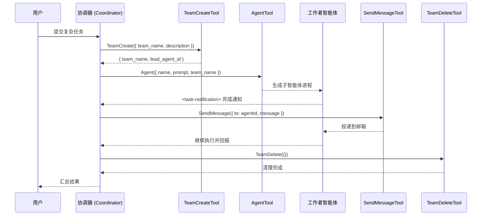

# 第 11 章 · 多智能体协调

Claude Code 不仅是一个单一的 AI 助手，它还内置了一套完整的**多智能体协调系统**，允许主智能体（协调器）将复杂任务分解并分发给多个并行运行的子智能体（工作者），从而大幅提升处理复杂工程任务的效率。

本章将深入解析这套系统的核心组件：`AgentTool`（子智能体生成）、`TeamCreateTool` / `TeamDeleteTool`（团队管理）、`SendMessageTool`（智能体间通信）以及 `coordinatorMode`（协调器编排逻辑）。

## 系统架构概览

多智能体系统由以下几个核心模块构成：

```
src/coordinator/coordinatorMode.ts   # 协调器模式逻辑
src/tools/AgentTool/                 # 子智能体生成工具
src/tools/TeamCreateTool/            # 团队创建工具
src/tools/TeamDeleteTool/            # 团队解散工具
src/tools/SendMessageTool/           # 智能体间消息工具
```

## 智能体协调流程图

下图展示了从任务分配到结果汇总的完整协作流程：



## 协调器模式（Coordinator Mode）

### 什么是协调器模式

协调器模式是一种特殊的运行模式，通过环境变量 `CLAUDE_CODE_COORDINATOR_MODE` 启用。在此模式下，主智能体扮演"协调器"角色，不直接执行具体任务，而是将工作分发给工作者智能体并汇总结果。

```typescript title="src/coordinator/coordinatorMode.ts"
export function isCoordinatorMode(): boolean {
  if (feature('COORDINATOR_MODE')) {
    return isEnvTruthy(process.env.CLAUDE_CODE_COORDINATOR_MODE)
  }
  return false
}
```

协调器模式通过 `bun:bundle` 特性标志 `COORDINATOR_MODE` 进行死代码消除控制——在不支持该特性的构建中，整个协调器逻辑会被完全剔除。

### 协调器的系统提示

协调器拥有专属的系统提示，明确定义了其角色和工作方式：

```typescript title="src/coordinator/coordinatorMode.ts"
export function getCoordinatorSystemPrompt(): string {
  return `You are Claude Code, an AI assistant that orchestrates software
engineering tasks across multiple workers.

## 1. Your Role
You are a **coordinator**. Your job is to:
- Help the user achieve their goal
- Direct workers to research, implement and verify code changes
- Synthesize results and communicate with the user
- Answer questions directly when possible — don't delegate work
  that you can handle without tools
...`
}
```

协调器的核心工作流分为四个阶段：

| 阶段 | 执行者 | 目的 |
|------|--------|------|
| 研究 | 工作者（并行） | 调查代码库、理解问题 |
| 综合 | 协调器 | 分析研究结果、制定实施规范 |
| 实施 | 工作者 | 按规范进行代码修改 |
| 验证 | 工作者 | 测试变更是否正确 |

### 工作者上下文注入

协调器会将工作者可用的工具列表注入到用户上下文中，让 LLM 了解工作者的能力边界：

```typescript title="src/coordinator/coordinatorMode.ts"
export function getCoordinatorUserContext(
  mcpClients: ReadonlyArray<{ name: string }>,
  scratchpadDir?: string,
): { [k: string]: string } {
  if (!isCoordinatorMode()) return {}

  const workerTools = Array.from(ASYNC_AGENT_ALLOWED_TOOLS)
    .filter(name => !INTERNAL_WORKER_TOOLS.has(name))
    .sort()
    .join(', ')

  let content = `Workers spawned via the ${AGENT_TOOL_NAME} tool have
access to these tools: ${workerTools}`

  if (scratchpadDir && isScratchpadGateEnabled()) {
    content += `\n\nScratchpad directory: ${scratchpadDir}\nWorkers can
read and write here without permission prompts.`
  }

  return { workerToolsContext: content }
}
```

`INTERNAL_WORKER_TOOLS` 集合包含 `TeamCreate`、`TeamDelete`、`SendMessage` 等内部协调工具，这些工具不对普通工作者开放，只有协调器才能使用。

## 子智能体生成机制（AgentTool）

### 工具定义与输入参数

`AgentTool`（位于 `src/tools/AgentTool/AgentTool.tsx`）是整个多智能体系统的核心入口。其输入 Schema 定义了子智能体的创建参数：

```typescript title="src/tools/AgentTool/AgentTool.tsx"
const baseInputSchema = lazySchema(() => z.object({
  description: z.string()
    .describe('A short (3-5 word) description of the task'),
  prompt: z.string()
    .describe('The task for the agent to perform'),
  subagent_type: z.string().optional()
    .describe('The type of specialized agent to use for this task'),
  model: z.enum(['sonnet', 'opus', 'haiku']).optional()
    .describe('Optional model override for this agent.'),
  run_in_background: z.boolean().optional()
    .describe('Set to true to run this agent in the background.'),
}))

// 多智能体扩展参数（Agent Swarms 功能启用时）
const multiAgentInputSchema = z.object({
  name: z.string().optional()
    .describe('Name for the spawned agent. Makes it addressable via SendMessage.'),
  team_name: z.string().optional()
    .describe('Team name for spawning.'),
  mode: permissionModeSchema().optional()
    .describe('Permission mode for spawned teammate.'),
})
```

关键参数说明：
- `subagent_type`：指定使用哪种专用智能体（如 `worker`、`researcher`、`Explore` 等）
- `name`：为智能体命名后，可通过 `SendMessage({ to: name })` 向其发送消息
- `team_name`：将智能体加入指定团队，实现团队协作
- `isolation`：支持 `worktree` 模式，在独立的 git 工作树中运行，实现文件系统隔离

### 子智能体生命周期

子智能体的生命周期分为同步和异步两种模式：

**同步模式**：父智能体等待子智能体完成后才继续执行，适合简单的一次性任务。

**异步模式**（`run_in_background: true`）：子智能体在后台运行，完成后通过 `<task-notification>` XML 消息通知父智能体：

```xml
<task-notification>
  <task-id>{agentId}</task-id>
  <status>completed|failed|killed</status>
  <summary>Agent "Investigate auth bug" completed</summary>
  <result>Found null pointer in src/auth/validate.ts:42...</result>
  <usage>
    <total_tokens>N</total_tokens>
    <tool_uses>N</tool_uses>
    <duration_ms>N</duration_ms>
  </usage>
</task-notification>
```

异步生命周期由 `runAsyncAgentLifecycle` 函数管理（`src/tools/AgentTool/agentToolUtils.ts`）：

```typescript title="src/tools/AgentTool/agentToolUtils.ts"
export async function runAsyncAgentLifecycle({
  taskId, abortController, makeStream, metadata,
  description, toolUseContext, rootSetAppState,
  agentIdForCleanup, enableSummarization, getWorktreeResult,
}): Promise<void> {
  const agentMessages: MessageType[] = []
  try {
    for await (const message of makeStream(onCacheSafeParams)) {
      agentMessages.push(message)
      updateProgressFromMessage(tracker, message, resolveActivity, tools)
      updateAsyncAgentProgress(taskId, getProgressUpdate(tracker), rootSetAppState)
    }
    const agentResult = finalizeAgentTool(agentMessages, taskId, metadata)
    completeAsyncAgent(agentResult, rootSetAppState)
    enqueueAgentNotification({ taskId, status: 'completed', ... })
  } catch (error) {
    if (error instanceof AbortError) {
      killAsyncAgent(taskId, rootSetAppState)
      enqueueAgentNotification({ taskId, status: 'killed', ... })
    } else {
      failAsyncAgent(taskId, msg, rootSetAppState)
      enqueueAgentNotification({ taskId, status: 'failed', ... })
    }
  }
}
```

### 资源隔离：Worktree 模式

当 `isolation: "worktree"` 时，系统会为子智能体创建一个独立的 git 工作树，使其在隔离的文件系统副本中工作，不影响主工作区：

```typescript title="src/tools/AgentTool/forkSubagent.ts"
export function buildWorktreeNotice(
  parentCwd: string,
  worktreeCwd: string,
): string {
  return `You've inherited the conversation context above from a parent
agent working in ${parentCwd}. You are operating in an isolated git
worktree at ${worktreeCwd} — same repository, same relative file
structure, separate working copy. Paths in the inherited context refer
to the parent's working directory; translate them to your worktree root.`
}
```

### Fork 子智能体实验

`isForkSubagentEnabled()` 控制一种特殊的"Fork"模式：子智能体继承父智能体的完整对话上下文和系统提示，实现提示缓存共享（prompt cache sharing）：

```typescript title="src/tools/AgentTool/forkSubagent.ts"
export const FORK_AGENT = {
  agentType: FORK_SUBAGENT_TYPE,
  tools: ['*'],          // 继承父智能体的完整工具集
  maxTurns: 200,
  model: 'inherit',      // 继承父智能体的模型
  permissionMode: 'bubble', // 权限提示冒泡到父终端
  source: 'built-in',
  getSystemPrompt: () => '',
} satisfies BuiltInAgentDefinition
```

Fork 模式通过让所有子智能体共享相同的 API 请求前缀（byte-identical prefix），最大化提示缓存命中率，降低 API 调用成本。

### 工具过滤机制

子智能体不能使用所有工具。`filterToolsForAgent` 函数根据智能体类型和运行模式过滤可用工具：

```typescript title="src/tools/AgentTool/agentToolUtils.ts"
export function filterToolsForAgent({
  tools, isBuiltIn, isAsync = false, permissionMode,
}): Tools {
  return tools.filter(tool => {
    if (tool.name.startsWith('mcp__')) return true  // MCP 工具始终允许
    if (ALL_AGENT_DISALLOWED_TOOLS.has(tool.name)) return false
    if (!isBuiltIn && CUSTOM_AGENT_DISALLOWED_TOOLS.has(tool.name)) return false
    if (isAsync && !ASYNC_AGENT_ALLOWED_TOOLS.has(tool.name)) return false
    return true
  })
}
```

异步智能体（后台运行）只能使用 `ASYNC_AGENT_ALLOWED_TOOLS` 白名单中的工具，防止后台任务执行危险操作。

## 团队创建与管理

### TeamCreateTool：创建协作团队

`TeamCreateTool`（`src/tools/TeamCreateTool/TeamCreateTool.ts`）负责初始化一个多智能体团队。团队是协调多个智能体协作的基本单位，每个团队对应一个独立的任务列表。

```typescript title="src/tools/TeamCreateTool/TeamCreateTool.ts"
const inputSchema = lazySchema(() =>
  z.strictObject({
    team_name: z.string().describe('Name for the new team to create.'),
    description: z.string().optional().describe('Team description/purpose.'),
    agent_type: z.string().optional()
      .describe('Type/role of the team lead.'),
  }),
)
```

创建团队时，系统会执行以下操作：

```typescript title="src/tools/TeamCreateTool/TeamCreateTool.ts"
async call(input, context) {
  // 1. 检查是否已有团队（每个领导者只能管理一个团队）
  const existingTeam = appState.teamContext?.teamName
  if (existingTeam) {
    throw new Error(`Already leading team "${existingTeam}".`)
  }

  // 2. 生成唯一团队名（避免冲突）
  const finalTeamName = generateUniqueTeamName(team_name)

  // 3. 创建团队文件（~/.claude/teams/{team-name}/config.json）
  const teamFile: TeamFile = {
    name: finalTeamName,
    leadAgentId,
    leadSessionId: getSessionId(),
    members: [{ agentId: leadAgentId, name: TEAM_LEAD_NAME, ... }],
  }
  await writeTeamFileAsync(finalTeamName, teamFile)

  // 4. 创建对应的任务列表目录（~/.claude/tasks/{team-name}/）
  await resetTaskList(taskListId)
  await ensureTasksDir(taskListId)

  // 5. 更新 AppState 中的团队上下文
  setAppState(prev => ({
    ...prev,
    teamContext: { teamName: finalTeamName, leadAgentId, teammates: {...} },
  }))
}
```

团队创建后，文件系统结构如下：

```
~/.claude/
├── teams/
│   └── {team-name}/
│       └── config.json    # 团队配置（成员列表、领导者信息）
└── tasks/
    └── {team-name}/       # 团队共享任务列表
        ├── task-1.json
        └── task-2.json
```

### 团队工作流

根据 `TeamCreateTool` 的提示文档，完整的团队工作流如下：

1. **创建团队**：`TeamCreate({ team_name, description })`
2. **创建任务**：使用 `TaskCreate` 工具创建任务，自动关联到团队任务列表
3. **生成队友**：使用 `Agent({ name, prompt, team_name })` 生成加入团队的智能体
4. **分配任务**：使用 `TaskUpdate({ owner: "teammate-name" })` 将任务分配给队友
5. **队友执行**：队友完成任务后通过 `SendMessage` 汇报，然后进入空闲状态
6. **关闭团队**：任务完成后，通过 `SendMessage({ message: { type: "shutdown_request" } })` 优雅关闭队友

:::tip 队友空闲状态
队友在每次轮次结束后会自动进入空闲状态，这是完全正常的行为。空闲的队友仍然可以接收消息——发送消息会唤醒它们继续工作。
:::

### TeamDeleteTool：解散团队

`TeamDeleteTool`（`src/tools/TeamDeleteTool/TeamDeleteTool.ts`）负责清理团队资源：

```typescript title="src/tools/TeamDeleteTool/TeamDeleteTool.ts"
async call(_input, context) {
  const teamName = appState.teamContext?.teamName

  if (teamName) {
    // 检查是否还有活跃成员
    const activeMembers = nonLeadMembers.filter(m => m.isActive !== false)
    if (activeMembers.length > 0) {
      return {
        data: {
          success: false,
          message: `Cannot cleanup team with ${activeMembers.length}
active member(s). Use requestShutdown to terminate teammates first.`,
        },
      }
    }

    // 清理团队目录和工作树
    await cleanupTeamDirectories(teamName)
    unregisterTeamForSessionCleanup(teamName)
    clearTeammateColors()
    clearLeaderTeamName()
  }

  // 清除 AppState 中的团队上下文
  setAppState(prev => ({
    ...prev,
    teamContext: undefined,
    inbox: { messages: [] },
  }))
}
```

`TeamDeleteTool` 在删除前会检查是否还有活跃成员——如果有，必须先通过 `SendMessage` 发送 `shutdown_request` 优雅关闭队友，再执行清理。

## 智能体间消息协议（SendMessageTool）

### 消息格式与路由

`SendMessageTool`（`src/tools/SendMessageTool/SendMessageTool.ts`）实现了智能体间的消息传递协议。其输入 Schema 定义了消息的格式：

```typescript title="src/tools/SendMessageTool/SendMessageTool.ts"
const inputSchema = lazySchema(() =>
  z.object({
    to: z.string().describe(
      'Recipient: teammate name, or "*" for broadcast to all teammates'
    ),
    summary: z.string().optional()
      .describe('A 5-10 word summary shown as a preview in the UI'),
    message: z.union([
      z.string().describe('Plain text message content'),
      StructuredMessage(),  // 结构化消息（shutdown_request 等）
    ]),
  }),
)
```

`to` 字段支持多种寻址方式：

| `to` 值 | 含义 |
|---------|------|
| `"researcher"` | 按名称发送给指定队友 |
| `"*"` | 广播给所有队友（线性开销，谨慎使用） |
| `"uds:/path/to.sock"` | 发送给本机另一个 Claude 会话（UDS 模式） |
| `"bridge:session_..."` | 发送给远程 Claude 会话（Remote Control 模式） |

### 消息路由实现

`SendMessageTool` 的路由逻辑按优先级依次处理：

```typescript title="src/tools/SendMessageTool/SendMessageTool.ts"
async call(input, context, canUseTool, assistantMessage) {
  // 1. 跨会话路由（bridge: / uds: 前缀）
  if (feature('UDS_INBOX') && typeof input.message === 'string') {
    const addr = parseAddress(input.to)
    if (addr.scheme === 'bridge') {
      return postInterClaudeMessage(addr.target, input.message)
    }
    if (addr.scheme === 'uds') {
      return sendToUdsSocket(addr.target, input.message)
    }
  }

  // 2. 按名称路由到进程内子智能体（自动恢复已停止的智能体）
  if (typeof input.message === 'string' && input.to !== '*') {
    const registered = appState.agentNameRegistry.get(input.to)
    const agentId = registered ?? toAgentId(input.to)
    if (agentId) {
      const task = appState.tasks[agentId]
      if (isLocalAgentTask(task) && task.status === 'running') {
        // 智能体正在运行：将消息加入队列
        queuePendingMessage(agentId, input.message, setAppState)
        return { data: { success: true, message: 'Message queued...' } }
      }
      // 智能体已停止：自动恢复并传递消息
      return resumeAgentBackground({ agentId, prompt: input.message, ... })
    }
  }

  // 3. 广播或团队内消息
  if (input.to === '*') return handleBroadcast(input.message, input.summary, context)
  return handleMessage(input.to, input.message, input.summary, context)
}
```

### 邮箱机制

消息通过**邮箱（Mailbox）**机制传递。每个智能体都有一个对应的邮箱文件，`writeToMailbox` 函数将消息写入目标智能体的邮箱：

```typescript title="src/tools/SendMessageTool/SendMessageTool.ts"
async function handleMessage(
  recipientName: string,
  content: string,
  summary: string | undefined,
  context: ToolUseContext,
): Promise<{ data: MessageOutput }> {
  const senderName = getAgentName() || TEAM_LEAD_NAME
  const senderColor = getTeammateColor()

  await writeToMailbox(
    recipientName,
    {
      from: senderName,
      text: content,
      summary,
      timestamp: new Date().toISOString(),
      color: senderColor,
    },
    teamName,
  )

  return {
    data: {
      success: true,
      message: `Message sent to ${recipientName}'s inbox`,
      routing: { sender: senderName, target: `@${recipientName}`, ... },
    },
  }
}
```

### 结构化消息协议

除了普通文本消息，`SendMessageTool` 还支持结构化消息，用于协调器与队友之间的协议交互：

```typescript title="src/tools/SendMessageTool/SendMessageTool.ts"
const StructuredMessage = lazySchema(() =>
  z.discriminatedUnion('type', [
    // 关闭请求：协调器请求队友优雅退出
    z.object({
      type: z.literal('shutdown_request'),
      reason: z.string().optional(),
    }),
    // 关闭响应：队友确认或拒绝关闭
    z.object({
      type: z.literal('shutdown_response'),
      request_id: z.string(),
      approve: semanticBoolean(),
      reason: z.string().optional(),
    }),
    // 计划审批响应：队友提交计划，协调器审批
    z.object({
      type: z.literal('plan_approval_response'),
      request_id: z.string(),
      approve: semanticBoolean(),
      feedback: z.string().optional(),
    }),
  ]),
)
```

**关闭流程**：
1. 协调器发送 `{ type: "shutdown_request" }` 给队友
2. 队友收到后，发送 `{ type: "shutdown_response", approve: true }` 回协调器
3. 系统调用 `handleShutdownApproval`，中止队友的 AbortController，进程退出

**计划审批流程**（`plan` 权限模式下）：
1. 队友在执行前提交计划，等待协调器审批
2. 协调器发送 `{ type: "plan_approval_response", approve: true/false }` 
3. 审批通过后，队友继承协调器的权限模式继续执行

## 协调器编排逻辑

### 任务分配策略

协调器的核心能力是**并行化**。系统提示明确指出：

> 并行是你的超能力。工作者是异步的。只要任务相互独立，就应该并发启动——不要把可以并行的工作串行化。

协调器根据任务类型决定并发策略：

- **只读任务**（研究）：可以自由并行运行
- **写密集任务**（实施）：同一组文件同时只有一个工作者
- **验证任务**：可以与针对不同文件区域的实施任务并行

### 继续 vs. 重新生成

协调器在收到工作者结果后，需要决定是**继续**现有工作者还是**重新生成**新工作者：

| 场景 | 机制 | 原因 |
|------|------|------|
| 研究探索了需要编辑的文件 | 继续（SendMessage） | 工作者已有文件上下文 |
| 研究范围广但实施范围窄 | 重新生成（Agent） | 避免携带无关的探索噪音 |
| 纠正失败或扩展近期工作 | 继续 | 工作者有错误上下文 |
| 验证另一个工作者刚写的代码 | 重新生成 | 验证者应以新鲜视角审查 |
| 完全不相关的任务 | 重新生成 | 没有可复用的上下文 |

### 进度监控

协调器通过 `<task-notification>` 消息监控工作者进度。每个通知包含：
- `task-id`：工作者的唯一 ID（用于后续 `SendMessage`）
- `status`：`completed` / `failed` / `killed`
- `summary`：人类可读的状态摘要
- `result`：工作者的最终文本响应
- `usage`：Token 消耗、工具调用次数、耗时

### 结果汇总

协调器负责综合所有工作者的结果，形成最终响应。系统提示强调：

> 当工作者报告研究结果时，**你必须在指导后续工作之前理解这些结果**。阅读发现，识别方法，然后写一个证明你理解的提示——包含具体的文件路径、行号和确切的修改内容。

这种"综合优先"的设计确保协调器不会盲目地将工作者的输出转发给下一个工作者，而是真正理解并提炼出精确的实施规范。

### 会话模式匹配

当恢复一个已有会话时，系统会检查会话的协调器模式是否与当前环境匹配：

```typescript title="src/coordinator/coordinatorMode.ts"
export function matchSessionMode(
  sessionMode: 'coordinator' | 'normal' | undefined,
): string | undefined {
  const currentIsCoordinator = isCoordinatorMode()
  const sessionIsCoordinator = sessionMode === 'coordinator'

  if (currentIsCoordinator === sessionIsCoordinator) return undefined

  // 翻转环境变量以匹配会话模式
  if (sessionIsCoordinator) {
    process.env.CLAUDE_CODE_COORDINATOR_MODE = '1'
  } else {
    delete process.env.CLAUDE_CODE_COORDINATOR_MODE
  }

  return sessionIsCoordinator
    ? 'Entered coordinator mode to match resumed session.'
    : 'Exited coordinator mode to match resumed session.'
}
```

这确保了恢复的会话能够以正确的模式继续运行，避免协调器/普通模式混淆。

## 与查询引擎和工具系统的集成

### 查询引擎如何驱动子智能体

子智能体本质上是一个独立的查询引擎实例。`runAgent` 函数（`src/tools/AgentTool/runAgent.ts`）接收智能体定义、提示消息和工具上下文，然后启动一个完整的 LLM 查询循环：

```typescript title="src/tools/AgentTool/runAgent.ts"
export async function* runAgent({
  agentDefinition,
  promptMessages,
  toolUseContext,
  canUseTool,
  isAsync,
  availableTools,   // 预计算的工具池（避免循环依赖）
  allowedTools,     // 工具权限规则
  model,
  maxTurns,
  ...
}): AsyncGenerator<Message, void> {
  // 解析智能体模型（继承/覆盖父智能体模型）
  const resolvedAgentModel = getAgentModel(
    agentDefinition.model,
    toolUseContext.options.mainLoopModel,
    model,
    permissionMode,
  )
  // 创建唯一的智能体 ID
  const agentId = override?.agentId ? override.agentId : createAgentId()
  // ... 启动查询循环
}
```

每个子智能体都有独立的：
- **会话 ID**：通过 `createAgentId()` 生成
- **工具池**：根据智能体类型和权限模式过滤
- **系统提示**：由智能体定义的 `getSystemPrompt()` 生成
- **上下文**：与父智能体隔离，防止上下文污染

### 工具系统中的智能体工具注册

`AgentTool` 本身作为一个普通工具注册在工具系统中（`src/tools.ts`），遵循与其他工具相同的注册机制。但它有一个特殊之处：子智能体的工具池是在 `AgentTool.call()` 中通过 `assembleToolPool()` 动态构建的，而不是直接继承父智能体的工具池：

```typescript title="src/tools/AgentTool/AgentTool.tsx"
// 在 AgentTool.call() 中动态构建子智能体工具池
const availableTools = assembleToolPool(toolUseContext, selectedAgent)
```

这种设计确保了每个子智能体都有一个干净的、符合其权限模式的工具集，而不会意外继承父智能体的工具限制或扩展。

### 内置智能体类型

系统预定义了几种内置智能体类型（`src/tools/AgentTool/builtInAgents.ts`）：

- **`Explore`**：只读探索智能体，用于代码库调查，不能修改文件
- **`Plan`**：规划智能体，生成实施计划
- **`worker`**：通用工作者，拥有完整工具集，用于实施和验证任务

`ONE_SHOT_BUILTIN_AGENT_TYPES`（`Explore`、`Plan`）是一次性智能体，完成后不需要通过 `SendMessage` 继续，系统会跳过 agentId/SendMessage 提示以节省 Token。

## 实践示例：并行代码审查

以下是一个使用多智能体系统进行并行代码审查的完整示例：

```
# 协调器发起并行研究
Agent({
  description: "审查认证模块",
  subagent_type: "worker",
  prompt: "审查 src/auth/ 目录下的所有文件，找出潜在的安全漏洞。
           重点关注：SQL 注入、XSS、不安全的 Token 存储。
           报告具体文件路径和行号，不要修改文件。",
  run_in_background: true
})

Agent({
  description: "审查权限检查",
  subagent_type: "worker",
  prompt: "审查 src/hooks/toolPermission/ 中的权限检查逻辑，
           验证所有工具调用都经过适当的权限验证。
           报告任何绕过权限检查的路径，不要修改文件。",
  run_in_background: true
})

# 两个工作者并行运行，协调器等待 <task-notification>
# 收到结果后，协调器综合发现并生成修复规范
```

## 小结

Claude Code 的多智能体协调系统通过以下设计实现了高效的并行任务处理：

- **AgentTool** 提供灵活的子智能体生成机制，支持同步/异步、隔离/共享等多种模式
- **TeamCreateTool / TeamDeleteTool** 管理团队生命周期，提供共享任务列表和成员发现机制
- **SendMessageTool** 实现了基于邮箱的消息传递协议，支持点对点、广播和跨会话通信
- **协调器模式** 通过专属系统提示和工具集，将主智能体转变为高效的任务编排者

这套系统的核心设计哲学是：**协调器负责理解和综合，工作者负责执行**。协调器不应盲目转发信息，而应真正理解工作者的发现，并将其转化为精确的实施规范。

:::info 相关章节
- [工具系统](./tool-system)：了解工具的基础架构和注册机制
- [查询引擎](./query-engine)：了解 LLM 查询循环如何驱动智能体执行
- [权限与安全](./permission-and-security)：了解工具权限如何在多智能体场景中工作
:::
