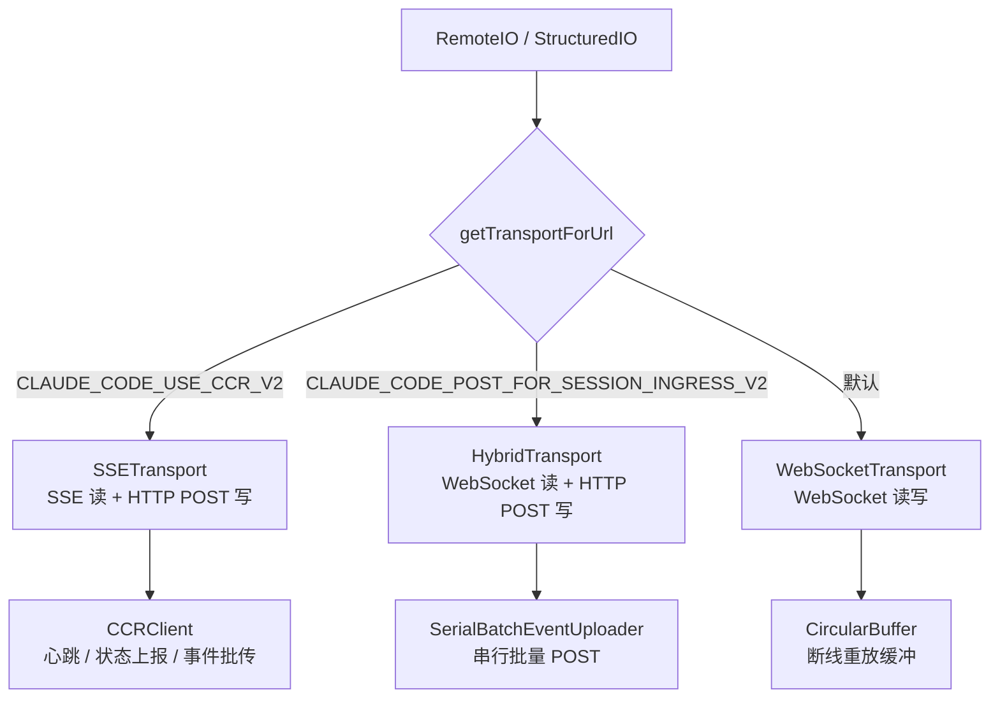

# CLI 传输层与远程会话

Claude Code 的网络通信层是整个系统的"神经网络"——它负责在 CLI 进程与远端服务之间可靠地传递消息。本章将深入剖析三种传输实现、批量上传机制、远程会话管理，以及将这一切串联起来的结构化 IO 系统。

## 传输层总览

传输层位于 `src/cli/transports/` 目录，定义了一个统一的 `Transport` 接口，并提供三种具体实现：



传输选择逻辑集中在 `src/cli/transports/transportUtils.ts`：

```typescript title="src/cli/transports/transportUtils.ts"
export function getTransportForUrl(
  url: URL,
  headers: Record<string, string> = {},
  sessionId?: string,
  refreshHeaders?: () => Record<string, string>,
): Transport {
  if (isEnvTruthy(process.env.CLAUDE_CODE_USE_CCR_V2)) {
    // v2：SSE 读取 + HTTP POST 写入
    const sseUrl = new URL(url.href)
    sseUrl.pathname =
      sseUrl.pathname.replace(/\/$/, '') + '/worker/events/stream'
    return new SSETransport(sseUrl, headers, sessionId, refreshHeaders)
  }
  if (url.protocol === 'ws:' || url.protocol === 'wss:') {
    if (isEnvTruthy(process.env.CLAUDE_CODE_POST_FOR_SESSION_INGRESS_V2)) {
      return new HybridTransport(url, headers, sessionId, refreshHeaders)
    }
    return new WebSocketTransport(url, headers, sessionId, refreshHeaders)
  }
  throw new Error(`Unsupported protocol: ${url.protocol}`)
}
```

三种传输的核心差异如下表所示：

| 传输类型 | 读取方式 | 写入方式 | 适用场景 |
|---------|---------|---------|---------|
| `WebSocketTransport` | WebSocket | WebSocket | 默认模式，低延迟双向通信 |
| `HybridTransport` | WebSocket | HTTP POST | 需要可靠写入保证时 |
| `SSETransport` | Server-Sent Events | HTTP POST | CCR v2 环境，支持断点续传 |

## SSETransport：服务器推送事件传输

`SSETransport`（`src/cli/transports/SSETransport.ts`）是 CCR v2 环境下的首选传输方式。它用 SSE 长连接接收服务端推送，用 HTTP POST 发送消息。

### SSE 帧解析

SSE 协议以双换行符 `\n\n` 分隔帧，每帧包含 `event:`、`id:`、`data:` 字段。`SSETransport` 内置了一个增量帧解析器：

```typescript title="src/cli/transports/SSETransport.ts"
export function parseSSEFrames(buffer: string): {
  frames: SSEFrame[]
  remaining: string
} {
  const frames: SSEFrame[] = []
  let pos = 0
  let idx: number
  while ((idx = buffer.indexOf('\n\n', pos)) !== -1) {
    const rawFrame = buffer.slice(pos, idx)
    pos = idx + 2
    if (!rawFrame.trim()) continue
    const frame: SSEFrame = {}
    for (const line of rawFrame.split('\n')) {
      const colonIdx = line.indexOf(':')
      if (colonIdx === -1) continue
      const field = line.slice(0, colonIdx)
      const value = line[colonIdx + 1] === ' '
        ? line.slice(colonIdx + 2)
        : line.slice(colonIdx + 1)
      switch (field) {
        case 'event': frame.event = value; break
        case 'id':    frame.id = value;    break
        case 'data':  frame.data = frame.data
          ? frame.data + '\n' + value : value; break
      }
    }
    if (frame.data) frames.push(frame)
  }
  return { frames, remaining: buffer.slice(pos) }
}
```

### 断点续传与序列号

每个 SSE 帧携带 `id:` 字段（即序列号）。`SSETransport` 维护 `lastSequenceNum` 高水位线，重连时通过 `Last-Event-ID` 请求头和 `from_sequence_num` 查询参数告知服务端从哪里续传，避免重放整个会话历史。

### 活跃性检测

服务端每 15 秒发送一次 keepalive 注释帧（`:keepalive`）。客户端设置 45 秒的活跃性定时器，任何帧（包括注释帧）都会重置该定时器。超时则视连接已死，触发重连：

```typescript title="src/cli/transports/SSETransport.ts"
// 服务端每 15s 发 keepalive；45s 无帧则视为连接已死
const LIVENESS_TIMEOUT_MS = 45_000

private readonly onLivenessTimeout = (): void => {
  this.abortController?.abort()
  this.handleConnectionError()
}
```

### 自动重连策略

连接断开后，`SSETransport` 采用指数退避（基础 1s，上限 30s，±25% 抖动），并设置 10 分钟的总重连预算。超出预算则关闭传输并通知上层：

```typescript title="src/cli/transports/SSETransport.ts"
const RECONNECT_BASE_DELAY_MS = 1000
const RECONNECT_MAX_DELAY_MS = 30_000
const RECONNECT_GIVE_UP_MS = 600_000  // 10 分钟
```

## WebSocketTransport：全双工 WebSocket 传输

`WebSocketTransport`（`src/cli/transports/WebSocketTransport.ts`）是默认传输方式，同时支持 Bun 原生 WebSocket 和 Node.js `ws` 包。

### 双运行时适配

代码通过 `typeof Bun !== 'undefined'` 判断运行时，分别使用不同的 API 绑定事件监听器：

```typescript title="src/cli/transports/WebSocketTransport.ts"
if (typeof Bun !== 'undefined') {
  const ws = new globalThis.WebSocket(this.url.href, {
    headers,
    proxy: getWebSocketProxyUrl(this.url.href),
    tls: getWebSocketTLSOptions() || undefined,
  } as unknown as string[])
  ws.addEventListener('open', this.onBunOpen)
  ws.addEventListener('message', this.onBunMessage)
  // ...
} else {
  const { default: WS } = await import('ws')
  const ws = new WS(this.url.href, { headers, agent: ... })
  ws.on('open', this.onNodeOpen)
  ws.on('message', this.onNodeMessage)
  // ...
}
```

事件处理器以类属性箭头函数形式定义，确保可以被 `removeEventListener` / `off` 精确移除，防止重连时内存泄漏。

### 消息缓冲与断线重放

`WebSocketTransport` 维护一个 `CircularBuffer<StdoutMessage>`（容量 1000），记录所有带 `uuid` 的出站消息。重连成功后，通过 `X-Last-Request-Id` 响应头确认服务端已收到的最后一条消息，然后只重放未确认的消息：

```typescript title="src/cli/transports/WebSocketTransport.ts"
private replayBufferedMessages(lastId: string): void {
  const messages = this.messageBuffer.toArray()
  // 找到服务端确认的最后一条，只重放之后的消息
  const lastConfirmedIndex = messages.findIndex(
    message => 'uuid' in message && message.uuid === lastId,
  )
  if (lastConfirmedIndex >= 0) {
    const remaining = messages.slice(lastConfirmedIndex + 1)
    this.messageBuffer.clear()
    this.messageBuffer.addAll(remaining)
  }
  // 重放未确认消息
  for (const message of messages.slice(startIndex)) {
    this.sendLine(jsonStringify(message) + '\n')
  }
}
```

### 睡眠检测与代理保活

WebSocket 传输面临两个特殊挑战：

1. **系统睡眠**：笔记本合盖后，`setInterval` 不会补发错过的 tick，唤醒时只触发一次回调。代码通过检测相邻 tick 间隔是否超过 60s（`SLEEP_DETECTION_THRESHOLD_MS`）来判断系统曾经睡眠，并立即强制重连。

2. **代理空闲超时**：Cloudflare 等代理会在 5 分钟无数据后断开连接。`WebSocketTransport` 每 5 分钟发送一个 `{"type":"keep_alive"}` 数据帧（非 ping 控制帧，因为代理不计入 ping/pong）来重置代理的空闲计时器。
