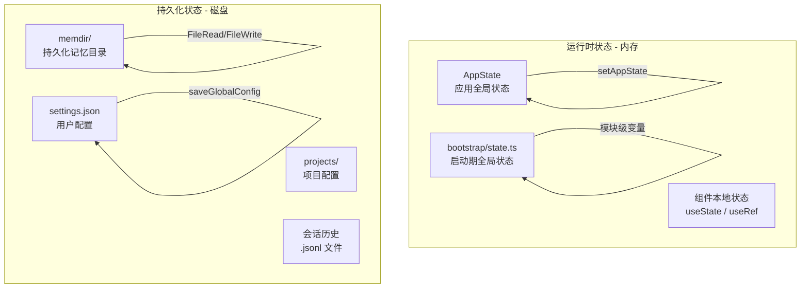
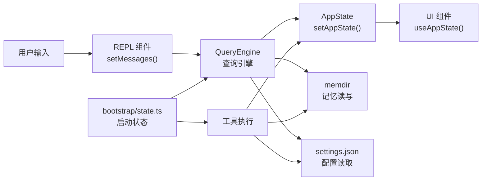

# 第 13 章 · 状态管理与数据持久化

> 一个 CLI 工具如何在没有数据库的情况下管理复杂的运行时状态？如何在会话之间持久化用户记忆？如何在版本升级时平滑迁移配置？本章将深入解析 Claude Code 的状态管理体系，从内存中的 AppState 到磁盘上的 memdir，从 Zod Schema 验证到版本迁移系统。

## 13.1 状态管理架构概览

Claude Code 的状态分为两个层次：



| 状态类型 | 存储位置 | 生命周期 | 访问方式 |
|---------|---------|---------|---------|
| AppState | 内存（React Store） | 单次会话 | `useAppState(selector)` |
| Bootstrap State | 内存（模块变量） | 单次会话 | 直接函数调用 |
| 用户配置 | `~/.claude/settings.json` | 跨会话 | `getGlobalConfig()` |
| 项目配置 | `.claude/settings.json` | 跨会话 | `getProjectConfig()` |
| 持久化记忆 | `~/.claude/projects/*/memory/` | 跨会话 | FileRead/FileWrite |
| 会话历史 | `~/.claude/projects/*/sessions/` | 跨会话 | CCR API |

## 13.2 AppState：运行时状态的单一数据源

### Store 的实现

`src/state/store.ts` 实现了一个极简的发布-订阅 Store，不依赖任何外部状态管理库：

```typescript title="src/state/store.ts" showLineNumbers
export function createStore<T>(
  initialState: T,
  onChange?: OnChange<T>,
): Store<T> {
  let state = initialState
  const listeners = new Set<Listener>()

  return {
    getState: () => state,

    setState: (updater: (prev: T) => T) => {
      const prev = state
      const next = updater(prev)
      // highlight-next-line
      if (Object.is(next, prev)) return  // 引用相等则跳过，避免不必要的重渲染
      state = next
      onChange?.({ newState: next, oldState: prev })
      for (const listener of listeners) listener()
    },

    subscribe: (listener: Listener) => {
      listeners.add(listener)
      return () => listeners.delete(listener)  // 返回取消订阅函数
    },
  }
}
```

这个 Store 的设计非常精简：
- **不可变更新**：`setState` 接受一个 `(prev) => next` 函数，确保状态更新是纯函数
- **引用相等检查**：`Object.is(next, prev)` 防止相同状态触发不必要的重渲染
- **Set 存储监听器**：自动去重，避免同一监听器被注册多次

### AppState 的结构

`AppState`（定义在 `src/state/AppStateStore.ts`）是整个应用的全局状态类型，包含了几乎所有运行时需要的信息：

```typescript title="src/state/AppStateStore.ts" showLineNumbers
export type AppState = DeepImmutable<{
  settings: SettingsJson              // 用户设置（从磁盘加载）
  verbose: boolean                    // 详细输出模式
  mainLoopModel: ModelSetting         // 当前使用的 LLM 模型
  toolPermissionContext: ToolPermissionContext  // 工具权限上下文
  mcp: {                              // MCP 服务器连接状态
    clients: MCPServerConnection[]
    resources: ServerResource[]
  }
  tasks: Record<AgentId, TaskState>   // 后台任务状态
  teamContext?: TeamContext           // 多智能体团队上下文
  plugins: {                          // 已加载的插件
    enabled: LoadedPlugin[]
    disabled: LoadedPlugin[]
    errors: PluginError[]
  }
  // ... 更多字段
}>
```

`DeepImmutable<T>` 是一个递归只读类型，确保 AppState 的所有嵌套属性都是只读的，防止意外的直接修改。

### useAppState：精细化订阅

组件通过 `useAppState(selector)` 订阅 AppState 的特定切片：

```typescript title="src/state/AppState.tsx" showLineNumbers
// 只订阅需要的字段，避免不必要的重渲染
const verbose = useAppState(s => s.verbose)
const model = useAppState(s => s.mainLoopModel)

// 订阅子对象引用（不要返回新对象！）
const { text, promptId } = useAppState(s => s.promptSuggestion)  // ✅
// const data = useAppState(s => ({ a: s.a, b: s.b }))  // ❌ 每次都是新对象
```

底层使用 React 18 的 `useSyncExternalStore`，确保并发模式下的状态一致性。

### AppStateProvider：防止嵌套

`AppStateProvider` 通过 `HasAppStateContext` 防止嵌套使用：

```typescript title="src/state/AppState.tsx" showLineNumbers
const HasAppStateContext = React.createContext<boolean>(false)

export function AppStateProvider({ children, initialState, onChangeAppState }) {
  const hasAppStateContext = useContext(HasAppStateContext)
  if (hasAppStateContext) {
    // highlight-next-line
    throw new Error('AppStateProvider can not be nested within another AppStateProvider')
  }
  // Store 只创建一次，Context 值永远不变
  // 消费者通过 useSyncExternalStore 订阅状态切片
  const [store] = useState(() => createStore(initialState ?? getDefaultAppState(), onChangeAppState))
  // ...
}
```

Store 只在 `useState` 初始化时创建一次，Context 值（store 引用）永远不变，因此 Provider 本身不会触发重渲染。消费者通过 `useSyncExternalStore` 直接订阅 store，只在自己关心的状态切片变化时重渲染。

## 13.3 Bootstrap State：启动期全局状态

`src/bootstrap/state.ts` 管理着启动阶段需要的全局状态，使用**模块级变量 + getter/setter 函数**的模式，而非 React Context：

```typescript title="src/bootstrap/state.ts" showLineNumbers
// 模块级变量——进程级单例
let sessionId: SessionId = generateSessionId()
let originalCwd: string = process.cwd()
let mainLoopModelOverride: ModelSetting | null = null
let totalCostUSD = 0

// 通过函数访问，而非直接暴露变量
export function getSessionId(): SessionId { return sessionId }
export function getOriginalCwd(): string { return originalCwd }
export function setCwd(cwd: string): void { originalCwd = cwd }

// 成本追踪
export function addToTotalCostState(cost: number, ...): void {
  totalCostUSD += cost
}
export function getTotalCostUSD(): number { return totalCostUSD }
```

Bootstrap State 与 AppState 的区别：
- **Bootstrap State**：进程级单例，非 React，适合非 UI 代码（工具、服务）访问
- **AppState**：React Context，适合 UI 组件订阅，支持精细化重渲染

## 13.4 持久化内存目录（memdir）系统

`src/memdir/` 实现了 Claude Code 的"长期记忆"机制。记忆以 Markdown 文件形式存储在文件系统中，跨会话持久化。

### 目录结构

```
~/.claude/
├── projects/
│   └── {project-slug}/
│       └── memory/
│           ├── MEMORY.md          # 记忆索引（入口文件）
│           ├── user_role.md       # 用户角色记忆
│           ├── feedback_testing.md # 反馈记忆
│           └── team/              # 团队共享记忆（TEAMMEM 特性）
│               └── MEMORY.md
```

### MEMORY.md：索引文件

`MEMORY.md` 是记忆系统的入口文件，作为所有记忆文件的索引：

```markdown
# MEMORY.md（示例）

- [用户角色](user_role.md) — 后端工程师，专注 TypeScript
- [测试偏好](feedback_testing.md) — 偏好 vitest，不喜欢 jest
- [项目约定](project_conventions.md) — 使用 bun 而非 npm
```

`MEMORY.md` 有严格的大小限制：

```typescript title="src/memdir/memdir.ts" showLineNumbers
export const MAX_ENTRYPOINT_LINES = 200
export const MAX_ENTRYPOINT_BYTES = 25_000  // ~25KB

export function truncateEntrypointContent(raw: string): EntrypointTruncation {
  const contentLines = trimmed.split('\n')
  const wasLineTruncated = lineCount > MAX_ENTRYPOINT_LINES
  const wasByteTruncated = byteCount > MAX_ENTRYPOINT_BYTES

  // 先按行截断，再按字节截断（在最后一个换行符处截断，避免切断行中间）
  if (truncated.length > MAX_ENTRYPOINT_BYTES) {
    const cutAt = truncated.lastIndexOf('\n', MAX_ENTRYPOINT_BYTES)
    truncated = truncated.slice(0, cutAt > 0 ? cutAt : MAX_ENTRYPOINT_BYTES)
  }
  // 追加截断警告，提示用户精简索引
  return { content: truncated + '\n\n> WARNING: MEMORY.md is ...', ... }
}
```

### 记忆文件格式

每个记忆文件使用 YAML frontmatter 定义元数据：

```markdown
---
name: 用户角色
description: 用户的职业背景和技术偏好
type: user
---

# 用户角色

用户是一名后端工程师，主要使用 TypeScript 和 Go。
偏好函数式编程风格，不喜欢过度的面向对象设计。
```

记忆类型（`type` 字段）分为四类：
- `user`：关于用户的信息（角色、偏好、背景）
- `feedback`：用户对 AI 行为的反馈（"不要这样做"）
- `project`：项目相关的上下文（约定、架构决策）
- `reference`：外部系统的引用（文档链接、工具路径）

### 记忆加载流程

`loadMemoryPrompt()` 在每次会话开始时加载记忆，注入到系统提示词中：

```typescript title="src/memdir/memdir.ts" showLineNumbers
export async function loadMemoryPrompt(): Promise<string | null> {
  const autoEnabled = isAutoMemoryEnabled()

  // KAIROS 模式：使用日志追加模式（而非 MEMORY.md 索引模式）
  if (feature('KAIROS') && autoEnabled && getKairosActive()) {
    return buildAssistantDailyLogPrompt(skipIndex)
  }

  // 团队记忆模式：同时加载个人和团队记忆
  if (feature('TEAMMEM') && teamMemPaths!.isTeamMemoryEnabled()) {
    await ensureMemoryDirExists(teamDir)
    return teamMemPrompts!.buildCombinedMemoryPrompt(extraGuidelines, skipIndex)
  }

  // 标准模式：加载个人记忆
  if (autoEnabled) {
    await ensureMemoryDirExists(autoDir)
    return buildMemoryLines('auto memory', autoDir, extraGuidelines, skipIndex).join('\n')
  }

  return null  // 记忆功能已禁用
}
```

### 记忆目录确保存在

`ensureMemoryDirExists()` 在加载记忆前确保目录存在，让 LLM 可以直接写入而无需先检查：

```typescript title="src/memdir/memdir.ts" showLineNumbers
export async function ensureMemoryDirExists(memoryDir: string): Promise<void> {
  const fs = getFsImplementation()
  try {
    await fs.mkdir(memoryDir)  // recursive: true，自动创建父目录
  } catch (e) {
    // EEXIST 已在 fs.mkdir 内部处理
    // 其他错误（EACCES/EPERM）记录日志但不阻塞
    logForDebugging(`ensureMemoryDirExists failed: ${code ?? String(e)}`)
  }
}
```

系统提示词中明确告知 LLM："目录已存在，直接用 Write 工具写入，不要运行 mkdir 或检查是否存在。"这避免了 LLM 浪费轮次做不必要的检查。

## 13.5 配置 Schema 验证（Zod）

Claude Code 使用 Zod 对所有配置文件进行运行时验证，确保配置数据的类型安全。

### 配置层次结构

配置分为三个层次，优先级从低到高：

```
全局配置（~/.claude/settings.json）
    ↓ 被覆盖
项目配置（.claude/settings.json）
    ↓ 被覆盖
本地配置（.claude/settings.local.json）
```

### Hooks Schema 验证

`src/schemas/hooks.ts` 定义了 Hooks 配置的 Zod Schema：

```typescript title="src/schemas/hooks.ts" showLineNumbers
import { z } from 'zod/v4'

// Hooks 配置的完整 Schema
export const HooksSettingsSchema = z.object({
  PreToolUse: z.array(HookSchema).optional(),
  PostToolUse: z.array(HookSchema).optional(),
  Stop: z.array(HookSchema).optional(),
  Notification: z.array(HookSchema).optional(),
  PreCompact: z.array(HookSchema).optional(),
  SubagentStop: z.array(HookSchema).optional(),
  PermissionRequest: z.array(HookSchema).optional(),
})

// 单个 Hook 的 Schema
const HookSchema = z.object({
  matcher: z.string().optional(),
  hooks: z.array(z.object({
    type: z.enum(['command', 'callback']),
    command: z.string().optional(),
    timeout: z.number().optional(),
  })),
})
```

### 配置读写模式

配置文件的读写通过 `src/utils/settings/` 目录下的工具函数进行，所有写入都经过 Zod 验证：

```typescript
// 读取全局配置（带 Zod 验证）
const config = getGlobalConfig()

// 更新全局配置（原子写入）
saveGlobalConfig(prev => ({
  ...prev,
  migrationVersion: CURRENT_MIGRATION_VERSION,
}))
```

## 13.6 迁移系统

`src/migrations/` 目录包含了所有配置迁移逻辑。迁移系统确保用户配置能够从旧版本平滑升级到新版本。

### 迁移版本控制

迁移通过版本号控制，在 `src/main.tsx` 中定义：

```typescript title="src/main.tsx" showLineNumbers
const CURRENT_MIGRATION_VERSION = 11

function runMigrations(): void {
  if (getGlobalConfig().migrationVersion !== CURRENT_MIGRATION_VERSION) {
    // 按顺序执行所有迁移
    migrateAutoUpdatesToSettings()
    migrateBypassPermissionsAcceptedToSettings()
    migrateEnableAllProjectMcpServersToSettings()
    resetProToOpusDefault()
    migrateSonnet1mToSonnet45()
    migrateLegacyOpusToCurrent()
    migrateSonnet45ToSonnet46()
    migrateOpusToOpus1m()
    migrateReplBridgeEnabledToRemoteControlAtStartup()

    // 更新版本号，确保迁移只运行一次
    saveGlobalConfig(prev => ({
      ...prev,
      migrationVersion: CURRENT_MIGRATION_VERSION,
    }))
  }
  // 异步迁移（fire-and-forget）
  migrateChangelogFromConfig().catch(() => {})
}
```

### 迁移示例：模型名称迁移

以 `migrateSonnet45ToSonnet46.ts` 为例，展示典型的迁移逻辑：

```typescript title="src/migrations/migrateSonnet45ToSonnet46.ts" showLineNumbers
export function migrateSonnet45ToSonnet46(): void {
  // 迁移全局配置中的模型设置
  const globalConfig = getGlobalConfig()
  if (globalConfig.model === 'claude-sonnet-4-5') {
    saveGlobalConfig(prev => ({ ...prev, model: 'claude-sonnet-4-6' }))
  }

  // 迁移所有项目配置中的模型设置
  for (const projectConfig of getAllProjectConfigs()) {
    if (projectConfig.model === 'claude-sonnet-4-5') {
      saveProjectConfig(projectConfig.path, prev => ({
        ...prev,
        model: 'claude-sonnet-4-6',
      }))
    }
  }
}
```

迁移系统的设计原则：
- **幂等性**：通过版本号确保每个迁移只运行一次
- **顺序执行**：迁移按定义顺序执行，确保依赖关系正确
- **同步优先**：关键迁移同步执行，确保后续代码看到正确的配置
- **异步兜底**：非关键迁移（如 changelog）异步执行，不阻塞启动

## 13.7 会话历史管理

`src/assistant/sessionHistory.ts` 实现了会话历史的远程存储和检索，通过 CCR API 分页加载历史事件。

### 分页加载

会话历史可能非常长，因此采用分页加载策略：

```typescript title="src/assistant/sessionHistory.ts" showLineNumbers
export const HISTORY_PAGE_SIZE = 100

// 加载最新的一页（最近 100 条事件）
export async function fetchLatestEvents(
  ctx: HistoryAuthCtx,
  limit = HISTORY_PAGE_SIZE,
): Promise<HistoryPage | null> {
  return fetchPage(ctx, { limit, anchor_to_latest: true }, 'fetchLatestEvents')
}

// 加载更早的一页（基于游标）
export async function fetchOlderEvents(
  ctx: HistoryAuthCtx,
  beforeId: string,
  limit = HISTORY_PAGE_SIZE,
): Promise<HistoryPage | null> {
  return fetchPage(ctx, { limit, before_id: beforeId }, 'fetchOlderEvents')
}
```

`HistoryPage` 包含：
- `events`：按时间顺序排列的事件列表
- `firstId`：本页最早事件的 ID（用作下一页的游标）
- `hasMore`：是否还有更早的事件

### 认证上下文

会话历史 API 需要 OAuth 认证：

```typescript title="src/assistant/sessionHistory.ts" showLineNumbers
export async function createHistoryAuthCtx(
  sessionId: string,
): Promise<HistoryAuthCtx> {
  const { accessToken, orgUUID } = await prepareApiRequest()
  return {
    baseUrl: `${getOauthConfig().BASE_API_URL}/v1/sessions/${sessionId}/events`,
    headers: {
      ...getOAuthHeaders(accessToken),
      'anthropic-beta': 'ccr-byoc-2025-07-29',
      'x-organization-uuid': orgUUID,
    },
  }
}
```

## 13.8 状态在各模块间的流转

理解状态管理的关键，在于看清状态如何在各模块间流转：



**数据流向**：
1. 用户输入 → REPL 组件更新消息状态
2. QueryEngine 执行查询 → 更新 AppState（任务状态、成本等）
3. 工具执行 → 可能读写 memdir（记忆）或 settings.json（配置）
4. AppState 变化 → UI 组件自动重渲染

**关键设计**：AppState 是单向数据流的核心，所有状态变更通过 `setAppState` 进行，UI 通过 `useAppState` 订阅，形成清晰的数据流向。

## 13.9 本章小结

Claude Code 的状态管理体系体现了几个重要的设计原则：

1. **分层管理**：运行时状态（AppState）和持久化状态（memdir/配置）分离，各司其职
2. **单一数据源**：AppState 作为 UI 状态的单一数据源，通过精细化订阅避免不必要的重渲染
3. **类型安全**：Zod Schema 确保配置数据的运行时类型安全
4. **平滑迁移**：版本号控制的迁移系统确保配置升级的可靠性
5. **文件系统作为数据库**：memdir 系统展示了如何在 CLI 应用中用文件系统实现可靠的数据持久化

---

## 术语表

| 术语 | 说明 |
|------|------|
| AppState | 应用全局运行时状态，通过 React Context 和 useSyncExternalStore 管理 |
| Bootstrap State | 启动期全局状态，使用模块级变量存储，非 React |
| memdir | 持久化内存目录系统，以 Markdown 文件形式存储跨会话记忆 |
| MEMORY.md | 记忆索引文件，作为所有记忆文件的入口 |
| DeepImmutable | 递归只读类型，防止 AppState 被意外修改 |
| useSyncExternalStore | React 18 API，用于订阅外部 Store，支持并发模式 |
| 迁移版本号 | 控制配置迁移只运行一次的版本计数器 |
