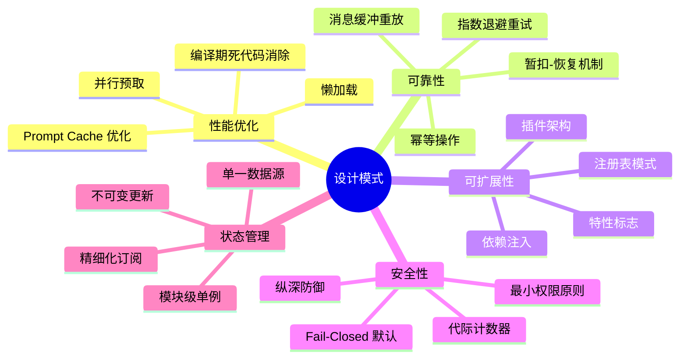

# 第 14 章 · 工程实践与设计模式

> 经过前 13 章的深入分析，我们已经全面了解了 Claude Code 的各个子系统。本章将从全局视角提炼这个项目中最值得借鉴的工程实践和设计模式，帮助你将这些经过大规模生产验证的智慧应用到自己的项目中。

## 14.1 核心设计模式总览

在整个代码库中，我们反复看到以下设计模式的应用。这些模式不是偶然的——它们是在解决真实工程问题的过程中自然涌现的。



## 14.2 并行预取：隐藏延迟的艺术

**模式描述**：在等待 CPU 密集型操作（如模块加载）的同时，并行启动 I/O 操作，将 I/O 等待时间隐藏在 CPU 工作时间背后。

**在项目中的应用**：

```typescript title="src/main.tsx" showLineNumbers
// 在模块 import 语句之间插入副作用调用
// 利用 ~135ms 的模块加载时间并行执行 I/O
import { profileCheckpoint } from './utils/startupProfiler.js'
profileCheckpoint('main_tsx_entry')

import { startMdmRawRead } from './utils/settings/mdm/rawRead.js'
startMdmRawRead()  // 启动 MDM 子进程（~50ms）

import { startKeychainPrefetch } from './utils/secureStorage/keychainPrefetch.js'
startKeychainPrefetch()  // 并行读取 Keychain（~65ms）

// 接下来是 ~135ms 的 import 语句
// 在这段时间里，上面的 I/O 操作在后台并行执行
import { feature } from 'bun:bundle'
// ...
```

**性能收益**：启动时间节省约 200ms（MDM + Keychain + API 预连接）。

**可复用的模式**：
```typescript
// 通用模式：在模块加载期间启动 I/O
import { startExpensiveIO } from './expensive-io.js'
startExpensiveIO()  // fire-and-forget，与后续 import 并行

import { heavyModule } from './heavy-module.js'  // ~100ms 加载时间
// 此时 expensiveIO 已经完成或接近完成
const result = await getExpensiveIOResult()  // 几乎免费
```

**适用场景**：CLI 工具启动、服务器初始化、任何需要在"等待期"内预热缓存的场景。

## 14.3 编译期死代码消除：零成本特性标志

**模式描述**：使用构建时特性标志，让未启用的功能代码在构建产物中完全不存在，而不是通过运行时条件分支控制。

**在项目中的应用**：

```typescript title="src/tools.ts" showLineNumbers
import { feature } from 'bun:bundle'

// 编译期条件：当 COORDINATOR_MODE 为 false 时，
// 整个 require 分支在构建时被完全移除
const coordinatorModeModule = feature('COORDINATOR_MODE')
  ? require('./coordinator/coordinatorMode.js')
  : null

// 运行时条件（对比）：代码始终存在，只是不执行
// if (process.env.COORDINATOR_MODE) { ... }  // ❌ 代码仍在产物中
```

**与运行时特性标志的对比**：

| 维度 | 编译期（bun:bundle） | 运行时（GrowthBook） |
|------|---------------------|---------------------|
| 代码影响 | 未启用代码完全移除 | 代码始终存在 |
| 包体积 | 更小 | 不变 |
| 变更方式 | 需要重新构建 | 服务端配置即时生效 |
| 适用场景 | 大型模块的条件加载 | A/B 测试、灰度发布 |

**可复用的模式**：对于大型可选功能（如语音模式、协调器模式），使用编译期标志；对于需要动态调整的功能（如 UI 实验），使用运行时标志。

## 14.4 暂扣-恢复机制：优雅的错误处理

**模式描述**：当遇到可能可恢复的错误时，先暂扣（不立即传递给调用方），尝试恢复，恢复成功则丢弃错误，恢复失败则暴露错误。

**在项目中的应用**（查询引擎的 Prompt-Too-Long 恢复）：

```typescript title="src/query.ts" showLineNumbers
let withheld = false

// 检查是否可以恢复
if (contextCollapse?.isWithheldPromptTooLong(message, ...)) {
  withheld = true  // 暂扣错误，尝试上下文折叠
}
if (reactiveCompact?.isWithheldPromptTooLong(message)) {
  withheld = true  // 暂扣错误，尝试响应式压缩
}

if (!withheld) {
  yield yieldMessage  // 无法恢复，暴露错误
}

// 后续：尝试恢复
if (withheld) {
  // 尝试压缩上下文
  const recovered = await tryRecover(messages)
  if (recovered) {
    continue  // 恢复成功，继续循环（错误被丢弃）
  }
  yield lastMessage  // 恢复失败，暴露被暂扣的错误
}
```

**可复用的模式**：
```typescript
async function withRecovery<T>(
  operation: () => Promise<T>,
  recover: (error: Error) => Promise<T | null>,
): Promise<T> {
  try {
    return await operation()
  } catch (error) {
    const recovered = await recover(error as Error)
    if (recovered !== null) return recovered
    throw error  // 恢复失败，重新抛出
  }
}
```

**适用场景**：网络请求失败后的降级、上下文溢出后的压缩、Token 超限后的续写。
