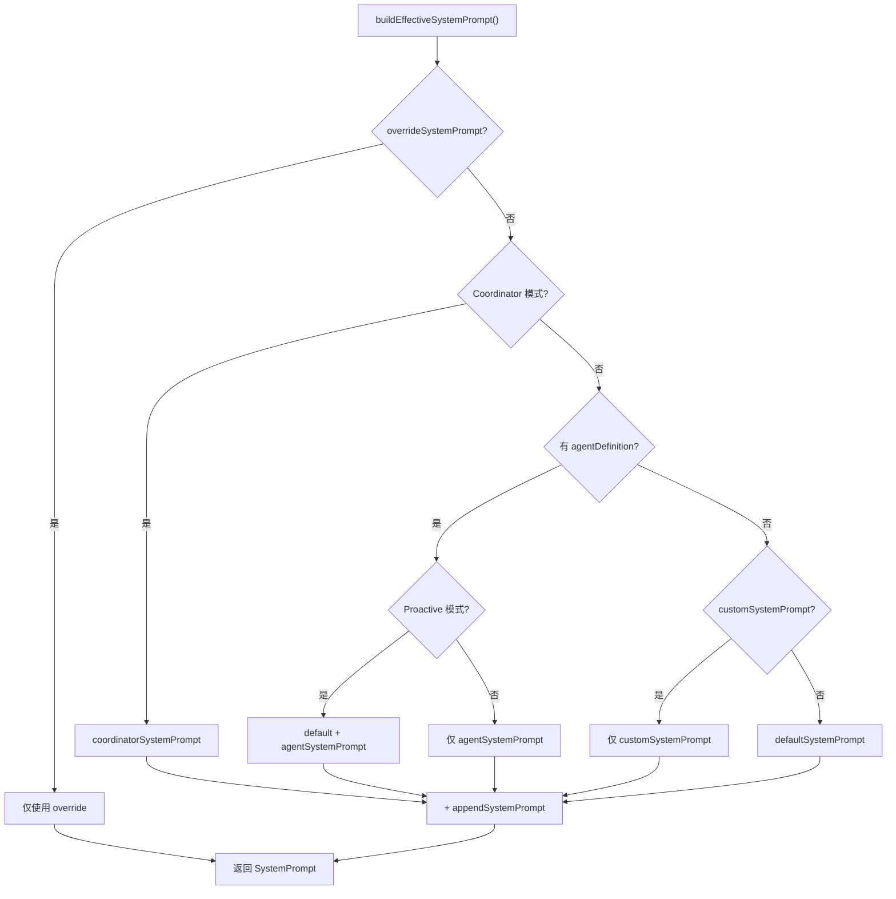
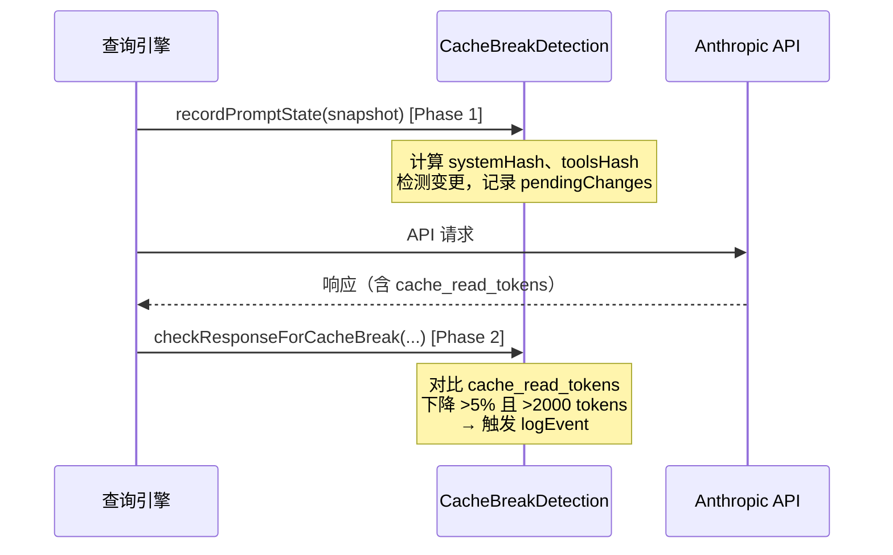

# 第 15 章 · Prompt 工程体系

> 控制一个 LLM 智能体的行为，本质上是一道 Prompt 工程问题。Claude Code 用 80+ 工具、14 个系统提示词分区、100+ 个工具 `prompt.ts` 文件构建了一套精密的 Prompt 设计体系——既要让模型懂得"用哪个工具"，又要让它知道"怎么用"，同时还要把对 Prompt Cache 的影响控制在可观测的范围内。本章将这套体系完整呈现。

## 15.1 概述：Prompt 设计是核心工程活动

在查询引擎（第 5 章）的视角下，每次 API 调用都会携带一个完整的 **system prompt** 数组。这个数组不是一段静态文字，而是由数十个独立函数的返回值动态拼装而成的"行为规范集合"。

Claude Code 的 Prompt 设计体系可以从三个层次来理解：

```
┌──────────────────────────────────────────────────────┐
│            系统提示词（System Prompt）                 │
│  ┌─────────────┐  ┌─────────────┐  ┌──────────────┐  │
│  │  静态分区   │  │ 动态边界标记 │  │   动态分区   │  │
│  │（可全局缓存）│  │ BOUNDARY    │  │（按需重计算）│  │
│  └─────────────┘  └─────────────┘  └──────────────┘  │
├──────────────────────────────────────────────────────┤
│              工具描述（Tool Descriptions）             │
│   每个工具的 prompt.ts — 告诉 LLM 何时、如何使用该工具 │
├──────────────────────────────────────────────────────┤
│             服务级 Prompt 模板（Service Prompts）      │
│   compact、extractMemories 等一次性任务的特殊指令集    │
└──────────────────────────────────────────────────────┘
```

| 文件 | 职责 |
|------|------|
| `src/constants/prompts.ts` | 系统提示词主组装函数 `getSystemPrompt()` |
| `src/constants/systemPromptSections.ts` | 分区注册与缓存机制 |
| `src/utils/systemPrompt.ts` | 有效提示词优先级裁决 `buildEffectiveSystemPrompt()` |
| `src/tools/*/prompt.ts` | 各工具的行为描述 |
| `src/services/compact/prompt.ts` | 会话压缩的 Prompt 模板 |
| `src/services/extractMemories/prompts.ts` | 记忆提取的 Prompt 模板 |
| `src/services/api/promptCacheBreakDetection.ts` | Prompt 缓存断裂监控 |

---

## 15.2 系统提示词的组装管道

### getSystemPrompt：主组装函数

`src/constants/prompts.ts` 中的 `getSystemPrompt()` 是系统提示词的核心出口。它接受工具集、模型名称和 MCP 客户端列表，返回一个 **字符串数组**——每个元素对应 Anthropic API `system` 参数中的一个文本块。

```typescript title="src/constants/prompts.ts" showLineNumbers
export async function getSystemPrompt(
  tools: Tools,
  model: string,
  additionalWorkingDirectories?: string[],
  mcpClients?: MCPServerConnection[],
): Promise<string[]> {
  // ...
  return [
    // --- 静态内容（可跨组织缓存）---
    getSimpleIntroSection(outputStyleConfig),   // 角色定位
    getSimpleSystemSection(),                   // 工具执行规则
    getSimpleDoingTasksSection(),               // 任务完成准则
    getActionsSection(),                        // 高危操作指南
    getUsingYourToolsSection(enabledTools),     // 工具使用偏好
    getSimpleToneAndStyleSection(),             // 输出风格
    getOutputEfficiencySection(),               // 简洁性要求
    // === 边界标记：此后为动态内容 ===
    SYSTEM_PROMPT_DYNAMIC_BOUNDARY,
    // --- 动态内容（注册表托管）---
    ...resolvedDynamicSections,
  ].filter(s => s !== null)
}
```

整个输出分为两个区域，由 `SYSTEM_PROMPT_DYNAMIC_BOUNDARY` 标记隔开。标记左侧的所有内容在同一版本的 Claude Code 中对所有用户完全相同，可以使用 Anthropic 的 **跨组织全局缓存**（`scope: 'global'`，5 分钟 TTL）；标记右侧包含用户特定的环境信息、记忆内容和 MCP 配置，必须每次重新计算。

### 静态分区一览

每个静态分区对应一个私有函数，职责清晰、互不依赖：

```typescript title="src/constants/prompts.ts" showLineNumbers
// 角色定位 — "You are an interactive agent..."
function getSimpleIntroSection(outputStyleConfig): string

// 系统行为规则 — 工具执行权限、system-reminder 标签处理等
function getSimpleSystemSection(): string

// 任务准则 — "不要过度设计"、安全编码实践等
function getSimpleDoingTasksSection(): string

// 高危操作 — 破坏性操作需先确认的规则
function getActionsSection(): string

// 工具偏好 — 优先用 Read 而非 cat，用 Glob 而非 find
function getUsingYourToolsSection(enabledTools: Set<string>): string

// 风格 — 不用 emoji，引用代码时带行号
function getSimpleToneAndStyleSection(): string

// 简洁性 — 直击要点，避免铺垫
function getOutputEfficiencySection(): string
```

:::tip 两个版本的 "简洁性" 指令
`getOutputEfficiencySection()` 内部存在版本分叉。外部用户看到简短的 `# Output efficiency` 章节；Anthropic 内部用户（`process.env.USER_TYPE === 'ant'`）看到更详细的 `# Communicating with the user` 指南——包含"倒金字塔结构"、"语义不回溯"等专业写作技巧。这种差异化说明了 Prompt 内容可以针对不同用户群体精细调整。
:::

### prependBullets：可组合的列表构建器

静态分区的内容通常由多个条目拼装，使用 `prependBullets()` 辅助函数：

```typescript title="src/constants/prompts.ts" showLineNumbers
export function prependBullets(items: Array<string | string[]>): string[] {
  return items.flatMap(item =>
    Array.isArray(item)
      ? item.map(subitem => `  - ${subitem}`)
      : [` - ${item}`],
  )
}
```

这个函数接受嵌套数组——字符串对应顶层条目，字符串数组对应子条目，自动处理缩进。例如 `getUsingYourToolsSection` 中"工具偏好"的主条目和"子工具列表"就是这样组装的：

```typescript
const items = [
  `Do NOT use the Bash tool when a dedicated tool is provided:`,
  providedToolSubitems,  // ← 字符串数组，自动缩进为子条目
  `Break down work with the ${taskToolName} tool.`,
]
return [`# Using your tools`, ...prependBullets(items)].join('\n')
```

---

## 15.3 动态分区与缓存机制

### systemPromptSection vs DANGEROUS_uncachedSystemPromptSection

动态分区通过 `src/constants/systemPromptSections.ts` 中的注册机制管理。每个分区是一个带有名称和计算函数的对象：

```typescript title="src/constants/systemPromptSections.ts" showLineNumbers
type SystemPromptSection = {
  name: string
  compute: ComputeFn
  cacheBreak: boolean  // true = 每轮重新计算
}

/**
 * 常规分区：计算一次，缓存到 /clear 或 /compact。
 */
export function systemPromptSection(
  name: string,
  compute: ComputeFn,
): SystemPromptSection {
  return { name, compute, cacheBreak: false }
}

/**
 * 易失分区：每轮重新计算，会破坏 Prompt Cache。
 * 必须提供 _reason 说明为何需要易失性。
 */
export function DANGEROUS_uncachedSystemPromptSection(
  name: string,
  compute: ComputeFn,
  _reason: string,
): SystemPromptSection {
  return { name, compute, cacheBreak: true }
}
```

函数命名采用了"让危险操作命名醒目"的设计哲学（与 `DANGEROUS_` 前缀的 React 生命周期类似）——每次你想创建易失分区时，都必须在代码里看到这个"警告"，迫使你认真思考是否真的需要。

### resolveSystemPromptSections：并发缓存解析

`resolveSystemPromptSections()` 负责并发解析所有注册的动态分区，对非易失分区使用内存缓存：

```typescript title="src/constants/systemPromptSections.ts" showLineNumbers
export async function resolveSystemPromptSections(
  sections: SystemPromptSection[],
): Promise<(string | null)[]> {
  const cache = getSystemPromptSectionCache()

  return Promise.all(
    sections.map(async s => {
      // cacheBreak=false 且已有缓存 → 直接返回缓存值
      if (!s.cacheBreak && cache.has(s.name)) {
        return cache.get(s.name) ?? null
      }
      const value = await s.compute()
      setSystemPromptSectionCacheEntry(s.name, value)
      return value
    }),
  )
}
```

由于所有 `Promise.all`，各分区并发计算，不存在串行等待。`clearSystemPromptSections()` 在 `/clear` 和 `/compact` 时调用，清空缓存并重置 Beta header 锁存器。

### 实际的动态分区

`getSystemPrompt()` 注册的动态分区包括：

```typescript title="src/constants/prompts.ts" showLineNumbers
const dynamicSections = [
  // 会话级指导（可见工具集变化时才变）
  systemPromptSection('session_guidance', () =>
    getSessionSpecificGuidanceSection(enabledTools, skillToolCommands)),

  // 用户记忆（从 memdir 加载）
  systemPromptSection('memory', () => loadMemoryPrompt()),

  // 环境信息（OS、工作目录、日期等）
  systemPromptSection('env_info_simple', () =>
    computeSimpleEnvInfo(model, additionalWorkingDirectories)),

  // 语言偏好
  systemPromptSection('language', () => getLanguageSection(settings.language)),

  // MCP 指令 — 易失：MCP 服务器随时连接/断开
  DANGEROUS_uncachedSystemPromptSection(
    'mcp_instructions',
    () => isMcpInstructionsDeltaEnabled()
      ? null
      : getMcpInstructionsSection(mcpClients),
    'MCP servers connect/disconnect between turns',
  ),
  // ...
]
```

注意 `mcp_instructions` 是唯一使用 `DANGEROUS_uncachedSystemPromptSection` 的分区——因为 MCP 服务器可能在会话中途连接或断开，指令必须每轮重新计算。其余分区都使用普通缓存。

---

## 15.4 有效系统提示词的优先级体系

实际发送给 API 的系统提示词并不总是 `getSystemPrompt()` 的输出，而是经过 `buildEffectiveSystemPrompt()` 的优先级裁决：

```typescript title="src/utils/systemPrompt.ts" showLineNumbers
/**
 * 优先级（从高到低）：
 * 0. Override（loop 模式等——完全替换所有提示词）
 * 1. Coordinator（多智能体协调者模式）
 * 2. Agent（主线程运行自定义智能体）
 *    - 主动模式（Proactive）：Agent 提示词追加到默认提示词后
 *    - 普通模式：Agent 提示词替换默认提示词
 * 3. Custom（通过 --system-prompt 指定）
 * 4. Default（标准 Claude Code 提示词）
 *
 * appendSystemPrompt 在非 Override 模式下始终追加到末尾。
 */
export function buildEffectiveSystemPrompt({
  mainThreadAgentDefinition,
  toolUseContext,
  customSystemPrompt,
  defaultSystemPrompt,
  appendSystemPrompt,
  overrideSystemPrompt,
}): SystemPrompt { ... }
```

这个优先级体系的设计逻辑是：

| 场景 | 使用的提示词 |
|------|-------------|
| Loop 模式或自动化流程 | `overrideSystemPrompt`（完全接管） |
| 协调者智能体 | `coordinatorSystemPrompt`（专为任务调度优化） |
| 自定义智能体（普通模式） | `agentSystemPrompt`（替换默认） |
| 自定义智能体（主动模式） | `defaultSystemPrompt` + `agentSystemPrompt`（追加） |
| `--system-prompt` 参数 | `customSystemPrompt`（替换默认） |
| 普通对话 | `defaultSystemPrompt` |



---

## 15.5 工具描述即行为规范

### prompt.ts 模式

每个工具目录下都有一个 `prompt.ts` 文件。这不是偶然——这是系统对"工具行为 = 独立 Prompt 模块"的架构表达。

```
src/tools/
├── BashTool/
│   ├── BashTool.tsx      ← 执行逻辑
│   └── prompt.ts         ← 行为规范：何时用，怎么用，什么不能做
├── AgentTool/
│   ├── AgentTool.tsx
│   └── prompt.ts
├── FileEditTool/
│   ├── FileEditTool.tsx
│   └── prompt.ts
...（共 30+ 个工具，每个都有对应的 prompt.ts）
```

工具的 `description` 字段（即 Anthropic API 的 `tool.description`）通常来自这个 `prompt.ts` 的导出函数。对 LLM 来说，这段文字就是该工具的全部"说明书"。

### 深度案例：BashTool 的行为规范

`src/tools/BashTool/prompt.ts` 的 `getSimplePrompt()` 包含约 120 行指令，结构清晰：

**第一部分：工具偏好排序**

```
IMPORTANT: Avoid using this tool to run `find`, `grep`, `cat`, `head`, `tail`, `sed`, `awk`, or `echo`...
Instead, use the appropriate dedicated tool:
 - File search: Use Glob (NOT find or ls)
 - Content search: Use Grep (NOT grep or rg)
 - Read files: Use Read (NOT cat/head/tail)
 - Edit files: Use Edit (NOT sed/awk)
```

这段指令解决了一个实际问题：LLM 天然倾向于使用 Bash 执行一切操作（因为训练数据中大量命令行操作都通过 shell），但这样做无法触发 Claude Code 的专用工具（Read、Grep 等），导致用户看不到友好的工具调用 UI，也无法逐步审批。

**第二部分：多命令执行规则**

```
When issuing multiple commands:
  - If independent and can run in parallel, make multiple Bash calls in one message
  - If sequential dependencies exist, use a single Bash call with '&&'
  - Use ';' only when you don't care if earlier commands fail
  - DO NOT use newlines to separate commands
```

这段指令将 Claude Code 的并发执行能力（多工具同一消息）与 shell 的命令串联语义统一成一套行为规范，避免了大量 "先等 A 再做 B" 的串行等待。

**第三部分：Git 安全操作指南**

`getCommitAndPRInstructions()` 生成约 60 行的 Git 操作指令，包含完整的提交流程（三步并行：`git status` + `git diff` + `git log`）和 PR 创建模板。核心规则：

```
Git Safety Protocol:
- NEVER update the git config
- NEVER run destructive git commands (reset --hard, clean -f...) without explicit request
- NEVER skip hooks (--no-verify, --no-gpg-sign)
- CRITICAL: Always create NEW commits rather than amending
```

值得注意的是，Anthropic 内部用户（`USER_TYPE === 'ant'`）看到的是精简版，指向 `/commit`、`/commit-push-pr` 技能；外部用户看到完整的内联指令。这是同一 `prompt.ts` 通过 `process.env.USER_TYPE` 分叉的典型例子。

**第四部分：Sandbox 边界描述**

当沙箱模式开启时，`getSimpleSandboxSection()` 会将实时的文件系统和网络限制配置序列化成 Prompt：

```typescript title="src/tools/BashTool/prompt.ts" showLineNumbers
function getSimpleSandboxSection(): string {
  const filesystemConfig = {
    read: { denyOnly: dedup(fsReadConfig.denyOnly) },
    write: { allowOnly: normalizeAllowOnly(fsWriteConfig.allowOnly) },
  }
  // ...
  return [
    '## Command sandbox',
    'The sandbox has the following restrictions:',
    `Filesystem: ${jsonStringify(filesystemConfig)}`,
    `Network: ${jsonStringify(networkConfig)}`,
    ...prependBullets(sandboxOverrideItems),
  ].join('\n')
}
```

沙箱路径中含有用户 UID 的临时目录（如 `/private/tmp/claude-1001/`）会被替换为 `$TMPDIR`——这是一个精妙的缓存优化：不同用户的沙箱路径不同，但归一化后的 Prompt 内容相同，可以命中共享缓存。

### 深度案例：AgentTool 的 Prompt 设计哲学

`src/tools/AgentTool/prompt.ts` 的 `getPrompt()` 包含了系统中最精心设计的一段 Prompt。

**"Writing the prompt" 章节**

这段 Prompt 指导 LLM 如何给子智能体写提示词，本质上是一套"元 Prompt 指南"：

```
Brief the agent like a smart colleague who just walked into the room — it hasn't seen 
this conversation, doesn't know what you've tried, doesn't understand why this task matters.
- Explain what you're trying to accomplish and why.
- Describe what you've already learned or ruled out.
- Give enough context that the agent can make judgment calls.
- If you need a short response, say so ("report in under 200 words").
- Lookups: hand over the exact command.
- Investigations: hand over the question — prescribed steps become dead weight when the premise is wrong.

Terse command-style prompts produce shallow, generic work.

**Never delegate understanding.** Don't write "based on your findings, fix the bug."
Those phrases push synthesis onto the agent instead of doing it yourself.
Write prompts that prove you understood: include file paths, line numbers, what specifically to change.
```

这段 Prompt 解决了智能体使用中的核心质量问题：当主智能体给子智能体的指令太模糊时（"帮我查查这个"），子智能体的输出质量极差。通过在工具描述中直接给出"如何写好 Prompt"的指南，系统把 Prompt 工程的最佳实践内嵌到了 LLM 的行为约束中。

**Fork vs 新智能体的行为差异**

`isForkSubagentEnabled()` 特性标志控制 AgentTool 的两种模式，对应不同的 Prompt 内容：

| 特性 | Fork 模式 | 新智能体模式 |
|------|-----------|-------------|
| 上下文继承 | 完全继承父智能体上下文 | 零上下文，需完整说明 |
| Prompt 写法 | "指令式"（上下文已知，直接说做什么） | "情景式"（需解释背景和动机） |
| 缓存共享 | 与父智能体共享 Prompt Cache | 独立缓存 |
| 模型 | 不建议指定（无法复用父缓存） | 可指定 |

这种差异直接体现在工具描述的文字中：Fork 模式下有专门的 `whenToForkSection`，详述何时应该 fork（研究型任务、多步实现）、何时不应该（需要干净隔离的场景）。

---

## 15.6 服务级 Prompt 模板

除了系统提示词和工具描述，系统中还有若干用于"一次性 LLM 任务"的独立 Prompt 模板，通常在服务层调用，不经过主查询引擎。

### Compact Prompt：上下文压缩的精密设计

`src/services/compact/prompt.ts` 的 Compact Prompt 是系统中最复杂的单次任务 Prompt 之一，包含约 200 行结构化指令。

**NO_TOOLS_PREAMBLE：强制纯文本输出**

```typescript title="src/services/compact/prompt.ts" showLineNumbers
const NO_TOOLS_PREAMBLE = `CRITICAL: Respond with TEXT ONLY. Do NOT call any tools.

- Do NOT use Read, Bash, Grep, Glob, Edit, Write, or ANY other tool.
- You already have all the context you need in the conversation above.
- Tool calls will be REJECTED and will waste your only turn — you will fail the task.
- Your entire response must be plain text: an <analysis> block followed by a <summary> block.
`
```

这段前言解决了一个实际的工程问题：Compact 任务使用"完美 fork"方式继承主智能体的完整工具集（这是 Prompt Cache 命中的必要条件），但在 Claude Sonnet 4.6+ 的自适应思考模式下，模型有时会尝试调用工具。由于 `maxTurns: 1`，一次被拒绝的工具调用意味着没有文本输出，触发流式降级（在 4.6 版本上出现率约 2.79%）。这段明确警告"工具调用=失败任务"的前言把此类问题的发生率降到接近零。

**Analysis + Summary 双阶段结构**

```
Before providing your final summary, wrap your analysis in <analysis> tags...
- Chronologically analyze each message
- Identify: user intents, approach, key decisions, code snippets, file names

[主要总结内容，含 9 个必须覆盖的部分]
```

`<analysis>` 块是模型的"草稿本"——引导模型在生成最终摘要前先系统性地整理思路，类似于思考链（Chain of Thought），但最终会被 `formatCompactSummary()` 剥离，不进入上下文。这避免了大量"分析 token"污染实际的压缩摘要。

**三种 Compact 变体**

系统提供三种不同场景的 Compact Prompt：

| 函数 | 场景 | 摘要范围 |
|------|------|----------|
| `getCompactPrompt()` | 整个会话压缩 | 全部消息 |
| `getPartialCompactPrompt(direction='from')` | 部分压缩（from 模式） | 最近的消息 |
| `getPartialCompactPrompt(direction='up_to')` | 部分压缩（up_to 模式） | 保留的前缀消息 |

`up_to` 模式特别有趣：摘要会被放在保留的新消息前面，因此第 9 个必须覆盖的部分不是"下一步"，而是"**继续工作所需的上下文**"——因为读者会先看到这份摘要，然后直接跳进后续消息，需要足够的背景信息来衔接。

### 记忆提取 Prompt：受限工具集的策略

`src/services/extractMemories/prompts.ts` 的记忆提取智能体在受限工具集下工作——只能读文件，不能写代码或执行命令：

```
Available tools: FileRead, Grep, Glob, read-only Bash (ls/find/cat/stat/wc/head/tail),
and FileEdit/FileWrite for paths inside the memory directory only.
Bash rm is not permitted. All other tools will be denied.
```

这种工具限制不是通过权限系统实现的（那会产生大量被拒绝的工具调用），而是通过 Prompt 明确告知模型"这些工具不可用"——让模型在生成工具调用之前就主动放弃不可用的选项。

**高效执行的两步策略**

记忆提取 Prompt 包含明确的时间预算指导：

```
You have a limited turn budget.
FileEdit requires a prior FileRead of the same file, so the efficient strategy is:
- Turn 1: issue all FileRead calls in parallel for every file you might update
- Turn 2: issue all FileWrite/FileEdit calls in parallel
Do not interleave reads and writes across multiple turns.
```

这段指令将"最优工具调用序列"直接编码进 Prompt，确保记忆提取任务在最少的轮次内完成。

---

## 15.7 Prompt 缓存监控系统

`src/services/api/promptCacheBreakDetection.ts` 是一个不可见但极为重要的工程工具——它监控每次 API 调用的 Prompt Cache 命中情况，在缓存断裂时记录原因。

### 两阶段检测架构

缓存监控分两个阶段运行，与 API 调用同步：



**Phase 1 — recordPromptState**

在每次 API 调用前，记录当前 Prompt 状态的哈希值：

```typescript
type PreviousState = {
  systemHash: number      // 系统提示词哈希（去除 cache_control）
  toolsHash: number       // 工具 Schema 哈希
  cacheControlHash: number // 含 cache_control 的哈希（捕获 scope/TTL 翻转）
  perToolHashes: Record<string, number>  // 每个工具的独立哈希
  model: string
  fastMode: boolean
  betas: string[]
  // ...
}
```

`cacheControlHash` 是一个精心设计的细节——去除 `cache_control` 后的 `systemHash` 看不到缓存范围从 `global` 变 `org`、或 TTL 从 1 小时变 5 分钟这类变化，但这些变化同样会导致缓存断裂，因此需要额外记录。

**Phase 2 — checkResponseForCacheBreak**

响应返回后，对比本次和上次的 `cache_read_tokens`：

```typescript
// 判断缓存断裂的条件：
// - cache_read_tokens 下降超过 5%，且
// - 绝对下降量超过 2000 tokens
const tokenDrop = prevCacheRead - cacheReadTokens
if (cacheReadTokens >= prevCacheRead * 0.95 || tokenDrop < MIN_CACHE_MISS_TOKENS) {
  // 正常范围，跳过
  return
}
// 触发 logEvent('tengu_prompt_cache_break', { ...原因分析 })
```

### 可检测的断裂原因

系统可以精确识别导致缓存断裂的原因（按常见程度排序）：

| 原因 | 对应字段 | 典型触发场景 |
|------|---------|------------|
| 工具 Schema 变化 | `toolSchemasChanged` | `/reload-plugins`、MCP 服务器连接 |
| 系统提示词变化 | `systemPromptChanged` | 记忆更新、MCP 指令变化 |
| 模型切换 | `modelChanged` | `/model` 命令 |
| 工具集增减 | `addedToolCount/removedToolCount` | 插件加载 |
| 缓存范围变化 | `cacheControlChanged` | 全局缓存策略切换 |
| Beta header 变化 | `betasChanged` | 特性开关 |
| 可能的 TTL 到期 | 基于时间推断 | 超过 5 分钟/1 小时无活动 |

当所有客户端可见原因均不符合时，系统会根据距离上次助手消息的时间差推断是"服务端路由/缓存淘汰"（根据 BigQuery 分析，在 prompt 未变化且 5 分钟内的断裂中，约 90% 属于此类）。

:::info per-tool 哈希的优化
`perToolHashes` 记录每个工具的独立 Schema 哈希，仅在 `toolsHash` 发生变化时才重新计算。这解决了一个 BigQuery 发现的实际问题：工具集大小未变但某个工具的描述改变时（占工具断裂的 77%），仅靠 `toolsHash` 无法指出是哪个工具变了，而 `perToolHashes` 可以精确定位。这是运营数据反馈到工具链优化的典型案例。
:::

---

## 15.8 Prompt 中的特性标志与死代码消除

系统中大量 Prompt 内容通过 `bun:bundle` 的 `feature()` 函数进行条件编译：

```typescript title="src/tools/BashTool/prompt.ts" showLineNumbers
const sleepSubitems = [
  'Do not sleep between commands that can run immediately — just run them.',
  ...(feature('MONITOR_TOOL')
    ? ['Use the Monitor tool to stream events from a background process...']
    : []),
  // ...
]
```

`feature('MONITOR_TOOL')` 在编译时求值——如果 `MONITOR_TOOL` 特性标志未开启，整个 `?:` 分支被 Bun 的打包器在编译期删除，最终产物里不会包含这段 Prompt 文字。这有两个好处：

1. **包体积**：Prompt 文字不会膨胀到未启用特性的构建物中
2. **缓存稳定性**：未启用的特性不会影响 Prompt 哈希，避免无谓的缓存断裂

同样的模式出现在系统提示词主函数中，用于 `PROACTIVE`、`KAIROS`、`TOKEN_BUDGET`、`COORDINATOR_MODE` 等特性。

---

## 15.9 关键设计模式总结

### 模式一：静态/动态边界分离

将系统提示词分为"对所有用户相同的静态内容"和"用户特定的动态内容"，并通过边界标记隔开，是这套 Prompt 架构中最重要的工程决策。它使得 Anthropic 的跨组织全局缓存（`scope: 'global'`）能够覆盖几万 token 的静态前缀，大幅降低每次 API 调用的成本和延迟。

### 模式二：工具描述即行为规范

不把行为规则散落在系统提示词的各个角落，而是让每个工具"自带说明书"（`prompt.ts`）。这种模块化设计让每个工具的 Prompt 可以独立演化、独立测试，也让添加新工具时无需修改中心化的系统提示词。

### 模式三：元 Prompt 内嵌

AgentTool 的 "Writing the prompt" 章节是"用 Prompt 教 LLM 如何写 Prompt"的典型例子——把 Prompt 工程的最佳实践内嵌到工具描述中，让 LLM 在每次使用 AgentTool 前都能"重温"正确的写法。这是比"系统提示词末尾加几句话"更有效的行为约束方式。

### 模式四：操作前置强限制

Compact Prompt 的 `NO_TOOLS_PREAMBLE` 把"不要调用工具"的指令放在整个 Prompt 的最开头，并用大写 `CRITICAL`、明确的失败后果（"Tool calls will be REJECTED and will waste your only turn"）来强化。这种"前置强限制"模式在 LLM 行为控制中经过验证有效：开头的指令比末尾的更难被后续内容稀释。

### 模式五：让命名传达危险等级

`DANGEROUS_uncachedSystemPromptSection` 的命名不只是风格——它是一种代码层面的"警告信号"。每次工程师想创建一个新的易失分区时，都必须在代码里写下这个名字，自然地触发"真的需要易失性吗？"的思考。这比注释或文档更有效，因为它进入了代码审查的视线。

---

:::info 章节小结
本章完整拆解了 Claude Code 的 Prompt 工程体系：
- **系统提示词组装**：`getSystemPrompt()` 的分区架构和静态/动态边界
- **分区缓存机制**：`systemPromptSection` 与 `DANGEROUS_uncachedSystemPromptSection` 的设计哲学
- **有效提示词裁决**：`buildEffectiveSystemPrompt()` 的六级优先级体系
- **工具行为规范**：每个工具的 `prompt.ts` 模式及 BashTool/AgentTool 深度解析
- **服务级模板**：Compact 和记忆提取的 Prompt 设计决策
- **缓存监控**：`promptCacheBreakDetection.ts` 的两阶段检测架构

理解这套体系不仅有助于读懂 Claude Code 的行为，也提供了一套可迁移的方法论：在大型 LLM 智能体系统中，Prompt 是可以被系统化、模块化、可观测地管理的工程资产，而不是一段随意的文字。
:::
