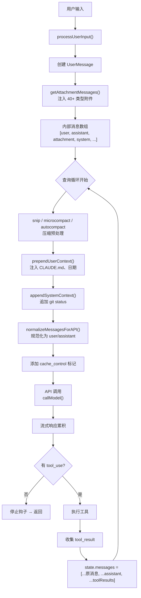
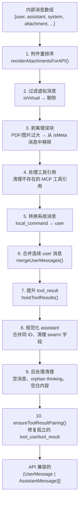
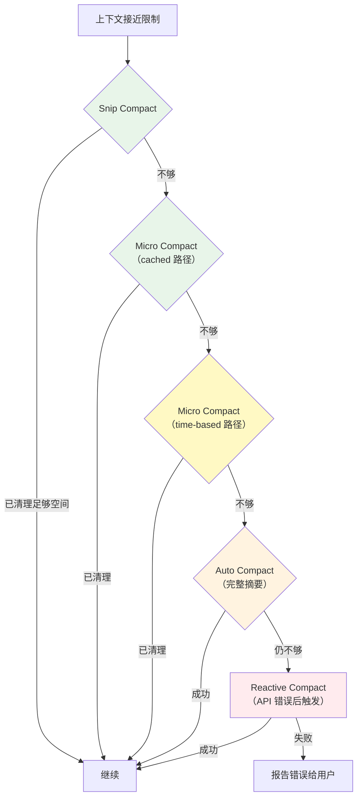

# 第 16 章 · 消息数组的构造与生命周期

> 第 15 章讲的是"对 LLM 说什么"（系统提示词的设计），本章讲的是"怎么把完整请求组织起来"——包括消息类型设计、上下文注入架构、工具调用循环、上下文窗口管理和缓存优化。这是 LLM 智能体工程中最复杂、最容易做错的部分。Claude Code 用 ~9,000 行代码（`messages.ts` + `attachments.ts` + `query.ts`）来解决这个问题，其中蕴含了大量可迁移到任何 Agent 系统的工程模式。

## 16.1 概述：消息的完整旅程

### 内部消息 vs API 消息

LLM API（如 Anthropic Messages API）只接受严格的 **user/assistant 交替消息**。但一个真实的 Agent 系统内部需要跟踪远不止这两种消息——系统事件、附件注入、工具结果、进度状态、压缩边界等。

Claude Code 的解决方案是维护一个 **异构的内部消息数组**，包含 7+ 种类型，在发送给 API 前通过规范化流水线转换为严格的 user/assistant 格式：

```
内部消息数组（单一真实来源）
┌──────────────────────────────────────────────────────────┐
│ user | assistant | system | attachment | progress |       │
│ tombstone | tool_use_summary                              │
└────────────────────────┬─────────────────────────────────┘
                         │ normalizeMessagesForAPI()
                         ↓
API 消息数组（严格 user/assistant 交替）
┌──────────────────────────────────────────────────────────┐
│ { role: 'user', content: [...] }                         │
│ { role: 'assistant', content: [...] }                    │
│ { role: 'user', content: [...] }                         │
│ ...                                                      │
└──────────────────────────────────────────────────────────┘
```

各消息类型的职责：

| 类型 | 到达 API? | 职责 |
|------|----------|------|
| `user` | 是 | 用户输入、工具结果（tool_result）、合成系统消息 |
| `assistant` | 是 | LLM 回复（含 text、tool_use、thinking 等内容块） |
| `system` | 否（转换后可能） | 本地命令结果、压缩边界、权限重试等 10+ 个子类型 |
| `attachment` | 否（转换后） | 40+ 种动态上下文：记忆文件、Git diff、任务状态、技能发现等 |
| `progress` | 否 | 流式进度指示（纯 UI 用途） |
| `tombstone` | 否 | 标记已失效的消息（如模型回退后的旧消息） |
| `tool_use_summary` | 否 | 工具使用摘要（移动端 UI 用） |

内部消息数组是会话的**唯一真实来源**——UI 渲染、会话持久化、转录导出、压缩决策都从这个数组出发。

### 端到端消息管道



核心文件分布：

| 文件 | 行数 | 职责 |
|------|------|------|
| `src/query.ts` | ~1,800 | 查询循环、状态机、错误恢复 |
| `src/utils/messages.ts` | ~4,500 | 消息创建、规范化、合并、配对验证 |
| `src/utils/attachments.ts` | ~3,900 | 40+ 附件类型、Delta 模式、上下文注入 |
| `src/utils/api.ts` | ~700 | 上下文注入函数、系统提示词分块、工具 Schema 缓存 |
| `src/services/api/claude.ts` | ~1,200 | API 消息转换、cache_control、流式处理 |
| `src/services/compact/` | 多个文件 | 全量/微量/选择性压缩策略 |

---

## 16.2 三通道上下文注入

Claude Code 通过三个独立通道将环境上下文注入到 LLM 请求中。每个通道有不同的缓存特征、刷新频率和在请求中的定位：

### 通道一：系统提示词追加

`appendSystemContext()` 将 Git 状态等信息追加到系统提示词末尾：

```typescript title="src/utils/api.ts" showLineNumbers
export function appendSystemContext(
  systemPrompt: SystemPrompt,
  context: { [k: string]: string },
): string[] {
  return [
    ...systemPrompt,
    Object.entries(context)
      .map(([key, value]) => `${key}: ${value}`)
      .join('\n'),
  ].filter(Boolean)
}
```

这个通道的内容来自 `getSystemContext()`（`src/context.ts`），包含：
- **gitStatus**：当前分支、主分支、未提交变更、最近提交等
- **cacheBreaker**：用于主动触发缓存失效的注入标记（内部用户功能）

`getSystemContext()` 通过 `memoize` 做会话级缓存——整个会话期间只计算一次，因为 Git 状态在会话开始时就是一个快照。

### 通道二：合成用户消息

`prependUserContext()` 将 CLAUDE.md 内容和当前日期包装成一条合成的用户消息，插入到消息数组的最前面：

```typescript title="src/utils/api.ts" showLineNumbers
export function prependUserContext(
  messages: Message[],
  context: { [k: string]: string },
): Message[] {
  if (Object.entries(context).length === 0) {
    return messages
  }

  return [
    createUserMessage({
      content: `<system-reminder>
As you answer the user's questions, you can use the following context:
${Object.entries(context)
  .map(([key, value]) => `# ${key}\n${value}`)
  .join('\n')}

      IMPORTANT: this context may or may not be relevant to your tasks.
      You should not respond to this context unless it is highly relevant to your task.
</system-reminder>\n`,
      isMeta: true,
    }),
    ...messages,
  ]
}
```

几个设计决策值得注意：

1. **`<system-reminder>` 标签**：不是随意命名——系统提示词中明确告诉模型"system-reminder 标签包含系统信息"，建立了一种模型可理解的协议
2. **`isMeta: true`**：标记为系统生成的消息，不出现在转录/导出中
3. **"may or may not be relevant" 限定语**：防止模型每次都对上下文做回应，只在真正需要时使用

### 通道三：附件消息

`getAttachmentMessages()` 是一个 **async generator**，每轮注入 40+ 种动态上下文：

```typescript title="src/utils/attachments.ts" showLineNumbers
export async function* getAttachmentMessages(
  input: string | null,
  toolUseContext: ToolUseContext,
  ideSelection: IDESelection | null,
  queuedCommands: QueuedCommand[],
  messages?: Message[],
  querySource?: QuerySource,
): AsyncGenerator<AttachmentMessage, void> {
  const attachments = await getAttachments(
    input, toolUseContext, ideSelection, queuedCommands, messages, querySource,
  )
  for (const attachment of attachments) {
    yield createAttachmentMessage(attachment)
  }
}
```

### 为什么需要三个通道？

| 维度 | 系统提示词追加 | 合成用户消息 | 附件消息 |
|------|-------------|------------|---------|
| **位置** | system 参数末尾 | 消息数组最前面 | 消息数组中间/末尾 |
| **缓存** | 静态前缀可全局缓存 | 会话级稳定 | 每轮变化 |
| **刷新** | 一次（会话开始） | 一次（会话开始） | 每轮重新计算 |
| **内容** | Git 状态 | CLAUDE.md, 日期 | 记忆、任务、工具列表、MCP 指令… |
| **成本** | 低（缓存命中） | 低（稳定） | 中（每轮计算） |

核心设计原则：**按变化频率分通道**。不变的放系统提示词（享受全局缓存），会话级的放合成用户消息（享受会话缓存），每轮变化的放附件（不影响前两者的缓存）。

---

## 16.3 附件系统架构

### getAttachments：40+ 种附件的编排

`getAttachments()` 是附件系统的入口（`src/utils/attachments.ts:743`），按三个阶段组织附件的收集：

```typescript title="src/utils/attachments.ts（简化）" showLineNumbers
export async function getAttachments(
  input, toolUseContext, ideSelection, queuedCommands, messages, querySource
): Promise<Attachment[]> {
  // 阶段一：用户输入触发的附件（必须先完成）
  const userInputAttachments = input ? [
    maybe('at_mentioned_files', () => processAtMentionedFiles(input, context)),
    maybe('mcp_resources', () => processMcpResourceAttachments(input, context)),
    maybe('agent_mentions', () => processAgentMentions(input, ...)),
    maybe('skill_discovery', () => getTurnZeroSkillDiscovery(input, ...)),
  ] : []
  const userAttachmentResults = await Promise.all(userInputAttachments)

  // 阶段二：线程安全的附件（子智能体也可用）— 并发执行
  const allThreadAttachments = [
    maybe('queued_commands', () => getQueuedCommandAttachments(queuedCommands)),
    maybe('date_change', () => getDateChangeAttachment(messages)),
    maybe('deferred_tools_delta', () => getDeferredToolsDeltaAttachment(...)),
    maybe('agent_listing_delta', () => getAgentListingDeltaAttachment(...)),
    maybe('mcp_instructions_delta', () => getMcpInstructionsDeltaAttachment(...)),
    maybe('nested_memory', () => getNestedMemoryAttachments(...)),
    maybe('todo_reminders', () => getTodoReminders(...)),
    maybe('task_reminders', () => getTaskReminders(...)),
    // ... 更多
  ]

  // 阶段三：仅主线程的附件（IDE 集成、诊断等）
  const mainThreadOnly = isMainThread ? [
    maybe('ide_selection', () => getIDESelectionAttachments(...)),
    maybe('diagnostics', () => getDiagnosticsAttachments(...)),
    maybe('token_usage', () => getTokenUsageAttachment(...)),
    // ... 更多
  ] : []

  const [threadResults, mainResults] = await Promise.all([
    Promise.all(allThreadAttachments),
    Promise.all(mainThreadOnly),
  ])

  return [...userAttachmentResults, ...threadResults, ...mainResults].flat()
}
```

### `maybe()` 包装器：优雅降级

每个附件都通过 `maybe()` 包装，实现"单个附件失败不影响整体"的容错模式。如果某个附件计算函数抛出异常或返回空数组，其他附件照常注入。

### 三阶段执行顺序的必要性

阶段一（用户输入附件）必须在阶段二之前完成，因为 `@提及文件` 的处理结果会填充 `nestedMemoryAttachmentTriggers`，而阶段二的 `nested_memory` 附件依赖这个数据。这种"用户输入 → 环境推导"的依赖关系要求严格的执行顺序。

### 附件到 API 消息的转换

附件不能直接发送给 API——它们在 `normalizeMessagesForAPI()` 中被转换。大多数附件被包装成 `<system-reminder>` 标签内的文本；文件附件被渲染为合成的 `tool_use / tool_result` 消息对，模拟"读取文件"工具的调用结果，让模型以它熟悉的格式理解文件内容。

---

## 16.4 Delta 附件模式

### 问题：每轮重新通知的代价

在 Claude Code 早期，智能体列表直接嵌入在 AgentTool 的工具描述中。这意味着每次 MCP 服务器连接/断开或 `/reload-plugins` 都会改变工具描述 → 触发工具 Schema 缓存失效 → 重新创建整个 Prompt Cache 前缀。数据显示这占了**全网 cache_creation token 的约 10.2%**。

### 解决方案：无状态扫描 + 增量发射

三种 Delta 附件（`deferred_tools_delta`、`agent_listing_delta`、`mcp_instructions_delta`）使用相同的模式：

```typescript title="src/utils/attachments.ts — agent_listing_delta 实现" showLineNumbers
export function getAgentListingDeltaAttachment(
  toolUseContext: ToolUseContext,
  messages: Message[] | undefined,
): Attachment[] {
  // 步骤一：扫描消息历史，重建"已通知"的状态
  const announced = new Set<string>()
  for (const msg of messages ?? []) {
    if (msg.type !== 'attachment') continue
    if (msg.attachment.type !== 'agent_listing_delta') continue
    for (const t of msg.attachment.addedTypes) announced.add(t)
    for (const t of msg.attachment.removedTypes) announced.delete(t)
  }

  // 步骤二：计算当前实际状态
  const currentTypes = new Set(filtered.map(a => a.agentType))

  // 步骤三：对比，只发射增量
  const added = filtered.filter(a => !announced.has(a.agentType))
  const removed: string[] = []
  for (const t of announced) {
    if (!currentTypes.has(t)) removed.push(t)
  }

  // 无变化 → 不注入任何附件
  if (added.length === 0 && removed.length === 0) return []

  return [{
    type: 'agent_listing_delta',
    addedTypes: added.map(a => a.agentType),
    addedLines: added.map(formatAgentLine),
    removedTypes: removed,
    isInitial: announced.size === 0,
  }]
}
```

### 为何这个模式如此巧妙

1. **无需维护显式状态**：不用在某个全局变量里跟踪"上次通知了什么"——直接从消息历史重建。这消除了状态同步的 bug 风险

2. **天然适配压缩**：当 full compact 删除旧消息后，扫描结果变成空集（`announced = {}`），下次自动生成一个完整通知（`isInitial: true`）。不需要任何特殊的"压缩后重建"逻辑

3. **缓存友好**：工具描述保持静态（不再嵌入动态智能体列表），Prompt Cache 不会因为智能体池变化而失效

4. **Token 高效**：只有实际变化时才注入附件，避免每轮重复通知相同信息

:::tip 可迁移的设计模式
如果你的 Agent 系统有"变化不频繁但必须存在于上下文中"的状态（如可用工具列表、活跃插件、连接的外部服务），Delta 模式是最佳选择。核心思路：**扫描历史重建已知状态，只发射差异，让压缩自然触发完整重建**。
:::

---

## 16.5 消息规范化流水线

### normalizeMessagesForAPI：10 阶段管道

`src/utils/messages.ts` 中的 `normalizeMessagesForAPI()` 是内部消息数组与 API 之间的桥梁。它执行约 10 个阶段的转换：



### 阶段 1：附件重排序

`reorderAttachmentsForAPI()` 解决一个定位问题：附件消息在内部数组中的位置可能不理想（比如夹在 tool_result 之后），需要"气泡上浮"到合适的位置。

```typescript title="src/utils/messages.ts" showLineNumbers
export function reorderAttachmentsForAPI(messages: Message[]): Message[] {
  const result: Message[] = []
  const pendingAttachments: AttachmentMessage[] = []

  // 从底部向上扫描
  for (let i = messages.length - 1; i >= 0; i--) {
    const message = messages[i]!

    if (message.type === 'attachment') {
      // 收集附件，准备上浮
      pendingAttachments.push(message)
    } else {
      // "停止点"：assistant 消息或以 tool_result 开头的 user 消息
      const isStoppingPoint =
        message.type === 'assistant' ||
        (message.type === 'user' &&
          Array.isArray(message.message.content) &&
          message.message.content[0]?.type === 'tool_result')

      if (isStoppingPoint && pendingAttachments.length > 0) {
        // 附件停在这里（出现在停止点之后）
        for (let j = 0; j < pendingAttachments.length; j++) {
          result.push(pendingAttachments[j]!)
        }
        result.push(message)
        pendingAttachments.length = 0
      } else {
        result.push(message)
      }
    }
  }

  // 剩余附件浮到最顶部
  for (let j = 0; j < pendingAttachments.length; j++) {
    result.push(pendingAttachments[j]!)
  }

  result.reverse()
  return result
}
```

整个算法是 O(N) 的——从后向前扫描（`push`），最后一次性 `reverse()`，避免了在数组前端 `unshift` 的 O(N²) 开销。

### 阶段 10：确保工具调用配对

`ensureToolResultPairing()` 是规范化管道中最关键的安全网。Anthropic API 要求每个 `tool_use` 块都有对应的 `tool_result`，否则返回错误。这个函数处理多种边缘情况：

- **孤立的 tool_use**（没有对应 tool_result）→ 插入合成的 error tool_result
- **孤立的 tool_result**（没有前置 tool_use）→ 从消息中剥离
- **重复的 tool_use ID**（会话恢复时可能出现）→ 去重处理

---

## 16.6 工具调用循环

### State 类型：跨迭代的可变状态

查询循环的核心是一个显式的 `State` 类型，承载所有需要在迭代之间传递的可变状态：

```typescript title="src/query.ts" showLineNumbers
type State = {
  messages: Message[]                    // 完整消息历史
  toolUseContext: ToolUseContext         // 工具执行上下文
  autoCompactTracking: AutoCompactTrackingState | undefined
  maxOutputTokensRecoveryCount: number  // output tokens 恢复重试次数
  hasAttemptedReactiveCompact: boolean  // 是否已尝试被动压缩
  maxOutputTokensOverride: number | undefined
  pendingToolUseSummary: Promise<ToolUseSummaryMessage | null> | undefined
  stopHookActive: boolean | undefined
  turnCount: number                      // 当前轮次
  transition: Continue | undefined       // 上一次迭代为何继续（调试用）
}
```

`transition` 字段是一个精心的调试设计——记录上一次循环继续的原因（`'next_turn'` | `'reactive_compact_retry'` | `'max_output_tokens_escalate'` 等），让测试可以断言恢复路径触发了正确的分支，而无需检查消息内容。

### 循环结构

```typescript title="src/query.ts（简化）" showLineNumbers
async function* queryLoop(params, consumedCommandUuids) {
  let state: State = { messages: params.messages, turnCount: 1, ... }

  while (true) {
    const { messages, toolUseContext, turnCount, ... } = state

    // 1. 压缩预处理：snip → microcompact → autocompact
    const messagesForQuery = await preprocess(messages)

    // 2. API 调用
    for await (const message of deps.callModel({
      messages: prependUserContext(messagesForQuery, userContext),
      systemPrompt: fullSystemPrompt,
      tools: toolUseContext.options.tools,
    })) {
      // 3. 流式累积：收集 assistantMessages 和 toolUseBlocks
    }

    // 4. 无 tool_use → 运行 stop hooks → 返回
    if (!needsFollowUp) {
      // 检查可恢复错误（prompt_too_long、max_output_tokens）
      // 如果可恢复：注入恢复消息，continue
      // 如果不可恢复：return { reason: 'completed' }
    }

    // 5. 执行工具
    const toolUpdates = streamingToolExecutor
      ? streamingToolExecutor.getRemainingResults()
      : runTools(toolUseBlocks, assistantMessages, canUseTool, toolUseContext)

    for await (const update of toolUpdates) {
      toolResults.push(
        ...normalizeMessagesForAPI([update.message], tools)
          .filter(_ => _.type === 'user'),
      )
    }

    // 6. 收集下一轮附件
    for await (const msg of deps.getAttachmentMessages(...)) {
      yield msg
      toolResults.push(...normalizeMessagesForAPI([msg], tools))
    }

    // 7. 组装下一轮状态
    state = {
      messages: [...messagesForQuery, ...assistantMessages, ...toolResults],
      turnCount: nextTurnCount,
      transition: { reason: 'next_turn' },
      // ...
    }
  } // while (true)
}
```

### 消息数组的增长方式

每次循环迭代，消息数组以追加方式增长：

```
迭代 N 的 messagesForQuery:  [原始消息...]
                             + [本轮 assistant 消息...]
                             + [本轮 tool_result 消息...]
                             + [本轮附件消息...]
                             = 迭代 N+1 的 messages
```

这种"只追加"模式确保了完整的对话历史，直到压缩机制介入。

### 停止条件 vs 继续条件

循环通过 `return` 终止，通过 `state = { ... }` + `continue` 继续。系统显式枚举了所有可能的状态转移：

**终止（return）：**
| 原因 | 触发条件 |
|------|---------|
| `completed` | 正常完成（无 tool_use） |
| `max_turns` | 达到 maxTurns 限制 |
| `aborted_streaming` | 用户中断流式响应 |
| `aborted_tools` | 用户中断工具执行 |
| `prompt_too_long` | 上下文超限且无法恢复 |
| `model_error` | API/模型错误 |
| `blocking_limit` | 预检上下文已超硬限制 |
| `hook_stopped` | 钩子阻止继续 |

**继续（state = next）：**
| 原因 | 触发条件 |
|------|---------|
| `next_turn` | 正常工具调用后继续 |
| `reactive_compact_retry` | 被动压缩后重试 |
| `max_output_tokens_escalate` | 升级输出限制后重试 |
| `max_output_tokens_recovery` | 注入恢复提示后重试 |
| `stop_hook_blocking` | 钩子注入阻塞错误 |
| `token_budget_continuation` | Token 预算允许继续 |

### StreamingToolExecutor：流式并发执行

`StreamingToolExecutor` 在 API 流式返回的过程中就开始执行工具——当一个 tool_use 块的输入完整后，立即启动执行，而不用等整个响应完成。这把"等待 API 完成 → 执行工具"的串行等待变成了并行：

```
时间线（无流式执行器）：
  |--- API 流式 ---|--- Tool A ---|--- Tool B ---|

时间线（有流式执行器）：
  |--- API 流式 ---|
       |--- Tool A --|
            |--- Tool B --|
```

---

## 16.7 上下文窗口压缩策略

### 分层策略：从廉价到昂贵

Claude Code 使用分层压缩策略，每层都保留更多上下文：



### Micro Compact：精确删除工具结果

微压缩是最精细的策略——只删除旧的工具调用结果（tool_result），保留对话的完整结构。

**Cached 路径**（与 Prompt Cache 集成）：通过 Anthropic API 的 `cache_edits` 机制在服务端删除旧工具结果，**不改变本地消息内容**，因此不会破坏已建立的 Prompt Cache 前缀。

**Time-based 路径**：当缓存已过期（距上次 assistant 消息超过 5 分钟 TTL）时，直接清空本地消息中的工具结果内容，因为缓存反正已经失效。

### SUMMARIZE_TOOL_RESULTS：在清除前提示模型

系统提示词中包含这样一段指令：

```
When working with tool results, write down any important information you might need later 
in your response, as the original tool result may be cleared later.
```

这告诉模型：在生成回复时，把从工具结果中获取的关键信息"写下来"——因为旧的工具结果可能在后续轮次被微压缩清除。这样，即使原始工具输出消失了，模型之前生成的文字中仍保留了关键信息。

### Auto Compact：完整对话摘要

当微压缩不够时，auto compact 触发完整的对话摘要。触发阈值为：

```
context_window_size - 13,000 tokens (AUTOCOMPACT_BUFFER_TOKENS)
```

完整压缩会 fork 一个独立的 LLM 调用来生成摘要（使用第 15 章描述的 Compact Prompt），然后用摘要替换旧消息。压缩后，所有 Delta 附件会自动重新生成完整通知，确保模型知道当前的工具列表和智能体池。

---

## 16.8 缓存控制与 API 转换

### cache_control 标记的放置规则

消息转换为 API 格式时，`cache_control` 标记被精确放置在每条消息的 **最后一个内容块** 上：

```typescript title="src/services/api/claude.ts（简化）" showLineNumbers
export function userMessageToMessageParam(
  message: UserMessage,
  addCache = false,
  enablePromptCaching: boolean,
  querySource?: QuerySource,
): MessageParam {
  if (addCache && enablePromptCaching) {
    // cache_control 放在最后一个内容块上
    return {
      role: 'user',
      content: message.message.content.map((block, i) => ({
        ...block,
        ...(i === message.message.content.length - 1
          ? { cache_control: getCacheControl({ querySource }) }
          : {}),
      })),
    }
  }
  return { role: message.message.role, content: message.message.content }
}
```

对于 assistant 消息，`cache_control` 跳过 `thinking` 和 `redacted_thinking` 块——这些块不参与缓存匹配。

### 系统提示词的分块策略

系统提示词在发送前被分为最多 4 个文本块，每个块有不同的缓存范围（`cacheScope`）：

| 块 | 内容 | cacheScope |
|---|------|-----------|
| Attribution header | 版本标记 | `null` |
| Static prefix | 角色定位 → 输出效率（BOUNDARY 之前） | `'global'` |
| Dynamic suffix | 记忆、环境、MCP 指令（BOUNDARY 之后） | `null` 或 `'org'` |
| Append | appendSystemPrompt | `null` |

`global` scope 可以跨所有组织共享缓存（5 分钟 TTL），这是第 15 章中 `SYSTEM_PROMPT_DYNAMIC_BOUNDARY` 标记的直接应用。

### 工具 Schema 缓存

```typescript title="src/utils/api.ts（概念）"
// 会话开始时捕获工具 Schema 快照
const cachedSchemas = getToolSchemaCache()

// 每次 API 调用时，在缓存基础上叠加 per-request 修改
// （如 defer_loading、cache_control），但不修改缓存本身
const requestSchemas = cachedSchemas.map(schema => ({
  ...schema,
  ...(needsCacheControl ? { cache_control: getCacheControl() } : {}),
}))
```

工具 Schema 使用会话级缓存，防止 GrowthBook 特性标志在会话中途翻转时改变 Schema 的序列化结果——这种变化会无谓地破坏 Prompt Cache。

---

## 16.9 错误恢复与消息修复

### 孤立 tool_use 的修复

当 API 调用在流式返回 tool_use 块后出错（网络断开、超时等），这些 tool_use 块已经进入了消息数组，但没有对应的 tool_result。`yieldMissingToolResultBlocks()` 为每个孤立的 tool_use 生成合成的 error tool_result：

```typescript title="src/query.ts" showLineNumbers
function* yieldMissingToolResultBlocks(
  assistantMessages: AssistantMessage[],
  errorMessage: string,
) {
  for (const assistantMessage of assistantMessages) {
    const toolUseBlocks = assistantMessage.message.content.filter(
      content => content.type === 'tool_use',
    ) as ToolUseBlock[]
    for (const toolUse of toolUseBlocks) {
      yield createUserMessage({
        content: [{
          type: 'tool_result',
          content: errorMessage,
          is_error: true,
          tool_use_id: toolUse.id,
        }],
      })
    }
  }
}
```

### prompt_too_long 的恢复级联

当 API 返回"请求太长"错误时，系统按代价递增的顺序尝试恢复：

1. **Context Collapse Drain**（最廉价）：如果启用了上下文折叠，先尝试排空折叠缓冲
2. **Reactive Compact**（中等代价）：触发完整的对话摘要压缩
3. **报告错误**（最后手段）：向用户展示错误信息

### max_output_tokens 的恢复

当模型输出被截断（达到 output tokens 限制）时：

1. **升级限制**（第一次）：从默认限制升级到更高限制，单次重试，不注入任何提示消息
2. **注入恢复提示**（第 2-4 次）：注入 `"Resume directly — no apology, no recap"` 提示，让模型从断点续写
3. **放弃**（第 4 次后）：停止重试，返回已有内容

每种恢复策略都是幂等的——失败后消息数组仍处于有效状态，可以安全地尝试下一级策略。

---

## 16.10 关键设计模式总结

从 Claude Code 的消息构建体系中，可以提炼出 10 条对自建 Agent 系统最有价值的设计模式：

### 模式一：内部表示与 API 格式分离

维护一个丰富的内部消息数组（7+ 类型），在 API 调用前才做规范化转换。内部数组服务于 UI、持久化和调试；API 数组服务于严格的协议约束。**不要试图用 API 格式做所有事情。**

### 模式二：按变化频率分通道注入

不变的上下文放系统提示词（全局缓存），会话级的放合成用户消息（会话缓存），每轮变化的放附件（不影响前两者的缓存命中率）。

### 模式三：Delta 通知而非全量重建

对于变化不频繁但必须存在于上下文的状态，扫描消息历史重建已知状态，只发射差异。让压缩自然触发完整重建，无需特殊的"重建"逻辑。

### 模式四：分层压缩，从廉价到昂贵

Snip（选择性删除）→ Micro Compact（清除旧工具结果）→ Auto Compact（完整摘要）→ Reactive Compact（API 错误后兜底）。每层都保留更多上下文，但成本更高。

### 模式五：流式工具执行

不要等 API 流式响应完全结束才开始执行工具。当 tool_use 块的输入完整时就启动，让 API 流式传输和工具执行并行。

### 模式六：错误恢复级联

每种恢复策略都是幂等的，失败后消息数组仍处于有效状态。按代价递增排列：廉价策略先试，昂贵策略兜底。

### 模式七：缓存感知的消息构建

`cache_control` 标记放在消息的最后一个内容块上（不是第一个）。系统提示词做 static/dynamic 分割。工具 Schema 做会话级缓存防止中途变化。

### 模式八：附件即插件

每个上下文源（记忆、诊断、任务状态…）独立计算、独立失败。单个附件的异常不影响其他附件的注入。

### 模式九：消息规范化是显式管道

每个转换阶段有明确的输入、输出和依赖关系。文档化 pass 的执行顺序——调换顺序可能引入难以发现的 bug。

### 模式十：显式状态机循环

查询循环的每次继续都记录原因（`transition` 字段），每种停止条件和继续条件都被显式枚举。这让调试和测试可以直接断言"触发了哪条恢复路径"，而无需解析消息内容。

---

:::info 章节小结
本章拆解了 Claude Code 消息构建体系的完整架构：
- **消息类型分层**：7+ 内部类型 vs API 的 user/assistant 严格格式
- **三通道注入**：系统提示词（稳定）/ 合成用户消息（会话级）/ 附件（每轮）
- **Delta 附件模式**：无状态扫描 + 增量发射的缓存友好设计
- **规范化管道**：10 阶段转换，从内部格式到 API 兼容格式
- **工具调用循环**：显式状态机 + 流式并发执行
- **分层压缩**：Snip → Micro → Auto → Reactive
- **缓存优化**：标记放置、Schema 缓存、static/dynamic 分割
- **错误恢复**：幂等策略 + 代价递增级联

如果你正在构建自己的 Agent 系统，这 10 条设计模式中最优先实现的是：**内部/API 格式分离**（模式一）、**工具调用配对保证**（模式九中的 ensureToolResultPairing）、和**分层压缩**（模式四）。它们解决的都是在生产环境中最容易出问题的场景。
:::
