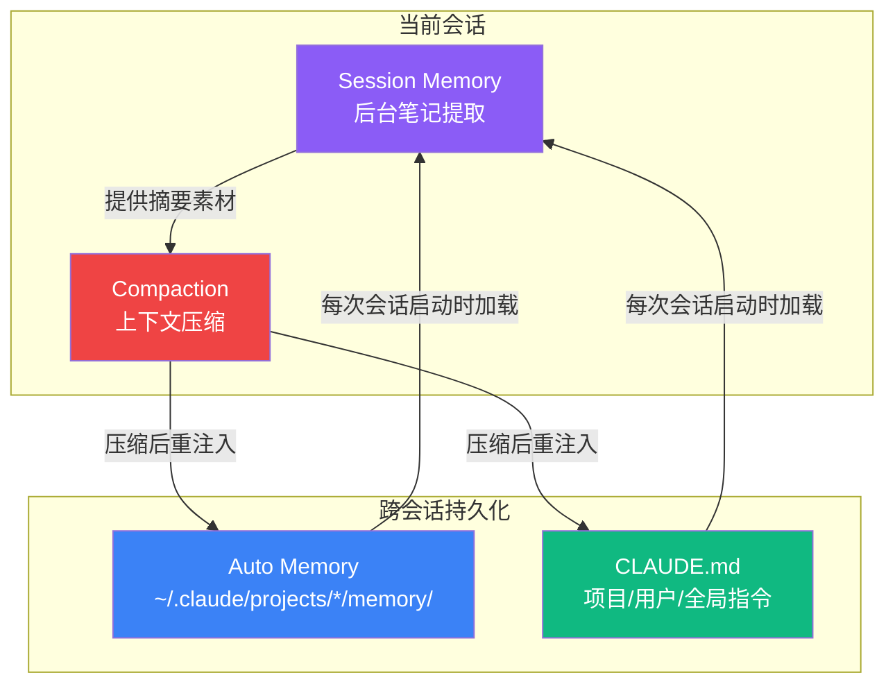
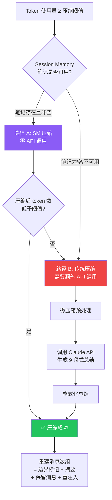

import BrowserOnly from '@docusaurus/BrowserOnly';
import Tabs from '@theme/Tabs';
import TabItem from '@theme/TabItem';

# 番外一 · 记忆系统（上）：会话记忆与上下文压缩

一个 LLM 智能体面临的最核心矛盾之一是：**用户的项目是无限的，但上下文窗口是有限的。** 即使是 200K token 的窗口，在一次涉及大量文件读写、测试执行和错误修复的编码会话中也会被耗尽。当这一刻到来时，一个根本性的问题出现了——模型如何在丢失大部分对话历史的情况下，继续像什么都没发生一样工作？

这就是 Claude Code 记忆系统要解决的问题。

:::info 本章阅读收获
读完本章，你将能回答以下问题：
- 上下文窗口用完时会发生什么？压缩后的上下文是通过什么机制恢复的？
- Session Memory 到底是什么？它在后台做了什么？为什么它能让压缩变成"零成本"？
- 持久化记忆是如何在不用数据库的情况下实现跨会话记忆的？
- CLAUDE.md 是在什么时候、以什么方式加载到模型上下文中的？
:::

---

## A1.1 一个问题引出四个子系统

想象一个真实场景：你用 Claude Code 重构一个认证模块。经过 2 小时的工作，你读了 20 多个文件、做了十几次编辑、跑了 30 多次测试。此时上下文窗口已经用了 160K token。你接着说："还需要处理 token 刷新逻辑"——然后系统告诉你，上下文快满了。

这个场景中，至少需要解决四个层面的问题：

| 问题 | 解决方案 | 子系统 |
|------|---------|--------|
| **当前对话太长了** | 把旧消息压缩成摘要 | **Compaction（上下文压缩）** |
| **压缩需要高质量的摘要** | 在后台持续提取笔记 | **Session Memory（会话记忆）** |
| **下次新对话会失忆** | 把关键知识持久化到文件 | **Auto Memory（持久记忆）** |
| **项目规则需要始终生效** | 从文件加载静态指令 | **CLAUDE.md（指令层）** |

它们不是独立运作的——**Session Memory 是为 Compaction 准备素材的；Compaction 触发时会重新注入 CLAUDE.md 和 Auto Memory 的内容。** 理解这个协作关系是理解整个记忆系统的关键。



接下来，我们沿着"上下文耗尽 → 压缩 → 恢复"这条主线，逐层深入每个子系统。

---

## A1.2 Session Memory：在后台默默记笔记的子代理

在讲压缩之前，必须先理解 Session Memory——因为它是压缩能做到"零 API 调用"的前提。

### 它是什么

Session Memory 是一个**在主对话后台运行的子代理**。当你和 Claude Code 对话时，这个子代理会周期性地"旁听"对话内容，把关键信息提取到一个 Markdown 文件中。

这个文件**不是给用户看的**。它的唯一目的是：当上下文压缩发生时，系统可以直接用这份文件的内容代替昂贵的 API 总结调用。

> 📍 源码入口：`src/services/SessionMemory/sessionMemory.ts`

### 笔记文件：一个真实存在于磁盘上的 Markdown 文件

这不是一个抽象概念——它是一个**物理文件**，存在于你的文件系统中：

```
~/.claude/projects/{project-slug}/{session-id}/session-memory/summary.md
```

> 📍 路径定义：`src/utils/permissions/filesystem.ts:269-271`

```typescript title="src/utils/permissions/filesystem.ts:269-271" showLineNumbers
export function getSessionMemoryPath(): string {
  return join(getSessionMemoryDir(), 'summary.md')
}
```

**生命周期：**
1. 会话开始时，这个文件**不存在**
2. 对话累积到 10K token 后，后台子代理首次创建它，写入空模板
3. 之后每隔一段时间（5K token 增量或 3 次工具调用），子代理更新文件内容
4. 会话结束后，文件保留在磁盘上（但不会被其他会话使用）

### 笔记文件的 9 段模板

文件使用固定的 9 段结构——**段落标题和斜体描述永远不会被修改**，子代理只更新描述下方的实际内容：

```markdown title="DEFAULT_SESSION_MEMORY_TEMPLATE（src/services/SessionMemory/prompts.ts:11-41）"
# Session Title
_A short and distinctive 5-10 word descriptive title for the session._

# Current State
_What is actively being worked on right now? Pending tasks not yet completed._

# Task specification
_What did the user ask to build? Any design decisions or other explanatory context_

# Files and Functions
_What are the important files? In short, what do they contain and why are they relevant?_

# Workflow
_What bash commands are usually run and in what order?_

# Errors & Corrections
_Errors encountered and how they were fixed. What did the user correct?_

# Codebase and System Documentation
_What are the important system components? How do they work/fit together?_

# Learnings
_What has worked well? What has not? What to avoid?_

# Key results
_If the user asked a specific output such as an answer to a question, repeat the exact result here_

# Worklog
_Step by step, what was attempted, done? Very terse summary for each step_
```

模板路径可以自定义：`~/.claude/session-memory/config/template.md`。如果文件存在，系统会用它替代默认模板。

### 笔记被填充后的真实样貌

经过子代理几次提取后，这个文件会被填充成这样（以重构 Auth 模块的会话为例）：

```markdown title="summary.md（经过 4 次提取后的实际内容）"
# Session Title
_A short and distinctive 5-10 word descriptive title for the session._
重构 Auth 模块并修复 Token 刷新竞态问题

# Current State
_What is actively being worked on right now? Pending tasks not yet completed._
正在修复 src/auth/refresh.ts 中 refresh token 的并发竞态。
已定位问题：多个请求同时发现 token 过期时会并发刷新。
下一步：添加 mutex 锁，确保同一时间只有一个刷新请求。

# Task specification
_What did the user ask to build? Any design decisions or other explanatory context_
用户要求重构认证模块：
- 从 session-based 迁移到 JWT + refresh token
- 需要向后兼容现有的 /api/auth/* 端点
- 中间件要支持 Express 和 Fastify

# Files and Functions
_What are the important files?_
- src/auth/index.ts — 主入口，exportAuthMiddleware()，已重构完成
- src/auth/refresh.ts — 新文件，handleTokenRefresh()，正在开发
- src/auth/middleware.ts — Express 中间件，verifyToken()，已更新
- test/auth.test.ts — 集成测试，38 个用例，目前 35 通过

# Workflow
_What bash commands are usually run and in what order?_
npm test — 跑全量测试（约 20 秒）
npm test -- --grep "refresh" — 只跑 refresh 相关用例
看 FAIL 行找失败原因，看 "expected" vs "received" 对比

# Errors & Corrections
_Errors encountered and how they were fixed. What did the user correct?_
1. 最初用 setTimeout 做 token 刷新轮询 → 用户否决，要求用 mutex
2. import path 错误：用了 '@/auth' 但 tsconfig 没配 paths → 改为相对路径
3. middleware.ts 编辑后忘了更新 export → 导致 3 个测试失败 → 补上 export

# Codebase and System Documentation
_What are the important system components?_
Auth 模块依赖 Redis 做 session 存储（但正在迁移掉）
中间件链：rate-limit → cors → auth → router
测试用的是真实 Redis（不是 mock），连接 localhost:6379

# Learnings
_What has worked well? What has not? What to avoid?_
- 编辑 middleware.ts 前必须先跑测试，否则容易破坏登录流程
- 用户偏好小步提交，每改一个文件就跑一次测试

# Key results
_If the user asked a specific output, repeat the exact result here_
（暂无）

# Worklog
_Step by step, what was attempted, done? Very terse summary for each step_
1. 读取 src/auth/ 目录，理解现有结构
2. 重构 index.ts：移除 session 逻辑，添加 JWT 验证
3. 更新 middleware.ts：适配新的 token 验证
4. 跑测试，3 个失败 → 修复 export 问题 → 全部通过
5. 创建 refresh.ts，开始处理 token 刷新
6. 发现并发刷新的竞态问题 ← 当前在这里
```

注意：斜体描述行（如 `_What is actively being worked on right now?_`）始终保留不变——它们是模板的一部分，指导子代理应该在下方写什么内容。

### 子代理是如何更新笔记的

每次触发提取时，子代理收到的 prompt 大致如下：

```text title="提取 Prompt 核心内容（src/services/SessionMemory/prompts.ts:43-80，简化）"
Based on the user conversation above, update the session notes file.

The file {notesPath} has already been read for you.
Here are its current contents:
<current_notes_content>
{当前笔记全文}
</current_notes_content>

Your ONLY task is to use the Edit tool to update the notes file, then stop.

CRITICAL RULES:
- NEVER modify or delete section headers (# lines) or italic descriptions (_ lines)
- ONLY update the content BELOW the italic descriptions
- Write DETAILED, INFO-DENSE content (file paths, function names, error messages)
- IMPORTANT: Always update "Current State" to reflect the most recent work
- Keep each section under ~2000 tokens
- Make all Edit tool calls in parallel in a single message
```

子代理可以看到**主对话的完整上下文**（通过共享 prompt cache），所以它知道对话中发生了什么。但它**只能用 `Edit` 工具编辑这一个文件**——相当于一个"只能写笔记、不能插嘴"的旁听记录员。

提取 Prompt 也可以自定义：放在 `~/.claude/session-memory/config/prompt.md`，支持 `{{currentNotes}}` 和 `{{notesPath}}` 变量替换。

### 提取何时发生

提取不是每轮都运行——它有精确的触发条件：

<BrowserOnly>
  {() => {
    const SessionMemoryExtraction = require('@site/src/components/memory/SessionMemoryExtraction').default;
    return <SessionMemoryExtraction />;
  }}
</BrowserOnly>

> 📍 触发逻辑：`src/services/SessionMemory/sessionMemory.ts:134-181`
>
> 📍 配置定义：`src/services/SessionMemory/sessionMemoryUtils.ts` 中的 `DEFAULT_SESSION_MEMORY_CONFIG`

这些阈值通过 GrowthBook 远程配置（feature flag: `tengu_sm_config`）动态调整——Anthropic 可以在线上做 A/B 测试来优化提取频率。

### 提取过程：一个受限的分叉子代理

提取通过 `runForkedAgent()` 实现——创建一个共享 prompt cache 的隔离子代理：

```typescript title="src/services/SessionMemory/sessionMemory.ts:318-325" showLineNumbers
await runForkedAgent({
  promptMessages: [createUserMessage({ content: userPrompt })],
  cacheSafeParams: createCacheSafeParams(context),   // 复用主对话的 prompt cache
  canUseTool: createMemoryFileCanUseTool(memoryPath), // 只允许 Edit 笔记文件
  querySource: 'session_memory',
  forkLabel: 'session_memory',
  overrides: { readFileState: setupContext.readFileState },
})
```

三个关键设计决策：

**1. 工具权限被锁死。** 子代理只能使用 `Edit` 工具，且只能编辑笔记文件本身。这不是通过系统提示词"请求"模型遵守的，而是通过 `canUseTool` 回调函数强制执行的——任何其他工具调用都会被直接拒绝：

```typescript title="src/services/SessionMemory/sessionMemory.ts:460-482" showLineNumbers
export function createMemoryFileCanUseTool(memoryPath: string): CanUseToolFn {
  return async (tool: Tool, input: unknown) => {
    if (tool.name === FILE_EDIT_TOOL_NAME &&
        typeof input === 'object' && input !== null &&
        'file_path' in input && input.file_path === memoryPath) {
      return { behavior: 'allow' as const, updatedInput: input }
    }
    return {
      behavior: 'deny' as const,
      message: `only ${FILE_EDIT_TOOL_NAME} on ${memoryPath} is allowed`,
    }
  }
}
```

**2. 上下文隔离。** 使用 `createSubagentContext()` 创建独立环境，子代理的任何副作用（文件状态缓存等）都不会污染主对话。

**3. 串行执行。** 提取函数用 `sequential()` 包装，保证同一时间只有一个提取在运行——防止并发写入笔记文件导致内容损坏。

### 笔记的内容限制

为防止笔记无限膨胀，有两层预算：

```typescript title="src/services/SessionMemory/prompts.ts:8-9" showLineNumbers
const MAX_SECTION_LENGTH = 2000              // 每个段落 ~2000 tokens
const MAX_TOTAL_SESSION_MEMORY_TOKENS = 12000 // 全文 ~12000 tokens
```

超出预算时，提取 prompt 会附加强制精简指令，要求子代理"激进地缩短超大段落，优先保留 Current State 和 Errors & Corrections"。

### lastSummarizedMessageId：压缩的分界线

每次成功提取后，系统会记录最后一条被笔记覆盖的消息的 UUID：

```typescript title="src/services/SessionMemory/sessionMemory.ts:488-495" showLineNumbers
function updateLastSummarizedMessageIdIfSafe(messages: Message[]): void {
  if (!hasToolCallsInLastAssistantTurn(messages)) {
    const lastMessage = messages[messages.length - 1]
    if (lastMessage?.uuid) {
      setLastSummarizedMessageId(lastMessage.uuid)
    }
  }
}
```

注意条件 `!hasToolCallsInLastAssistantTurn(messages)`——如果最后一轮助手正在执行工具调用，就不更新。这是为了防止出现"笔记已经标记到这条消息了，但对应的 `tool_result` 还没到"的状态，避免压缩时切断未完成的工具调用对。

**这个 ID 是整个压缩机制的关键锚点**——它决定了哪些消息可以被安全删除（ID 之前的已被笔记覆盖），哪些必须原样保留（ID 之后的还未被覆盖）。

---

## A1.3 上下文压缩：当空间不够时发生了什么

现在进入最核心的部分：**当上下文窗口快满时，系统到底做了什么来恢复可用空间？**

### 何时触发

> 📍 核心逻辑：`src/services/compact/autoCompact.ts:62-91`

压缩阈值的计算公式：

```
有效上下文窗口 = 模型上下文窗口 - min(模型最大输出 token, 20,000)
自动压缩阈值 = 有效上下文窗口 - 13,000
```

以 200K token 窗口为例：

```
有效窗口 = 200,000 - 20,000 = 180,000
压缩阈值 = 180,000 - 13,000 = 167,000
→ 当 token 使用量 ≥ 167,000 时自动触发
```

这里预留了两层缓冲：**20K** 给压缩总结的输出空间，**13K** 作为触发到实际满之间的余量——确保压缩有足够的空间完成。

### token 使用量的变化

下面的图表展示了一次典型会话中 token 使用量的完整生命周期——从对话开始到触发压缩，再到压缩后的重新累积：

<BrowserOnly>
  {() => {
    const TokenTimeline = require('@site/src/components/memory/TokenTimeline').default;
    return <TokenTimeline />;
  }}
</BrowserOnly>

几个关键观察：
- **紫色标记**是 Session Memory 后台提取的时间点——它在对话进行中持续工作
- 到达红色阈值线时触发压缩，token 数**断崖式下降**
- 压缩后对话从低 token 起点重新累积——可以继续很长的对话

### 两条压缩路径

触发压缩后，系统会尝试两条路径，**优先走更便宜的那条**：



**为什么有两条路径？** 传统压缩需要调用一次 Claude API 来生成总结——这意味着额外的延迟和费用。Session Memory 压缩的核心洞察是：既然后台子代理已经在持续提取笔记了，**笔记本身就是现成的总结**，直接用它替代被删除的旧消息就行了，不需要额外的 API 调用。

### 两条路径的完整流程

点击每个步骤查看详细说明：

<BrowserOnly>
  {() => {
    const CompactionPipeline = require('@site/src/components/memory/CompactionPipeline').default;
    return <CompactionPipeline />;
  }}
</BrowserOnly>

### 压缩前后的消息数组对比

下面的交互组件展示了压缩前后消息数组的具体变化——这是理解"上下文如何恢复"的最直观方式。点击"压缩后"按钮查看转换结果：

<BrowserOnly>
  {() => {
    const CompactionBeforeAfter = require('@site/src/components/memory/CompactionBeforeAfter').default;
    return <CompactionBeforeAfter />;
  }}
</BrowserOnly>

### 摘要消息的具体内容：两条路径不同

两条路径最终都会生成一条 `user` 类型的摘要消息注入到新消息数组中，但**摘要的内容来源和格式是不同的**。

<Tabs>
  <TabItem value="sm" label="路径 A：Session Memory 压缩的摘要" default>

SM 压缩的摘要内容**直接就是笔记文件的内容**——上面展示的那个 `summary.md`。系统读取文件，截断超大段落（每段最多 ~2000 token），然后包装成摘要消息：

```text title="SM 压缩摘要（简化）"
This session is being continued from a previous conversation that ran
out of context. The summary below covers the earlier portion of the
conversation.

# Session Title
重构 Auth 模块并修复 Token 刷新竞态问题

# Current State
正在修复 src/auth/refresh.ts 中 refresh token 的并发竞态...

# Task specification
用户要求重构认证模块：从 session-based 迁移到 JWT...

（... 笔记文件的其余段落 ...）

If you need specific details from before compaction, read the full
transcript at: ~/.claude/projects/.../d7702287.../transcript.jsonl

Recent messages are preserved verbatim.

Continue the conversation from where it left off without asking the
user any further questions. Resume directly — do not acknowledge the
summary, do not recap what was happening...
```

**注意：这里不需要 API 调用。** 笔记文件是后台子代理在对话过程中持续维护的，压缩时只需要读取文件。

  </TabItem>
  <TabItem value="traditional" label="路径 B：传统压缩的摘要">

传统压缩的摘要由 Claude API **实时生成**，使用的是**另一套 9 段结构**（面向"一次性全量回顾"设计，与笔记文件的段落不同）：

```text title="传统压缩摘要（简化）"
This session is being continued from a previous conversation that ran
out of context. The summary below covers the earlier portion of the
conversation.

Summary:
1. Primary Request and Intent:
   用户要求重构 auth 模块，采用 JWT + refresh token 方案...

2. Key Technical Concepts:
   - Express middleware chain
   - JWT token rotation...

3. Files and Code Sections:
   - src/auth/index.ts — 重构了 token 验证逻辑
     [完整代码片段: export function verifyToken(req, res, next) ...]

4. Errors and fixes:
   - import path 错误 → 改为相对路径...

5. Problem Solving:
   解决了 middleware export 缺失导致的测试失败...

6. All user messages:
   - "帮我重构 auth 模块"
   - "测试跑一下"
   - "还需要处理 token 刷新逻辑"

7. Pending Tasks:
   - 修复 refresh token 并发竞态

8. Current Work:
   正在处理 src/auth/refresh.ts 中的并发刷新问题...

9. Optional Next Step:
   添加 mutex 锁到 handleTokenRefresh()...

If you need specific details from before compaction, read the full
transcript at: ~/.claude/projects/.../transcript.jsonl

Continue the conversation from where it left off...
```

  </TabItem>
</Tabs>

**两套 9 段结构的区别：**

| SM 笔记文件的段落 | 传统压缩总结的段落 | 设计差异 |
|---|---|---|
| Session Title | — | 笔记有标题，总结没有 |
| **Current State** | **Current Work** | 类似，但笔记的 Current State 每次提取都必须更新 |
| Task specification | Primary Request and Intent | 笔记侧重"设计决策"，总结侧重"用户意图" |
| Files and Functions | Files and Code Sections | 总结要求包含**完整代码片段** |
| **Workflow** | — | 总结没有这个段落（不需要记住命令） |
| Errors & Corrections | Errors and fixes | 笔记额外记录"用户纠正了什么" |
| Codebase and System Documentation | Key Technical Concepts | 角度不同 |
| **Learnings** | Problem Solving | 笔记记"什么有效/无效"，总结记"解决过程" |
| Key results | — | 总结没有（不需要保留精确输出） |
| Worklog | Pending Tasks | 笔记是"做了什么"，总结是"还要做什么" |
| — | **All user messages** | 笔记没有（不需要原文），总结要求列出所有用户消息 |
| — | **Optional Next Step** | 笔记没有（靠 Current State），总结需要引用原文建议下一步 |

设计思路的本质区别：**笔记文件会被反复更新**，所以需要 Workflow、Learnings、Worklog 这种"需要持续积累"的段落。**传统总结只生成一次**，所以需要 All user messages、Optional Next Step 这种"一次性全量回顾"的段落。

两种摘要的末尾都有同样的指令：

> Continue the conversation from where it left off without asking the user any further questions. Resume directly — do not acknowledge the summary, do not recap what was happening...

这告诉模型：**不要承认压缩发生了，直接像什么都没发生一样继续工作。** 确保用户体验的连续性。

### Transcript 文件：压缩的安全网

两种摘要中都包含一个 transcript 文件路径（如 `~/.claude/projects/.../d7702287.../transcript.jsonl`）。这是会话的**完整原始对话记录**——每条消息、每次工具调用、每个返回结果都以 JSON Lines 格式逐行记录。

它的作用是**压缩的安全网**：如果摘要丢失了某些细节（比如一段具体的代码片段），模型可以通过 `Read` 工具读取 transcript 文件来找回原始内容。这就像"删除了邮件但还能从回收站找回来"。

### 边界标记（boundaryMarker）的元数据

压缩后消息数组的第一条是边界标记——一条特殊的系统消息，不是给模型"看"的，而是给系统内部逻辑用的。它携带以下元数据：

```typescript title="createCompactBoundaryMessage() 创建的元数据"
{
  type: 'auto' | 'manual',              // 压缩类型
  preCompactTokenCount: number,          // 压缩前的 token 数
  lastMessageUuid: string,               // 压缩前最后一条消息的 UUID
  compactMetadata: {
    preservedSegment: { ... },           // 保留段的链接信息（用于去重）
    preCompactDiscoveredTools: string[],  // 压缩前发现的工具名（供 ToolSearch 恢复）
  }
}
```

其中 `preCompactDiscoveredTools` 特别重要——Claude Code 的工具发现是渐进式的（ToolSearch 按需加载），压缩后这些发现记录会丢失。边界标记保存了压缩前已发现的工具名，让系统在压缩后能自动重新加载这些工具。

### 压缩后的文件附件预算

压缩后除了重注入 CLAUDE.md 和工具定义，系统还会尝试恢复最近读取过的文件——但有严格的预算：

```typescript title="src/services/compact/compact.ts:122-130" showLineNumbers
export const POST_COMPACT_MAX_FILES_TO_RESTORE = 5      // 最多恢复 5 个文件
export const POST_COMPACT_TOKEN_BUDGET = 50_000          // 文件总预算 50K tokens
export const POST_COMPACT_MAX_TOKENS_PER_FILE = 5_000    // 每文件最多 5K tokens
export const POST_COMPACT_MAX_TOKENS_PER_SKILL = 5_000   // 每技能最多 5K tokens
export const POST_COMPACT_SKILLS_TOKEN_BUDGET = 25_000   // 技能总预算 25K tokens
```

优先恢复最近读取的文件——如果压缩前你刚读了 `src/auth/refresh.ts`，它大概率会被重新附加到上下文中，让模型不需要重新 `Read` 就能继续编辑。

### tool_use/tool_result 对的保护

Claude API 有一个严格的不变量：每个 `tool_result` 消息必须有对应的 `tool_use` 消息。如果压缩时的裁切位置不当——保留了 `tool_result` 但删除了对应的 `tool_use`——API 会报错。

`adjustIndexToPreserveAPIInvariants()` 负责处理这个问题：

```typescript title="src/services/compact/sessionMemoryCompact.ts:232-286（简化）" showLineNumbers
export function adjustIndexToPreserveAPIInvariants(
  messages: Message[], startIndex: number
): number {
  let adjustedIndex = startIndex

  // Step 1: 收集保留范围内所有 tool_result 的 ID
  const allToolResultIds: string[] = []
  for (let i = startIndex; i < messages.length; i++) {
    allToolResultIds.push(...getToolResultIds(messages[i]!))
  }

  // 找到保留范围之外、但被 tool_result 引用的 tool_use
  const neededToolUseIds = new Set(
    allToolResultIds.filter(id => !toolUseIdsInKeptRange.has(id))
  )

  // 向前扩展保留范围以包含这些 tool_use
  for (let i = adjustedIndex - 1; i >= 0 && neededToolUseIds.size > 0; i--) {
    if (hasToolUseWithIds(messages[i]!, neededToolUseIds)) {
      adjustedIndex = i  // 扩展边界
    }
  }

  // Step 2: 处理流式分割的 thinking 块
  // 流式传输可能产生多个共享 message.id 的消息
  // 确保 thinking 块与对应的 tool_use 不被分割
  // ...

  return adjustedIndex
}
```

举一个具体的 bug 场景——这个函数就是为了修复它：

```
消息数组：
  [N]   assistant, id: X, content: [thinking]
  [N+1] assistant, id: X, content: [tool_use: ORPHAN_ID]
  [N+2] assistant, id: X, content: [tool_use: VALID_ID]
  [N+3] user, content: [tool_result: ORPHAN_ID, tool_result: VALID_ID]

如果压缩的 startIndex = N+2：
  保留：[N+2] [N+3]
  → normalizeMessagesForAPI 合并 id: X 的消息
  → 结果：assistant 只有 [tool_use: VALID_ID]，但 user 有 [tool_result: ORPHAN_ID]
  → API 报错：orphan tool_result

修复：检测到 N+3 的 ORPHAN_ID 引用了 N+1 的 tool_use
     → 将 startIndex 调整为 N（同时包含 N 的 thinking 块）
```

### 连续失败的熔断器

如果压缩连续失败 3 次，系统会停止重试：

```typescript title="src/services/compact/autoCompact.ts:67-70" showLineNumbers
const MAX_CONSECUTIVE_AUTOCOMPACT_FAILURES = 3
// BQ 2026-03-10: 1,279 个会话在单次会话中有 50+ 次连续失败
// (最多 3,272 次)，浪费约 250K API 调用/天
```

这个注释来自线上数据分析——在引入熔断器之前，某些不可恢复的情况（如对话结构已损坏）会导致系统不断重试压缩，全球每天浪费约 25 万次 API 调用。

---

## A1.4 传统压缩的总结 Prompt

当 Session Memory 不可用时，传统压缩需要调用 Claude API 来生成总结。这个总结的 prompt 设计有几个值得关注的细节。

### 严格禁止工具调用

总结 prompt 的开头是一段非常强硬的禁令：

```text title="src/services/compact/prompt.ts:19-26"
CRITICAL: Respond with TEXT ONLY. Do NOT call any tools.

- Do NOT use Read, Bash, Grep, Glob, Edit, Write, or ANY other tool.
- You already have all the context you need in the conversation above.
- Tool calls will be REJECTED and will waste your only turn — you will fail the task.
- Your entire response must be plain text.
```

为什么要这么强硬？注释中给出了原因：

> 缓存共享的分叉路径继承了主对话的完整工具集（API cache-key 匹配需要），而 Sonnet 4.6+ 的自适应思考模型有时会尝试调用工具。`maxTurns: 1` 意味着如果工具调用被拒绝，就没有文本输出了——总结直接失败。在 4.6 上这个问题的发生率是 2.79%（vs 4.5 的 0.01%）。

### analysis + summary 的双阶段结构

Prompt 要求模型先在 `<analysis>` 标签中做详细的思维分析，然后在 `<summary>` 标签中输出正式总结。

`formatCompactSummary()` 在后处理时会**直接删除 `<analysis>` 块**——它只是一个改善总结质量的"思维草稿"，没有信息价值。

```typescript title="src/services/compact/prompt.ts:311-334（简化）" showLineNumbers
export function formatCompactSummary(summary: string): string {
  let result = summary
  // 删除 analysis —— 它只是草稿
  result = result.replace(/<analysis>[\s\S]*?<\/analysis>/, '')
  // 提取 summary 内容
  const match = result.match(/<summary>([\s\S]*?)<\/summary>/)
  if (match) {
    result = result.replace(/<summary>[\s\S]*?<\/summary>/, `Summary:\n${match[1].trim()}`)
  }
  return result.trim()
}
```

这是一个经典的"chain-of-thought 后丢弃推理过程"模式——让模型先想清楚再输出，但只保留最终结果。

### 三种总结变体

根据压缩类型，使用不同的 prompt 变体：

| 变体 | 场景 | 关键区别 |
|------|------|---------|
| `BASE_COMPACT_PROMPT` | 压缩所有消息 | 分析"整个对话" |
| `PARTIAL_COMPACT_PROMPT` | 只压缩最近部分 | "早期消息保留在上文中，只总结最近的" |
| `PARTIAL_COMPACT_UP_TO_PROMPT` | 压缩前半部分 | 第 8 节变为"已完成的工作"，第 9 节变为"继续工作所需的上下文" |

---

## A1.5 微压缩：发送给总结模型之前的预处理

在传统压缩路径中，消息先经过"微压缩"（microcompact）——这是一个不需要 API 调用的本地优化步骤，目的是减少发送给总结模型的 token 数量。

> 📍 源码：`src/services/compact/microCompact.ts`

### 可处理的工具类型

微压缩只处理特定工具的输出结果：

```typescript title="src/services/compact/microCompact.ts:39-49" showLineNumbers
const COMPACTABLE_TOOLS = new Set<string>([
  FILE_READ_TOOL_NAME,     // Read
  ...SHELL_TOOL_NAMES,     // Bash
  GREP_TOOL_NAME,          // Grep
  GLOB_TOOL_NAME,          // Glob
  WEB_SEARCH_TOOL_NAME,    // WebSearch
  WEB_FETCH_TOOL_NAME,     // WebFetch
  FILE_EDIT_TOOL_NAME,     // Edit
  FILE_WRITE_TOOL_NAME,    // Write
])
```

这些工具的输出通常很大（一次 `Read` 可能返回几千行代码），但其内容在总结阶段可以被安全清理——因为总结模型只需要知道"读了什么文件"和"做了什么编辑"，不需要完整的文件内容。

### 两种微压缩模式

**Cached Microcompact：** 不修改本地消息内容，而是通过 Prompt Cache API 的 `cache_edits` 功能在 API 层面标记删除。好处是不破坏本地缓存。

**Time-Based Microcompact：** 当助手消息之间的时间间隔超过一定阈值时，直接将旧工具结果替换为 `[Old tool result content cleared]`。适用于 prompt cache 已过期（用户离开了一会儿再回来）的场景。

### 图片的特殊处理

如果对话中包含图片（如用户发送截图），微压缩会在发送给总结模型之前将图片替换为 `[image]` 文本标记——因为图片会导致总结请求本身的 token 数过大。

---

:::tip 继续阅读
持久记忆（Auto Memory）、CLAUDE.md 指令层和设计洞察详见 **[番外一（下）：持久记忆与 CLAUDE.md](/A1b-memory-persistent)**。
:::
