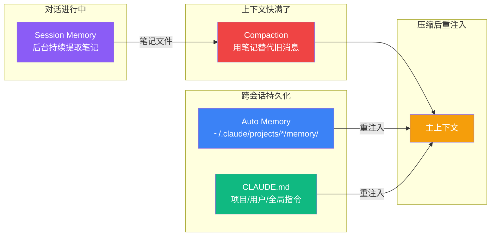

import BrowserOnly from '@docusaurus/BrowserOnly';
import Tabs from '@theme/Tabs';
import TabItem from '@theme/TabItem';

# 番外一 · 记忆系统（上）：Session Memory

一个 LLM 智能体面临的最核心矛盾之一是：**用户的项目是无限的，但上下文窗口是有限的。** 即使是 200K token 的窗口，在一次涉及大量文件读写、测试执行和错误修复的编码会话中也会被耗尽。当这一刻到来时，一个根本性的问题出现了——模型如何在丢失大部分对话历史的情况下，继续像什么都没发生一样工作？

这就是 Claude Code 记忆系统要解决的问题。

:::info 系列阅读收获
读完本系列三篇文章，你将能回答以下问题：
- Session Memory 到底是什么？它在后台做了什么？为什么它能让压缩变成"零成本"？**（本篇）**
- 上下文窗口用完时会发生什么？压缩后的上下文是通过什么机制恢复的？**（[中篇](/A1a-compaction)）**
- 持久化记忆是如何在不用数据库的情况下实现跨会话记忆的？**（[下篇](/A1b-memory-persistent)）**
- CLAUDE.md 是在什么时候、以什么方式加载到模型上下文中的？**（[下篇](/A1b-memory-persistent)）**
:::

---

## A1.1 一个问题引出四个子系统

想象一个真实场景：你用 Claude Code 重构一个认证模块。经过 2 小时的工作，你读了 20 多个文件、做了十几次编辑、跑了 30 多次测试。此时上下文窗口已经用了 160K token。你接着说："还需要处理 token 刷新逻辑"——然后系统告诉你，上下文快满了。

这个场景中，Claude Code 需要在不同阶段解决不同的问题。这四个子系统并非各自独立，而是按时间线协作的：

| 阶段 | 发生了什么 | 子系统 |
|------|-----------|--------|
| **对话进行中** | 后台子代理持续旁听，把关键信息提取到笔记文件 | **Session Memory（会话记忆）** |
| **上下文快满了** | 用笔记文件直接替代旧消息，零成本完成压缩 | **Compaction（上下文压缩）** |
| **每轮对话结束时** | 把跨会话有价值的知识写入持久化文件 | **Auto Memory（持久记忆）** |
| **新会话开始时** | 从文件加载项目规则和历史记忆到上下文 | **CLAUDE.md + Auto Memory** |

它们的协作关系是：**Session Memory 在对话过程中提前准备好笔记，Compaction 触发时直接用笔记代替旧消息（零 API 调用）；压缩完成后，系统重新注入 CLAUDE.md 和 Auto Memory 的内容，确保规则和记忆不丢失。**



本篇深入 Session Memory 的实现细节。Compaction 的完整流程见 **[中篇](/A1a-compaction)**，Auto Memory 和 CLAUDE.md 见 **[下篇](/A1b-memory-persistent)**。

---

## A1.2 Session Memory：在后台默默记笔记的子代理

在讲压缩之前，必须先理解 Session Memory——因为它是压缩能做到"零 API 调用"的前提。

### 它是什么

Session Memory 是一个**在主对话后台运行的子代理**。当你和 Claude Code 对话时，这个子代理会周期性地"旁听"对话内容，把关键信息提取到一个 Markdown 文件中。

这个文件**不是给用户看的**。它的核心用途是：当上下文压缩发生时，系统可以直接用这份文件的内容代替昂贵的 API 总结调用。

> 📍 源码入口：`src/services/SessionMemory/sessionMemory.ts`

### 笔记文件：一个真实存在于磁盘上的 Markdown 文件

这不是一个抽象概念——它是一个**物理文件**，存在于你的文件系统中：

```
~/.claude/projects/{project-slug}/{session-id}/session-memory/summary.md
```

> 📍 路径定义：`src/utils/permissions/filesystem.ts:269-271`

```typescript title="src/utils/permissions/filesystem.ts:269-271" showLineNumbers
export function getSessionMemoryPath(): string {
  return join(getSessionMemoryDir(), 'summary.md')
}
```

**生命周期：**
1. 会话开始时，这个文件**不存在**
2. 对话累积到 10K token 后，后台子代理首次创建它，写入空模板
3. 之后每隔一段时间（5K token 增量或 3 次工具调用），子代理更新文件内容
4. 会话结束后，文件保留在磁盘上（但不会被其他会话使用）

### 笔记文件的 9 段模板

文件使用固定的 9 段结构——**段落标题和斜体描述永远不会被修改**，子代理只更新描述下方的实际内容：

```markdown title="DEFAULT_SESSION_MEMORY_TEMPLATE（src/services/SessionMemory/prompts.ts:11-41）"
# Session Title
_A short and distinctive 5-10 word descriptive title for the session._

# Current State
_What is actively being worked on right now? Pending tasks not yet completed._

# Task specification
_What did the user ask to build? Any design decisions or other explanatory context_

# Files and Functions
_What are the important files? In short, what do they contain and why are they relevant?_

# Workflow
_What bash commands are usually run and in what order?_

# Errors & Corrections
_Errors encountered and how they were fixed. What did the user correct?_

# Codebase and System Documentation
_What are the important system components? How do they work/fit together?_

# Learnings
_What has worked well? What has not? What to avoid?_

# Key results
_If the user asked a specific output such as an answer to a question, repeat the exact result here_

# Worklog
_Step by step, what was attempted, done? Very terse summary for each step_
```

模板路径可以自定义：`~/.claude/session-memory/config/template.md`。如果文件存在，系统会用它替代默认模板。

### 笔记被填充后的真实样貌

经过子代理几次提取后，这个文件会被填充成这样（以重构 Auth 模块的会话为例）：

```markdown title="summary.md（经过 4 次提取后的实际内容）"
# Session Title
_A short and distinctive 5-10 word descriptive title for the session._
重构 Auth 模块并修复 Token 刷新竞态问题

# Current State
_What is actively being worked on right now? Pending tasks not yet completed._
正在修复 src/auth/refresh.ts 中 refresh token 的并发竞态。
已定位问题：多个请求同时发现 token 过期时会并发刷新。
下一步：添加 mutex 锁，确保同一时间只有一个刷新请求。

# Task specification
_What did the user ask to build? Any design decisions or other explanatory context_
用户要求重构认证模块：
- 从 session-based 迁移到 JWT + refresh token
- 需要向后兼容现有的 /api/auth/* 端点
- 中间件要支持 Express 和 Fastify

# Files and Functions
_What are the important files?_
- src/auth/index.ts — 主入口，exportAuthMiddleware()，已重构完成
- src/auth/refresh.ts — 新文件，handleTokenRefresh()，正在开发
- src/auth/middleware.ts — Express 中间件，verifyToken()，已更新
- test/auth.test.ts — 集成测试，38 个用例，目前 35 通过

# Workflow
_What bash commands are usually run and in what order?_
npm test — 跑全量测试（约 20 秒）
npm test -- --grep "refresh" — 只跑 refresh 相关用例
看 FAIL 行找失败原因，看 "expected" vs "received" 对比

# Errors & Corrections
_Errors encountered and how they were fixed. What did the user correct?_
1. 最初用 setTimeout 做 token 刷新轮询 → 用户否决，要求用 mutex
2. import path 错误：用了 '@/auth' 但 tsconfig 没配 paths → 改为相对路径
3. middleware.ts 编辑后忘了更新 export → 导致 3 个测试失败 → 补上 export

# Codebase and System Documentation
_What are the important system components?_
Auth 模块依赖 Redis 做 session 存储（但正在迁移掉）
中间件链：rate-limit → cors → auth → router
测试用的是真实 Redis（不是 mock），连接 localhost:6379

# Learnings
_What has worked well? What has not? What to avoid?_
- 编辑 middleware.ts 前必须先跑测试，否则容易破坏登录流程
- 用户偏好小步提交，每改一个文件就跑一次测试

# Key results
_If the user asked a specific output, repeat the exact result here_
（暂无）

# Worklog
_Step by step, what was attempted, done? Very terse summary for each step_
1. 读取 src/auth/ 目录，理解现有结构
2. 重构 index.ts：移除 session 逻辑，添加 JWT 验证
3. 更新 middleware.ts：适配新的 token 验证
4. 跑测试，3 个失败 → 修复 export 问题 → 全部通过
5. 创建 refresh.ts，开始处理 token 刷新
6. 发现并发刷新的竞态问题 ← 当前在这里
```

注意：斜体描述行（如 `_What is actively being worked on right now?_`）始终保留不变——它们是模板的一部分，指导子代理应该在下方写什么内容。

### 子代理是如何更新笔记的

每次触发提取时，子代理收到的 prompt 大致如下：

```text title="提取 Prompt 核心内容（src/services/SessionMemory/prompts.ts:43-80，简化）"
Based on the user conversation above, update the session notes file.

The file {notesPath} has already been read for you.
Here are its current contents:
<current_notes_content>
{当前笔记全文}
</current_notes_content>

Your ONLY task is to use the Edit tool to update the notes file, then stop.

CRITICAL RULES:
- NEVER modify or delete section headers (# lines) or italic descriptions (_ lines)
- ONLY update the content BELOW the italic descriptions
- Write DETAILED, INFO-DENSE content (file paths, function names, error messages)
- IMPORTANT: Always update "Current State" to reflect the most recent work
- Keep each section under ~2000 tokens
- Make all Edit tool calls in parallel in a single message
```

子代理可以看到**主对话的完整上下文**（通过共享 prompt cache），所以它知道对话中发生了什么。但它**只能用 `Edit` 工具编辑这一个文件**——相当于一个"只能写笔记、不能插嘴"的旁听记录员。

提取 Prompt 也可以自定义：放在 `~/.claude/session-memory/config/prompt.md`，支持 `{{currentNotes}}` 和 `{{notesPath}}` 变量替换。

### 提取何时发生

提取不是每轮都运行——它有精确的触发条件：

<BrowserOnly>
  {() => {
    const { TriggerCondition } = require('@site/src/components/memory/SessionMemoryExtraction');
    return <TriggerCondition />;
  }}
</BrowserOnly>

> 📍 触发逻辑：`src/services/SessionMemory/sessionMemory.ts:134-181`
>
> 📍 配置定义：`src/services/SessionMemory/sessionMemoryUtils.ts` 中的 `DEFAULT_SESSION_MEMORY_CONFIG`

这些阈值通过 GrowthBook 远程配置（feature flag: `tengu_sm_config`）动态调整——Anthropic 可以在线上做 A/B 测试来优化提取频率。

### 提取过程：一个受限的分叉子代理

提取通过 `runForkedAgent()` 实现——创建一个共享 prompt cache 的隔离子代理：

```typescript title="src/services/SessionMemory/sessionMemory.ts:318-325" showLineNumbers
await runForkedAgent({
  promptMessages: [createUserMessage({ content: userPrompt })],
  cacheSafeParams: createCacheSafeParams(context),   // 复用主对话的 prompt cache
  canUseTool: createMemoryFileCanUseTool(memoryPath), // 只允许 Edit 笔记文件
  querySource: 'session_memory',
  forkLabel: 'session_memory',
  overrides: { readFileState: setupContext.readFileState },
})
```

三个关键设计决策：

**1. 工具权限被锁死。** 子代理只能使用 `Edit` 工具，且只能编辑笔记文件本身。这不是通过系统提示词"请求"模型遵守的，而是通过 `canUseTool` 回调函数强制执行的——任何其他工具调用都会被直接拒绝：

```typescript title="src/services/SessionMemory/sessionMemory.ts:460-482" showLineNumbers
export function createMemoryFileCanUseTool(memoryPath: string): CanUseToolFn {
  return async (tool: Tool, input: unknown) => {
    if (tool.name === FILE_EDIT_TOOL_NAME &&
        typeof input === 'object' && input !== null &&
        'file_path' in input && input.file_path === memoryPath) {
      return { behavior: 'allow' as const, updatedInput: input }
    }
    return {
      behavior: 'deny' as const,
      message: `only ${FILE_EDIT_TOOL_NAME} on ${memoryPath} is allowed`,
    }
  }
}
```

**2. 上下文隔离。** 使用 `createSubagentContext()` 创建独立环境，子代理的任何副作用（文件状态缓存等）都不会污染主对话。

**3. 串行执行。** 提取函数用 `sequential()` 包装，保证同一时间只有一个提取在运行——防止并发写入笔记文件导致内容损坏。

### 笔记的内容限制

为防止笔记无限膨胀，有两层预算：

```typescript title="src/services/SessionMemory/prompts.ts:8-9" showLineNumbers
const MAX_SECTION_LENGTH = 2000              // 每个段落 ~2000 tokens
const MAX_TOTAL_SESSION_MEMORY_TOKENS = 12000 // 全文 ~12000 tokens
```

超出预算时，提取 prompt 会附加强制精简指令，要求子代理"激进地缩短超大段落，优先保留 Current State 和 Errors & Corrections"。

### lastSummarizedMessageId：压缩的分界线

每次成功提取后，系统会记录最后一条被笔记覆盖的消息的 UUID：

```typescript title="src/services/SessionMemory/sessionMemory.ts:488-495" showLineNumbers
function updateLastSummarizedMessageIdIfSafe(messages: Message[]): void {
  if (!hasToolCallsInLastAssistantTurn(messages)) {
    const lastMessage = messages[messages.length - 1]
    if (lastMessage?.uuid) {
      setLastSummarizedMessageId(lastMessage.uuid)
    }
  }
}
```

注意条件 `!hasToolCallsInLastAssistantTurn(messages)`——如果最后一轮助手正在执行工具调用，就不更新。这是为了防止出现"笔记已经标记到这条消息了，但对应的 `tool_result` 还没到"的状态，避免压缩时切断未完成的工具调用对。

**这个 ID 是整个压缩机制的关键锚点**——它决定了哪些消息可以被安全删除（ID 之前的已被笔记覆盖），哪些必须原样保留（ID 之后的还未被覆盖）。

---

:::tip 继续阅读
Session Memory 准备好的笔记是如何在压缩时被使用的？两条压缩路径的完整流程、消息数组的重建细节、微压缩预处理，详见 **[番外一（中）：上下文压缩](/A1a-compaction)**。

持久记忆（Auto Memory）和 CLAUDE.md 指令层详见 **[番外一（下）：持久记忆与 CLAUDE.md](/A1b-memory-persistent)**。
:::
