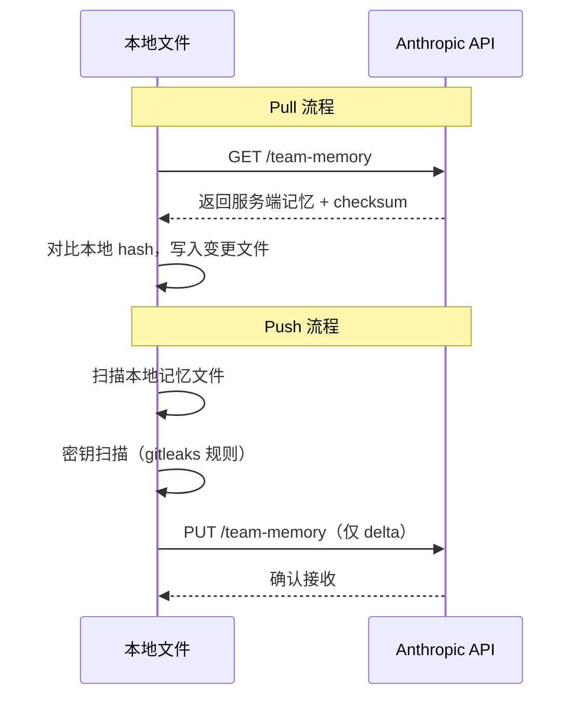

# 番外一 · 记忆系统

> 一个真正有用的智能体不仅要能完成当前任务，还要能"记住"用户是谁、之前犯过什么错、项目有什么约定。Claude Code 的记忆系统用 **文件系统即数据库** 的理念，在 `~/.claude/` 下构建了一套分层持久化记忆架构——不需要 Redis，不需要 PostgreSQL，只需要 Markdown 文件和 YAML 前言。

## A1.1 四类记忆的设计哲学

### 只记"不可推导"的知识

记忆系统的第一条设计原则藏在 `src/memdir/memoryTypes.ts` 的注释里：

```typescript title="src/memdir/memoryTypes.ts" showLineNumbers
/**
 * Memories are constrained to four types capturing context NOT derivable
 * from the current project state. Code patterns, architecture, git history,
 * and file structure are derivable (via grep/git/CLAUDE.md) and should NOT
 * be saved as memories.
 */
export const MEMORY_TYPES = ['user', 'feedback', 'project', 'reference'] as const
```

这条原则排除了大量"看起来应该记住"的内容——代码风格、架构决策、文件结构——因为这些可以通过读代码、`git log`、CLAUDE.md 获得。记忆系统只存储**从当前项目状态无法推导出的信息**。

### 四种类型

| 类型 | 范围 | 记什么 | 不记什么 |
|------|------|--------|----------|
| **user** | 始终私有 | 用户角色、偏好、知识背景 | 代码偏好（那是 feedback） |
| **feedback** | 默认私有，项目级约定可共享 | 用户纠正（"不要这样做"）和确认（"对，就这样"） | 一次性指令 |
| **project** | 倾向共享 | 正在进行的工作、截止日期、动机 | 可从 git/代码推导的信息 |
| **reference** | 私有或共享 | 外部系统的位置指针 | 系统本身的内容 |

最精妙的设计是 **feedback 类型**——它不仅记录"不要做 X"（纠正），还要求记录"对，就这样做"（确认）。系统提示词中有明确说明：

```
Record from failure AND success: if you only save corrections, you will 
avoid past mistakes but drift away from approaches the user has already 
validated, and may grow overly cautious.
```

这解决了一个真实的 LLM 行为问题：只记录负面反馈会让模型变得过于保守。

### feedback 的结构化格式

每条 feedback 记忆要求三个部分：

```markdown
---
name: 测试不要用 mock
description: 集成测试必须连真实数据库
type: feedback
---

集成测试必须连真实数据库，不用 mock。

**Why:** 上个季度 mock 测试全过但 prod migration 失败了。
**How to apply:** 写测试时如果涉及数据库操作，始终连接测试库。
```

**Why** 让模型在边缘情况下能做判断（而不是盲目遵守规则），**How to apply** 让模型知道在什么场景下应用这条记忆。

---

## A1.2 memdir 基础设施：文件系统即数据库

### 目录结构

```
~/.claude/
└── projects/
    └── {project-slug}/
        └── memory/
            ├── MEMORY.md              ← 索引文件（始终加载到上下文）
            ├── user_role.md           ← 独立记忆文件
            ├── feedback_testing.md
            ├── project_deadline.md
            └── reference_linear.md
```

### MEMORY.md：200 行索引

`MEMORY.md` 是记忆系统的入口——**始终加载到系统提示词中**。它不存储记忆内容，只存储指向各记忆文件的一行式链接：

```markdown
- [用户角色](user_role.md) — 数据科学家，关注日志和可观测性
- [测试规范](feedback_testing.md) — 集成测试必须连真实数据库
- [Q2 截止日期](project_deadline.md) — 2026-06-30 前完成 auth 重写
```

索引有严格的限制（`src/memdir/memdir.ts`）：

```typescript
export const MAX_ENTRYPOINT_LINES = 200
export const MAX_ENTRYPOINT_BYTES = 25_000  // ~125 chars/line
```

截断逻辑先按行截断（自然边界），再按字节截断（在最近的换行符处切断，不切割半行）。这防止了模型无限制地向索引中添加条目。

### 记忆文件格式

每个记忆文件使用 YAML 前言 + Markdown 内容：

```markdown
---
name: {{记忆名称}}
description: {{一行描述——用于未来对话中判断是否相关}}
type: {{user | feedback | project | reference}}
---

{{记忆内容}}
```

`description` 字段不是装饰——它在未来对话中决定这条记忆是否被加载。如果描述太模糊（如"一些反馈"），模型就无法判断它是否与当前任务相关。

---

## A1.3 记忆加载到系统提示词

`loadMemoryPrompt()` 在 `src/memdir/memdir.ts` 中实现，注册为动态系统提示词分区：

```typescript title="src/constants/prompts.ts" showLineNumbers
systemPromptSection('memory', () => loadMemoryPrompt()),
```

加载函数有三种工作模式：

```typescript title="src/memdir/memdir.ts（简化）" showLineNumbers
export async function loadMemoryPrompt(): Promise<string | null> {
  // 模式 1：KAIROS（自主模式）— 使用日志式记忆
  if (feature('KAIROS') && autoEnabled && getKairosActive()) {
    return buildAssistantDailyLogPrompt(skipIndex)
  }

  // 模式 2：团队记忆 — 合并个人 + 团队记忆
  if (feature('TEAMMEM') && teamMemPaths.isTeamMemoryEnabled()) {
    await ensureMemoryDirExists(teamDir)
    return teamMemPrompts.buildCombinedMemoryPrompt(extraGuidelines, skipIndex)
  }

  // 模式 3：标准模式 — 仅个人记忆
  if (autoEnabled) {
    await ensureMemoryDirExists(autoDir)
    return buildMemoryLines('auto memory', autoDir, extraGuidelines, skipIndex)
      .join('\n')
  }

  return null
}
```

一个重要的细节：`ensureMemoryDirExists()` 在加载前自动创建目录（`{ recursive: true }`），然后系统提示词告诉模型"目录已存在，直接用 Write 工具写入"——防止模型浪费一轮去检查目录是否存在。

---

## A1.4 后台记忆提取智能体

### 触发机制

记忆提取不是在主对话中进行的，而是通过一个**后台子智能体**执行。这个子智能体在 `src/services/extractMemories/` 中实现，在对话的停止钩子（stop hooks）中触发：

1. 检查自上次提取以来是否有足够的新消息
2. 检查主智能体在当前轮次是否已经自行写入了记忆（如果是，跳过提取）
3. Fork 一个独立的 LLM 调用，继承主对话的完整上下文

### 受限工具集

提取智能体只能使用有限的工具集：

```
Available tools: FileRead, Grep, Glob, read-only Bash (ls/find/cat/stat),
and FileEdit/FileWrite for paths inside the memory directory only.
Bash rm is not permitted. All other tools will be denied.
```

这通过 Prompt 明确告知（而非权限系统拦截），让模型在生成工具调用前就主动放弃不可用的工具。

### 两阶段高效执行

提取 Prompt 中包含明确的执行策略指导：

```
You have a limited turn budget. The efficient strategy is:
- Turn 1: issue all FileRead calls in parallel for every file you might update
- Turn 2: issue all FileWrite/FileEdit calls in parallel
Do not interleave reads and writes across multiple turns.
```

这把"最优工具调用序列"编码进了 Prompt，确保记忆提取在最少的 API 轮次（通常 2 轮）内完成。

---

## A1.5 团队记忆

### 与个人记忆的区别

| 维度 | 个人记忆 | 团队记忆 |
|------|---------|---------|
| **存储** | 本地文件系统 | 服务端 + 本地镜像 |
| **可见性** | 仅当前用户 | 同组织所有成员 |
| **同步** | 无需同步 | Pull/Push 双向同步 |
| **冲突解决** | 无冲突 | 服务端优先（server-wins） |
| **安全** | 无特殊限制 | 上传前密钥扫描 |

### 同步架构



### 上传前密钥扫描

团队记忆在上传前必须通过密钥扫描（基于 gitleaks 规则）：

- 检测 AWS token、GitHub PAT、Anthropic/OpenAI API key 等
- 只返回规则 ID，不返回实际密钥值
- 使用高置信度规则（含唯一前缀）避免误报

### 批量上传分片

大量记忆文件会被分片上传：
- 单次请求最大 200KB
- 单个文件最大 250KB
- 超出部分自动拆分为多次请求

---

## A1.6 会话记忆

### 与持久化记忆的区别

会话记忆（`src/services/SessionMemory/`）是**单次对话内的临时记忆**——在对话中提取，但不跨会话持久化。

| 维度 | 会话记忆 | 持久化记忆 |
|------|---------|-----------|
| 生命周期 | 单次对话 | 跨会话 |
| 存储 | 内存 + 本地缓存 | 文件系统 |
| 用途 | 压缩后恢复上下文 | 长期知识 |
| 触发 | 对话中自动提取 | 后台智能体提取 |

会话记忆的主要价值在于：当对话被压缩（compact）后，关键的对话上下文可能丢失。会话记忆作为"压缩保险"，保留了最重要的信息片段。

---

## A1.7 记忆整理（Auto-Dream）

`src/services/autoDream/` 实现了记忆整理功能——类似人类睡眠中的记忆巩固。

- 使用文件锁（`consolidationLock.ts`）防止多个并发会话同时整理
- 在系统检测到空闲期时运行
- 合并分散的记忆文件为更内聚的文档
- 清理过时或矛盾的记忆

---

## A1.8 设计模式总结

### 模式一：文件系统即数据库

不用任何外部数据库，Markdown 文件就是持久化层。好处：人类可读、可版本控制、无依赖。

### 模式二：索引 + 文件分离

MEMORY.md 只存索引（一行一条），具体内容在独立文件中。索引始终加载到系统提示词，内容按需读取。

### 模式三：只记不可推导的知识

代码风格？读代码。架构决策？看 CLAUDE.md。Git 历史？用 `git log`。记忆只存储这些工具无法获取的信息。

### 模式四：同时记录纠正和确认

不只记"不要做 X"，也记"对，就这样做 Y"——防止模型变得过于保守。

### 模式五：后台提取 + 受限工具

记忆提取在后台运行，不干扰主对话。受限工具集防止提取智能体做超出范围的事。

:::info 番外小结
Claude Code 的记忆系统展示了一种"重 Prompt 轻基础设施"的设计哲学——用精心设计的四类记忆分类法、文件系统存储和后台提取智能体，在不引入任何外部数据库的前提下实现了跨会话的个人/团队持久化记忆。对于自建 Agent 系统的开发者，最值得借鉴的是：**明确定义什么应该记住（不可推导的知识）和什么不应该记住（可从当前状态推导的信息）**。
:::
