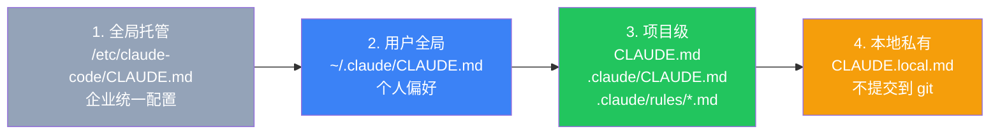
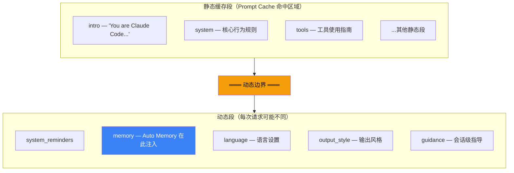

import Tabs from '@theme/Tabs';
import TabItem from '@theme/TabItem';

# 番外一 · 记忆系统（下）：持久记忆与 CLAUDE.md

:::tip 前置阅读
本文是记忆系统的下篇。Session Memory 详见 **[上篇](/A1-memory-system)**，上下文压缩详见 **[中篇](/A1a-compaction)**。
:::

前两篇讲的是**单次会话内**的记忆机制——Session Memory 在后台提取笔记，Compaction 在上下文耗尽时用笔记或 API 总结来恢复空间。但这些都随会话结束而消失。

本篇讲的是**跨会话**的记忆机制：如何让下一次新会话记住上一次学到的东西？以及静态指令（CLAUDE.md）是如何始终生效的？

---

## A1.6 持久记忆：跨会话的大脑

### 文件系统即数据库

Claude Code 不用任何数据库——所有记忆都是文件系统中的 Markdown 文件：

```
~/.claude/
└── projects/
    └── {project-slug}/
        └── memory/
            ├── MEMORY.md              ← 索引文件（始终加载到系统提示词）
            ├── user_role.md           ← 独立记忆文件
            ├── feedback_testing.md
            ├── project_deadline.md
            └── reference_linear.md
```

这个设计的好处：零依赖、人类可读、可用 git 管理、可在任何编辑器中直接修改。

### 四类记忆

记忆被严格限定为四类——且有一个核心原则：**只记录不可从当前代码状态推导出的信息**。代码风格、架构决策、文件结构这些都**不应该**被记住，因为它们可以通过 `grep`、`git log`、CLAUDE.md 获取。

```typescript title="src/memdir/memoryTypes.ts" showLineNumbers
export const MEMORY_TYPES = ['user', 'feedback', 'project', 'reference'] as const
```

<Tabs>
  <TabItem value="user" label="user（用户）" default>

**记什么：** 用户的角色、偏好、知识背景。

**为什么重要：** 与高级工程师协作和教初学者写代码，需要完全不同的沟通方式。

```markdown
---
name: 用户背景
description: 10年 Go 经验，首次接触 React
type: user
---

用户是有 10 年经验的 Go 后端工程师，首次接触 React。
解释前端概念时用后端类比（如 useEffect ≈ goroutine 的 defer）。
```

  </TabItem>
  <TabItem value="feedback" label="feedback（反馈）">

**记什么：** 用户的纠正（"不要这样做"）**和**确认（"对，就这样"）。

**关键洞察：** 如果只记录纠正，模型会变得过于保守——它知道什么不能做，但不知道什么该坚持做。

```markdown
---
name: 测试不要用 mock
description: 集成测试必须连真实数据库
type: feedback
---

集成测试必须连真实数据库，不用 mock。

**Why:** 上个季度 mock 测试全过但 prod migration 失败了。
**How to apply:** 写测试时如果涉及数据库操作，始终连接测试库。
```

每条 feedback 要求 **Why**（为什么）和 **How to apply**（何时应用），让模型能在边缘情况下做判断。

  </TabItem>
  <TabItem value="project" label="project（项目）">

**记什么：** 正在进行的工作、截止日期、动机——这些从代码和 git 中看不出来的项目上下文。

```markdown
---
name: Auth 重写动机
description: auth 中间件重写是法务合规驱动的
type: project
---

auth 中间件重写是法务/合规要求——session token 存储不符合新规。
这不是技术债务清理。范围决策应优先考虑合规性而非开发便利。

**Why:** 法务在 Q1 安全审计中标记了这个问题。
**How to apply:** 涉及 auth 相关决策时，合规优先于 DX。
```

  </TabItem>
  <TabItem value="reference" label="reference（引用）">

**记什么：** 外部系统的位置指针——让模型知道去哪里找信息。

```markdown
---
name: 值班告警看板
description: Grafana API 延迟面板
type: reference
---

grafana.internal/d/api-latency 是值班盯的延迟面板。
改请求路径相关代码时要注意这个。
```

  </TabItem>
</Tabs>

### MEMORY.md：200 行索引

MEMORY.md 始终加载到系统提示词中——但它不是记忆本身，而是**索引**。每条记忆只占一行、不超过 ~150 字符：

```markdown
- [用户角色](user_role.md) — 10 年 Go 经验，首次接触 React
- [测试规范](feedback_testing.md) — 集成测试必须连真实数据库
- [Auth 重写](project_deadline.md) — 法务合规驱动，Q2 截止
```

索引有硬性限制：

```typescript title="src/memdir/memdir.ts:34-38" showLineNumbers
export const MAX_ENTRYPOINT_LINES = 200       // 最多 200 行
export const MAX_ENTRYPOINT_BYTES = 25_000    // 最多 ~25KB
```

超出时先按行截断（在自然换行处），再按字节截断（在最后一个换行符前）。

### 语义过期：不自动删除，但标注新鲜度

持久记忆**没有 TTL**——不会到期自动删除。但超过 1 天的记忆会被附加新鲜度警告：

```typescript title="src/memdir/memoryAge.ts" showLineNumbers
export function memoryFreshnessText(mtimeMs: number): string {
  const d = memoryAgeDays(mtimeMs)
  if (d <= 1) return ''
  return (
    `This memory is ${d} days old. ` +
    `Memories are point-in-time observations, not live state — ` +
    `claims about code behavior or file:line citations may be outdated. ` +
    `Verify against current code before asserting as fact.`
  )
}
```

为什么不用硬过期？因为**不同记忆的时效性完全不同**。"用户是数据科学家"一年后仍然有效，但"src/auth/index.ts:42 有 bug"第二天可能就过时了。固定的 TTL 无法区分这两种情况，让模型根据上下文判断则可以。

注意代码注释中的背景：

> Motivated by user reports of stale code-state memories (file:line citations to code that has since changed) being asserted as fact — the citation makes the stale claim sound more authoritative, not less.

用户反馈说，包含具体行号引用的旧记忆反而让过时信息**看起来更可信**——因为有行号让它显得更权威。这个真实问题驱动了新鲜度警告的设计。

### 记忆加载到系统提示词的过程

`loadMemoryPrompt()` 根据不同模式加载记忆：

```typescript title="src/memdir/memdir.ts:419-507（简化）" showLineNumbers
export async function loadMemoryPrompt(): Promise<string | null> {
  // KAIROS 自主模式：使用日志式记忆（append-only 日志文件）
  if (feature('KAIROS') && autoEnabled && getKairosActive()) {
    return buildAssistantDailyLogPrompt(skipIndex)
  }

  // 团队记忆模式：合并个人 + 团队记忆
  if (feature('TEAMMEM') && teamMemPaths.isTeamMemoryEnabled()) {
    await ensureMemoryDirExists(teamDir)
    return teamMemPrompts.buildCombinedMemoryPrompt(extraGuidelines, skipIndex)
  }

  // 标准模式：个人记忆
  if (autoEnabled) {
    await ensureMemoryDirExists(autoDir)
    return buildMemoryLines('auto memory', autoDir, extraGuidelines, skipIndex)
      .join('\n')
  }

  return null
}
```

注意 `ensureMemoryDirExists()` 在加载前自动创建目录——然后系统提示词告诉模型"This directory already exists — write to it directly with the Write tool (do not run mkdir or check for its existence)"。这避免了模型浪费一轮工具调用去检查目录是否存在。

### Auto-Dream：记忆整理

记忆会随时间积累，需要定期整理。`autoDream.ts` 实现了一个后台整理进程，采用**按成本排序的三重门控**：

```
门控 1（最便宜）：stat 一个文件 → 距上次整理 ≥ 24 小时？
门控 2（中等）：  扫描会话目录 → 新增会话 ≥ 5 个？
门控 3（最贵）：  获取文件锁   → 没有其他进程在整理？
```

三个条件必须全部通过才会开始整理。绝大多数情况下，门控 1 就能拦住——只花费一次 `stat` 系统调用的成本。

---

## A1.7 CLAUDE.md：静态指令层

CLAUDE.md 不属于"记忆"——它是**静态指令**，在每次会话启动时加载（在压缩后也会重新注入）。

### 四层加载优先级



项目级 CLAUDE.md 会**从当前目录向上遍历到根目录**——这意味着 monorepo 中不同子目录可以有不同的指令。

### 条件规则

`.claude/rules/*.md` 文件支持 YAML 前言中的 `paths` 字段：

```yaml
---
paths: "src/**/*.ts, !src/node_modules/**"
---
TypeScript 文件的编码规范...
```

这种条件规则只在编辑匹配的文件时才会加载到上下文——避免不相关的指令占用 token。

### 加载时机

```typescript title="src/context.ts（简化）" showLineNumbers
export const getUserContext = memoize(async () => {
  const claudeMd = shouldDisableClaudeMd
    ? null
    : getClaudeMds(filterInjectedMemoryFiles(await getMemoryFiles()))

  return {
    ...(claudeMd && { claudeMd }),
    currentDate: `Today's date is ${getLocalISODate()}.`,
  }
})
```

`getUserContext()` 被 `memoize()` 包装——**整个会话只调用一次**，然后缓存结果。这意味着如果你在会话期间修改了 CLAUDE.md，变更不会立即生效（需要新会话或压缩触发重新加载）。

---

## A1.8 完整的系统提示词组装

所有记忆最终都通过系统提示词到达模型。提示词分为**静态缓存段**和**动态段**：



静态段的内容在会话中不变，可以被 Anthropic 的 Prompt Cache 缓存——后续请求只需要发送动态段的增量部分，大幅降低 API 成本。

**CLAUDE.md 的注入位置**不在系统提示词段中——它作为 `userContext` 的 `claudeMd` 字段，在用户消息前面注入（以 `<system-reminder>` 标签包装）。这样它属于动态内容，但通过缓存控制标记可以获得部分缓存命中。

---

## A1.9 设计洞察

### Session Memory 是压缩的"预制件"

这是整个记忆系统最精妙的设计：Session Memory 不是一个独立功能，而是**为压缩预制的摘要素材**。通过在后台持续提取笔记，它把"总结对话"的成本从压缩时刻分摊到了整个对话过程中——而且这个分摊是通过共享 prompt cache 的分叉子代理实现的，边际成本极低。

### 文件系统 > 数据库

对于一个 CLI 工具来说，引入 Redis 或 SQLite 是不必要的复杂性。Markdown 文件在文件系统上的好处远不止"简单"：它们可以被人类直接阅读和编辑，可以用 git 管理版本，可以用任何文本编辑器修改，可以在没有网络的环境中工作。

### 只记不可推导的知识

这条原则让记忆系统保持精炼。代码风格？读代码就知道。架构决策？看 CLAUDE.md。Git 历史？用 `git log`。记忆系统只存储这些工具无法获取的信息——用户的角色、项目的非技术背景、用户的偏好纠正。

### 语义过期 > 硬过期

不删除记忆，而是标注新鲜度让模型自行验证——这解决了"用户角色永远有效，但代码行号隔天过期"的异质过期问题。缺点是消耗 token 来注入警告，但比误删有价值的长期记忆要好得多。

### 压缩后必须重注入

压缩不只是"删旧消息、加摘要"——它还必须重新注入 CLAUDE.md、工具定义和 MCP 指令。如果忘了这一步，模型在压缩后会突然"忘记"项目规则和可用工具。这个重注入通过 `processSessionStartHooks('compact', ...)` 实现，效果等同于新建会话时的启动流程。

:::info 番外小结
Claude Code 的记忆系统用四个协作的子系统解决了 LLM 智能体的上下文有限问题。最核心的洞察是 **Session Memory 和 Compaction 的协作模式**（详见上篇）：后台子代理在对话过程中持续提取笔记到磁盘文件，当上下文耗尽时，笔记直接替代旧消息作为摘要，不需要额外的 API 调用。持久记忆和 CLAUDE.md 则确保跨会话的知识和项目规则不会丢失——它们在每次新会话启动时加载，在每次压缩后重新注入。
:::

---

## 附录：关键源码文件索引

| 文件 | 职责 |
|------|------|
| `src/services/compact/autoCompact.ts` | 自动压缩触发逻辑、阈值计算、熔断器 |
| `src/services/compact/compact.ts` | 传统压缩的完整实现、消息重建 |
| `src/services/compact/sessionMemoryCompact.ts` | Session Memory 压缩路径 |
| `src/services/compact/prompt.ts` | 压缩总结的 Prompt 模板（三种变体） |
| `src/services/compact/microCompact.ts` | 微压缩预处理 |
| `src/services/SessionMemory/sessionMemory.ts` | 会话记忆后台提取主逻辑 |
| `src/services/SessionMemory/prompts.ts` | 笔记模板和提取 Prompt |
| `src/services/SessionMemory/sessionMemoryUtils.ts` | 配置、阈值、lastSummarizedMessageId |
| `src/memdir/memdir.ts` | 持久记忆加载和 Prompt 构建 |
| `src/memdir/memoryTypes.ts` | 四类记忆的定义和行为指导 |
| `src/memdir/memoryAge.ts` | 新鲜度计算和过时警告 |
| `src/memdir/autoDream.ts` | 自动记忆整理（三重门控） |
| `src/utils/claudemd.ts` | CLAUDE.md 发现和加载 |
| `src/context.ts` | System/User 上下文注入 |
| `src/constants/prompts.ts` | 系统提示词组装（静态段 + 动态段） |

## 附录：环境变量与特性标志

<Tabs>
  <TabItem value="env" label="环境变量" default>

| 变量 | 作用 |
|------|------|
| `DISABLE_COMPACT` | 完全禁用压缩 |
| `DISABLE_AUTO_COMPACT` | 仅禁用自动压缩（手动 `/compact` 仍可用） |
| `CLAUDE_CODE_AUTO_COMPACT_WINDOW` | 覆盖有效上下文窗口大小 |
| `CLAUDE_AUTOCOMPACT_PCT_OVERRIDE` | 以百分比覆盖压缩阈值 (0-100) |
| `ENABLE_CLAUDE_CODE_SM_COMPACT` | 强制启用 Session Memory 压缩 |
| `DISABLE_CLAUDE_CODE_SM_COMPACT` | 强制禁用 Session Memory 压缩 |
| `CLAUDE_CODE_DISABLE_AUTO_MEMORY` | 禁用持久记忆 |
| `CLAUDE_CODE_DISABLE_CLAUDE_MDS` | 禁用 CLAUDE.md 加载 |

  </TabItem>
  <TabItem value="flags" label="特性标志（GrowthBook）">

| Flag | 作用 |
|------|------|
| `tengu_session_memory` | 启用 Session Memory 后台提取 |
| `tengu_sm_compact` | 启用 SM 压缩路径 |
| `tengu_sm_compact_config` | SM 压缩的远程配置（minTokens, maxTokens 等） |
| `tengu_sm_config` | SM 提取的远程配置（阈值、频率等） |
| `tengu_cobalt_raccoon` | 反应式压缩模式 |
| `tengu_coral_fern` | "搜索过去上下文"段落 |
| `tengu_onyx_plover` | Auto-Dream 整理参数 |
| `KAIROS` | 自主/常驻模式（日志式记忆） |
| `TEAMMEM` | 团队记忆功能 |

  </TabItem>
</Tabs>
