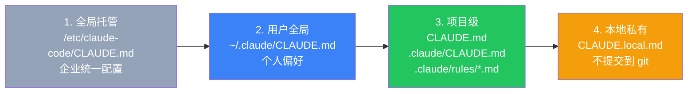
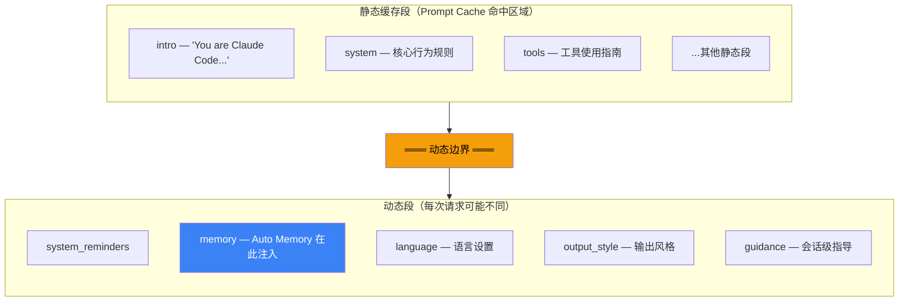

import Tabs from '@theme/Tabs';
import TabItem from '@theme/TabItem';

# 番外一 · 记忆系统（下）：持久记忆与 CLAUDE.md

:::tip 前置阅读
本文是记忆系统的下篇。Session Memory 详见 **[上篇](/A1-memory-system)**，上下文压缩详见 **[中篇](/A1a-compaction)**。
:::

前两篇讲的是**单次会话内**的记忆机制——Session Memory 在后台提取笔记，Compaction 在上下文耗尽时用笔记或 API 总结来恢复空间。但这些都随会话结束而消失。

本篇讲的是**跨会话**的记忆机制：如何让下一次新会话记住上一次学到的东西？以及静态指令（CLAUDE.md）是如何始终生效的？

---

## A1.6 持久记忆：跨会话的大脑

### 文件系统即数据库

Claude Code 不用任何数据库——所有记忆都是文件系统中的 Markdown 文件：

```
~/.claude/
└── projects/
    └── {project-slug}/
        └── memory/
            ├── MEMORY.md              ← 索引文件（始终加载到系统提示词）
            ├── user_role.md           ← 独立记忆文件
            ├── feedback_testing.md
            ├── project_deadline.md
            └── reference_linear.md
```

这个设计的好处：零依赖、人类可读、可用 git 管理、可在任何编辑器中直接修改。

### 四类记忆

记忆被严格限定为四类——且有一个核心原则：**只记录不可从当前代码状态推导出的信息**。代码风格、架构决策、文件结构这些都**不应该**被记住，因为它们可以通过 `grep`、`git log`、CLAUDE.md 获取。

```typescript title="src/memdir/memoryTypes.ts" showLineNumbers
export const MEMORY_TYPES = ['user', 'feedback', 'project', 'reference'] as const
```

<Tabs>
  <TabItem value="user" label="user（用户）" default>

**记什么：** 用户的角色、偏好、知识背景。

**为什么重要：** 与高级工程师协作和教初学者写代码，需要完全不同的沟通方式。

```markdown
---
name: 用户背景
description: 10年 Go 经验，首次接触 React
type: user
---

用户是有 10 年经验的 Go 后端工程师，首次接触 React。
解释前端概念时用后端类比（如 useEffect ≈ goroutine 的 defer）。
```

  </TabItem>
  <TabItem value="feedback" label="feedback（反馈）">

**记什么：** 用户的纠正（"不要这样做"）**和**确认（"对，就这样"）。

**关键洞察：** 如果只记录纠正，模型会变得过于保守——它知道什么不能做，但不知道什么该坚持做。

```markdown
---
name: 测试不要用 mock
description: 集成测试必须连真实数据库
type: feedback
---

集成测试必须连真实数据库，不用 mock。

**Why:** 上个季度 mock 测试全过但 prod migration 失败了。
**How to apply:** 写测试时如果涉及数据库操作，始终连接测试库。
```

每条 feedback 要求 **Why**（为什么）和 **How to apply**（何时应用），让模型能在边缘情况下做判断。

  </TabItem>
  <TabItem value="project" label="project（项目）">

**记什么：** 正在进行的工作、截止日期、动机——这些从代码和 git 中看不出来的项目上下文。

```markdown
---
name: Auth 重写动机
description: auth 中间件重写是法务合规驱动的
type: project
---

auth 中间件重写是法务/合规要求——session token 存储不符合新规。
这不是技术债务清理。范围决策应优先考虑合规性而非开发便利。

**Why:** 法务在 Q1 安全审计中标记了这个问题。
**How to apply:** 涉及 auth 相关决策时，合规优先于 DX。
```

  </TabItem>
  <TabItem value="reference" label="reference（引用）">

**记什么：** 外部系统的位置指针——让模型知道去哪里找信息。

```markdown
---
name: 值班告警看板
description: Grafana API 延迟面板
type: reference
---

grafana.internal/d/api-latency 是值班盯的延迟面板。
改请求路径相关代码时要注意这个。
```

  </TabItem>
</Tabs>

### MEMORY.md：200 行索引

MEMORY.md 始终加载到系统提示词中——但它不是记忆本身，而是**索引**。每条记忆只占一行、不超过 ~150 字符：

```markdown
- [用户角色](user_role.md) — 10 年 Go 经验，首次接触 React
- [测试规范](feedback_testing.md) — 集成测试必须连真实数据库
- [Auth 重写](project_deadline.md) — 法务合规驱动，Q2 截止
```

索引有硬性限制：

```typescript title="src/memdir/memdir.ts:34-38" showLineNumbers
export const MAX_ENTRYPOINT_LINES = 200       // 最多 200 行
export const MAX_ENTRYPOINT_BYTES = 25_000    // 最多 ~25KB
```

超出时先按行截断（在自然换行处），再按字节截断（在最后一个换行符前）。

### 语义过期：不自动删除，但标注新鲜度

持久记忆**没有 TTL**——不会到期自动删除。但超过 1 天的记忆会被附加新鲜度警告：

```typescript title="src/memdir/memoryAge.ts" showLineNumbers
export function memoryFreshnessText(mtimeMs: number): string {
  const d = memoryAgeDays(mtimeMs)
  if (d <= 1) return ''
  return (
    `This memory is ${d} days old. ` +
    `Memories are point-in-time observations, not live state — ` +
    `claims about code behavior or file:line citations may be outdated. ` +
    `Verify against current code before asserting as fact.`
  )
}
```

为什么不用硬过期？因为**不同记忆的时效性完全不同**。"用户是数据科学家"一年后仍然有效，但"src/auth/index.ts:42 有 bug"第二天可能就过时了。固定的 TTL 无法区分这两种情况，让模型根据上下文判断则可以。

注意代码注释中的背景：

> Motivated by user reports of stale code-state memories (file:line citations to code that has since changed) being asserted as fact — the citation makes the stale claim sound more authoritative, not less.

用户反馈说，包含具体行号引用的旧记忆反而让过时信息**看起来更可信**——因为有行号让它显得更权威。这个真实问题驱动了新鲜度警告的设计。

### 记忆加载到系统提示词的过程

`loadMemoryPrompt()` 根据不同模式加载记忆：

```typescript title="src/memdir/memdir.ts:419-507（简化）" showLineNumbers
export async function loadMemoryPrompt(): Promise<string | null> {
  // KAIROS 自主模式：使用日志式记忆（append-only 日志文件）
  if (feature('KAIROS') && autoEnabled && getKairosActive()) {
    return buildAssistantDailyLogPrompt(skipIndex)
  }

  // 团队记忆模式：合并个人 + 团队记忆
  if (feature('TEAMMEM') && teamMemPaths.isTeamMemoryEnabled()) {
    await ensureMemoryDirExists(teamDir)
    return teamMemPrompts.buildCombinedMemoryPrompt(extraGuidelines, skipIndex)
  }

  // 标准模式：个人记忆
  if (autoEnabled) {
    await ensureMemoryDirExists(autoDir)
    return buildMemoryLines('auto memory', autoDir, extraGuidelines, skipIndex)
      .join('\n')
  }

  return null
}
```

注意 `ensureMemoryDirExists()` 在加载前自动创建目录——然后系统提示词告诉模型"This directory already exists — write to it directly with the Write tool (do not run mkdir or check for its existence)"。这避免了模型浪费一轮工具调用去检查目录是否存在。

### Auto-Dream：记忆整理

记忆会随时间积累，需要定期整理。`autoDream.ts` 实现了一个后台整理进程——在每轮对话结束时触发，满足条件则启动一个专用的分叉子代理（forked agent）来整理记忆文件。

#### 触发时机：每轮结束时的 stopHooks

Auto-Dream 挂载在 `stopHooks` 上，在主对话的**每轮模型输出结束后**触发：

```typescript title="src/query/stopHooks.ts（简化）" showLineNumbers
// fire-and-forget —— 不 await，不阻塞主对话
executeAutoDream(context, appendSystemMessage)
```

但"触发"不等于"执行"——`executeAutoDream` 只是调用 `runner?.(context)`，而 `runner` 在每次触发时都会检查三重门控。

#### 初始化：闭包作用域的状态

`autoDream.ts` 的状态不在模块顶层，而在 `initAutoDream()` 函数的**闭包作用域**里：

```typescript title="src/services/autoDream/autoDream.ts:122-125" showLineNumbers
export function initAutoDream(): void {
  let lastSessionScanAt = 0  // 上次扫描会话目录的时间戳

  runner = async function runAutoDream(context, appendSystemMessage) {
    // ...
  }
}
```

> 📍 源码入口：`src/services/autoDream/autoDream.ts`

这个设计让测试可以在 `beforeEach` 中调用 `initAutoDream()` 来重置状态，不会出现模块级状态污染。启动时由 `startBackgroundHousekeeping()` → `initAutoDream()` 调用一次。

#### 三重门控（按成本排序）

三个门控按**成本从低到高**依次检查——绝大多数情况下，门控 1 就能拦住，不需要扫描文件目录：

```
门控 1（最便宜）：stat 一个文件 → 距上次整理 ≥ 24 小时？
扫描节流：       距上次扫描 ≥ 10 分钟？（防止时间门通过后每轮都扫）
门控 2（中等）：  扫描会话目录 → 新增会话 ≥ 5 个？
门控 3（最贵）：  获取文件锁   → 没有其他进程在整理？
```

**门控 1 — 时间门：**

```typescript title="src/services/autoDream/autoDream.ts:131-141" showLineNumbers
const lastAt = await readLastConsolidatedAt()  // 读 .consolidate-lock 的 mtime
const hoursSince = (Date.now() - lastAt) / 3_600_000
if (hoursSince < cfg.minHours) return          // 默认 24 小时
```

时间信息直接编码在锁文件的 **mtime** 里——不需要单独的状态文件，一次 `stat` 系统调用就能得到上次整理的时间。

**扫描节流（时间门通过后）：**

时间门通过后，如果会话门不满足，锁文件的 mtime 不会前进，下次触发时时间门还是会通过。这会导致每轮都扫描会话目录——因此加了 10 分钟的节流：

```typescript title="src/services/autoDream/autoDream.ts:143-151" showLineNumbers
const sinceScanMs = Date.now() - lastSessionScanAt
if (sinceScanMs < SESSION_SCAN_INTERVAL_MS) return // SESSION_SCAN_INTERVAL_MS = 10min
lastSessionScanAt = Date.now()
```

**门控 2 — 会话门：**

```typescript title="src/services/autoDream/autoDream.ts:153-170" showLineNumbers
let sessionIds = await listSessionsTouchedSince(lastAt)
// 排除当前会话（它的 mtime 总是很新）
sessionIds = sessionIds.filter(id => id !== getSessionId())
if (sessionIds.length < cfg.minSessions) return    // 默认 5 个会话
```

`listSessionsTouchedSince()` 扫描项目的会话目录，找出 **mtime 在上次整理之后**被修改的会话文件（`.jsonl` 格式）。注意用的是 `mtime`（最后修改时间）而非 `birthtime`——因为 Linux ext4 文件系统的 `birthtime` 总是 0。

#### 锁机制：mtime 即状态

锁文件 `.consolidate-lock` 存在内存目录下，它的 **mtime 就是 lastConsolidatedAt**，文件体是持有者的 PID：

```
~/.claude/projects/{project-slug}/memory/.consolidate-lock
```

**获取锁的逻辑：**

```typescript title="src/services/autoDream/consolidationLock.ts:46-83" showLineNumbers
export async function tryAcquireConsolidationLock(): Promise<number | null> {
  // 1. 读取现有锁文件（如果存在）
  const [s, raw] = await Promise.all([stat(path), readFile(path, 'utf8')])
  const holderPid = parseInt(raw.trim(), 10)

  // 2. 判断锁是否有效（持有者存活且 < 60 分钟）
  if (Date.now() - mtimeMs < HOLDER_STALE_MS) {       // 60 分钟有效期
    if (isProcessRunning(holderPid)) return null        // 锁被活着的进程持有，放弃
    // 死进程 → 强行夺取
  }

  // 3. 写入 PID 并做二次验证（防止两个进程同时夺取）
  await writeFile(path, String(process.pid))
  const verify = await readFile(path, 'utf8')
  if (parseInt(verify.trim(), 10) !== process.pid) return null  // 输了竞争

  return mtimeMs ?? 0  // 返回 pre-acquire 时间（用于失败时回滚）
}
```

**失败回滚：**

整理失败时，需要把锁文件的 mtime 倒回到整理前，让时间门下次还能通过：

```typescript title="src/services/autoDream/consolidationLock.ts:91-108" showLineNumbers
export async function rollbackConsolidationLock(priorMtime: number): Promise<void> {
  if (priorMtime === 0) {
    await unlink(path)    // 原本没有锁文件 → 直接删除
    return
  }
  await writeFile(path, '')         // 清空 PID（防止被认为仍在持有）
  const t = priorMtime / 1000
  await utimes(path, t, t)          // 恢复 mtime
}
```

扫描节流（10 分钟）承担了失败后的退避职责——即使时间门立刻通过，也不会立刻重试。

#### 执行：分叉子代理

三重门控通过后，创建一个 forked agent 执行整理：

```typescript title="src/services/autoDream/autoDream.ts:224-233" showLineNumbers
const result = await runForkedAgent({
  promptMessages: [createUserMessage({ content: prompt })],
  cacheSafeParams: createCacheSafeParams(context),    // 复用主对话的 prompt cache
  canUseTool: createAutoMemCanUseTool(memoryRoot),     // 工具权限限制
  querySource: 'auto_dream',
  forkLabel: 'auto_dream',
  skipTranscript: true,                               // 不记入对话 timeline
  overrides: { abortController },
  onMessage: makeDreamProgressWatcher(taskId, setAppState),
})
```

**工具权限：** `createAutoMemCanUseTool(memoryRoot)` 允许对内存目录内文件的读写，同时 Bash 工具被限制为只读命令（`ls`, `find`, `grep`, `cat`, `stat`, `wc`, `head`, `tail` 等），禁止任何写文件或改变状态的操作。

#### 四阶段整理提示词

> 📍 源码：`src/services/autoDream/consolidationPrompt.ts`

整理提示词将任务分成四个阶段，引导子代理系统地完成记忆整理：

| 阶段 | 任务 | 工具 |
|------|------|------|
| **Phase 1 — Orient** | 浏览内存目录，读 MEMORY.md 索引，快速浏览现有记忆 | `ls`, `cat` |
| **Phase 2 — Gather recent signal** | 查找新信息：优先读日志文件，找漂移的记忆，按需 grep 会话记录 | `grep`, `cat` |
| **Phase 3 — Consolidate** | 合并新信号到现有记忆，转换相对日期，删除矛盾事实 | `FileEdit`, `FileWrite` |
| **Phase 4 — Prune and index** | 更新 MEMORY.md（保持 ≤ 200 行、≤ 25KB），删除过时指针，解决矛盾 | `FileEdit` |

Phase 2 明确告诫：**不要穷举读取会话记录**——只在有目的时才 `grep` 会话目录，因为 JSONL 文件可能非常大。

#### 进度追踪：DreamTask

整理过程通过 `DreamTask` 系统在 UI 中可见——出现在底部状态栏的后台任务胶囊和 `Shift+Down` 后台任务对话框中：

```typescript title="src/tasks/DreamTask/DreamTask.ts:25-41" showLineNumbers
export type DreamTaskState = TaskStateBase & {
  type: 'dream'
  phase: DreamPhase          // 'starting' | 'updating'
  sessionsReviewing: number  // 正在检视的会话数
  filesTouched: string[]     // 已修改的文件路径（来自 Edit/Write tool_use）
  turns: DreamTurn[]         // 最近 30 轮助手回应
  priorMtime: number         // 用于 kill 时回滚锁
}
```

`makeDreamProgressWatcher` 监听 forked agent 的消息流，提取文本块和工具调用：

- **文本块** → 追加到 `turns`（用户在 UI 中能看到整理进度）
- **Edit/Write 工具调用** → 提取 `file_path`，加入 `filesTouched`
- 一旦有文件被修改：阶段从 `'starting'` 翻转到 `'updating'`

**用户中止：** `DreamTask.kill()` 调用 `abortController.abort()`，同时执行 `rollbackConsolidationLock(priorMtime)` 回滚锁——和 fork 失败时的处理路径完全相同。

#### 完成处理

```typescript title="src/services/autoDream/autoDream.ts:235-248" showLineNumbers
completeDreamTask(taskId, setAppState)
// 如果有文件被修改，在主对话的 timeline 里插入系统消息
if (appendSystemMessage && dreamState.filesTouched.length > 0) {
  appendSystemMessage({
    ...createMemorySavedMessage(dreamState.filesTouched),
    verb: 'Improved',
  })
}
```

整理成功后，如果有文件被修改，会在主对话中插入一条 **"Improved N files"** 的系统消息——这是用户唯一能看到 auto-dream 工作的地方（DreamTask 本身标记了 `skipTranscript: true`，不出现在对话历史里）。整理失败时，调用 `rollbackConsolidationLock(priorMtime)` 回滚，让下次会话的时间门再次通过。

---

## A1.7 CLAUDE.md：静态指令层

CLAUDE.md 不属于"记忆"——它是**静态指令**，在每次会话启动时加载（在压缩后也会重新注入）。

### 四层加载优先级


```mermaid
graph LR
    A["1. 全局托管<br/>/etc/claude-code/CLAUDE.md<br/>企业统一配置"] --> B["2. 用户全局<br/>~/.claude/CLAUDE.md<br/>个人偏好"]
    B --> C["3. 项目级<br/>CLAUDE.md<br/>.claude/CLAUDE.md<br/>.claude/rules/*.md"]
    C --> D["4. 本地私有<br/>CLAUDE.local.md<br/>不提交到 git"]

    style A fill:#94a3b8,color:#fff
    style B fill:#3b82f6,color:#fff
    style C fill:#22c55e,color:#fff
    style D fill:#f59e0b,color:#fff
```

项目级 CLAUDE.md 会**从当前目录向上遍历到根目录**——这意味着 monorepo 中不同子目录可以有不同的指令。

### 条件规则

`.claude/rules/*.md` 文件支持 YAML 前言中的 `paths` 字段：

```yaml
---
paths: "src/**/*.ts, !src/node_modules/**"
---
TypeScript 文件的编码规范...
```

这种条件规则只在编辑匹配的文件时才会加载到上下文——避免不相关的指令占用 token。

### 加载时机

```typescript title="src/context.ts（简化）" showLineNumbers
export const getUserContext = memoize(async () => {
  const claudeMd = shouldDisableClaudeMd
    ? null
    : getClaudeMds(filterInjectedMemoryFiles(await getMemoryFiles()))

  return {
    ...(claudeMd && { claudeMd }),
    currentDate: `Today's date is ${getLocalISODate()}.`,
  }
})
```

`getUserContext()` 被 `memoize()` 包装——**整个会话只调用一次**，然后缓存结果。这意味着如果你在会话期间修改了 CLAUDE.md，变更不会立即生效（需要新会话或压缩触发重新加载）。

---

## A1.8 完整的系统提示词组装

所有记忆最终都通过系统提示词到达模型。提示词分为**静态缓存段**和**动态段**：


```mermaid
graph TD
    subgraph 静态缓存段["静态缓存段（Prompt Cache 命中区域）"]
        direction TB
        S1["intro — 'You are Claude Code...'"]
        S2["system — 核心行为规则"]
        S3["tools — 工具使用指南"]
        S4["...其他静态段"]
    end

    B["═══ 动态边界 ═══"]

    subgraph 动态段["动态段（每次请求可能不同）"]
        direction TB
        D1["system_reminders"]
        D2["memory — Auto Memory 在此注入"]
        D3["language — 语言设置"]
        D4["output_style — 输出风格"]
        D5["guidance — 会话级指导"]
    end

    静态缓存段 --> B --> 动态段

    style B fill:#f59e0b,color:#000
    style D2 fill:#3b82f6,color:#fff
```

静态段的内容在会话中不变，可以被 Anthropic 的 Prompt Cache 缓存——后续请求只需要发送动态段的增量部分，大幅降低 API 成本。

**CLAUDE.md 的注入位置**不在系统提示词段中——它作为 `userContext` 的 `claudeMd` 字段，在用户消息前面注入（以 `<system-reminder>` 标签包装）。这样它属于动态内容，但通过缓存控制标记可以获得部分缓存命中。

---

## A1.9 设计洞察

### Session Memory 是压缩的"预制件"

这是整个记忆系统最精妙的设计：Session Memory 不是一个独立功能，而是**为压缩预制的摘要素材**。通过在后台持续提取笔记，它把"总结对话"的成本从压缩时刻分摊到了整个对话过程中——而且这个分摊是通过共享 prompt cache 的分叉子代理实现的，边际成本极低。

### 文件系统 > 数据库

对于一个 CLI 工具来说，引入 Redis 或 SQLite 是不必要的复杂性。Markdown 文件在文件系统上的好处远不止"简单"：它们可以被人类直接阅读和编辑，可以用 git 管理版本，可以用任何文本编辑器修改，可以在没有网络的环境中工作。

### 只记不可推导的知识

这条原则让记忆系统保持精炼。代码风格？读代码就知道。架构决策？看 CLAUDE.md。Git 历史？用 `git log`。记忆系统只存储这些工具无法获取的信息——用户的角色、项目的非技术背景、用户的偏好纠正。

### 语义过期 > 硬过期

不删除记忆，而是标注新鲜度让模型自行验证——这解决了"用户角色永远有效，但代码行号隔天过期"的异质过期问题。缺点是消耗 token 来注入警告，但比误删有价值的长期记忆要好得多。

### 压缩后必须重注入

压缩不只是"删旧消息、加摘要"——它还必须重新注入 CLAUDE.md、工具定义和 MCP 指令。如果忘了这一步，模型在压缩后会突然"忘记"项目规则和可用工具。这个重注入通过 `processSessionStartHooks('compact', ...)` 实现，效果等同于新建会话时的启动流程。

:::info 番外小结
Claude Code 的记忆系统用四个协作的子系统解决了 LLM 智能体的上下文有限问题。最核心的洞察是 **Session Memory 和 Compaction 的协作模式**（详见上篇）：后台子代理在对话过程中持续提取笔记到磁盘文件，当上下文耗尽时，笔记直接替代旧消息作为摘要，不需要额外的 API 调用。持久记忆和 CLAUDE.md 则确保跨会话的知识和项目规则不会丢失——它们在每次新会话启动时加载，在每次压缩后重新注入。
:::

---

## 附录：关键源码文件索引

| 文件 | 职责 |
|------|------|
| `src/services/compact/autoCompact.ts` | 自动压缩触发逻辑、阈值计算、熔断器 |
| `src/services/compact/compact.ts` | 传统压缩的完整实现、消息重建 |
| `src/services/compact/sessionMemoryCompact.ts` | Session Memory 压缩路径 |
| `src/services/compact/prompt.ts` | 压缩总结的 Prompt 模板（三种变体） |
| `src/services/compact/microCompact.ts` | 微压缩预处理 |
| `src/services/SessionMemory/sessionMemory.ts` | 会话记忆后台提取主逻辑 |
| `src/services/SessionMemory/prompts.ts` | 笔记模板和提取 Prompt |
| `src/services/SessionMemory/sessionMemoryUtils.ts` | 配置、阈值、lastSummarizedMessageId |
| `src/memdir/memdir.ts` | 持久记忆加载和 Prompt 构建 |
| `src/memdir/memoryTypes.ts` | 四类记忆的定义和行为指导 |
| `src/memdir/memoryAge.ts` | 新鲜度计算和过时警告 |
| `src/services/autoDream/autoDream.ts` | 自动记忆整理主逻辑（三重门控、forked agent） |
| `src/services/autoDream/consolidationLock.ts` | 锁机制（mtime = 上次整理时间、PID 竞争、回滚） |
| `src/services/autoDream/consolidationPrompt.ts` | 四阶段整理提示词构建 |
| `src/services/autoDream/config.ts` | Auto-Dream 启用状态（用户设置 + GB flag） |
| `src/tasks/DreamTask/DreamTask.ts` | 后台任务状态（UI 可见、进度追踪、kill） |
| `src/utils/claudemd.ts` | CLAUDE.md 发现和加载 |
| `src/context.ts` | System/User 上下文注入 |
| `src/constants/prompts.ts` | 系统提示词组装（静态段 + 动态段） |

## 附录：环境变量与特性标志

<Tabs>
  <TabItem value="env" label="环境变量" default>

| 变量 | 作用 |
|------|------|
| `DISABLE_COMPACT` | 完全禁用压缩 |
| `DISABLE_AUTO_COMPACT` | 仅禁用自动压缩（手动 `/compact` 仍可用） |
| `CLAUDE_CODE_AUTO_COMPACT_WINDOW` | 覆盖有效上下文窗口大小 |
| `CLAUDE_AUTOCOMPACT_PCT_OVERRIDE` | 以百分比覆盖压缩阈值 (0-100) |
| `ENABLE_CLAUDE_CODE_SM_COMPACT` | 强制启用 Session Memory 压缩 |
| `DISABLE_CLAUDE_CODE_SM_COMPACT` | 强制禁用 Session Memory 压缩 |
| `CLAUDE_CODE_DISABLE_AUTO_MEMORY` | 禁用持久记忆 |
| `CLAUDE_CODE_DISABLE_CLAUDE_MDS` | 禁用 CLAUDE.md 加载 |

  </TabItem>
  <TabItem value="flags" label="特性标志（GrowthBook）">

| Flag | 作用 |
|------|------|
| `tengu_session_memory` | 启用 Session Memory 后台提取 |
| `tengu_sm_compact` | 启用 SM 压缩路径 |
| `tengu_sm_compact_config` | SM 压缩的远程配置（minTokens, maxTokens 等） |
| `tengu_sm_config` | SM 提取的远程配置（阈值、频率等） |
| `tengu_cobalt_raccoon` | 反应式压缩模式 |
| `tengu_coral_fern` | "搜索过去上下文"段落 |
| `tengu_onyx_plover` | Auto-Dream 整理参数 |
| `KAIROS` | 自主/常驻模式（日志式记忆） |
| `TEAMMEM` | 团队记忆功能 |

  </TabItem>
</Tabs>
